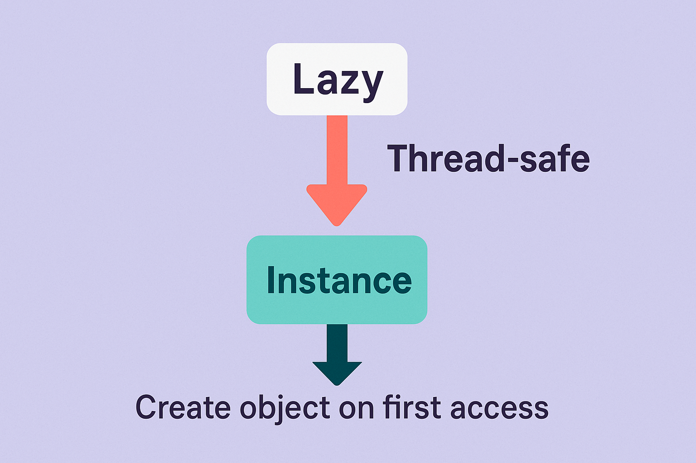

# C#多线程下的Singleton最佳实践：为什么推荐用Lazy？【附图解】

## 引言

在日常开发中，Singleton（单例）模式几乎是所有C#程序员都绕不开的话题。但当应用进入多线程场景时，看似简单的Singleton实现却可能埋下“炸弹”💣。你真的理解多线程下的Singleton陷阱吗？有没有更优雅、安全的解决方案？本文将带你拆解背后的原理，并用图文并茂的方式，介绍.NET推荐的Lazy实现方式！

---

## Singleton在多线程下的问题

Singleton的核心诉求是：全局只存在一个实例。最常见的实现大致如下：

```csharp
public class Singleton
{
    private static Singleton instance;
    public static Singleton Instance
    {
        get
        {
            if (instance == null)
                instance = new Singleton();
            return instance;
        }
    }
}
```

乍看没啥问题，但如果在多线程环境中，可能会出现如下“惊险一幕”：


_如上图，两条线程同时检测到`instance`为null，于是各自创建新实例，违背了单例原则。_

**进一步，哪怕已经创建了实例，因为CPU缓存可见性等问题，其他线程也可能“看不到”这次变化，依然重复创建对象。**

---

## 如何实现线程安全的Singleton？

为解决上面的问题，经典做法是加锁（如double-check locking）：

```csharp
private static object lockObj = new object();
public static Singleton Instance
{
    get
    {
        if (instance == null)
        {
            lock (lockObj)
            {
                if (instance == null)
                    instance = new Singleton();
            }
        }
        return instance;
    }
}
```

虽然可以保证线程安全，但带来了额外的复杂性和性能开销。而且，如果不理解底层原理，很容易出错。

**那么，有没有更现代、简单又安全的做法？**

---

## 推荐方案：用Lazy实现线程安全Singleton

.NET自带的`Lazy<T>`类就是为这种“延迟初始化+线程安全”需求量身定做的！我们来看代码：

```csharp
public class Singleton
{
    private static readonly Lazy<Singleton> lazyInstance =
        new Lazy<Singleton>(() => new Singleton());

    public static Singleton Instance => lazyInstance.Value;

    private Singleton() { }
}
```

### 图解Lazy方式


_上图说明：只有第一次调用Instance时才创建对象，并且整个过程是线程安全的。之后每次调用都直接复用同一个对象。_

### 为什么推荐用Lazy？

- **延迟初始化**：只有用到的时候才真正创建实例，节省资源。
- **线程安全**：`Lazy<T>`内部已做了严格的同步控制，无需手写繁琐的加锁逻辑。
- **代码简洁易维护**：极大减少出错概率，可读性高。

---

## 总结与思考

对于C#开发者来说，在多线程环境下手写锁机制实现单例既繁琐又风险高。相较之下，使用`Lazy<T>`不仅能满足懒加载和线程安全需求，还让代码更优雅、易维护，堪称现代C#开发中实现Singleton模式的首选👍。

---

## 结尾互动

你还见过哪些奇葩或巧妙的Singleton写法？在你的项目中，是怎么处理多线程下的单例问题的？欢迎在评论区留言分享你的经验或疑问，也可以点赞、转发给身边的小伙伴一起探讨哦！🗣️👇
