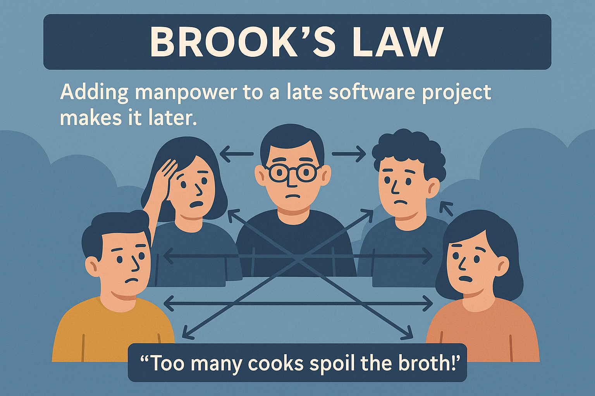

# 所有软件估算都是错的，但都不是没用的？Scrum团队如何理性看待与改进估算

在敏捷开发和Scrum实践中，估算（Estimation）一直是绕不开的话题。每次Sprint Planning，大家举着扑克牌，讨论着Story Points，想要预测未来两周能完成多少功能——可最终结论往往是：**“怎么又拖延了？”**、“为啥我们又低估了？”。

其实，这背后不仅仅是技术难度的问题，更关乎我们对估算本质的理解。**所有软件估算都是错的，但没有一个估算是没用的。**这不是一句玩笑，而是敏捷团队必须深刻体会的真理。

今天就用一篇通俗+专业+图文并茂的文章，带你一探估算的“坑”，并分享实用建议！

---

## 为什么软件估算总是“错”？

### 1. 估算其实是“预测未来”

无论Story Points还是工时拆分，**本质都是基于已有知识对未来做出预测**。但软件项目高度复杂、需求变化快，很多变量根本无法提前预知。就像天气预报，即便科学手段再先进，也无法百分百准确。

_“开发其实就是在不确定中掷骰子。”_

### 2. 为什么计划会失败？五大经典定律揭秘

敏捷领域、软件工程早已总结出不少“血泪教训”。下面这五条定律，就是每个Scrum Master和开发者都应该铭记于心的👇：

#### 🕰️ Hofstadter’s Law（霍夫施塔特定律）

> “事情总比你预期耗时更久——即使你考虑到了这一点。”

- **核心：** 人类普遍乐观，总低估复杂度，哪怕意识到要留余量还是不够！
- **案例：** 一个看似简单的API接口，遇到第三方服务变更、团队沟通延迟，结果延期两倍。

#### 👥 Brook’s Law（布鲁克定律）

> “给一个已经延误的软件项目增加人手，只会让它更晚完成。”

- **核心：** 新人上手需要时间，团队扩大导致沟通成本成倍提升。
- **案例：** 项目中期急招新成员，希望加速进度，结果反而拖慢节奏。

_“人多力量大？不一定！”_

#### 🧠 Planning Fallacy（计划谬误）

- **核心：** 过度自信，忽视潜在障碍，对自己能力过度乐观。
- **案例：** “这功能上次做过，顶多2天。”结果因需求变动、遗忘细节拖到5天。

#### 🚲 Bikeshedding（自行车棚效应）

- **核心：** 团队倾向于在容易理解的小问题上纠结，却忽略了真正棘手的大问题。
- **案例：** “按钮颜色到底用蓝还是绿？”大家讨论半天，复杂业务逻辑却无人问津。

#### ⏳ Parkinson’s Law（帕金森定律）

> “工作会扩展到所有可用时间。”

- **核心：** 任务时间宽裕时，开发者往往会无形中拖慢节奏、追求“完美”。
- **案例：** 3天的工作，实际2天能完成，但因为deadline宽松反而拖满3天。

---

## 那么，我们该怎么做？

### 拆解任务，把大象切成小块🐘➡️🍔

最有效的方法之一，就是把“大任务”分解成“小任务”。比如：

- **避免笼统评估1周、2周的大功能；**
- **将任务粒度控制在最多3天内；**
- **小任务更容易看清风险，也便于进度跟踪和及时调整。**

### 别让估算变成承诺，而是用来指导决策

估算≠承诺！不要被数字绑架，更不要因为计划失误而互相指责。它只是帮助我们了解复杂度、制定优先级、发现风险。**把它当作指南针，而不是GPS导航仪。**

### 不断复盘和学习

每个Sprint结束后，和团队一起Review下哪些估算准、哪些偏差大，讨论原因，下次就会更接近事实。

---

## 结论：理性看待估算，用好它就行！

敏捷开发和Scrum不是要你完美预知未来，而是鼓励你大胆假设、小步快跑、持续调整。记住：

- **所有软件估算都会有误差，但它们依然有参考价值；**
- **识别常见陷阱，别被心理偏见和流程误区带跑偏；**
- **拆分任务、复盘总结，让团队进步一点点！**

---

## 你怎么看？🤔

你所在的Scrum团队有哪些估算“翻车”经历？你们有没有更好的拆分与校准方法？欢迎在评论区留言交流！

👉 如果觉得本文有帮助，别忘了点赞、转发给你的团队小伙伴！
