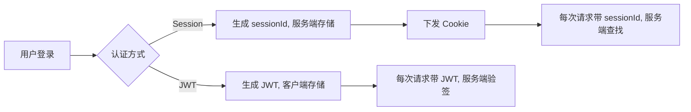

# Session-Based Auth 与 JWT 的区别与应用解析

## 引言

在现代 Web 应用和分布式系统架构中，**用户认证**（Authentication）方案的选择直接影响系统的安全性、可扩展性与运维复杂度。Session-Based Authentication（基于会话的认证）和 JWT（JSON Web Token）是当前主流的两种认证机制。虽然许多开发者日常使用其中一种，但对二者的原理、优劣及适用场景往往缺乏系统性认识。本文将结合实际案例和技术细节，全面剖析这两种方案，帮助你在不同场景下做出最佳决策。

## 技术原理详解

### 1. Session-Based Authentication（基于会话的认证）

Session 认证的核心思想是：**状态由服务器管理**。

- **登录流程**：用户登录后，后端生成一个随机 `session ID`，并将其存储在缓存（如 Redis）或数据库中，同时通过 `Set-Cookie` 响应头以 `HttpOnly` Cookie 的形式下发给浏览器。
- **请求流程**：每次请求浏览器自动携带该 Cookie，服务器根据 `session ID` 查找会话记录，恢复用户上下文。
- **安全性**：敏感信息完全存储在服务端，前端只持有无实际含义的随机串，泄漏风险低。

**典型代码示例：**

```python
# Flask 示例
@app.route('/login', methods=['POST'])
def login():
    user = authenticate(request.form['username'], request.form['password'])
    if user:
        session_id = generate_session_id()
        redis.set(session_id, user.id)
        response = make_response(redirect('/dashboard'))
        response.set_cookie('sessionid', session_id, httponly=True)
        return response
    return 'Unauthorized', 401
```

#### 优势 ✨

- **即时注销（Revoke）**：服务端删除 `session` 记录即可实现“强制登出”或“全端退出”。
- **数据不出服务端**：认证信息仅存储于后端，降低敏感数据泄漏风险。
- **运维简单（小规模）**：适合中小规模应用，尤其单体或轻量级集群。

#### 挑战 ⚠️

- **扩展性受限**：横向扩容时需引入共享缓存（如 Redis Cluster），增加网络延迟与系统复杂度。
- **粘性会话（Sticky Session）**：部分场景需保持请求路由一致，负载均衡配置复杂。

### 2. JWT Authentication（基于令牌的认证）

JWT 的核心思想是：**状态随客户端流动，服务端无状态（Stateless）**。

- **登录流程**：用户登录后，服务器生成包含用户信息和权限的 JSON Token，并用私钥签名，然后返回给客户端。
- **请求流程**：客户端每次请求将 JWT 放在 `Authorization` Header 或 Cookie 中。任何服务器节点均可使用公钥验证签名并解析其中声明（Claims）。
- **Token 结构**：`header.payload.signature`，其中 payload 明文可读但不可篡改。

**典型 Token 示例（解码后）：**

```json
{
  "alg": "HS256",
  "typ": "JWT"
}.
{
  "sub": "user123",
  "role": "admin",
  "exp": 1718153400
}.
(signature)
```

#### 优势 🚀

- **天然无状态**：任意微服务/边缘节点可独立校验 Token，无需共享存储或中心化会话管理。
- **高扩展性**：特别适合 SPA、移动端或微服务架构下，前端直接调用多个后端接口。
- **传输轻便**：Token 可嵌入 Header 或 Cookie，网络通信高效。

#### 挑战 ⚡

- **Token 不可即时撤销**：JWT 一旦签发即有效，除非到期（exp），无法“强制登出”或账户锁定，除非引入黑名单等额外机制。
- **Payload 可被读取**：虽然不可篡改，但敏感信息不应写入 Payload。
- **密钥管理复杂**：密钥轮换与权限粒度控制需谨慎设计。

## 应用场景对比

| 维度         | Session-Based Auth  | JWT Auth                    |
| ------------ | ------------------- | --------------------------- |
| 数据存储     | 服务端              | 客户端                      |
| 横向扩展     | 需共享缓存或 Sticky | 天然支持多节点              |
| 撤销/登出    | 即时删除 session    | 需额外机制，无法即时撤销    |
| 秘密暴露风险 | 最小                | 秘钥管理关键                |
| 适合场景     | 单体/中小系统       | 微服务、大型分布式/移动应用 |

## 案例分析

### 场景一：企业内部管理后台

对于后台管理类系统，用户数量有限，对安全性和账号管控（如强制下线、权限收回）要求高。采用 Session-Based Auth 可实现灵活的会话管理和即时权限变更。

### 场景二：多终端社交或内容平台

如移动 App + Web + IoT 场景，需横向扩展且前端直连多个微服务接口。此时采用 JWT，可大幅简化架构，提高吞吐能力。但需配合短生命周期 Token、Refresh Token 和 Token 黑名单等机制强化安全性。

## 图示说明



## 结论与建议

选择认证机制时，应结合业务特性、系统规模及安全需求：

- **优先考虑 Session-Based Auth** 👉 如果你需要实时撤销用户访问权、系统体量适中或后台管理场景；
- **优先考虑 JWT Auth** 👉 如果你追求横向可扩展性、服务无状态化、适用于微服务/多终端架构。

无论哪种方案，都建议进行定期审计和安全评估，并根据业务发展动态调整设计。合理组合 Refresh Token、黑名单、权限粒度控制等措施，可进一步提升系统安全与用户体验。

---

🛡️ 安全架构选型没有银弹。理解每种方案的本质和边界，是构建健壮、高效系统的关键。
