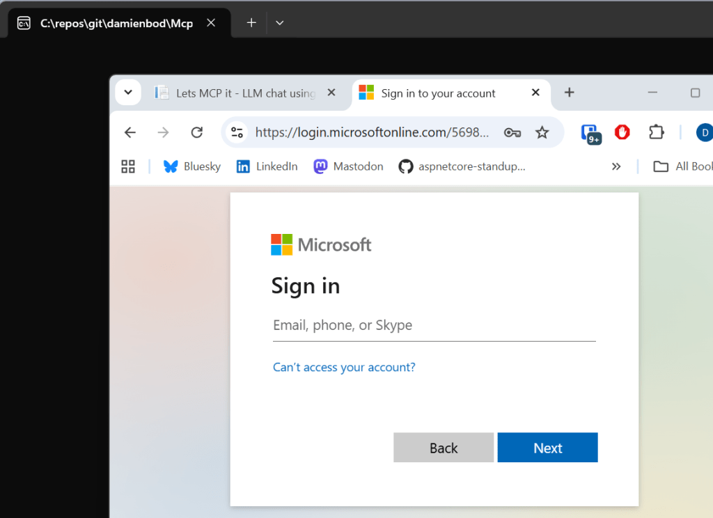

# 使用 OAuth 和 Entra ID 实现安全的 MCP 桌面客户端

Model Context Protocol (MCP) 是一种用于连接 AI 应用与外部数据源、工具和服务的开放协议标准。在企业环境中部署 MCP 应用时，如何确保客户端与服务器之间的安全通信至关重要。本文将详细介绍如何构建一个安全的 MCP OAuth 桌面客户端，通过 Microsoft Entra ID（原 Azure Active Directory）实现基于用户身份的委托访问模式。

## MCP 安全架构概述

在传统的客户端-服务器架构中，桌面应用通常面临无法安全存储密钥的问题。因此，MCP 桌面客户端需要采用公共客户端（Public Client）模式，依赖用户身份进行身份验证，而非应用程序凭据。这种架构设计基于以下核心原则：

1. **零信任模型**：桌面应用无法被信任保存任何密钥信息
2. **用户委托**：所有操作必须基于已认证用户的身份和权限
3. **最小权限**：仅授予完成特定任务所需的最小权限范围


整个认证流程涉及三个核心组件：

- **MCP 桌面客户端**：.NET 控制台应用程序，负责用户身份验证和请求发起
- **MCP 服务器**：基于 ASP.NET Core 构建的安全服务端点
- **Microsoft Entra ID**：身份提供者（IdP），负责用户认证和令牌颁发

## MCP 服务器端配置

MCP 服务器作为受保护的资源端点，必须正确配置 OAuth 身份验证中间件以验证来自客户端的访问令牌。服务器端采用基于 JWT Bearer 令牌的验证机制，确保只接受来自特定租户的委托访问令牌。

### 关键配置要点

服务器端配置需要注意以下几点：

1. **受众（Audience）验证**：确保令牌是为当前 API 颁发的
2. **作用域（Scope）验证**：检查令牌是否包含必需的 `mcp:tools` 权限
3. **令牌类型限制**：仅接受用户委托令牌，拒绝应用程序访问令牌

在 ASP.NET Core 中配置 JWT 身份验证：

```csharp
services.AddAuthentication(JwtBearerDefaults.AuthenticationScheme)
    .AddJwtBearer(options =>
    {
        options.Authority = "https://login.microsoftonline.com/{tenant-id}";
        options.Audience = "api://96b0f495-3b65-4c8f-a0c6-c3767c3365ed";
        options.TokenValidationParameters = new TokenValidationParameters
        {
            ValidateIssuer = true,
            ValidateAudience = true,
            ValidateLifetime = true,
            ValidateIssuerSigningKey = true
        };
    });
```

服务器端还需要验证令牌中的 `scp` 声明（Scope Claim），确保包含 `mcp:tools` 权限：

```csharp
app.Use(async (context, next) =>
{
    if (context.User.Identity?.IsAuthenticated == true)
    {
        var scopeClaim = context.User.FindFirst("scp")?.Value;
        if (string.IsNullOrEmpty(scopeClaim) ||
            !scopeClaim.Contains("mcp:tools"))
        {
            context.Response.StatusCode = 403;
            await context.Response.WriteAsync("Insufficient permissions");
            return;
        }
    }
    await next();
});
```

## 客户端身份验证实现

桌面应用客户端的核心挑战在于如何安全地获取用户身份令牌。由于桌面应用无法安全存储客户端密钥，必须采用公共客户端模式，使用 OAuth 2.0 授权码流程（Authorization Code Flow）配合 PKCE（Proof Key for Code Exchange）扩展。

### MSAL 库集成

Microsoft Authentication Library (MSAL) 提供了完整的身份验证能力。通过 `Microsoft.Identity.Client` NuGet 包，可以轻松实现公共客户端的身份验证逻辑。

以下是完整的用户登录和令牌获取实现：

```csharp
private static async Task<string> SignInUserAndGetTokenUsingMSAL(
    PublicClientApplicationOptions configuration,
    string[] scopes)
{
    // 构建身份验证授权终结点 URL
    string authority = string.Concat(configuration.Instance, configuration.TenantId);

    // 初始化 MSAL 公共客户端应用程序
    var application = PublicClientApplicationBuilder
        .Create(configuration.ClientId)
        .WithAuthority(authority)
        .WithDefaultRedirectUri() // 使用默认的本地回环地址
        .Build();

    AuthenticationResult result;

    try
    {
        // 首先尝试静默获取令牌（使用缓存的账户）
        var accounts = await application.GetAccountsAsync();
        result = await application
            .AcquireTokenSilent(scopes, accounts.FirstOrDefault())
            .ExecuteAsync();
    }
    catch (MsalUiRequiredException ex)
    {
        // 如果静默获取失败，启动交互式浏览器登录流程
        result = await application
            .AcquireTokenInteractive(scopes)
            .WithClaims(ex.Claims) // 传递任何必需的额外声明
            .ExecuteAsync();
    }

    return result.AccessToken;
}
```

### 令牌获取流程解析

上述代码实现了两阶段令牌获取策略：

**阶段一：静默令牌获取**  
应用首先尝试从本地缓存中获取有效令牌。MSAL 会自动管理令牌缓存，包括访问令牌和刷新令牌的存储。如果缓存中存在未过期的令牌，可以直接返回使用，避免重复的用户交互。

**阶段二：交互式登录**  
当静默获取失败时（令牌过期、首次登录等情况），MSAL 会抛出 `MsalUiRequiredException` 异常。此时应用调用 `AcquireTokenInteractive` 方法，启动系统默认浏览器进行用户身份验证。

交互式登录使用 OAuth 2.0 授权码流程配合 PKCE，确保即使在公共客户端环境下也能安全地完成身份验证：

1. 客户端生成随机的 `code_verifier` 和对应的 `code_challenge`
2. 浏览器重定向到 Entra ID 授权端点，携带 `code_challenge`
3. 用户完成身份验证后，Entra ID 返回授权码
4. 客户端使用授权码和原始 `code_verifier` 交换访问令牌

这种机制有效防止了授权码拦截攻击，即使授权码被中间人截获也无法兑换成令牌。

## MCP 客户端传输层配置

获取访问令牌后，需要配置 MCP 客户端的传输层，将令牌附加到 HTTP 请求头中：

```csharp
private static PublicClientApplicationOptions? appConfiguration = null;
private static IPublicClientApplication? application;

public static async Task<IClientTransport> CreateMcpTransportAsync(
    HttpClient httpClient,
    IConfigurationRoot configuration)
{
    // 加载应用配置
    appConfiguration = configuration.Get<PublicClientApplicationOptions>();

    // 定义请求的权限作用域
    string[] scopes = ["api://96b0f495-3b65-4c8f-a0c6-c3767c3365ed/mcp:tools"];

    // 使用 MSAL 进行用户登录并获取访问令牌
    var accessToken = await SignInUserAndGetTokenUsingMSAL(
        appConfiguration!,
        scopes);

    // 将令牌设置到 HttpClient 的默认请求头中
    httpClient.DefaultRequestHeaders.Authorization =
        new AuthenticationHeaderValue("Bearer", accessToken);

    // 获取 MCP 服务器 URL 配置
    var httpMcpServer = configuration["HttpMcpServerUrl"];

    // 创建并返回 SSE 客户端传输实例
    var transport = new SseClientTransport(new()
    {
        Endpoint = new Uri(httpMcpServer!),
        Name = "MCP Desktop Client",
    }, httpClient);

    return transport;
}
```

### 作用域（Scope）配置详解

在上述代码中，`scopes` 数组定义了客户端请求的权限范围。作用域字符串遵循特定格式：

```
api://{resource-identifier}/{permission-name}
```

其中：

- `{resource-identifier}`：MCP 服务器在 Entra ID 中注册的应用程序 ID
- `{permission-name}`：自定义的权限名称，如 `mcp:tools`

这种细粒度的权限控制允许服务器端根据不同的作用域实施不同的访问策略。客户端请求的作用域会包含在访问令牌的 `scp` 声明中，服务器端可以据此进行授权决策。

## 用户认证体验

当客户端应用启动时，如果检测到需要用户交互，MSAL 会自动打开系统默认浏览器，导航到 Microsoft Entra ID 的登录页面。用户体验流程如下：



1. **身份验证**：用户输入企业账号和密码（或使用其他配置的身份验证方法，如 Windows Hello、FIDO2 密钥等）
2. **多因素认证**（可选）：如果组织启用了 MFA，用户需要完成额外的身份验证步骤
3. **同意授权**：首次访问时，用户需要同意授予应用所请求的权限
4. **重定向回调**：身份验证成功后，浏览器重定向到本地回环地址，MSAL 自动捕获授权码并完成令牌交换

整个过程对用户透明且安全，无需在桌面应用中输入任何凭据，避免了凭据被客户端应用记录或窃取的风险。

## 安全性考量与最佳实践

### 为什么不使用动态客户端注册（DCR）

Model Context Protocol 规范中提到了动态客户端注册（Dynamic Client Registration, DCR）作为可选的安全特性。然而，在桌面客户端场景下，不建议使用 DCR，原因如下：

1. **信任边界问题**：DCR 允许客户端在运行时动态注册到授权服务器，但桌面应用作为公共客户端，其代码和配置可以被用户完全访问和修改
2. **密钥管理困境**：即使通过 DCR 动态获得客户端凭据，桌面应用仍然无法安全存储这些凭据
3. **合规性风险**：某些行业监管要求明确禁止在不受控环境中存储客户端密钥

### 委托访问 vs 应用访问

本文介绍的方案强制使用用户委托访问令牌（Delegated Access Token），而非应用访问令牌（Application Access Token）。这种设计选择基于以下安全原则：

**用户委托访问模式**：

- 所有操作均在已认证用户的上下文中执行
- 访问权限受用户角色和权限约束
- 审计日志可追溯到具体用户
- 符合最小权限原则

**应用访问模式**（不推荐用于桌面客户端）：

- 应用以自身身份执行操作，无法关联到具体用户
- 需要客户端密钥，桌面应用无法安全存储
- 权限通常过于宽泛，违反最小权限原则

### 令牌生命周期管理

访问令牌通常具有较短的有效期（默认 1 小时），以限制令牌泄露的潜在影响。MSAL 自动处理令牌刷新逻辑：

1. **访问令牌**：用于实际的 API 调用，生命周期短
2. **刷新令牌**：用于获取新的访问令牌，生命周期长（可达 90 天）
3. **自动刷新**：MSAL 在访问令牌接近过期时自动使用刷新令牌获取新令牌

应用开发者无需手动管理令牌刷新流程，MSAL 的 `AcquireTokenSilent` 方法会自动处理这一切。

### 网络传输安全

除了身份验证外，还需要确保网络传输层的安全性：

1. **HTTPS 强制**：所有与 MCP 服务器的通信必须通过 HTTPS 进行
2. **证书验证**：客户端应验证服务器 TLS 证书的有效性
3. **证书固定**（可选）：对于高安全要求场景，可以实施证书固定（Certificate Pinning）

## 配置文件管理

客户端应用需要一个配置文件来存储 Entra ID 相关的设置。以下是典型的 `appsettings.json` 示例：

```json
{
  "Instance": "https://login.microsoftonline.com/",
  "TenantId": "your-tenant-id",
  "ClientId": "your-client-id",
  "HttpMcpServerUrl": "https://your-mcp-server.com/mcp"
}
```

配置项说明：

- **Instance**：Entra ID 授权端点基础 URL
- **TenantId**：组织的租户标识符（可在 Azure 门户获取）
- **ClientId**：在 Entra ID 中注册的客户端应用程序 ID
- **HttpMcpServerUrl**：MCP 服务器的端点地址

## 常见问题与故障排除

### 令牌验证失败

如果服务器端返回 401 Unauthorized 错误，可能的原因包括：

1. **受众不匹配**：确保客户端请求的作用域与服务器端配置的受众一致
2. **令牌过期**：检查系统时间是否正确
3. **作用域缺失**：验证令牌中是否包含必需的 `scp` 声明

可以使用 [jwt.ms](https://jwt.ms) 等工具解码访问令牌，检查其内容是否符合预期。

### 浏览器未打开

MSAL 依赖系统默认浏览器进行身份验证。如果浏览器未自动打开：

1. 检查防火墙设置，确保允许应用监听本地回环端口
2. 验证操作系统是否正确配置了默认浏览器
3. 尝试显式指定重定向 URI 而非使用默认值

### 跨平台兼容性

MSAL 支持 Windows、macOS 和 Linux 平台，但在非 Windows 平台上需要注意：

- Linux：确保安装了图形环境和默认浏览器
- macOS：首次运行时可能需要授予应用网络访问权限

## 扩展阅读与参考资源

### MCP 协议与实现

- [MCP 协议规范](https://modelcontextprotocol.io/specification/2025-06-18/basic/authorization)
- [MCP 安全最佳实践](https://modelcontextprotocol.io/specification/2025-06-18/basic/security_best_practices)
- [Azure MCP 服务](https://mcp.azure.com/)

### OAuth 与身份认证标准

- [OAuth 2.0 授权服务器元数据（RFC 8414）](https://datatracker.ietf.org/doc/html/rfc8414)
- [OAuth 2.0 动态客户端注册协议（RFC 7591）](https://datatracker.ietf.org/doc/html/rfc7591)
- [PKCE 扩展（RFC 7636）](https://datatracker.ietf.org/doc/html/rfc7636)

### Microsoft Entra ID 文档

- [Microsoft.Identity.Client 库文档](https://learn.microsoft.com/zh-cn/azure/active-directory/develop/msal-overview)
- [公共客户端应用最佳实践](https://learn.microsoft.com/zh-cn/azure/active-directory/develop/msal-net-initializing-client-applications)
- [使用 .NET 构建 MCP 服务器](https://learn.microsoft.com/zh-cn/dotnet/ai/quickstarts/build-mcp-server)

## 总结

构建安全的 MCP 桌面客户端需要综合考虑身份验证、授权和传输层安全等多个维度。本文介绍的方案基于以下核心原则：

1. **用户身份委托**：所有操作基于已认证用户的身份和权限执行
2. **公共客户端模式**：承认桌面应用无法安全存储密钥的现实
3. **标准协议遵循**：严格遵循 OAuth 2.0 和 OpenID Connect 标准
4. **最小权限原则**：仅请求和授予完成任务所需的最小权限

通过 Microsoft Entra ID 与 MSAL 库的结合，开发者可以快速构建企业级的安全 MCP 应用，同时提供良好的用户体验。随着 MCP 协议的不断演进和安全标准的完善，未来可能会有更多针对桌面客户端的安全模式出现，但本文介绍的委托访问模式将持续作为企业场景下的推荐方案。

在实际项目中部署此方案时，务必结合组织的安全策略和合规要求，配置适当的条件访问策略、多因素认证和审计日志记录，以构建完整的安全防护体系。
