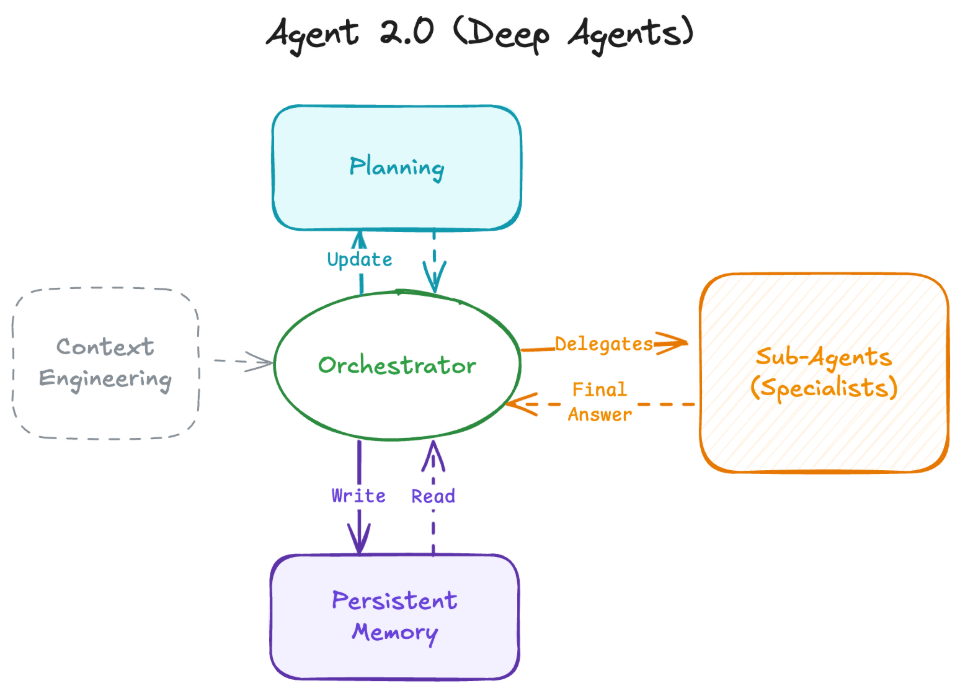

## 引言：AI 智能体的架构转型

过去一年中，构建 AI 智能体（Agent）通常意味着一件事：建立一个 while 循环，接收用户提示词，发送给大语言模型（LLM），解析工具调用，执行工具，将结果返回，然后重复这一过程。这就是我们所说的**浅层智能体（Shallow Agent）**或 **Agent 1.0**。

这种架构对于处理事务性任务表现出色，例如"东京的天气如何？我应该穿什么？"这类即时问答场景。然而，当面对需要 50 个步骤、持续三天才能完成的复杂任务时，它们往往会分散注意力、丢失上下文、陷入无限循环，或者因为单个上下文窗口无法容纳过多步骤而产生幻觉（hallucination）。

我们正在见证一场架构性转变，从浅层智能体向**深度智能体（Deep Agents）**或 **Agent 2.0** 演进。这些系统不仅仅是在循环中被动响应，而是结合了智能体模式（agentic patterns）来进行规划，管理持久化的内存/状态，并将工作委托给专门的子智能体（sub-agents），从而解决多步骤、复杂的问题。



## Agent 1.0：浅层循环的局限性

要理解智能体的未来方向，我们必须先了解现状。当今大多数智能体都是"浅层"的，这意味着它们完全依赖 LLM 的上下文窗口（对话历史）作为其状态存储。

### 典型的浅层智能体工作流程

1. **用户提示**："查找苹果股票的价格，并告诉我现在是否适合购买。"
2. **LLM 推理**："我需要使用搜索工具。"
3. **工具调用**：`search("AAPL stock price")`
4. **观察结果**：工具返回数据。
5. **LLM 回答**：根据观察生成响应，或调用另一个工具。
6. **重复**：循环直到完成。

### 架构特点与根本缺陷

这种架构具有**无状态**和**短暂性**的特点。智能体的整个"大脑"都在上下文窗口内。当任务变得复杂时，例如"研究 10 个竞争对手，分析他们的定价模型，构建比较电子表格，并撰写战略总结"，它会因以下原因而失败：

- **上下文溢出**：历史记录中充斥着工具输出（HTML、混乱的数据），将原始指令挤出了上下文窗口。
- **目标丢失**：在中间步骤的噪音中，智能体忘记了原始目标。
- **无恢复机制**：如果它陷入困境，很少有远见停止、回溯并尝试新方法。

浅层智能体非常适合 5-15 步的任务，但对于需要 500 步的任务则表现糟糕。这种架构的根本问题在于，它将计划、执行和记忆全部耦合在单一的上下文窗口中，缺乏分层思考和长期记忆能力。

## Agent 2.0 的架构：深度智能体的四大支柱

深度智能体将规划与执行解耦，并在上下文窗口之外管理内存。这种架构由四个核心支柱构成，它们共同作用，使智能体能够处理复杂、长期的任务。

### 支柱一：显式规划（Explicit Planning）

浅层智能体通过思维链（chain-of-thought）进行隐式规划（"我应该做 X，然后做 Y"）。相比之下，深度智能体使用工具来创建和维护**显式计划**，这可以是 Markdown 文档中的待办事项列表。

#### 规划机制的工作原理

在每个步骤之间,智能体会审查和更新此计划，将步骤标记为 `pending`（待处理）、`in_progress`（进行中）或 `completed`（已完成），或添加注释。如果某个步骤失败，它不会盲目重试，而是更新计划以适应失败。这使智能体能够专注于高层任务。

显式规划的核心优势在于：

- **可追溯性**：任何时候都可以查看当前进度和剩余任务
- **可调整性**：遇到障碍时可以动态调整策略
- **目标保持**：即使执行数百步，也不会偏离最初目标

例如，当处理"研究量子计算并撰写总结"任务时，规划文档可能如下：

```markdown
## 任务计划

- [x] 搜索量子计算的基本概念
- [in_progress] 收集最新研究论文
  - 注意：某些学术数据库访问受限，需要切换到公开资源
- [pending] 分析技术趋势
- [pending] 撰写综合总结
- [pending] 保存到文件
```

### 支柱二：层级委托与子智能体（Hierarchical Delegation）

复杂任务需要专业化分工。浅层智能体试图在单一提示词中成为"万金油"。深度智能体则采用**协调者 → 子智能体**的模式。

#### 委托模式的架构设计

协调者（Orchestrator）将任务委托给一个或多个子智能体，每个子智能体都拥有清晰的上下文。子智能体（例如"研究员"、"编码员"、"作家"）执行自己的工具调用循环（搜索、出错、重试），编译最终答案，并**仅**将综合答案返回给协调者。

这种分层架构带来多重好处：

- **上下文隔离**：每个子智能体只处理自己领域的信息，避免上下文污染
- **专业化**：不同子智能体可以配置不同的模型、提示词和工具集
- **并行处理**：多个子智能体可以同时处理不同子任务
- **错误隔离**：子智能体的失败不会影响整体任务的其他部分

举例来说，当协调者接收到"构建竞争对手分析报告"任务时，它可能会：

1. 派遣"研究员"子智能体收集各竞争对手的信息
2. 派遣"数据分析员"子智能体处理定价数据
3. 派遣"作家"子智能体撰写最终报告

每个子智能体完成任务后，只返回精炼的结果，而不是所有中间步骤和原始数据。

### 支柱三：持久化内存（Persistent Memory）

为了防止上下文窗口溢出，深度智能体利用**外部内存源**，如文件系统或向量数据库作为其真实来源（source of truth）。诸如 Claude Code 和 Manus 等框架为智能体提供了 `read`/`write` 访问权限。

#### 内存管理策略

智能体将中间结果（代码、草稿文本、原始数据）写入持久化存储。后续智能体通过文件路径或查询仅检索必要的信息。这将范式从"记住一切"转变为"知道在哪里找到信息"。

持久化内存的典型使用场景：

#### 场景 1：研究任务

```text
/memory/research_notes.txt  - 研究员子智能体写入初步发现
/memory/raw_data.json        - 存储原始 API 响应
/memory/summary.md           - 最终总结文档
```

#### 场景 2：代码生成

```text
/workspace/main.py           - 主程序代码
/workspace/tests/            - 测试文件
/workspace/docs/README.md    - 文档
```

协调者只需要知道文件路径，而不需要将所有文件内容都加载到上下文中。当需要时，它可以指示子智能体读取特定文件，处理后再写回结果。

这种方法的关键优势：

- **无限扩展**：不受上下文窗口大小限制
- **结构化存储**：信息以有意义的方式组织
- **跨会话持久**：可以在不同的执行会话间保持状态

### 支柱四：极致上下文工程（Extreme Context Engineering）

更智能的模型并不意味着需要更少的提示词，而是需要**更好的上下文**。你无法用一个简单的"你是一个有用的 AI"提示词来获得 Agent 2.0 的行为。深度智能体依赖于高度详细的指令，有时长达数千个 token。

#### 高质量提示词的构成要素

这些指令定义了：

1. **决策协议**：识别何时停止并在行动前进行规划
2. **委托标准**：何时生成子智能体而不是自己执行工作的协议
3. **工具定义**：详细的工具定义以及如何和何时使用的示例
4. **标准规范**：文件命名和目录结构的标准
5. **协作格式**：人机协作的严格格式

一个典型的深度智能体系统提示词可能包含：

```text
你是一个协调智能体，负责管理复杂的多步骤任务。

**规划原则**
- 在执行任何操作之前，先创建详细的任务计划
- 使用 create_plan 工具生成 Markdown 格式的计划文档
- 每完成一个步骤，更新计划状态

**委托策略**
- 当子任务需要超过 10 个工具调用时，创建子智能体
- 研究任务 → 使用 Researcher 子智能体
- 代码生成 → 使用 Coder 子智能体
- 文档撰写 → 使用 Writer 子智能体

**内存管理**
- 将所有中间结果保存到 /memory/ 目录
- 文件命名格式：{task_id}_{description}.{ext}
- 每个子任务结束时，记录文件路径到计划文档

**工具使用规范**
[详细的工具文档，包含示例...]
```

这种详细的上下文工程使智能体能够做出明智的决策，而不是依赖模型的"猜测"。

## 深度智能体的实际工作流程

让我们通过一个完整的示例来可视化这些支柱如何协同工作。假设用户提出请求："研究量子计算并将总结写入文件。"


### 详细执行步骤分析

#### 第一阶段：显式规划

1. 协调者收到用户请求
2. 调用显式规划工具，创建任务计划
3. 将计划保存到外部内存：`/memory/tasks.md`

   ```markdown
   - [pending] 研究量子计算
   - [pending] 撰写总结
   - [pending] 保存到文件
   ```

#### 第二阶段：委托执行

1. 协调者识别"研究"是一个复杂的子任务
2. 生成 Researcher 子智能体，传递清晰的任务定义
3. 子智能体在**独立的上下文**中运行：
   - 搜索网络
   - 阅读文档
   - 过滤关键信息
   - 多次工具调用和重试

#### 第三阶段：持久化内存

1. Researcher 子智能体完成工作，返回**综合总结**（而非所有原始数据）
2. 协调者将总结写入外部内存：`/memory/research_notes.txt`
3. 更新任务计划，标记"研究"为 `completed`

#### 第四阶段：继续下一任务

1. 协调者继续处理下一个任务："撰写总结"
2. 读取 `/memory/research_notes.txt`（而不是将所有内容加载到上下文）
3. 生成最终文档并保存
4. 向用户报告："我已完成研究并创建了..."

### 关键优势总结

这个工作流展示了深度智能体相比浅层智能体的核心优势：

- **上下文清晰度**：协调者的上下文中只有高层计划和最终结果，没有被中间步骤污染
- **任务持久性**：即使中间某步失败，也可以从计划文档中恢复
- **可扩展性**：可以处理需要数百步的任务，因为每个子智能体只处理一小部分
- **可观察性**：通过检查计划文档和内存文件，可以随时了解进度

## 从 Agent 1.0 到 Agent 2.0 的根本转变

从浅层智能体到深度智能体的演进不仅仅是将 LLM 连接到更多工具那么简单。这是一种从**反应式循环**到**主动式架构**的转变，是围绕模型的更优工程实践。

### 核心差异对比

| 维度           | Agent 1.0（浅层） | Agent 2.0（深度） |
| -------------- | ----------------- | ----------------- |
| **状态管理**   | 上下文窗口        | 外部持久化内存    |
| **任务处理**   | 单一循环          | 层级委托          |
| **规划方式**   | 隐式思维链        | 显式计划文档      |
| **上下文工程** | 简单提示词        | 详细系统指令      |
| **适用场景**   | 5-15 步短任务     | 数百步长期任务    |
| **错误恢复**   | 无机制            | 计划更新与回溯    |

### 实施路径建议

对于想要构建深度智能体系统的开发者，建议采用渐进式方法：

1. **起步阶段**：从显式规划开始，为现有浅层智能体添加计划管理能力
2. **中级阶段**：引入持久化内存，减少对上下文窗口的依赖
3. **高级阶段**：实现层级委托，构建专业化子智能体
4. **优化阶段**：精细化上下文工程，持续改进系统提示词

### 技术栈考虑

实现深度智能体通常需要以下技术组件：

- **编排框架**：LangChain、LangGraph、AutoGen 等
- **内存存储**：文件系统、向量数据库（Pinecone、Weaviate）、图数据库
- **工具集成**：API 包装器、搜索引擎、代码执行环境
- **监控系统**：日志记录、性能追踪、成本控制

## 结论：控制上下文，解锁复杂性

通过实施显式规划、通过子智能体进行层级委托以及持久化内存，我们得以控制上下文。而通过控制上下文，我们就能控制复杂性，从而解锁解决需要数小时甚至数天而非仅仅几秒钟的问题的能力。

深度智能体代表了 AI 系统设计的范式转变。它不是试图让单一模型做所有事情，而是将复杂任务分解为可管理的部分，使用专业化组件，并通过良好的架构原则将它们组合在一起。

这种方法不仅提高了任务完成的成功率，还使智能体系统更加**可理解**、**可维护**和**可扩展**。随着 LLM 能力的不断提升，这种架构模式将成为构建真正有用的 AI 应用的基础。

未来的智能体将不再是简单的问答机器，而是能够独立完成复杂项目、进行深度研究、生成高质量内容的智能助手。而实现这一愿景的关键，正是从 Agent 1.0 到 Agent 2.0 的架构演进。
