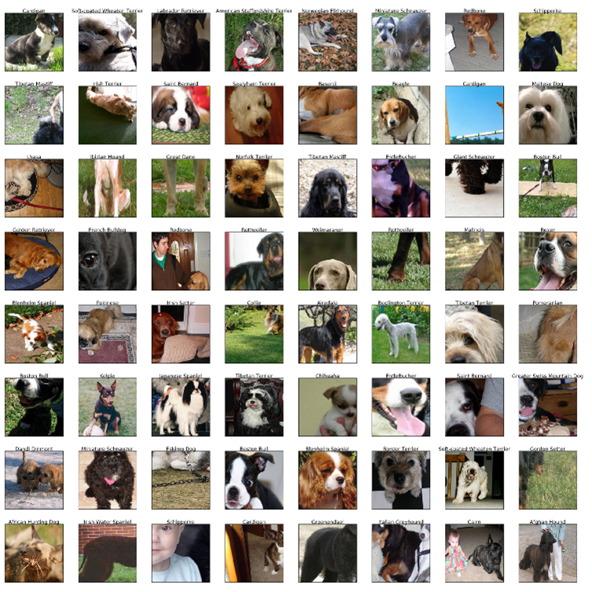

# 在 Azure AI Foundry 上微调 GPT-4o 视觉模型：图像分类实战指南

无论你是机器学习从业者、应用开发者，还是对 AI 技术充满好奇的探索者，本文将展示如何在 Azure 平台上利用前沿的视觉语言模型（Vision-Language Model, VLM）快速提升图像分类准确率——无需深厚的深度学习专业知识。

本指南将通过斯坦福狗品种数据集（Stanford Dogs Dataset）的实战案例，演示如何在 Azure OpenAI 上对 GPT-4o 进行视觉微调，并与传统的卷积神经网络（CNN）基准进行全面对比。我们将使用 Vision Fine-Tuning API 来训练模型，并分析现代视觉语言模型相对于传统方法的优势。


_数据集中展示的部分狗品种图像示例_

## 核心学习目标

通过本文，你将掌握以下关键技能：

- **数据准备**：理解视觉微调所需的数据格式和预处理流程
- **批量推理**：使用 Azure OpenAI Batch API 实现成本优化的大规模推理
- **模型微调**：通过 Vision Fine-Tuning API 训练定制化的 GPT-4o 模型
- **性能评估**：建立科学的评估体系，量化准确率、延迟和成本指标
- **权衡决策**：在不同应用场景下做出明智的技术选型

想要亲自实践？本文涉及的所有脚本、Notebook 和实验细节都已开源在 [GitHub 仓库](https://github.com/azure-ai-foundry/fine-tuning/tree/main/Demos/Image_Breed_Classification_FT)，你可以轻松复现或扩展这个项目。

让我们开始吧。

## 什么是图像分类？为何它如此重要？

计算机视觉作为人工智能/机器学习（AI/ML）领域的核心分支，已经发展了数十年。它支撑着众多跨行业的应用场景，从光学字符识别（OCR）到图像分类，无处不在。

聚焦图像分类这一任务，它能够实现内容过滤、智能路由等功能。事实上，你可能每天都在使用基于图像分类的应用，只是没有察觉到它的存在——比如照片应用的自动分类、社交媒体的内容审核等。

### 从 CNN 到视觉语言模型的演进

传统上，这些模型的主流架构是卷积神经网络（CNN），自 1998 年 LeNet 问世以来一直占据主导地位。然而，自 2017 年大语言模型（LLM）崛起以来，AI/ML 领域经历了彻底的变革，开启了大量令人兴奋的新应用场景。

最近，这些模型获得了一项突破性能力：除了文本之外，还能处理视觉输入（图像/视频）。这种新型视觉语言模型（VLM），如 OpenAI 的最新 GPT-4o 系列，不仅能生成文本，还能理解视觉输入并基于此生成相应的文本输出。

### 计算机视觉的民主化

这一进步使计算机视觉技术实现了真正的民主化，同时在性能上也达到了卓越水平。这些模型经过海量数据训练，覆盖了广泛的主题领域。现在，任何人都可以通过消费级应用（如 ChatGPT、Le Chat、Claude）或 API 访问 VLM，上传一张图片（比如你家狗狗的照片），输入你想要模型执行的任务（例如"识别图片中的狗品种是什么？"），然后直接运行。

## 起步：在 Azure 上选择和部署视觉语言模型

[Azure AI Foundry](https://ai.azure.com/) 提供了丰富的模型选择，涵盖各类 LLM、嵌入模型和语音模型，来自 OpenAI、Mistral AI、Meta、Cohere、Hugging Face 等合作伙伴。

在本文中，我们将选择 **Azure OpenAI GPT-4o（2024-08-06 模型版本）** 作为基础模型。这是支持以下两项能力的模型之一：

- **Azure OpenAI Batch API**：批量推理，成本仅为常规价格的一半
- **Azure OpenAI Vision Fine-Tuning API**：教会基础模型在特定任务上表现更好或学习全新的专门任务

### 实验流程概览

我们的实验将分为三个阶段：

1. 首先使用 Batch API 评估 GPT-4o 基础模型在测试集上的表现（利用其成本优势）
2. 然后通过 Vision Fine-Tuning API 在训练集和验证集上微调模型
3. 最后使用相同的测试集比较微调前后的性能指标

## 步骤一：使用 Azure OpenAI Batch API 进行成本优化的批量推理

### 数据集准备

让我们评估 GPT-4o 在斯坦福狗品种数据集上的表现。该数据集包含 120 个狗品种的数千张图像。为了控制成本，我们对数据集进行了下采样，每个品种仅保留 50 张图像，并按以下比例划分：

- **训练集**：4,800 张图像（每品种 40 张）
- **验证集**：600 张图像（每品种 5 张）
- **测试集**：600 张图像（每品种 5 张）

### JSONL 格式构建

要向 Batch API 发送请求，我们必须按照严格的 JSONL 格式组织数据。以下是单行 JSONL 的示例：

```json
{
  "model": "gpt-4o-batch",
  "messages": [
    {
      "role": "system",
      "content": "Classify the following input image into one of the following categories: [Affenpinscher, Afghan Hound, ..., Yorkshire Terrier]."
    },
    {
      "role": "user",
      "content": [
        {
          "type": "image_url",
          "image_url": {
            "url": "data:image/jpeg;base64,...",
            "detail": "low"
          }
        }
      ]
    }
  ]
}
```

这个 JSONL 包含：

- **model**：用于批量推理的模型部署名称（这里是 gpt-4o 2024-08-06）
- **system**：系统消息，描述图像分类任务及潜在品种列表
- **user**：用户输入，包含 base64 编码的狗图像，使用 `low` 细节级别以降低成本

> **注意**：此 JSONL 示例为简化版本，实际使用时还需包含 `response_format` 等完整参数。详细信息请参考[相关仓库](https://github.com/azure-ai-foundry/fine-tuning/tree/main/Demos/Image_Breed_Classification_FT)。

我们故意移除了实际的狗品种标签（输出），因为我们希望模型对这些请求进行推理，然后将预测结果与真实品种进行比对以评估性能。

### Batch API 的优势

Batch API 的核心优势在于以 **50% 的折扣** 处理请求，代价是需要在 24 小时内等待模型响应。需要注意的是，这是尽力而为的服务，Azure OpenAI 服务不保证 100% 的情况下都能在 24 小时内返回结果。

在我们的案例中，等待了约 15 分钟后，Batch API 返回了一个输出 JSONL 文件，其中每行包含模型的响应。


_Azure AI Foundry 门户中的批量作业执行详情_

现在，让我们提取 Batch API 的输出响应，并计算基础模型在测试集上的性能，这将成为我们的基准线。

## 步骤二：使用 Vision API 对你的图像进行 GPT-4o 微调

### 什么是微调（Fine-Tuning）？

微调旨在使用初始训练期间未涉及的新数据对模型进行二次训练，目的是让模型学习新知识、提高特定任务的性能或强化特定的语气风格。


_视觉微调的工作流程_

这个过程可以带来更好的性能、降低延迟，并且可能更具成本效益，因为你可以向微调后的模型发送更少的 token 来设定其指导方针。

### Azure OpenAI 的微调能力

Azure OpenAI 支持对不同模型进行微调，并提供多种对齐技术：

- **监督微调（SFT, Supervised Fine-Tuning）**
- **直接偏好优化（DPO, Direct Preference Optimization）**
- **强化微调（RFT, Reinforced Fine-Tuning）**

2024 年，微软引入了 **视觉微调（Vision Fine-Tuning）**，它接受图像和文本作为输入，并允许你控制以下超参数：

- **Epochs**（训练轮数）
- **Batch size**（批次大小）
- **Learning rate multiplier**（学习率倍数）
- 等等

### 微调成本结构

微调作业的定价与基础模型推理有所不同，主要考虑以下因素：

1. **训练期间使用的总 token 数**：训练/验证数据集中的 token 数量乘以训练轮数
2. **端点托管**：按小时计费
3. **推理成本**：输入/输出 token 的费用

### 构建训练数据

在我们的实验中，我们选择了 gpt-4o（2024-08-06 模型版本），并构建了 JSONL 格式的训练和验证数据集。它遵循监督微调（SFT）技术，使用输入/输出对来训练模型。

以下是训练集 JSONL 中的单行示例：

```json
{
  "messages": [
    {
      "role": "system",
      "content": "Classify the following input image into one of the following categories: [Affenpinscher, Afghan Hound, ..., Yorkshire Terrier]."
    },
    {
      "role": "user",
      "content": [
        {
          "type": "image_url",
          "image_url": {
            "url": "data:image/jpeg;base64,<encoded_springer_spaniel_image>",
            "detail": "low"
          }
        }
      ]
    },
    {
      "role": "assistant",
      "content": "Springer Spaniel"
    }
  ]
}
```

### 超参数配置

我们为本次微调选择了以下超参数：

- **Batch size: 6** — 每个训练步骤处理的样本数量
- **Learning rate: 0.5** — 控制训练期间模型学习的速度
- **Epochs: 2** — 模型在整个数据集上训练的次数
- **Seed: 42** — 确保在使用相同设置时训练结果可复现

> 更多超参数推荐信息，请参阅 [Azure 官方文档](https://learn.microsoft.com/en-us/azure/ai-foundry/openai/how-to/fine-tuning?context=%2Fazure%2Fai-foundry%2Fcontext%2Fcontext&tabs=azure-openai&pivots=programming-language-studio#configure-training-parameters-optional)。

### 微调作业监控

微调作业完成后，会返回一个结果文件，包含每步训练损失等数据点。这些数据也可以通过 Azure AI Foundry 门户可视化查看（见下方截图）。


_Azure AI Foundry 门户中的微调作业详情_


_微调过程中的训练损失曲线和其他关键指标_

## 步骤三：与经典 CNN 基准进行对比

为了提供另一个参考点，我们在 VLM 实验所用的同一斯坦福狗数据集子集上训练了一个轻量级卷积神经网络（CNN）。这个基准并 **非** 最先进的模型；它的作用是展示一个传统的、任务特定的模型在相对较小的架构和有限训练条件下能达到什么水平，并与大型预训练视觉语言模型进行对比。

这个 CNN 基准在测试集上达到了 **61.67%** 的平均准确率（详细数字见下方的对比部分）。它的训练时间不到 30 分钟，可以轻松在本地或 Azure 机器学习平台上运行。

## 结果一览：准确率、延迟与成本

在运行完所有实验后，让我们对比这三个模型（基础 VLM、微调 VLM、轻量级 CNN）在关键指标上的表现：准确率、延迟和成本。下表汇总了这些指标。

| **评估维度**               | **Base GPT-4o（零样本）** | **Fine-Tuned GPT-4o**        | **CNN 基准**              |
| -------------------------- | ------------------------- | ---------------------------- | ------------------------- |
| **平均准确率**（越高越好） | 73.67%                    | **82.67%** (+9.0 pp vs base) | 61.67% (-12.0 pp vs base) |
| **平均延迟**（越低越好）   | 1665ms                    | **1506ms** (-9.6%)           | —（未在此基准测试）       |
| **成本**（越低越好）       | 仅推理成本 $$             | 训练 + 托管 + 推理 $$$       | **本地基础设施 $**        |

### 准确率分析

微调后的 GPT-4o 模型在准确率上实现了显著提升，达到 **82.67%**，相比零样本基础模型的 **73.67%** 和轻量级 CNN 基准的 **61.67%** 都有明显优势。

这表明，即使在 Azure OpenAI 上进行少量领域特定的微调，也能显著缩小与专用分类器之间的差距。


_基础模型与微调模型的准确率对比_

### 延迟分析

使用基础 GPT-4o 进行推理平均每张图像耗时 **1.67 秒**，而微调后的模型将这一时间缩短至 **1.51 秒**（约 **快 9.6%**）。这种轻微的改进反映了更好的任务对齐。

CNN 基准虽然未在此处进行延迟基准测试，但在普通硬件上通常能在 **几十毫秒** 内返回预测结果，这在超低延迟场景下可能更具优势。


_推理延迟分布直方图_

### 成本分析

对于基础模型，使用 **Azure OpenAI Batch API** 仅产生推理成本（相比同步调用 **折扣 50%**）。

微调会引入额外的 **训练和托管新模型** 的成本，再加上推理费用。但在处理超大批量时，由于准确率更高，长期来看可能更经济。在我们的案例中：

- 微调训练作业成本为 **$152**
- 推理费用比基础模型 **贵 10%**（跨输入、缓存输入和输出）

CNN 基准可以在本地或低成本的 Azure 机器学习计算资源上托管，具有 **低推理成本**，但需要更多的工程投入来训练和维护（数据管道、更新和基础设施）。

## 关键要点

三个模型的结果清晰展现了准确率、延迟和成本之间的权衡：

- **在 Azure OpenAI 上微调 GPT-4o** 产生了 **最高的准确率**，同时还略微降低了延迟
- **零样本 GPT-4o 基础模型** **无需训练，是最快投入生产的路径**，但准确率较低
- **轻量级 CNN** 提供了低成本、低基础设施的选择，但其准确率远远落后，且需要更多的工程努力来训练和维护

## 后续步骤：如何在自己的项目中应用

本指南演示了如何在 [Azure AI Foundry](https://ai.azure.com/) 上获取一个预训练的视觉语言模型（GPT-4o），使用 Vision Fine-Tuning API 用你自己标注的图像进行微调，并将其与零样本性能和传统 CNN 基准进行对比。

通过结合 Batch API 推理进行成本高效的评估，以及针对特定任务的 Vision Fine-Tuning，你可以在无需从头构建和训练大型模型的情况下，释放更高的准确率和更好的延迟性能。

如果你想深入了解对比细节、复现或扩展本实验，请查看 [GitHub 仓库](https://github.com/azure-ai-foundry/fine-tuning/tree/main/Demos/Image_Breed_Classification_FT)，其中包含代码、JSONL 模板和评估脚本。

### 从这里出发，你可以：

- 尝试其他数据集或任务（分类、OCR、多模态提示）
- 试验不同的微调参数
- 将生成的模型集成到你自己的应用或管道中

借助 Azure AI Foundry，你可以快速从原型迁移到生产，同时利用 [Azure AI Foundry 模型](https://azure.microsoft.com/en-us/products/ai-foundry/models/)中的多样化模型目录、托管基础设施和企业级安全性。

---

**总结**：本文通过实战案例详细展示了如何在 Azure AI Foundry 平台上对 GPT-4o 视觉模型进行微调，并系统性地对比了视觉语言模型与传统 CNN 在图像分类任务中的表现。通过掌握 Batch API 和 Vision Fine-Tuning API 的使用，开发者可以在保证准确率的同时优化成本和延迟，为实际业务场景选择最合适的技术方案。
