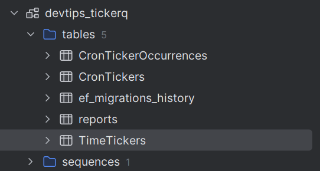
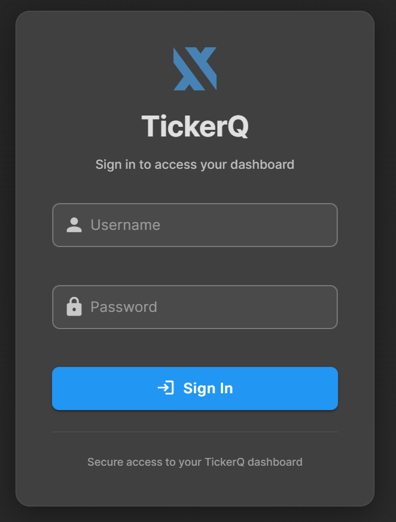
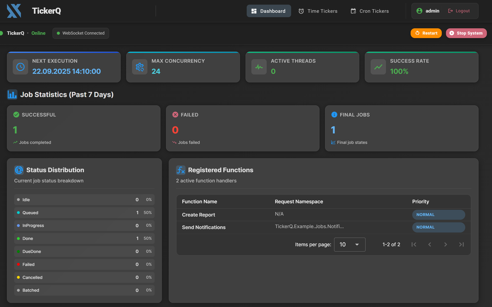
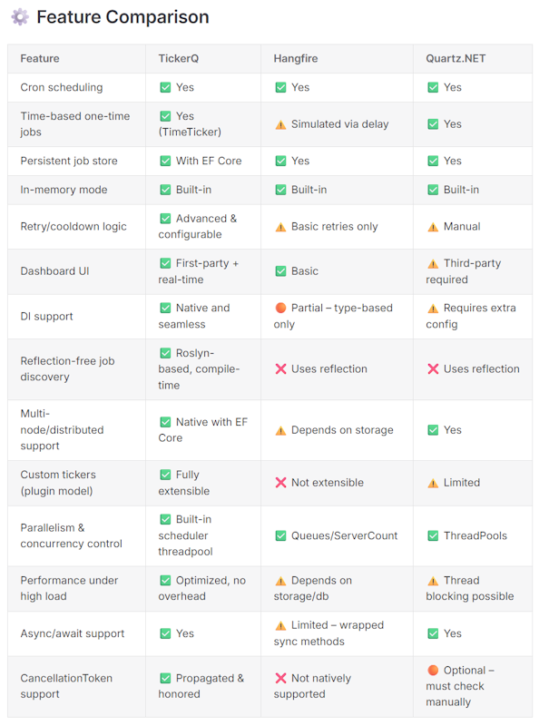

## 引言：后台任务调度的挑战

在构建现代 .NET 应用时，后台任务调度是一项基础且关键的功能。无论是定时发送邮件、生成报表、同步数据，还是执行各种维护任务，我们都需要一个可靠的调度系统。

长期以来，.NET 开发者主要依赖两个成熟的解决方案：Quartz.NET 和 Hangfire。这两个库经过时间考验，功能强大，但它们也存在一些明显的痛点：

**Quartz.NET 的局限性：**

- 基于反射的任务注册机制，缺乏类型安全
- API 设计复杂，学习曲线陡峭
- 配置繁琐，需要大量样板代码
- 参数传递机制不够直观
- 缺少原生的 EF Core 支持（依赖第三方扩展）
- 没有内置的任务监控仪表板
- 缺乏自动重试机制

**Hangfire 的不足：**

- 同样依赖反射进行任务注册
- 依赖注入支持有限
- 异步支持不完善
- 某些存储提供程序需要商业许可

这些问题在大型项目中尤为突出。开发者需要编写大量配置代码，处理复杂的类型转换，并且在调试和维护时面临诸多不便。

## TickerQ：为现代 .NET 设计的全新方案

[TickerQ](https://tickerq.net/) 是一个面向 .NET 生态的全新任务调度库，它的设计理念是"简单、优雅、强大"。TickerQ 采用了现代化的代码优先（code-first）方法，深度整合了依赖注入、EF Core 和 ASP.NET Core，提供了更符合当代开发习惯的 API。

**TickerQ 的核心优势：**

- **类型安全的任务定义**：使用特性标注即可，无需复杂的注册过程
- **原生依赖注入支持**：构造函数注入、生命周期管理完全自动化
- **内置 EF Core 集成**：任务持久化、状态管理开箱即用
- **可视化仪表板**：实时监控任务执行状态、历史记录和性能指标
- **灵活的重试策略**：支持自定义重试间隔和次数
- **最小化配置**：几行代码即可完成集成
- **优秀的异步支持**：完全基于 async/await 构建

TickerQ 兼容 .NET Standard 2.1，可在任何 .NET Core 3.1+ 应用中使用，特别适合 ASP.NET Core 项目。

## 快速上手：五分钟集成 TickerQ

让我们通过一个实际案例，了解如何在项目中快速集成 TickerQ。

### 第一步：安装 NuGet 包

首先通过 .NET CLI 安装核心包：

```bash
dotnet add package TickerQ
```

如果需要 EF Core 持久化和仪表板功能，还可以安装以下可选包：

```bash
dotnet add package TickerQ.EntityFrameworkCore
dotnet add package TickerQ.Dashboard
```

### 第二步：注册服务

在 `Program.cs` 中添加 TickerQ 服务注册，这是最简配置：

```csharp
var builder = WebApplication.CreateBuilder(args);

// 注册 TickerQ 服务
builder.Services.AddTickerQ();

var app = builder.Build();

// 启用 TickerQ 中间件
app.UseTickerQ();

app.Run();
```

`AddTickerQ()` 方法会自动注册所有必需的服务，包括任务调度器、执行引擎和状态管理器。`UseTickerQ()` 中间件负责处理任务的执行和生命周期管理。

值得注意的是，你无需手动配置后台服务或托管服务，TickerQ 在内部已经处理了这些细节。

### 第三步：定义任务

TickerQ 的任务定义非常直观——只需在普通类的方法上添加 `[TickerFunction]` 特性：

```csharp
public class ReportGenerationJob
{
    private readonly ReportDbContext _dbContext;
    private readonly ILogger<ReportGenerationJob> _logger;

    // 构造函数注入，完全支持
    public ReportGenerationJob(
        ReportDbContext dbContext, 
        ILogger<ReportGenerationJob> logger)
    {
        _dbContext = dbContext;
        _logger = logger;
    }

    // 使用特性标注定义周期性任务
    // 此任务每小时执行一次
    [TickerFunction(
        functionName: "Generate Hourly Report", 
        cronExpression: "0 * * * *")]
    public async Task GenerateHourlyReport(
        TickerFunctionContext context, 
        CancellationToken cancellationToken)
    {
        _logger.LogInformation(
            "开始生成报表，任务 ID: {TickerId}", 
            context.TickerId);

        var report = new Report
        {
            Title = $"每小时报表 - {DateTime.UtcNow:yyyy-MM-dd HH:mm}",
            Content = GenerateReportContent(),
            CreatedAt = DateTime.UtcNow
        };

        _dbContext.Reports.Add(report);
        await _dbContext.SaveChangesAsync(cancellationToken);

        _logger.LogInformation("报表生成完成: {ReportTitle}", report.Title);
    }

    private string GenerateReportContent()
    {
        // 实际的报表生成逻辑
        return $"报表内容，生成时间：{DateTime.UtcNow:yyyy-MM-dd HH:mm:ss}";
    }
}
```

这个示例展示了几个关键特性：

1. **依赖注入**：`ReportDbContext` 和 `ILogger` 通过构造函数注入，无需手动解析
2. **Cron 表达式**：使用标准的 Cron 格式定义调度规则
3. **上下文对象**：`TickerFunctionContext` 提供任务执行上下文信息
4. **取消令牌**：支持优雅的任务取消机制

### Cron 表达式配置

TickerQ 支持从配置文件中读取 Cron 表达式，便于环境差异化配置：

```csharp
[TickerFunction(
    functionName: "Scheduled Task", 
    cronExpression: "%CronSchedule:HourlyTask%")]
public void ExecuteTask() 
{ 
    // 任务逻辑
}
```

对应的 `appsettings.json` 配置：

```json
{
  "CronSchedule": {
    "HourlyTask": "0 * * * *",
    "DailyTask": "0 0 * * *",
    "WeeklyTask": "0 0 * * 0"
  }
}
```

这种方式让你可以在不修改代码的情况下调整任务调度频率。

### 任务上下文操作

`TickerFunctionContext` 对象提供了丰富的任务控制能力：

```csharp
public async Task ProcessData(TickerFunctionContext context, CancellationToken cancellationToken)
{
    try
    {
        // 获取任务信息
        var tickerId = context.TickerId;
        var executionTime = context.ExecutionTime;
        
        // 执行业务逻辑
        await PerformDataProcessing(cancellationToken);
        
        // 根据条件取消未来的执行
        if (ShouldStopRecurring())
        {
            context.CancelTicker();
        }
        
        // 或完全删除任务
        // await context.DeleteAsync();
    }
    catch (Exception ex)
    {
        // 异常处理逻辑
        throw;
    }
}
```

### 第四步：异常处理（可选）

TickerQ 允许你实现全局异常处理器，统一处理任务执行中的错误：

```csharp
public class GlobalTickerExceptionHandler : ITickerExceptionHandler
{
    private readonly ILogger<GlobalTickerExceptionHandler> _logger;
    
    public GlobalTickerExceptionHandler(ILogger<GlobalTickerExceptionHandler> logger)
    {
        _logger = logger;
    }

    public async Task HandleExceptionAsync(
        Exception exception, 
        Guid tickerId, 
        TickerType tickerType)
    {
        _logger.LogError(
            exception,
            "任务执行失败 - ID: {TickerId}, 类型: {TickerType}",
            tickerId,
            tickerType);
        
        // 发送告警通知
        await SendAlertNotification(exception, tickerId);
    }

    public async Task HandleCanceledExceptionAsync(
        Exception exception, 
        Guid tickerId, 
        TickerType tickerType)
    {
        _logger.LogWarning(
            "任务被取消 - ID: {TickerId}, 原因: {Reason}",
            tickerId,
            exception.Message);
    }
    
    private async Task SendAlertNotification(Exception ex, Guid tickerId)
    {
        // 实现告警逻辑，如发送邮件或推送通知
        await Task.CompletedTask;
    }
}
```

注册异常处理器：

```csharp
builder.Services.AddTickerQ(options =>
{
    options.SetExceptionHandler<GlobalTickerExceptionHandler>();
});
```

## 深度集成：TickerQ 与 EF Core

对于生产环境，任务持久化是必不可少的。TickerQ 提供了完善的 EF Core 集成方案，确保任务状态在应用重启、扩展或故障后能够可靠恢复。

### 配置 EF Core 持久化

首先安装 EF Core 扩展包：

```bash
dotnet add package TickerQ.EntityFrameworkCore
```

然后在服务注册时配置操作存储（Operational Store）：

```csharp
builder.Services.AddTickerQ(options =>
{
    // 配置错过任务的检查延迟
    options.UpdateMissedJobCheckDelay(TimeSpan.FromSeconds(10));
    
    // 设置实例标识符（用于多实例部署）
    options.SetInstanceIdentifier("TickerQ-Instance-1");
    
    // 添加 EF Core 操作存储
    options.AddOperationalStore<ReportDbContext>(efCoreOptions =>
    {
        // 在设计时（迁移）应用模型自定义
        // 运行时模型不受影响
        efCoreOptions.UseModelCustomizerForMigrations();
        
        // 应用启动时取消异常状态的任务
        // 防止崩溃后重复执行
        efCoreOptions.CancelMissedTickersOnAppStart();
        
        // 忽略特性定义的 Cron 任务的自动种子
        // 如果你希望仅在运行时管理这些任务
        // efCoreOptions.IgnoreSeedMemoryCronTickers();
    });
});
```

这个配置做了几件重要的事：

1. **实例标识**：在多实例部署中区分不同的应用实例
2. **错过任务检查**：定期扫描未执行的任务并补充执行
3. **启动时清理**：自动处理上次异常终止留下的"僵尸"任务
4. **迁移支持**：简化 EF Core 迁移的模型配置

### 数据库模型配置

TickerQ 使用几个内部表来管理任务状态。你有两种配置方式：

#### 方式一：使用内置模型自定义（推荐）

调用 `UseModelCustomizerForMigrations()` 后，迁移时会自动应用 TickerQ 的实体配置：

```csharp
efCoreOptions.UseModelCustomizerForMigrations();
```

#### 方式二：手动配置 DbContext

如果不使用模型自定义，需要在 `DbContext` 的 `OnModelCreating` 中手动应用配置：

```csharp
public class ReportDbContext : DbContext
{
    public ReportDbContext(DbContextOptions<ReportDbContext> options) 
        : base(options) { }

    public DbSet<Report> Reports { get; set; } = null!;

    protected override void OnModelCreating(ModelBuilder modelBuilder)
    {
        base.OnModelCreating(modelBuilder);

        // 设置默认架构
        modelBuilder.HasDefaultSchema("dbo");

        // 应用 TickerQ 的实体配置
        modelBuilder.ApplyConfiguration(
            new TimeTickerConfigurations(schema: "dbo"));
        modelBuilder.ApplyConfiguration(
            new CronTickerConfigurations(schema: "dbo"));
        modelBuilder.ApplyConfiguration(
            new CronTickerOccurrenceConfigurations(schema: "dbo"));
    }
}
```

### 创建迁移

配置完成后，使用 EF Core CLI 创建迁移：

```bash
dotnet ef migrations add AddTickerQTables -c ReportDbContext
dotnet ef database update
```

执行后，数据库会自动创建 TickerQ 需要的表结构：



主要表包括：

- **TimeTickers**：一次性或延迟执行的任务
- **CronTickers**：基于 Cron 表达式的周期性任务
- **CronTickerOccurrences**：Cron 任务的执行历史记录

### 任务种子数据

TickerQ 支持在启动时自动种子任务数据，便于初始化预定义任务：

```csharp
efCoreOptions.UseTickerSeeder(
    async timeTicker =>
    {
        // 添加一次性任务
        await timeTicker.AddAsync(new TimeTicker
        {
            Id = Guid.NewGuid(),
            Function = "Generate Initial Report",
            ExecutionTime = DateTime.UtcNow.AddMinutes(5),
            Description = "应用启动后 5 分钟生成初始报表"
        });
    },
    async cronTicker =>
    {
        // 添加周期性任务
        await cronTicker.AddAsync(new CronTicker
        {
            Id = Guid.NewGuid(),
            Expression = "0 0 * * *", // 每天午夜执行
            Function = "Generate Daily Report",
            Description = "每日报表生成任务"
        });
        
        await cronTicker.AddAsync(new CronTicker
        {
            Id = Guid.NewGuid(),
            Expression = "0 */6 * * *", // 每 6 小时执行
            Function = "Data Synchronization",
            Description = "数据同步任务"
        });
    }
);
```

种子数据在首次启动时写入数据库，后续启动不会重复添加（基于任务 ID）。

## 动态任务管理：运行时注册与控制

除了通过特性声明的静态任务，TickerQ 还支持在运行时动态创建、修改和删除任务。这在需要根据用户操作或业务逻辑动态调度任务时非常有用。

### 动态创建一次性任务

假设你有一个 API 端点，允许用户预约在未来某个时间发送通知：

```csharp
public record NotificationRequest(
    string Title, 
    string Content, 
    DateTime ScheduledTime);

public record NotificationJobContext(
    string Title, 
    string Content);

app.MapPost("/api/schedule-notification", 
    async (
        NotificationRequest request, 
        ITimeTickerManager<TimeTicker> timeTickerManager) =>
{
    // 验证时间
    if (request.ScheduledTime <= DateTime.Now)
    {
        return Results.BadRequest("预约时间必须是未来时间");
    }

    // 创建任务上下文数据
    var jobData = new NotificationJobContext(
        request.Title, 
        request.Content);

    // 动态注册任务
    var result = await timeTickerManager.AddAsync(new TimeTicker
    {
        Function = "Send Notification",
        ExecutionTime = request.ScheduledTime.ToUniversalTime(),
        Request = TickerHelper.CreateTickerRequest(jobData),
        Description = $"用户预约通知：{request.Title}",
        
        // 配置重试策略
        Retries = 3,
        RetryIntervals = new[] { 30, 60, 120 } // 30秒、1分钟、2分钟后重试
    });

    return Results.Ok(new
    {
        JobId = result.Result.Id,
        Message = $"通知 '{request.Title}' 已预约在 {request.ScheduledTime:yyyy-MM-dd HH:mm} 发送",
        RetryPolicy = "失败后最多重试 3 次"
    });
});
```

### 任务方法中接收上下文数据

在任务方法中，可以通过泛型上下文接收传递的数据：

```csharp
public class NotificationJob
{
    private readonly IEmailService _emailService;
    private readonly ILogger<NotificationJob> _logger;

    public NotificationJob(
        IEmailService emailService, 
        ILogger<NotificationJob> logger)
    {
        _emailService = emailService;
        _logger = logger;
    }

    [TickerFunction(functionName: "Send Notification")]
    public async Task Execute(
        TickerFunctionContext<NotificationJobContext> context, 
        CancellationToken cancellationToken)
    {
        // 从上下文中提取数据
        var title = context.Request.Title;
        var content = context.Request.Content;

        _logger.LogInformation(
            "开始发送通知 - 标题: {Title}, 任务 ID: {TickerId}",
            title,
            context.TickerId);

        try
        {
            // 执行实际的通知发送
            await _emailService.SendNotificationAsync(
                title, 
                content, 
                cancellationToken);

            _logger.LogInformation(
                "通知发送成功 - 任务 ID: {TickerId}",
                context.TickerId);
        }
        catch (Exception ex)
        {
            _logger.LogError(
                ex,
                "通知发送失败 - 任务 ID: {TickerId}",
                context.TickerId);
            
            // 异常会触发重试机制
            throw;
        }
    }
}
```

泛型上下文 `TickerFunctionContext<T>` 提供了强类型的 `Request` 属性，避免了手动类型转换。

### 动态创建周期性任务

同样地，你可以动态创建基于 Cron 表达式的周期性任务：

```csharp
app.MapPost("/api/schedule-recurring-task", 
    async (
        RecurringTaskRequest request, 
        ICronTickerManager<CronTicker> cronTickerManager) =>
{
    var jobData = new { 
        Description = request.Description 
    };

    var result = await cronTickerManager.AddAsync(new CronTicker
    {
        Function = "Process Recurring Task",
        Expression = request.CronExpression,
        Request = TickerHelper.CreateTickerRequest(jobData),
        Description = request.Description,
        
        // 重试配置
        Retries = 3,
        RetryIntervals = new[] { 30, 60, 120 }
    });

    return Results.Ok(new
    {
        JobId = result.Result.Id,
        Message = $"周期性任务已创建，执行规则：{request.CronExpression}"
    });
});
```

### 更新和删除任务

TickerQ 提供了灵活的任务管理 API：

```csharp
// 更新 Cron 任务
app.MapPut("/api/cron-ticker/{id:guid}", 
    async (
        Guid id, 
        UpdateCronTickerRequest request,
        ICronTickerManager<CronTicker> cronTickerManager) =>
{
    await cronTickerManager.UpdateAsync(id, ticker =>
    {
        ticker.Description = request.Description;
        ticker.Expression = request.CronExpression;
        ticker.Retries = request.MaxRetries;
    });

    return Results.Ok($"任务 {id} 已更新");
});

// 删除任务
app.MapDelete("/api/cron-ticker/{id:guid}", 
    async (
        Guid id, 
        ICronTickerManager<CronTicker> cronTickerManager) =>
{
    await cronTickerManager.DeleteAsync(id);
    return Results.NoContent();
});

// 批量删除
app.MapPost("/api/cron-ticker/batch-delete", 
    async (
        List<Guid> ids, 
        ICronTickerManager<CronTicker> cronTickerManager) =>
{
    foreach (var id in ids)
    {
        await cronTickerManager.DeleteAsync(id);
    }
    return Results.Ok($"已删除 {ids.Count} 个任务");
});
```

### 查询任务状态

你还可以查询任务的当前状态和执行历史：

```csharp
app.MapGet("/api/ticker/{id:guid}/status", 
    async (Guid id, ReportDbContext dbContext) =>
{
    var timeTicker = await dbContext.Set<TimeTicker>()
        .FirstOrDefaultAsync(t => t.Id == id);
    
    if (timeTicker != null)
    {
        return Results.Ok(new
        {
            Id = timeTicker.Id,
            Function = timeTicker.Function,
            Status = timeTicker.Status,
            ExecutionTime = timeTicker.ExecutionTime,
            LastExecutionTime = timeTicker.LastExecutionTime,
            Retries = timeTicker.Retries
        });
    }

    var cronTicker = await dbContext.Set<CronTicker>()
        .Include(c => c.Occurrences)
        .FirstOrDefaultAsync(c => c.Id == id);
    
    if (cronTicker != null)
    {
        return Results.Ok(new
        {
            Id = cronTicker.Id,
            Function = cronTicker.Function,
            Expression = cronTicker.Expression,
            Status = cronTicker.Status,
            LastOccurrences = cronTicker.Occurrences
                .OrderByDescending(o => o.ScheduledTime)
                .Take(10)
        });
    }

    return Results.NotFound();
});
```

## 可视化管理：TickerQ 仪表板

TickerQ 提供了一个功能完善的内置仪表板，让你能够实时监控所有任务的状态、执行历史和性能指标。这对于生产环境的运维和调试至关重要。

### 启用仪表板

首先安装仪表板包：

```bash
dotnet add package TickerQ.Dashboard
```

然后在服务配置中启用：

```csharp
builder.Services.AddTickerQ(options =>
{
    // ... 其他配置
    
    options.AddDashboard(dashboardOptions =>
    {
        // 设置仪表板访问路径
        dashboardOptions.BasePath = "/tickerq-dashboard";
        
        // 启用基本身份验证
        dashboardOptions.EnableBasicAuth = true;
    });
});
```

### 配置身份验证

TickerQ 仪表板支持开箱即用的基本身份验证。在 `appsettings.json` 中配置凭据：

```json
{
  "TickerQBasicAuth": {
    "Username": "admin",
    "Password": "SecurePassword123!"
  }
}
```

生产环境建议使用更强的密码，并考虑集成现有的身份验证系统。

### 访问仪表板

启动应用后，访问 `https://localhost:5001/tickerq-dashboard`（根据你的端口调整）。

首次访问会看到登录界面：



输入配置的用户名和密码后，进入主界面：



### 仪表板功能

仪表板提供了丰富的功能：

1. **任务总览**：显示所有任务的状态统计（运行中、已完成、失败、待执行）
2. **任务列表**：分别展示 Time Tickers 和 Cron Tickers
3. **执行历史**：查看每个任务的历史执行记录
4. **实时监控**：任务状态实时更新，无需手动刷新
5. **操作控制**：直接从界面触发、暂停或删除任务
6. **性能指标**：执行时长、失败率等统计数据

这些功能极大地简化了任务管理和问题排查。例如，当某个任务频繁失败时，你可以立即在仪表板中查看错误信息和重试历史，快速定位问题。

## TickerQ vs Quartz vs Hangfire：全面对比

为了更直观地理解 TickerQ 的优势，让我们通过一张对比表来看三个库的核心差异：



从这个对比可以看出，TickerQ 在以下方面具有明显优势：

### API 设计与易用性

**Quartz.NET** 需要大量配置代码：

```csharp
// Quartz.NET 方式
services.AddQuartz(q =>
{
    var jobKey = new JobKey("ReportJob");
    q.AddJob<ReportJob>(opts => opts.WithIdentity(jobKey));
    
    q.AddTrigger(opts => opts
        .ForJob(jobKey)
        .WithIdentity("ReportJob-trigger")
        .WithCronSchedule("0 * * * * ?"));
});
```

**TickerQ** 只需一个特性：

```csharp
// TickerQ 方式
[TickerFunction(functionName: "Report Job", cronExpression: "0 * * * *")]
public async Task GenerateReport() { }
```

### 依赖注入支持

**Hangfire** 的 DI 支持有限：

```csharp
// Hangfire 方式
BackgroundJob.Enqueue<ReportJob>(job => job.Generate(null));
// 参数传递不方便
```

**TickerQ** 完全基于 DI 构建：

```csharp
// TickerQ 方式
public class ReportJob
{
    private readonly IDbContext _db;
    private readonly IEmailService _email;
    
    // 构造函数注入自动工作
    public ReportJob(IDbContext db, IEmailService email)
    {
        _db = db;
        _email = email;
    }
}
```

### EF Core 集成

**Quartz.NET** 需要第三方包：

```bash
dotnet add package Quartz.Serialization.Json
dotnet add package Quartz.Extensions.DependencyInjection
# 还需手动配置存储
```

**TickerQ** 原生支持：

```csharp
options.AddOperationalStore<MyDbContext>(efOptions => 
{
    efOptions.UseModelCustomizerForMigrations();
});
```

### 仪表板体验

**Hangfire** 虽然有内置仪表板，但需要商业许可才能使用某些存储提供程序。

**TickerQ** 的仪表板完全免费，功能完善，UI 现代化。

## 实际应用场景

TickerQ 适用于各种实际场景：

### 场景一：定时报表生成

```csharp
[TickerFunction(functionName: "Weekly Sales Report", cronExpression: "0 0 * * 1")]
public async Task GenerateWeeklySalesReport(CancellationToken cancellationToken)
{
    var startDate = DateTime.Now.AddDays(-7);
    var endDate = DateTime.Now;
    
    var salesData = await _dbContext.Sales
        .Where(s => s.Date >= startDate && s.Date < endDate)
        .ToListAsync(cancellationToken);
    
    var report = await _reportGenerator.GenerateAsync(salesData);
    
    await _emailService.SendReportAsync(report, "team@company.com");
}
```

### 场景二：数据同步任务

```csharp
[TickerFunction(functionName: "Sync External API", cronExpression: "*/15 * * * *")]
public async Task SyncExternalData(CancellationToken cancellationToken)
{
    var lastSyncTime = await _dbContext.SyncLogs
        .OrderByDescending(l => l.Timestamp)
        .Select(l => l.Timestamp)
        .FirstOrDefaultAsync(cancellationToken);
    
    var newData = await _externalApiClient.GetDataAsync(lastSyncTime);
    
    _dbContext.ExternalData.AddRange(newData);
    await _dbContext.SaveChangesAsync(cancellationToken);
}
```

### 场景三：用户提醒通知

```csharp
// API 端点：用户预约提醒
app.MapPost("/api/reminders", async (
    ReminderRequest request,
    ITimeTickerManager<TimeTicker> tickerManager) =>
{
    var jobData = new ReminderJobContext(request.UserId, request.Message);
    
    await tickerManager.AddAsync(new TimeTicker
    {
        Function = "Send User Reminder",
        ExecutionTime = request.ReminderTime.ToUniversalTime(),
        Request = TickerHelper.CreateTickerRequest(jobData)
    });
    
    return Results.Ok();
});

// 任务方法
[TickerFunction(functionName: "Send User Reminder")]
public async Task SendReminder(
    TickerFunctionContext<ReminderJobContext> context,
    CancellationToken cancellationToken)
{
    var user = await _userRepository.GetByIdAsync(context.Request.UserId);
    await _notificationService.SendAsync(user, context.Request.Message);
}
```

## 最佳实践建议

在使用 TickerQ 时，以下最佳实践能帮助你构建更健壮的系统：

### 1. 合理配置重试策略

```csharp
await timeTickerManager.AddAsync(new TimeTicker
{
    Function = "Critical Task",
    ExecutionTime = DateTime.UtcNow.AddMinutes(5),
    Retries = 5,
    // 指数退避：30秒、1分钟、2分钟、5分钟、10分钟
    RetryIntervals = new[] { 30, 60, 120, 300, 600 }
});
```

### 2. 使用幂等性设计

确保任务可以安全地重复执行：

```csharp
[TickerFunction(functionName: "Process Order")]
public async Task ProcessOrder(
    TickerFunctionContext<OrderJobContext> context,
    CancellationToken cancellationToken)
{
    var orderId = context.Request.OrderId;
    
    // 检查是否已处理
    var order = await _dbContext.Orders
        .FirstOrDefaultAsync(o => o.Id == orderId, cancellationToken);
    
    if (order.Status == OrderStatus.Processed)
    {
        // 已处理，直接返回
        return;
    }
    
    // 执行处理逻辑
    await ProcessOrderInternal(order, cancellationToken);
}
```

### 3. 监控与告警

结合日志和指标，建立完善的监控体系：

```csharp
[TickerFunction(functionName: "Health Check", cronExpression: "*/5 * * * *")]
public async Task PerformHealthCheck(CancellationToken cancellationToken)
{
    var metrics = await _metricsCollector.CollectAsync(cancellationToken);
    
    if (metrics.ErrorRate > 0.05) // 错误率超过 5%
    {
        await _alertService.SendAlertAsync(
            "任务调度系统告警",
            $"错误率异常：{metrics.ErrorRate:P2}",
            AlertLevel.Critical);
    }
}
```

### 4. 合理使用任务上下文

避免传递过大的数据对象：

```csharp
// ❌ 不好：传递整个实体
var jobData = new { Order = largeOrderObject };

// ✅ 好：只传递 ID，在任务中查询
var jobData = new { OrderId = order.Id };
```

### 5. 优雅关闭处理

利用 `CancellationToken` 实现优雅关闭：

```csharp
[TickerFunction(functionName: "Long Running Task")]
public async Task ExecuteLongTask(CancellationToken cancellationToken)
{
    for (int i = 0; i < 1000; i++)
    {
        // 定期检查取消令牌
        cancellationToken.ThrowIfCancellationRequested();
        
        await ProcessBatchAsync(i, cancellationToken);
    }
}
```

## 总结

TickerQ 为 .NET 生态带来了一种全新的任务调度体验。它通过现代化的 API 设计、深度的框架集成和完善的工具支持，显著降低了后台任务管理的复杂度。

**核心优势回顾：**

- **极简配置**：几行代码即可集成，无需繁琐的样板代码
- **类型安全**：编译时检查，减少运行时错误
- **原生 EF Core 支持**：任务持久化和状态管理开箱即用
- **可视化仪表板**：实时监控，便于调试和运维
- **灵活的动态管理**：运行时创建、修改和删除任务
- **完善的重试机制**：内置指数退避和自定义策略
- **现代化异步支持**：完全基于 async/await 构建

相比 Quartz.NET 和 Hangfire，TickerQ 在易用性、类型安全和集成度上都有显著提升。如果你正在为新项目选择任务调度解决方案，或者希望简化现有系统的复杂性，TickerQ 绝对值得尝试。

项目地址：[https://tickerq.net/](https://tickerq.net/)

你可以通过官方文档获取更多详细信息和高级用法。开始使用 TickerQ，让任务调度变得简单而优雅。
