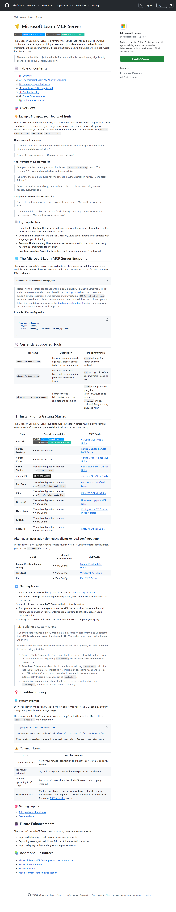

在现代软件开发中，开发者经常需要在编码过程中快速查阅技术文档、验证 API 用法或查找代码示例。传统的做法是在浏览器和 IDE 之间频繁切换，这不仅打断思维流程，还降低了开发效率。**Microsoft Learn MCP Server** 的出现改变了这一现状——它通过 Model Context Protocol (MCP) 协议，将微软官方文档的强大检索能力直接嵌入到 AI 助手的工作流中，让开发者无需离开开发环境即可获取权威、实时的技术信息。

本文将深入探讨 Microsoft Learn MCP Server 的架构原理、核心能力、集成方式以及实际应用场景，帮助开发者充分利用这一工具提升开发效率。

## 什么是 Model Context Protocol (MCP)

Model Context Protocol 是一个开放协议，旨在标准化 AI 应用程序与外部工具、数据源和上下文之间的交互方式。MCP 定义了一种客户端-服务器架构，包含三个核心组件：

1. **MCP 主机 (Host)**：使用 MCP 客户端连接到 MCP 服务器的 AI 应用程序（如 VS Code、Claude Desktop）
2. **MCP 客户端 (Client)**：维护与 MCP 服务器连接的组件，为主机获取上下文数据
3. **MCP 服务器 (Server)**：向客户端提供资源、工具和提示的程序

这种架构设计确保了 AI 模型可以安全、结构化地访问外部上下文，而无需每次都将完整的文档内容加载到提示词中。MCP 的意义在于，它为 AI 系统提供了一种类似"USB-C 接口"的标准化连接方式——不同的 AI 应用可以通过统一的协议访问各种数据源和工具。



## Microsoft Learn MCP Server 的核心能力

Microsoft Learn MCP Server 是一个远程 MCP 服务器，它通过 Streamable HTTP 传输协议提供三个核心工具，使 AI 助手能够高效访问微软官方文档：

### 1. 语义搜索工具 (microsoft_docs_search)

该工具利用先进的向量检索技术对 Microsoft Learn 文档进行语义搜索，返回最相关的内容片段。与传统的关键词搜索不同，语义搜索能够理解查询的上下文意图，即使开发者使用不同的表述方式也能找到准确的答案。

**典型应用场景**：

- 快速查找 API 参考："获取创建 Azure Container App 的 CLI 命令"
- 验证最佳实践："ASP.NET Core 中实现 IHttpClientFactory 的正确方式"
- 检查服务可用性："GPT-4.1-mini 是否在欧洲区域可用"

该工具返回的内容以 Markdown 格式呈现，包含标题、链接和精心提取的文档片段（每个片段最多 500 个令牌），确保 AI 助手能够快速获取必要信息而不被冗余内容淹没。

### 2. 完整文档获取工具 (microsoft_docs_fetch)

当需要完整的技术细节、分步教程或故障排除指南时，该工具可以获取整个文档页面并转换为 Markdown 格式。这对于需要理解完整上下文的复杂主题特别有用。

**适用场景**：

- 学习完整的实现流程："展示 ASP.NET Core 中实现身份验证的完整指南"
- 深入理解架构："端到端理解 Azure Functions"
- 获取详细教程："将 .NET 应用部署到 Azure App Service 的完整步骤"

### 3. 代码示例搜索工具 (microsoft_code_sample_search)

该工具专门用于检索微软官方文档中的代码示例，支持通过编程语言进行过滤（如 C#、Python、JavaScript、TypeScript 等）。这确保开发者获得的代码示例是可运行的、经过验证的官方实现。

**使用示例**：

- "展示使用 Azure AI Foundry SDK 进行危害评估的 Python 代码示例"
- "获取 .NET 8 中配置 IHttpClientFactory 的 C# 代码"

这三个工具协同工作，为开发者提供了从快速查询到深度学习的完整文档检索能力。

## 如何集成 Microsoft Learn MCP Server

Microsoft Learn MCP Server 的一个显著优势是其**无需身份验证、免费使用**的特性，同时支持多种主流开发工具和 AI 平台的快速集成。

### 远程 MCP 端点

服务器通过以下端点对外提供服务：

```text
https://learn.microsoft.com/api/mcp
```

> **重要提示**：该端点仅支持通过符合 MCP 标准的客户端使用 Streamable HTTP 协议访问，不支持直接在浏览器中打开（会返回 405 错误）。

### 在 Visual Studio Code 中集成

VS Code 是 Microsoft Learn MCP Server 支持最完善的开发环境之一。以下是详细的集成步骤：

#### 方式一：一键安装（推荐）

点击以下按钮可直接在 VS Code 中安装配置：

- [在 VS Code 中安装](https://vscode.dev/redirect/mcp/install?name=microsoft.docs.mcp&config=%7B%22type%22%3A%22http%22%2C%22url%22%3A%22https%3A%2F%2Flearn.microsoft.com%2Fapi%2Fmcp%22%7D)
- [在 VS Code Insiders 中安装](https://insiders.vscode.dev/redirect/mcp/install?name=microsoft.docs.mcp&config=%7B%22type%22%3A%22http%22%2C%22url%22%3A%22https%3A%2F%2Flearn.microsoft.com%2Fapi%2Fmcp%22%7D&quality=insiders)

#### 方式二：手动配置

如果需要更精细的控制，可以手动编辑配置文件：

1. 在 VS Code 中打开命令面板（Ctrl+Shift+P / Cmd+Shift+P）
2. 输入并执行 `MCP: Add Server`
3. 选择服务器类型：**HTTP (HTTP or Server Sent Events)**
4. 输入服务器 URL：`https://learn.microsoft.com/api/mcp`
5. 为服务器指定一个易于识别的 ID（如 `microsoft-docs-mcp`）
6. 选择配置范围：
   - **工作区设置**：配置保存到 `.vscode/mcp.json`，仅在当前项目中生效
   - **用户设置**：配置保存到全局 `settings.json`，在所有项目中可用

配置示例（JSON 格式）：

```json
{
  "microsoft.docs.mcp": {
    "type": "http",
    "url": "https://learn.microsoft.com/api/mcp"
  }
}
```

#### 使用 MCP Server

配置完成后，在 VS Code 中使用的步骤如下：

1. 打开 GitHub Copilot 聊天界面
2. 切换到 **Agent 模式**（参考 [VS Code 文档](https://code.visualstudio.com/docs/copilot/chat/chat-agent-mode)）
3. 在工具列表中应该能看到 "Learn MCP Server"
4. 直接提问即可，例如：
   - "根据官方文档，如何使用 az cli 创建 Azure 存储账户？"
   - "展示 .NET 8 中配置日志记录的最佳实践"

当 AI 助手需要查询微软文档时，会自动调用 MCP Server 的工具。开发者会看到类似"正在使用 microsoft_docs_search 工具..."的提示。

### 在其他平台集成

Microsoft Learn MCP Server 支持广泛的开发工具和 AI 平台：

| 平台                   | 集成方式                         | 官方指南                                                                           |
| ---------------------- | -------------------------------- | ---------------------------------------------------------------------------------- |
| **Claude Desktop**     | 通过设置 → 集成 → 添加远程服务器 | [Claude Desktop 指南](https://support.anthropic.com/en/articles/11503834)          |
| **Cursor IDE**         | 一键安装链接                     | [Cursor 官方文档](https://docs.cursor.com/context/model-context-protocol)          |
| **Visual Studio 2022** | 手动配置 `"type": "http"`        | [Visual Studio MCP 指南](https://learn.microsoft.com/visualstudio/ide/mcp-servers) |
| **Claude Code**        | 通过 CLI 命令配置                | [Claude Code 文档](https://docs.anthropic.com/en/docs/claude-code/mcp)             |
| **Windsurf / Cline**   | 通过 `mcp-remote` 代理           | 各自官方文档                                                                       |

## 实际应用场景与最佳实践

### 场景一：代码验证与最佳实践查询

在开发过程中，开发者经常需要验证自己的实现是否符合最佳实践。通过 MCP Server，可以直接在 AI 助手中完成：

**提示词示例**：

> "你确定这是在 .NET 8 最小 API 中实现 IHttpClientFactory 的正确方式吗？**请搜索 Microsoft 文档并获取完整指南**。"

AI 助手会：

1. 使用 `microsoft_docs_search` 快速定位相关文档
2. 使用 `microsoft_docs_fetch` 获取完整的实现指南
3. 使用 `microsoft_code_sample_search` 查找官方代码示例
4. 综合这些信息给出准确、权威的答案

### 场景二：学习新技术栈

当需要快速了解一个新的 Azure 服务或 .NET 特性时：

**提示词示例**：

> "我需要端到端理解 Azure Functions。**请深入研究 Microsoft 文档**。"

AI 助手会系统地检索并整理相关文档，包括架构概述、快速入门教程、配置选项和最佳实践，帮助开发者快速建立完整的知识体系。

### 场景三：故障排查与问题诊断

遇到运行时错误或配置问题时，可以直接查询官方文档中的故障排除指南：

**提示词示例**：

> "Azure Container App 部署失败，错误代码 ContainerCreateError。**请查询官方文档的故障排除指南**。"

### 优化 AI 助手使用 MCP 工具的频率

某些 AI 模型（如 Claude Sonnet 4）可能不会主动调用 MCP 工具。可以通过配置系统提示词来改善这一点。以下是一个 Cursor 规则示例：

```markdown
## 查询 Microsoft 文档

你可以使用 MCP 工具 `microsoft_docs_search`、`microsoft_docs_fetch` 和 `microsoft_code_sample_search`，这些工具能够检索微软的最新官方文档和代码示例，信息可能比你的训练数据更详细或更新。

当处理关于微软原生技术的问题时（如 C#、F#、ASP.NET Core、Microsoft.Extensions、NuGet、Entity Framework、dotnet 运行时等），请优先使用这些工具进行研究，尤其是针对具体、狭义定义的问题。
```

将此规则添加到 Cursor 的 `.cursorrules` 文件或 VS Code 的项目设置中，可以显著提高 AI 助手主动调用 MCP 工具的频率。

## 技术实现细节

### 基于向量检索的语义搜索

Microsoft Learn MCP Server 的搜索能力基于微软内部的知识服务 (Knowledge Service)，该服务同时为 "Ask Learn" 和 "Copilot for Azure" 提供支持。它采用向量嵌入和语义检索技术，能够理解查询的意图而非简单匹配关键词。

**工作流程**：

1. 用户查询通过 MCP 客户端发送到服务器
2. 查询被转换为高维向量表示
3. 向量检索引擎在文档语料库中找到语义上最相关的内容
4. 结果以结构化的 JSON 格式返回，包含标题、URL 和内容摘要

### Streamable HTTP 传输协议

与传统的请求-响应模式不同，Streamable HTTP 支持服务器以流式方式推送数据，这对于大型文档的传输特别有效：

- **低延迟**：客户端可以在完整响应到达前就开始处理数据
- **内存效率**：无需一次性加载整个文档到内存
- **实时反馈**：用户可以更快地看到 AI 助手的响应

### 动态工具发现机制

为了确保客户端不会因服务器更新而失效，MCP 协议采用动态工具发现机制：

1. **运行时发现**：客户端通过 `tools/list` 请求获取当前可用的工具及其模式
2. **故障恢复**：当工具调用失败时（如工具不存在或模式已更改），客户端自动刷新工具列表
3. **实时更新**：客户端监听服务器的 `listChanged` 通知，及时更新工具缓存

这种设计确保了服务的向后兼容性和弹性，开发者无需频繁更新客户端代码。

## 与 Azure MCP Server 的协同使用

Microsoft 还提供了 **Azure MCP Server**，它专注于 Azure 资源管理操作（如创建资源、查询状态等），与 Learn MCP Server 形成互补：

- **Learn MCP Server**：提供文档和知识查询能力
- **Azure MCP Server**：提供 Azure 资源的实际操作能力（通过 Azure CLI、azd 等工具）

在实际开发中，可以同时配置这两个 MCP Server，让 AI 助手既能查询文档又能执行 Azure 操作，实现完整的开发工作流支持。

配置示例（`.vscode/mcp.json`）：

```json
{
  "servers": {
    "microsoft.docs.mcp": {
      "type": "http",
      "url": "https://learn.microsoft.com/api/mcp"
    },
    "azure-mcp": {
      "type": "stdio",
      "command": "dnx",
      "args": [
        "Azure.Mcp",
        "--source",
        "https://api.nuget.org/v3/index.json",
        "--yes",
        "--",
        "azmcp",
        "server",
        "start"
      ]
    }
  }
}
```

## .NET 开发者的特别优势

对于 .NET 开发者，Microsoft Learn MCP Server 提供了特别丰富的内容覆盖：

- **.NET 框架与工具**：涵盖 C#、F#、ASP.NET Core、Entity Framework、Blazor 等
- **Azure 服务**：Azure Functions、App Service、Container Apps、AI Foundry 等
- **开发工具**：Visual Studio、VS Code、Azure CLI、azd 等
- **最佳实践**：Clean Architecture、DDD、微服务设计模式等

配合 VS Code 中的 GitHub Copilot 和 C# Dev Kit，开发者可以获得从编码到文档查询的一站式体验。

## 自建 MCP Server 的可能性

虽然 Microsoft Learn MCP Server 是一个托管服务，但 MCP 协议本身是开源的。开发者可以基于 MCP SDK 构建自己的文档服务器：

### C# 实现示例

使用官方的 `ModelContextProtocol` NuGet 包可以快速创建 MCP Server：

```csharp
using Microsoft.Extensions.DependencyInjection;
using Microsoft.Extensions.Hosting;
using ModelContextProtocol.Server;
using System.ComponentModel;

var builder = Host.CreateApplicationBuilder(args);
builder.Logging.AddConsole(options =>
{
    options.LogToStandardErrorThreshold = LogLevel.Trace;
});

builder.Services
    .AddMcpServer()
    .WithStdioServerTransport()
    .WithToolsFromAssembly();

await builder.Build().RunAsync();

[McpServerToolType]
public static class DocumentationTool
{
    [McpServerTool, Description("Searches internal documentation")]
    public static async Task<string> SearchDocs(string query)
    {
        // 实现自定义的文档搜索逻辑
        return $"Search results for: {query}";
    }
}
```

这对于企业内部文档、私有知识库或专有技术栈的文档检索特别有用。

## 常见问题与故障排查

### 问题 1：MCP Server 未显示在工具列表中

**解决方案**：

1. 确认配置文件语法正确（JSON 格式）
2. 重启 VS Code 或 AI 助手应用
3. 检查是否启用了 Agent 模式（VS Code 中）
4. 使用 `MCP: List Servers` 命令验证服务器状态

### 问题 2：AI 助手不主动使用 MCP 工具

**解决方案**：

1. 在提示词中明确要求："请搜索 Microsoft 文档"
2. 配置系统提示词鼓励使用工具（参见上文示例）
3. 使用更具体的技术术语提高相关性

### 问题 3：连接错误或超时

**解决方案**：

1. 验证网络连接和防火墙设置
2. 确认 MCP Server URL 正确输入
3. 检查是否使用了正确的传输协议（http 而非 stdio）

### 问题 4：浏览器访问返回 405 错误

**解释**：这是预期行为。MCP 端点仅供 MCP 客户端通过 Streamable HTTP 访问，不支持浏览器直接访问。请使用符合 MCP 标准的客户端（如 VS Code + GitHub Copilot）进行测试。

## 局限性与未来发展

### 当前局限性

1. **内容范围**：目前仅包含公开的技术文档，不包括培训模块、学习路径和认证考试内容
2. **更新频率**：知识服务每日全量刷新一次，内容更新时增量刷新
3. **语言支持**：主要针对英文文档优化，其他语言的检索效果可能有所差异

### 未来增强计划

根据微软的公开路线图，Microsoft Learn MCP Server 团队正在推进以下改进：

1. **扩展内容覆盖**：整合更多微软文档来源
2. **改进查询理解**：提升语义搜索的准确性和相关性
3. **增强遥测能力**：收集使用数据以优化服务质量
4. **多语言优化**：改善非英语语言的检索体验

## 总结

Microsoft Learn MCP Server 代表了文档检索与 AI 辅助开发融合的一个重要里程碑。通过将权威的官方文档直接嵌入到开发工作流中，它不仅提升了开发效率，更确保了开发者获取的信息是最新、最准确的。

对于微软技术栈的开发者而言，配置和使用 Microsoft Learn MCP Server 应该成为标准开发环境设置的一部分。它与 GitHub Copilot、Azure MCP Server 等工具的协同使用，可以构建一个真正智能化的开发环境，让开发者能够专注于创造价值，而非浪费时间在文档查找上。

随着 Model Context Protocol 生态系统的不断成熟，我们可以期待更多类似的高质量 MCP Server 出现，为 AI 辅助开发带来更多可能性。对于有内部文档需求的企业，基于 MCP SDK 构建私有文档服务器也是一个值得探索的方向。

## 参考资源

- [Microsoft Learn MCP Server 产品文档](https://learn.microsoft.com/training/support/mcp)
- [Microsoft MCP Servers GitHub 仓库](https://github.com/microsoft/mcp)
- [Model Context Protocol 规范](https://modelcontextprotocol.io)
- [VS Code MCP Servers 官方指南](https://code.visualstudio.com/docs/copilot/chat/mcp-servers)
- [Azure MCP Server 文档](https://learn.microsoft.com/azure/developer/azure-mcp-server/)

---

> 本文内容基于 Microsoft Learn MCP Server 官方文档和 GitHub 仓库信息，结合 Model Context Protocol 技术规范整理而成。文中所有代码示例和配置信息均来自官方文档，确保准确性和可操作性。
