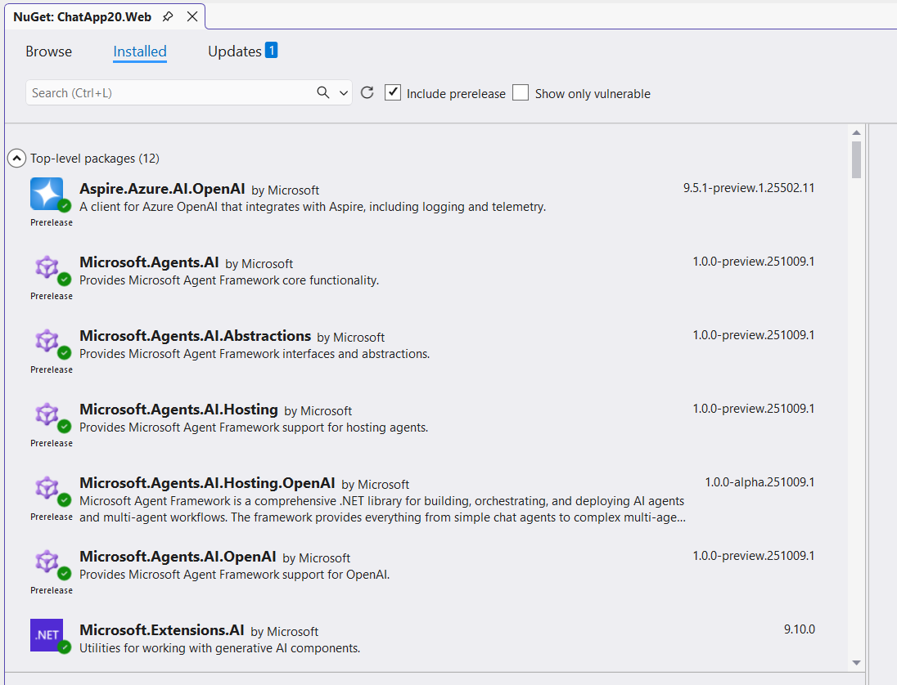
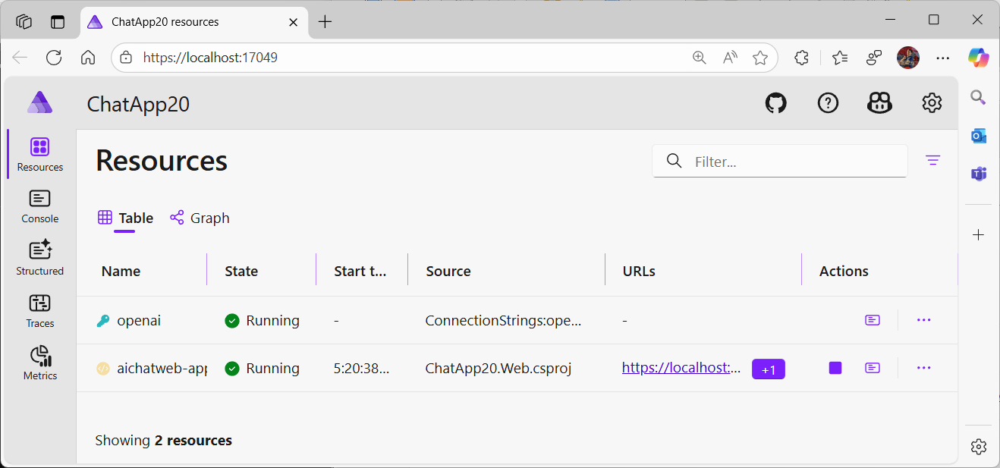

.NET AI 应用模板让我们能在几分钟内快速搭建一个包含 AI 集成、自定义数据导入等完整功能的聊天应用。这是一个坚实的起点，但如果你想构建更高级的 AI 代理——不仅能聊天，还能推理、决策、使用工具、编排复杂工作流呢？这就是 Microsoft Agent Framework 发挥作用的地方。

本文将演示如何将一个使用 .NET AI 模板生成的标准聊天应用升级为功能完整的智能代理系统，涵盖从基础搭建到高级场景的全过程。

## Microsoft Agent Framework 概览

[Microsoft Agent Framework](https://aka.ms/agent-framework) 是微软推出的用于在 .NET 中构建 AI 代理的预览框架。它不仅仅是一个简单的聊天机器人，而是能够实现以下能力的智能代理系统：

- **推理与规划**：通过多步骤工作流进行逻辑推理和任务规划
- **工具与函数调用**：与 API、数据库和各种服务进行交互
- **上下文维护**：在整个对话过程中保持完整的上下文信息
- **自主决策**：基于指令和数据自主做出决策
- **多代理协调**：在多代理场景中进行有效协作

这个框架的设计理念特别贴合 .NET 开发者的思维方式——它深度集成了我们熟悉的依赖注入、中间件、遥测等模式，并与 Microsoft.Extensions.AI 无缝结合。

## 准备工作

在开始之前，请确保已准备好以下环境：

- [.NET 9 SDK](https://dotnet.microsoft.com/download/dotnet/9.0)
- [Visual Studio](https://visualstudio.microsoft.com/) 或 [Visual Studio Code](https://code.visualstudio.com/) (需安装 C# Dev Kit)
- [Azure 账户](https://azure.microsoft.com/free/)（可访问 Azure OpenAI）或使用 [GitHub Models](https://github.com/marketplace?type=models)
- 基础的 .NET、Blazor 和 AI 概念知识

## 第一步：创建基础 AI 聊天应用

首先，我们需要安装 .NET AI 应用模板：

```bash
dotnet new install Microsoft.Extensions.AI.Templates
```

### 创建项目

你可以通过 Visual Studio 或命令行创建项目：

**使用 Visual Studio：**

1. 打开 Visual Studio 2022
2. 选择"创建新项目"
3. 搜索 "AI Chat Web App"
4. 配置项目名称（例如 `ChatApp20`）和位置
5. 选择 **Azure OpenAI** 作为 AI 提供者
6. 选择 **Local on-disk** 作为向量存储
7. 选择 .NET Aspire 进行编排


**使用 VS Code 或 CLI：**

可以参考[官方文档](https://learn.microsoft.com/dotnet/ai/quickstarts/ai-templates?tabs=visual-studio-code%2Cconfigure-visual-studio-code%2Cconfigure-visual-studio-code-aspire&pivots=azure-openai#create-the-net-ai-app)获取详细步骤，过程类似——使用 `dotnet new` 命令生成具有相同配置选项的项目。

### 理解项目结构

模板生成的解决方案包含三个项目：

```text
ChatApp20/
├── ChatApp20.Web/              # Blazor Server 应用，包含聊天 UI
├── ChatApp20.AppHost/          # .NET Aspire 编排
└── ChatApp20.ServiceDefaults/  # 共享服务配置
```


我们主要在 `ChatApp20.Web` 项目中工作，它包含：

- **Components/Pages/Chat/** – Blazor 聊天界面
- **Services/** – 数据导入和语义搜索服务
- **Program.cs** – AI 功能的配置中心
- **wwwroot/Data/** – 示例 PDF 文件

### 初始 Program.cs 配置

让我们看看模板在 `Program.cs` 中为我们配置了什么：

```csharp
using Microsoft.Extensions.AI;
using ChatApp20.Web.Components;
using ChatApp20.Web.Services;
using ChatApp20.Web.Services.Ingestion;

var builder = WebApplication.CreateBuilder(args);
builder.AddServiceDefaults();
builder.Services.AddRazorComponents().AddInteractiveServerComponents();

// 配置 Azure OpenAI，包括聊天客户端和嵌入生成器
var openai = builder.AddAzureOpenAIClient("openai");
openai.AddChatClient("gpt-4o-mini")
    .UseFunctionInvocation()
    .UseOpenTelemetry(configure: c => c.EnableSensitiveData = builder.Environment.IsDevelopment());

openai.AddEmbeddingGenerator("text-embedding-3-small");

// 配置向量存储用于语义搜索
var vectorStorePath = Path.Combine(AppContext.BaseDirectory, "vector-store.db");
var vectorStoreConnectionString = $"Data Source={vectorStorePath}";

builder.Services.AddSqliteCollection<string, IngestedChunk>("data-chatapp20-chunks", vectorStoreConnectionString);
builder.Services.AddSqliteCollection<string, IngestedDocument>("data-chatapp20-documents", vectorStoreConnectionString);

builder.Services.AddScoped<DataIngestor>();
builder.Services.AddSingleton<SemanticSearch>();

var app = builder.Build();

// ... 中间件配置 ...

// 启动时导入 PDF 文件
await DataIngestor.IngestDataAsync(
    app.Services, 
    new PDFDirectorySource(Path.Combine(builder.Environment.WebRootPath, "Data")));

app.Run();
```

### 基础聊天组件

初始的 `Chat.razor` 组件直接使用 `IChatClient`：

```csharp
@inject IChatClient ChatClient
@inject SemanticSearch Search

@code {
    private async Task AddUserMessageAsync(ChatMessage userMessage)
    {
        messages.Add(userMessage);
        var responseText = new TextContent("");
        currentResponseMessage = new ChatMessage(ChatRole.Assistant, [responseText]);
        
        await foreach (var update in ChatClient.GetStreamingResponseAsync(
            messages.Skip(statefulMessageCount), 
            chatOptions, 
            currentResponseCancellation.Token))
        {
            messages.AddMessages(update, filter: c => c is not TextContent);
            responseText.Text += update.Text;
            ChatMessageItem.NotifyChanged(currentResponseMessage);
        }
        
        messages.Add(currentResponseMessage);
    }

    [Description("Searches for information using a phrase or keyword")]
    private async Task<IEnumerable<string>> SearchAsync(
        [Description("The phrase to search for.")] string searchPhrase,
        [Description("If possible, specify the filename to search.")] string? filenameFilter = null)
    {
        var results = await Search.SearchAsync(searchPhrase, filenameFilter, maxResults: 5);
        return results.Select(result => 
            $"<result filename=\"{result.DocumentId}\" page_number=\"{result.PageNumber}\">{result.Text}</result>");
    }
}
```

这个实现对于入门来说已经很好了，但随着应用的发展，你会希望有更好的：

- **关注点分离**：将工具函数从 UI 组件中分离出来
- **易于测试**：独立于 UI 测试代理行为
- **更复杂的模式**：支持复杂推理和多步骤工作流
- **代理编排**：协调多个专业化代理
- **更丰富的遥测**：更好地观察 AI 的决策过程

这正是 Microsoft Agent Framework 所带来的价值！

## 第二步：添加 Microsoft Agent Framework

现在是最有趣的部分——让我们将聊天应用升级为真正的代理系统！

### 安装必需的包

首先，我们需要在 `ChatApp20.Web.csproj` 中添加 Microsoft Agent Framework 包：



```xml
<ItemGroup>
  <!-- 保留现有包 -->
  <PackageReference Include="Aspire.Azure.AI.OpenAI" Version="9.5.1-preview.1.25502.11" />
  <PackageReference Include="Microsoft.Extensions.AI.OpenAI" Version="9.10.0-preview.1.25513.3" />
  <PackageReference Include="Microsoft.Extensions.AI" Version="9.10.0" />
  <PackageReference Include="Microsoft.SemanticKernel.Core" Version="1.66.0" />
  
  <!-- 添加 Microsoft Agent Framework 包 -->
  <PackageReference Include="Microsoft.Agents.AI" Version="1.0.0-preview.251009.1" />
  <PackageReference Include="Microsoft.Agents.AI.Abstractions" Version="1.0.0-preview.251009.1" />
  <PackageReference Include="Microsoft.Agents.AI.Hosting" Version="1.0.0-preview.251009.1" />
  <PackageReference Include="Microsoft.Agents.AI.Hosting.OpenAI" Version="1.0.0-alpha.251009.1" />
  <PackageReference Include="Microsoft.Agents.AI.OpenAI" Version="1.0.0-preview.251009.1" />
  
  <!-- 保留其他现有包 -->
  <PackageReference Include="PdfPig" Version="0.1.12-alpha-20251015-255e7" />
  <PackageReference Include="System.Linq.Async" Version="7.0.0-preview.1.g24680b5469" />
  <PackageReference Include="Microsoft.SemanticKernel.Connectors.SqliteVec" Version="1.66.0-preview" />
</ItemGroup>
```

关键的 Agent Framework 包包括：

- **Microsoft.Agents.AI** – 核心代理抽象和实现
- **Microsoft.Agents.AI.Abstractions** – 基础接口和类型
- **Microsoft.Agents.AI.Hosting** – 依赖注入和托管扩展
- **Microsoft.Agents.AI.Hosting.OpenAI** – OpenAI 特定的托管支持
- **Microsoft.Agents.AI.OpenAI** – OpenAI 与代理的集成

### 创建专用的搜索函数服务

为了促进更好的关注点分离和可测试性，创建一个新的 `SearchFunctions.cs` 服务来封装语义搜索功能：

```csharp
using System.ComponentModel;

namespace ChatApp20.Web.Services;

/// <summary>
/// 暴露给 AI 代理的函数。包装 SemanticSearch 以便通过 DI 注入依赖项。
/// </summary>
public class SearchFunctions
{
    private readonly SemanticSearch _semanticSearch;

    public SearchFunctions(SemanticSearch semanticSearch)
    {
        _semanticSearch = semanticSearch;
    }

    [Description("使用短语或关键词搜索信息")]
    public async Task<IEnumerable<string>> SearchAsync(
        [Description("要搜索的短语。")] string searchPhrase,
        [Description("如果可能，指定要搜索的文件名。如果未提供或为空，则搜索所有文件。")] 
        string? filenameFilter = null)
    {
        // 在导入的数据块上执行语义搜索
        var results = await _semanticSearch.SearchAsync(searchPhrase, filenameFilter, maxResults: 5);
        
        // 将结果格式化为 XML 供代理使用
        return results.Select(result => 
            $"<result filename=\"{result.DocumentId}\" page_number=\"{result.PageNumber}\">{result.Text}</result>");
    }
}
```

**为什么这很重要：**

- `SearchFunctions` 类现在是一个专用服务，可以注入到代理中
- 它可以独立于 UI 进行测试
- `[Description]` 属性提供元数据，帮助 AI 理解何时以及如何使用工具
- 代理可以在需要搜索信息时自动调用此函数

### 在 Program.cs 中注册 AI 代理

现在，让我们使用 Agent Framework 的托管扩展在 `Program.cs` 中配置 AI 代理：

```csharp
using ChatApp20.Web.Components;
using ChatApp20.Web.Services;
using ChatApp20.Web.Services.Ingestion;
using Microsoft.Agents.AI;
using Microsoft.Agents.AI.Hosting;
using Microsoft.Extensions.AI;
using System.ComponentModel;

var builder = WebApplication.CreateBuilder(args);
builder.AddServiceDefaults();
builder.Services.AddRazorComponents().AddInteractiveServerComponents();

// 配置 Azure OpenAI
var openai = builder.AddAzureOpenAIClient("openai");
openai.AddChatClient("gpt-4o-mini")
    .UseFunctionInvocation()
    .UseOpenTelemetry(configure: c => c.EnableSensitiveData = builder.Environment.IsDevelopment());

// 使用 Agent Framework 注册 AI 代理
builder.AddAIAgent("ChatAgent", (sp, key) =>
{
    // 获取所需的服务
    var logger = sp.GetRequiredService<ILogger<Program>>();
    logger.LogInformation("使用键 '{Key}' 为模型 '{Model}' 配置 AI 代理", key, "gpt-4o-mini");
    
    var searchFunctions = sp.GetRequiredService<SearchFunctions>();
    var chatClient = sp.GetRequiredService<IChatClient>();

    // 创建和配置 AI 代理
    var aiAgent = chatClient.CreateAIAgent(
        name: key,
        instructions: "你是一个有用的代理，用简短而有趣的方式帮助用户。",
        description: "一个用简短而有趣的方式帮助用户的 AI 代理。",
        tools: [AIFunctionFactory.Create(searchFunctions.SearchAsync)]
    )
    .AsBuilder()
    .UseOpenTelemetry(configure: c => c.EnableSensitiveData = builder.Environment.IsDevelopment())
    .Build();

    return aiAgent;
});

// 配置嵌入和向量存储
openai.AddEmbeddingGenerator("text-embedding-3-small");

var vectorStorePath = Path.Combine(AppContext.BaseDirectory, "vector-store.db");
var vectorStoreConnectionString = $"Data Source={vectorStorePath}";

builder.Services.AddSqliteCollection<string, IngestedChunk>("data-chatapp20-chunks", vectorStoreConnectionString);
builder.Services.AddSqliteCollection<string, IngestedDocument>("data-chatapp20-documents", vectorStoreConnectionString);

builder.Services.AddScoped<DataIngestor>();
builder.Services.AddSingleton<SemanticSearch>();

// 注册 SearchFunctions 以便注入到代理中
builder.Services.AddSingleton<SearchFunctions>();

var app = builder.Build();

// ... 其余配置 ...
```

**关于代理注册的关键点：**

- **键控服务注册**：代理使用键 `"ChatAgent"` 通过 `builder.AddAIAgent()` 注册。这允许你在同一应用中注册多个代理。
- **代理配置**：代理创建时包含：
  - **名称**：用于标识
  - **指令**（系统提示）：定义其个性和行为
  - **描述**：解释其目的
  - **工具**：代理可以使用的工具（在这个例子中是 `SearchAsync` 函数）
- **工具绑定**：`AIFunctionFactory.Create()` 方法将 `SearchAsync` 方法转换为代理可以调用的工具。框架自动处理：
  - 基于 `[Description]` 属性的参数验证
  - JSON 序列化/反序列化
  - 错误处理和重试
- **遥测**：`UseOpenTelemetry()` 调用确保所有代理交互都被记录，可以通过 Application Insights 或其他监控工具观察。
- **依赖注入**：代理工厂接收一个 `IServiceProvider`，允许它解析依赖项，如 `SearchFunctions` 和 `IChatClient`。

### 更新聊天组件

最后，我们需要更新 `Chat.razor` 以使用新的 AI 代理。更改非常简单：

**注入 IServiceProvider 而不是 IChatClient：**

```csharp
@inject IServiceProvider ServiceProvider
@using Microsoft.Agents.AI
```

**在 OnInitialized() 中解析代理：**

```csharp
private AIAgent aiAgent = default!;

protected override void OnInitialized()
{
    // 解析在 Program.cs 中注册为 "ChatAgent" 的键控 AI 代理
    aiAgent = ServiceProvider.GetRequiredKeyedService<AIAgent>("ChatAgent");
    // ... 其余初始化 ...
}
```

**在 AddUserMessageAsync() 中使用代理流式传输：**

```csharp
// 用代理流式传输替换 ChatClient.GetStreamingResponseAsync
await foreach (var update in aiAgent.RunStreamingAsync(
    messages: messages.Skip(statefulMessageCount),
    cancellationToken: currentResponseCancellation.Token))
{
    var responseUpdate = update.AsChatResponseUpdate();
    messages.AddMessages(responseUpdate, filter: c => c is not TextContent);
    responseText.Text += update.Text;
    chatOptions.ConversationId = responseUpdate.ConversationId;
    ChatMessageItem.NotifyChanged(currentResponseMessage);
}
```

就是这样！代理处理其他所有事情——工具调用、推理和响应生成。

## 第三步：运行和测试增强应用

### 使用 .NET Aspire 运行

使用 AI 模板的最佳优势之一是一切都通过 .NET Aspire 运行。这为你提供：

- 组件之间的**服务发现**
- Aspire 仪表板中的**统一日志**和遥测
- 所有服务的**健康检查**
- 所有机密和设置的**简单配置**

运行应用后，Aspire 仪表板会在浏览器中自动打开：



### 配置 Azure OpenAI

首次运行时，系统会提示你配置 Azure OpenAI：

- **Azure 订阅**：选择你的订阅
- **资源组**：选择现有或创建新的
- **Azure OpenAI 资源**：选择或配置
- **模型部署**：确保你有：
  - 聊天模型（例如 `gpt-4o-mini`）
  - 嵌入模型（例如 `text-embedding-3-small`）

配置将保存在本地，并在后续运行中重用。

### 测试代理

一切运行后，点击 Aspire 仪表板中的 Web 端点（通常是 `https://localhost:7001`）。


让我们测试一下：

**基本对话：**

```text
你：你好！你好吗？
代理：嘿！我很好——像应急生存包一样充满电。
```

**使用语义搜索的工具调用：**

```text
你：应急生存包应该包含什么？
代理：简短的生存包清单（有趣版）
急救用品——绷带、纱布、消毒剂。
<citation filename='Example_Emergency_Survival_Kit.pdf' page_number='1'>水和食物供应</citation>
```

**特定文件查询：**

```text
你：告诉我 GPS 手表的功能
代理：GPS 手表包括...
<citation filename='Example_GPS_Watch.pdf' page_number='2'>实时跟踪</citation>
```


这里最酷的部分是：在代理工作时查看 Aspire 仪表板。你实际上可以看到：

- 代理何时决定调用搜索工具
- 它传递了什么参数
- 它得到的搜索结果
- 它如何将所有内容综合成响应

这种可观察性水平在调试或优化代理行为时非常宝贵。

## 高级场景

### 为代理添加更多工具

你可以轻松地用额外的功能扩展代理：

```csharp
public class WeatherFunctions
{
    [Description("获取某个位置的当前天气")]
    public async Task<string> GetWeatherAsync(
        [Description("城市和州/国家")] string location)
    {
        // 调用天气 API
        return $"Weather for {location}: Sunny, 72°F";
    }
}

// 在 Program.cs 中
builder.Services.AddSingleton<WeatherFunctions>();

builder.AddAIAgent("ChatAgent", (sp, key) =>
{
    var searchFunctions = sp.GetRequiredService<SearchFunctions>();
    var weatherFunctions = sp.GetRequiredService<WeatherFunctions>();
    var chatClient = sp.GetRequiredService<IChatClient>();

    return chatClient.CreateAIAgent(
        name: key,
        instructions: "你可以搜索文档和查看天气...",
        tools: [
            AIFunctionFactory.Create(searchFunctions.SearchAsync),
            AIFunctionFactory.Create(weatherFunctions.GetWeatherAsync)
        ]
    ).Build();
});
```

> **注意**：你可以在 [Generative AI for Beginners – .NET](https://aka.ms/genainet) 中查看完整运行的示例。

### 多代理场景

Agent Framework 使协调多个专业化代理变得容易：

```csharp
// 注册研究代理
builder.AddAIAgent("ResearchAgent", (sp, key) =>
{
    var chatClient = sp.GetRequiredService<IChatClient>();
    var searchFunctions = sp.GetRequiredService<SearchFunctions>();

    return chatClient.CreateAIAgent(
        name: "ResearchAgent",
        instructions: "你是一个研究专家。从文档中查找和总结信息。",
        tools: [AIFunctionFactory.Create(searchFunctions.SearchAsync)]
    ).Build();
});

// 注册写作代理
builder.AddAIAgent("WritingAgent", (sp, key) =>
{
    var chatClient = sp.GetRequiredService<IChatClient>();

    return chatClient.CreateAIAgent(
        name: "WritingAgent",
        instructions: "你是一个写作专家。获取信息并创建结构良好、引人入胜的内容。",
        tools: []
    ).Build();
});

// 注册使用两者的协调器代理
builder.AddAIAgent("CoordinatorAgent", (sp, key) =>
{
    var chatClient = sp.GetRequiredService<IChatClient>();
    var researchAgent = sp.GetRequiredKeyedService<AIAgent>("ResearchAgent");
    var writingAgent = sp.GetRequiredKeyedService<AIAgent>("WritingAgent");

    // 创建委托给其他代理的函数
    async Task<string> ResearchAsync(string topic)
    {
        var messages = new[] { new ChatMessage(ChatRole.User, topic) };
        var result = await researchAgent.RunAsync(messages);
        return result.Text ?? "";
    }

    async Task<string> WriteAsync(string content)
    {
        var messages = new[] { new ChatMessage(ChatRole.User, $"Write an article based on: {content}") };
        var result = await writingAgent.RunAsync(messages);
        return result.Text ?? "";
    }

    return chatClient.CreateAIAgent(
        name: "CoordinatorAgent",
        instructions: "协调研究和写作以创建综合性文章。",
        tools: [
            AIFunctionFactory.Create(ResearchAsync),
            AIFunctionFactory.Create(WriteAsync)
        ]
    ).Build();
});
```

> **注意**：有关多代理协调模式的更多示例，请查看 [Generative AI for Beginners – .NET](https://aka.ms/genainet)。

### 自定义代理中间件

你可以向代理添加自定义中间件以进行日志记录、缓存或自定义行为：

```csharp
builder.AddAIAgent("ChatAgent", (sp, key) =>
{
    var chatClient = sp.GetRequiredService<IChatClient>();
    var searchFunctions = sp.GetRequiredService<SearchFunctions>();
    var logger = sp.GetRequiredService<ILogger<Program>>();

    return chatClient.CreateAIAgent(
        name: key,
        instructions: "...",
        tools: [AIFunctionFactory.Create(searchFunctions.SearchAsync)]
    )
    .AsBuilder()
    .Use(async (messages, options, next, cancellationToken) =>
    {
        // 自定义预处理
        logger.LogInformation("代理正在处理 {MessageCount} 条消息", messages.Count());

        // 调用管道中的下一个
        var result = await next(messages, options, cancellationToken);

        // 自定义后处理
        logger.LogInformation("代理生成了包含 {ContentCount} 个内容项的响应", result.Contents.Count);

        return result;
    })
    .UseOpenTelemetry(configure: c => c.EnableSensitiveData = true)
    .Build();
});
```

> **注意**：你可以在 [Generative AI for Beginners – .NET](https://aka.ms/genainet) 中找到更多自定义中间件模式的示例。

## 最佳实践

### 1. 设计清晰的工具描述

代理工具调用的质量在很大程度上取决于良好的描述：

```csharp
[Description("在产品文档中搜索特定信息。" +
    "当用户询问功能、规格或如何使用产品时使用此工具。" +
    "返回带有文件名和页码的相关摘录以供引用。")]
public async Task<IEnumerable<string>> SearchAsync(
    [Description("要搜索的特定短语、关键词或问题。" +
        "要具体并包含相关上下文。")] 
    string searchPhrase,
    [Description("可选：要在其中搜索的确切文件名（例如，'ProductManual.pdf'）。" +
        "留空以搜索所有文档。")] 
    string? filenameFilter = null)
{
    // 实现
}
```

### 2. 测试代理行为

为代理工具创建单元测试，为代理工作流创建集成测试：

```csharp
public class SearchFunctionsTests
{
    [Fact]
    public async Task SearchAsync_WithValidQuery_ReturnsResults()
    {
        // Arrange
        var mockSemanticSearch = new Mock<SemanticSearch>();
        mockSemanticSearch
            .Setup(s => s.SearchAsync("test", null, 5))
            .ReturnsAsync(new List<IngestedChunk>
            {
                new IngestedChunk 
                { 
                    DocumentId = "test.pdf", 
                    PageNumber = 1, 
                    Text = "test content" 
                }
            });

        var searchFunctions = new SearchFunctions(mockSemanticSearch.Object);

        // Act
        var results = await searchFunctions.SearchAsync("test");

        // Assert
        Assert.NotEmpty(results);
        Assert.Contains("test content", results.First());
    }
}
```

### 3. 监控代理性能

使用 Application Insights 或 .NET Aspire 的仪表板监控：

- 每次代理交互的**令牌使用量**
- **工具调用模式**（使用哪些工具，使用频率）
- 代理操作的**响应时间**
- 工具调用的**错误率**
- 通过反馈机制的**用户满意度**

## 性能考虑

### 流式传输 vs. 非流式传输

Agent Framework 支持流式传输和非流式传输响应：

**使用流式传输时：**

- 构建交互式聊天界面
- 用户期望实时反馈
- 处理长时间运行的查询

**使用非流式传输时：**

- 在后台处理
- 批量操作
- 简单的 API 端点

### 工具调用优化

尽量减少不必要的工具调用：

```csharp
// 好：具体的指令
"仅当用户询问有关文档的特定问题时才使用搜索工具。如果可以从一般知识中回答，请不要搜索。"

// 差：模糊的指令
"你可以使用搜索工具。"
```

## 部署到 Azure

应用程序已准备好使用 .NET Aspire 的 Azure 配置部署到 Azure：

```bash
# 登录 Azure
az login

# 创建 Azure 资源
cd ChatApp20.AppHost
azd init
azd up
```

这将：

- 配置 Azure OpenAI 资源
- 将 Web 应用部署到 Azure Container Apps
- 设置 Application Insights 进行监控
- 配置服务连接和身份验证

有关详细的部署说明，请参阅 [.NET Aspire Azure 部署文档](https://learn.microsoft.com/dotnet/aspire/deployment/azd/aca-deployment-azd-in-depth?tabs=windows)。

## 总结

就是这样！我们已经将一个标准的 AI 聊天应用转换为使用 Microsoft Agent Framework 的真正代理系统。升级为你提供了更好的架构，具有清晰的关注点分离、更容易的测试和内置的可观察性——同时使用你已经熟悉的 .NET 模式。

我真正欣赏的是，Microsoft Agent Framework 不会强迫你学习一种全新的做事方式。它建立在熟悉的概念之上，如依赖注入、中间件和遥测，使 C# 开发人员感到自然。

如果你正在使用 .NET 构建 AI 应用，我强烈推荐尝试 Agent Framework。从 [AI 模板](https://learn.microsoft.com/dotnet/ai/quickstarts/ai-templates)开始，然后随着需求的增长添加代理功能。查看[官方文档](https://aka.ms/agent-framework)和 [Luis 的公告文章](https://devblogs.microsoft.com/dotnet/introducing-microsoft-agent-framework-preview/)以了解更多！
