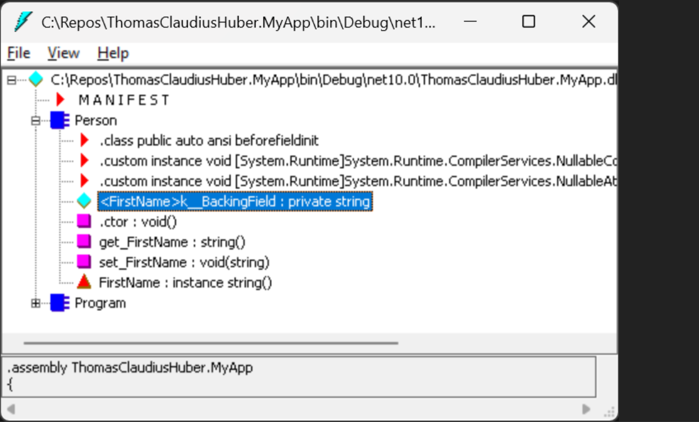

# C# 14 新特性：field 关键字实现半自动化属性

C# 14 即将随 .NET 10 一起在 2025 年 11 月发布，其中最令人期待的特性之一就是全新的 `field` 关键字。这个特性填补了自动属性（auto property）与完整属性（full property）之间的空白，让开发者能够在不显式声明后备字段的情况下为属性访问器添加自定义逻辑。

## 属性实现的演进之路

在理解 `field` 关键字的价值之前，我们需要回顾 C# 属性的发展历程。传统上，C# 提供了两种属性实现方式，但它们各有局限。

### 自动属性的便利与局限

自动属性是 C# 3.0 引入的简化语法，让开发者无需显式定义后备字段即可声明属性：

```csharp
public class Person
{
    public string? FirstName { get; set; }
}
```

这种简洁的语法背后，C# 编译器会自动生成一个私有的后备字段来存储属性值。我们可以通过中间语言反汇编工具（ILDASM）来观察这个隐藏的实现细节。

打开 Visual Studio 的开发者命令提示符（通过菜单 **Tools → Command Line → Developer Command Prompt**），输入 `ildasm` 并回车启动工具。将包含上述 `Person` 类的 DLL 拖放到工具中，即可看到编译器为 `FirstName` 属性生成的后备字段：



自动属性的问题在于缺乏灵活性。当我们需要在属性的 getter 或 setter 中添加额外逻辑时（例如在 MVVM 模式中触发 `PropertyChanged` 事件），就必须放弃自动属性，切换到完整属性实现。

### 完整属性的冗余代码

当自动属性无法满足需求时，我们不得不手动声明后备字段并实现完整的访问器：

```csharp
public class Person
{
    private string? _firstName;

    public string? FirstName
    {
        get { return _firstName; }
        set
        {
            _firstName = value;
            // 在此处添加自定义逻辑
            OnPropertyChanged(nameof(FirstName));
        }
    }
}
```

这种实现方式带来了诸多不便：

1. **代码冗余**：需要显式声明后备字段并在访问器中反复引用
2. **命名维护**：后备字段名需要与属性名保持一致性
3. **作用域泄露**：后备字段暴露在整个类的作用域内，可能导致意外绕过访问器的情况

早在 2008 年，就有开发者提出了"半自动化属性"的设想，希望能够通过某种机制直接访问自动属性的后备字段，而无需显式声明。经过十多年的演进，这个愿望终于在 C# 14 中实现。

## field 关键字的工作原理

C# 14 引入的 `field` 关键字为开发者提供了直接访问编译器生成的后备字段的能力。这意味着我们可以在保持自动属性简洁性的同时，为访问器添加自定义逻辑。

### 基础用法

使用 `field` 关键字，前面的完整属性可以简化为：

```csharp
public class Person
{
    public string? FirstName
    {
        get { return field; }
        set { field = value; }
    }
}
```

注意这里没有显式的 `_firstName` 字段声明，`field` 关键字直接引用了编译器生成的后备字段。

### 混合访问器模式

`field` 关键字的强大之处在于可以灵活混合使用自动访问器和自定义访问器。如果某个访问器不需要自定义逻辑，可以保持为自动实现：

```csharp
public class Person
{
    public string? FirstName
    {
        get;  // 自动实现的 getter
        set { field = value; }  // 自定义的 setter
    }
}
```

这种方式在实际开发中非常实用，特别是在实现 MVVM 模式的 ViewModel 时。

## 实际应用场景

### MVVM 模式中的属性变更通知

在 MVVM 架构的 ViewModel 中，属性通常需要实现 `INotifyPropertyChanged` 接口以支持数据绑定。传统实现方式代码冗长：

```csharp
// C# 13 及之前版本的实现
private string? _firstName;

public string? FirstName
{
    get { return _firstName; }
    set
    {
        _firstName = value;
        OnPropertyChanged(nameof(FirstName));
    }
}
```

使用 `field` 关键字可以显著简化代码：

```csharp
// C# 14 的简洁实现
public string? FirstName
{
    get;
    set
    {
        field = value;
        OnPropertyChanged(nameof(FirstName));
    }
}
```

这种实现方式消除了显式的后备字段声明，将代码行数减少了近一半，同时保持了相同的功能。

### 属性值验证

另一个常见场景是在 setter 中添加值验证逻辑：

```csharp
public class TimePeriod
{
    public double Hours
    {
        get;
        set => field = (value >= 0)
            ? value
            : throw new ArgumentOutOfRangeException(nameof(value),
                "值不能为负数");
    }
}
```

### 延迟初始化

对于需要延迟计算的属性，`field` 关键字结合空值合并赋值运算符提供了优雅的实现：

```csharp
public class DataCache
{
    public string? ComputedValue
    {
        get => field ??= ComputeExpensiveValue();
        set;
    }

    private string ComputeExpensiveValue()
    {
        // 执行复杂的计算逻辑
        return "computed result";
    }
}
```

这种模式确保 `ComputeExpensiveValue` 方法只在首次访问属性时执行一次。

### 变更检测与追踪

在需要实现变更追踪的场景中，`field` 关键字可以简化比较逻辑：

```csharp
public class ViewModel
{
    public bool HasPendingChanges { get; private set; }

    public string? UserInput
    {
        get;
        set
        {
            if (field == value) return;
            field = value;
            HasPendingChanges = true;
        }
    }
}
```

## 技术细节与注意事项

### 属性初始化器的行为

使用 `field` 关键字的属性仍然可以使用属性初始化器，但其行为与调用 setter 不同。属性初始化器会直接初始化后备字段，而不会调用 setter：

```csharp
public class SomeViewModel
{
    public bool HasPendingChanges { get; private set; }

    public bool IsActive
    {
        get;
        set
        {
            field = value;
            HasPendingChanges = true;  // 初始化器不会触发这里
        }
    } = true;  // 直接初始化 field，不调用 setter
}
```

这种设计是有意为之的，因为属性初始化器在调用基类构造函数之前执行，此时调用实例方法是不合法的。如果需要通过 setter 进行初始化，应该在构造函数中进行赋值。

### 字段目标特性（Field-Targeted Attributes）

与自动属性类似，使用 `field` 关键字的属性支持字段目标特性：

```csharp
public class Example
{
    [field: NonSerialized]
    public string? CachedData
    {
        get => field ??= LoadData();
        set;
    }
}
```

### 命名冲突的处理

如果类中已经存在名为 `field` 的字段或变量，需要使用 `@field` 进行转义以引用实际的标识符：

```csharp
public class ConflictExample
{
    private string? field;  // 已存在的字段

    public string? Property
    {
        get;
        set
        {
            field = value;    // 引用后备字段
            @field = "test";  // 引用名为 field 的成员变量
        }
    }
}
```

为避免混淆，建议重命名现有的 `field` 标识符，或者采用更具描述性的命名。

## 与其他 C# 特性的协同

### 可空引用类型（Nullable Reference Types）

`field` 关键字与 C# 8.0 引入的可空引用类型完美配合：

```csharp
public class Person
{
    public string FirstName
    {
        get;
        set => field = string.IsNullOrWhiteSpace(value)
            ? throw new ArgumentException(nameof(value),
                "姓名不能为空或空白")
            : value;
    } = "默认名称";
}
```

编译器会根据 setter 中的逻辑分析后备字段的可空性。

### Init-Only 访问器

`field` 关键字同样适用于 `init` 访问器：

```csharp
public class ImmutablePerson
{
    public string Name
    {
        get;
        init => field = value?.Trim()
            ?? throw new ArgumentNullException(nameof(value));
    }
}
```

这种组合在创建不可变对象时非常有用，既保证了数据验证，又维持了对象的不可变性。

## 性能影响分析

使用 `field` 关键字不会带来任何运行时性能开销。编译后的代码与显式声明后备字段的实现完全等效，这纯粹是编译时的语法糖。

从编译器的角度来看，以下两种实现生成相同的 IL 代码：

```csharp
// 使用 field 关键字
public string Name { get; set => field = value; }

// 显式后备字段
private string <Name>k__BackingField;
public string Name
{
    get { return <Name>k__BackingField; }
    set { <Name>k__BackingField = value; }
}
```

## 最佳实践与建议

1. **优先使用 field 关键字**：对于需要在访问器中添加简单逻辑的场景，使用 `field` 关键字替代显式后备字段可以减少代码量并提高可读性。

2. **保持一致性**：在项目中统一使用 `field` 关键字或传统实现方式，避免混用导致风格不一致。

3. **注释复杂逻辑**：虽然 `field` 关键字简化了语法，但复杂的访问器逻辑仍需要适当的注释说明。

4. **重构现有代码**：升级到 .NET 10 后，可以考虑将现有的完整属性实现重构为使用 `field` 关键字的形式，但需要注意测试覆盖。

5. **避免过度复杂化**：如果访问器逻辑过于复杂，考虑提取为独立方法，保持属性访问器的简洁性。

## 未来展望

`field` 关键字的引入标志着 C# 属性系统的重要演进，它实现了语法简洁性与功能灵活性的平衡。这个特性特别适合 MVVM、数据绑定、验证等常见开发场景，有望成为 C# 开发者日常使用的重要工具。

随着 .NET 10 和 C# 14 在 2025 年 11 月正式发布，开发者将能够在生产环境中使用这一特性。对于已经在使用 .NET 预览版的团队，现在就可以开始体验和评估这个特性的实际效果。

## 总结

C# 14 的 `field` 关键字填补了自动属性与完整属性之间的空白，为开发者提供了第三种选择。它允许我们在不显式声明后备字段的情况下为属性访问器添加自定义逻辑，既保持了代码的简洁性，又提供了必要的灵活性。

这个特性的引入证明了 C# 语言设计团队对开发者需求的持续关注。从 2008 年的最初设想到 2025 年的正式实现，`field` 关键字的诞生历程体现了编程语言设计中"简洁性"与"表达力"之间的平衡艺术。

对于 MVVM 模式、数据验证、延迟初始化等常见场景，`field` 关键字将成为开发者工具箱中不可或缺的一部分。随着 .NET 10 的普及，这个特性有望显著改善 C# 代码的可读性和可维护性。
