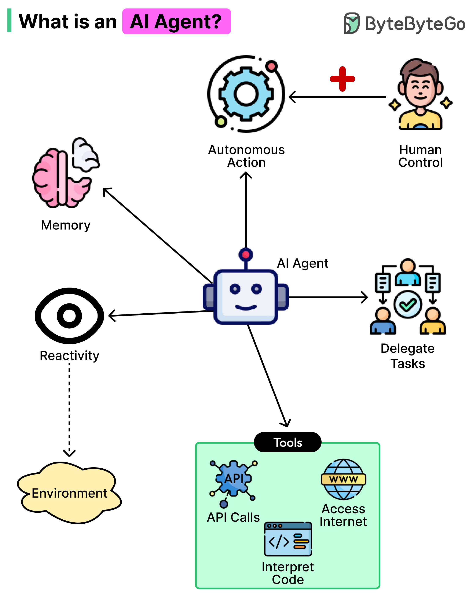
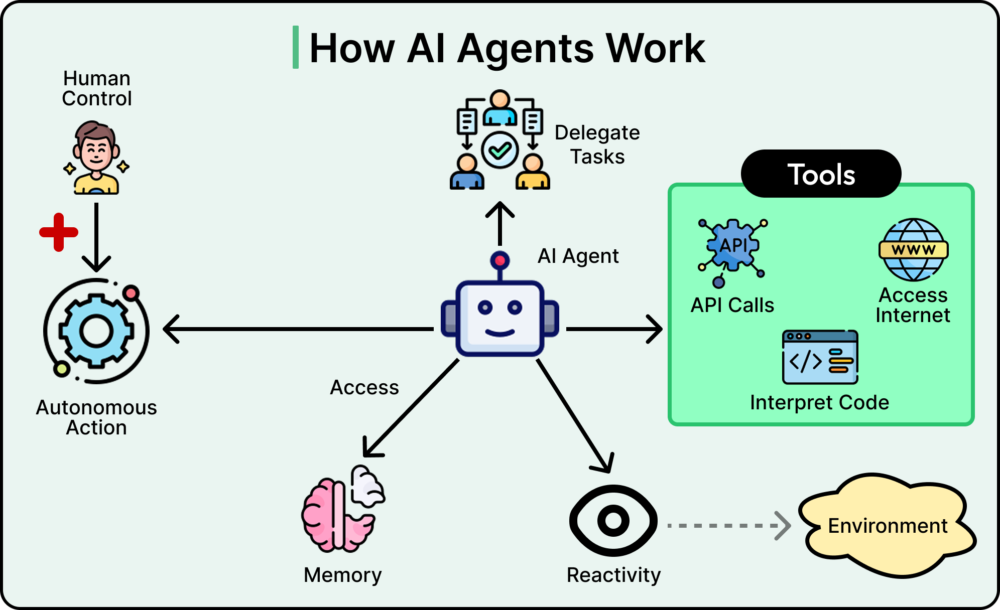
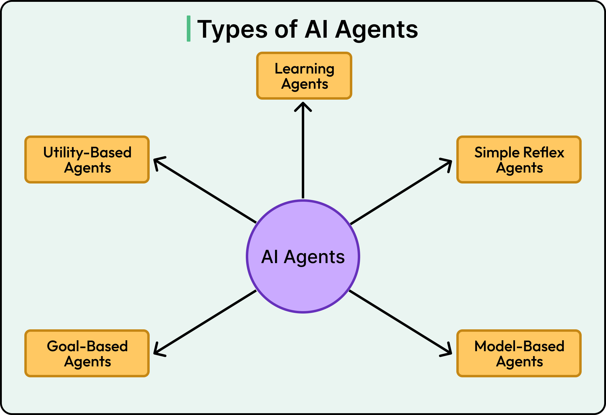
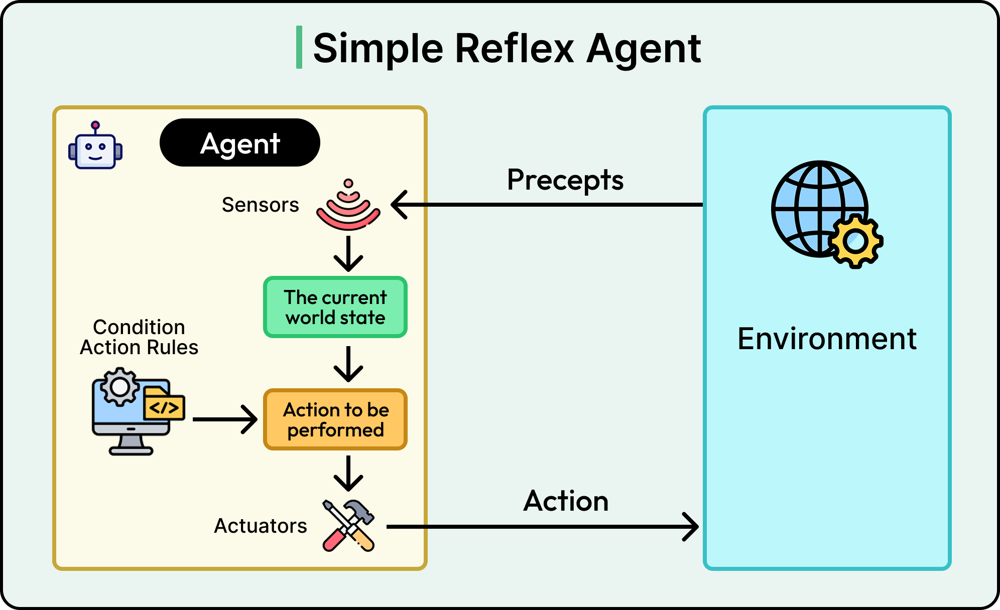
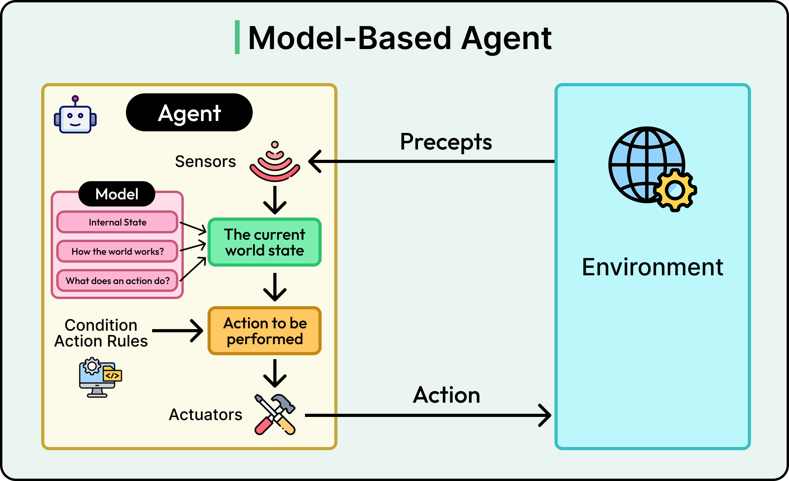
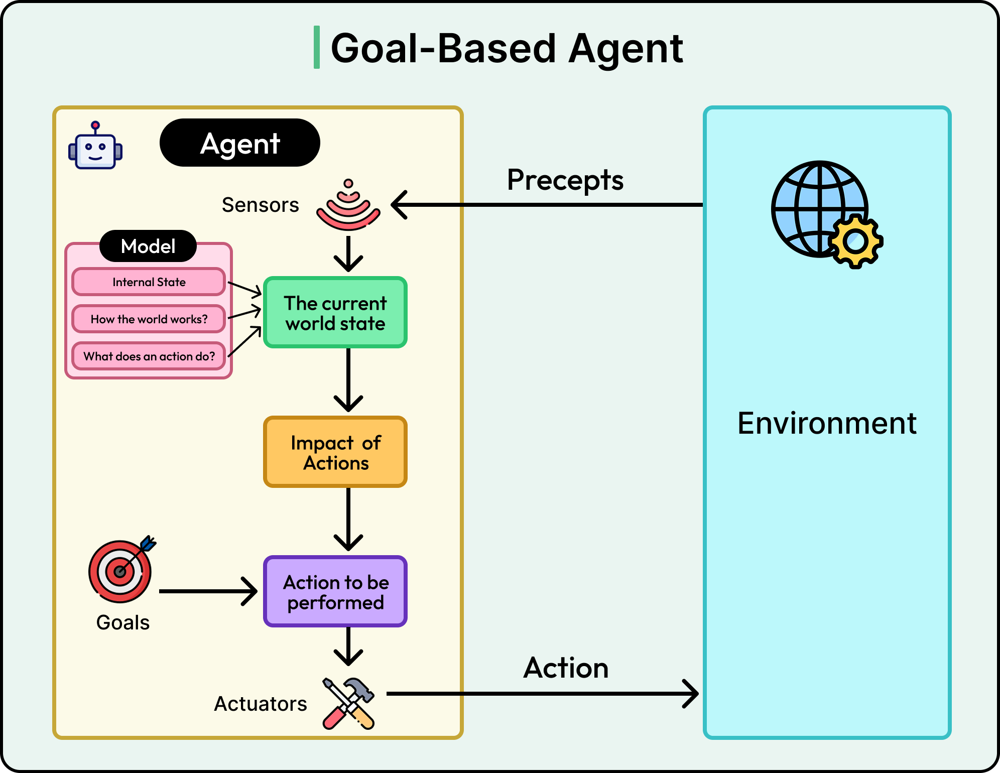
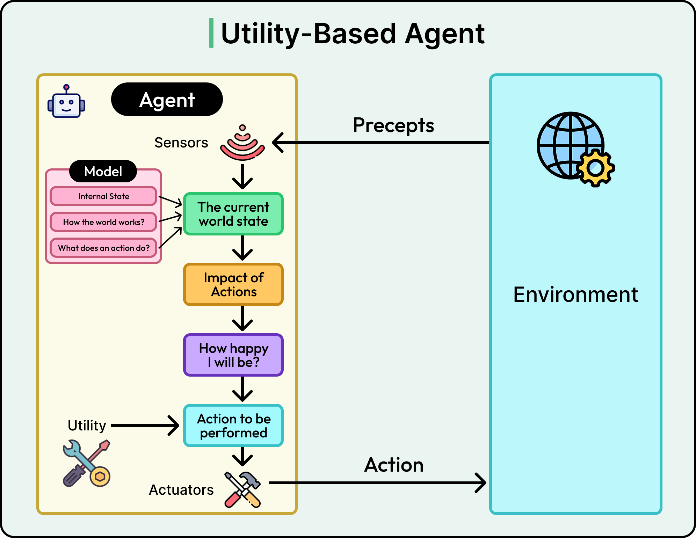
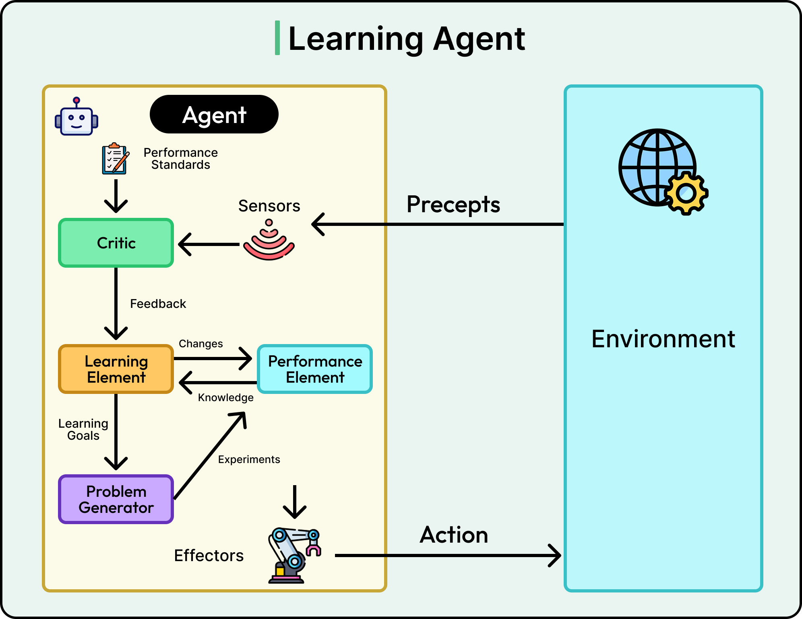

# 深入理解 AI 智能代理:从基础原理到实际应用

在当今 AI 技术快速演进的时代,智能代理(AI Agents)正在重新定义我们与软件系统的交互方式。想象这样一个场景:你只需告诉数字助手"帮我规划周末去巴黎的旅行",它不仅能搜索航班信息,还会主动比较不同社区的酒店价格、查询天气预报、推荐附近的热门餐厅,甚至根据你之前提到的预算限制调整建议。这就是 AI 智能代理的魅力所在——它不再是被动执行指令的工具,而是能够主动理解目标、制定计划并采取行动的智能系统。

## 什么是 AI 智能代理

AI 智能代理的核心是一个能够感知环境、做出决策并采取行动来实现特定目标的软件系统,且具有一定程度的自主性。"代理"(Agent)这个词至关重要——就像旅行代理会代表你寻找航班和洽谈优惠一样,AI 智能代理代表用户或系统完成任务,而无需对每一个步骤进行明确指导。

### 传统程序与智能代理的本质区别

传统软件程序遵循预定义的执行路径。当我们使用电子表格程序时,它会按照公式准确执行计算;当我们点击应用中的按钮时,它执行固定的操作序列。这种行为是完全可预测的,因为每种场景都已被明确编程。

相比之下,AI 智能代理能够应对不确定的情况,并根据观察结果做出选择。它们不仅执行指令,还能弄清楚需要做什么以及如何去做。这种能力在大型语言模型(LLM)出现后变得尤为强大。

### 大型语言模型赋能现代智能代理

大型语言模型经过海量文本数据的训练,具备了理解自然语言、推理问题和生成类人响应的卓越能力。当我们将这些语言模型与使用工具和采取行动的能力结合时,就得到了现代 AI 智能代理。语言模型充当"大脑"的角色,处理信息、做出决策并确定最佳行动方案。它能够分解复杂请求、理解上下文和细微差别,并与人类和其他系统进行自然交流。

### 定义智能代理的四大核心特征

真正的 AI 智能代理具备以下四个关键特征:

**自主性(Autonomy)** - 能够在没有持续人工干预的情况下运作,并独立做出决策。智能代理可以在用户提供高层目标后,自行规划和执行多个步骤,而不需要在每个决策点都征求许可。

**反应性(Reactivity)** - 能够对环境变化和新信息做出适当响应。当条件发生变化时,智能代理能够识别这些变化并相应地调整其行为,而不是盲目继续原计划。

**主动性(Proactiveness)** - 主动采取行动实现目标,而不仅仅是对即时刺激做出反应。智能代理会预见可能的问题,提前采取措施,并寻找优化路径来完成任务。

**社交能力(Social Ability)** - 通过某种形式的通信与其他代理或人类交互的能力。这包括使用自然语言进行沟通、理解意图,以及在必要时协调多个代理的工作。

这些特征共同使智能代理能够处理传统软件难以或无法有效管理的复杂多步骤任务。当我们要求智能代理"准备月度销售报告"时,它能够理解这涉及收集数据、执行分析、创建可视化和格式化输出等步骤,而无需我们指定每一个细节。

## 智能代理的工作原理

理解 AI 智能代理的运作方式需要掌握一个基本概念——代理循环(Agent Loop)。这是智能代理在追求目标时遵循的持续循环:感知当前情况、思考下一步行动、采取具体步骤、观察行动结果,然后重复这个过程。这个循环会持续进行,直到代理确定已完成任务或需要人工协助才能继续。

### 实际案例:旅行规划智能代理

让我们通过一个具体例子来观察这个循环的实际运作。假设我们请一个 AI 智能代理帮助规划下个月去东京的假期旅行:

1. **感知阶段** - 代理首先感知我们的请求并理解目标,即在我们的约束条件内寻找航班、住宿并创建行程。

2. **思考阶段** - 在思考阶段,它确定第一个合理步骤是在我们偏好的日期搜索可用航班。

3. **行动阶段** - 然后通过使用航班搜索工具查询可用选项来采取行动。

4. **观察阶段** - 执行此操作后,它观察结果,可能发现直飞航班价格昂贵,但转机航班可节省大量费用。

5. **再次思考** - 基于这一观察,代理再次思考并决定呈现两种选项,同时注明权衡。

6. **继续循环** - 然后它可能会进入下一步,搜索热门景点或交通枢纽附近的酒店,再次观察结果并根据发现调整建议。

### 工具调用:扩展智能代理的能力

这引出了现代 AI 智能代理的一个关键方面——使用工具的能力。智能代理不仅限于处理信息和生成文本响应,它可以调用各种工具来扩展其能力:

- **Web 搜索引擎** - 查找当前信息
- **API 接口** - 检查航班价格或天气预报
- **计算器** - 进行复杂计算
- **代码解释器** - 分析数据
- **数据库** - 存储和检索信息

当旅行规划代理需要当前航班价格时,它会使用航班搜索工具;当它需要了解下个月东京的天气时,会使用天气 API。代理根据要完成的任务决定使用哪些工具以及何时使用它们。

### 观察与适应:智能的本质体现

观察和适应阶段正是将智能代理与简单自动化脚本区分开来的关键。在每次行动后,代理会检查结果并相应调整策略。如果酒店搜索在我们偏好的社区没有返回可用房间,代理不会放弃或盲目继续原计划。相反,它会观察这一障碍并进行适应,也许会将搜索扩大到附近区域或略微调整日期范围。

这种反馈循环使智能代理能够处理意外情况、绕过问题,并迭代改进其方法,直到实现预期结果或确定无法用可用资源达成目标。这正是智能代理真正"智能"的体现——它们不是机械地执行预设流程,而是根据实际情况动态调整策略。

## 智能代理的类型

AI 智能代理存在于一个从简单到复杂的能力谱系中。理解不同类型有助于我们识别哪种代理最适合各种任务,以及我们可以合理期待每种代理具备什么能力。

让我们从最简单到最先进的类别逐一探讨。

### 简单反射代理(Simple Reflex Agents)

简单反射代理是最基本的类型,基于直接的条件-行动规则运作。这些代理感知其环境的当前状态,并根据模式匹配用预定的行动进行响应。

典型例子包括恒温器:当温度降到设定阈值以下时开启加热,当温度升到另一个阈值以上时关闭加热。在软件领域,识别"退款"等关键词并用预设消息回应退款政策的基础客服聊天机器人就是简单反射代理。

**优势与局限** - 这些代理快速、可预测且易于构建。然而,它们受到严重限制,因为没有过去交互的记忆,无法处理设计者未明确预料的情况。它们适用于重复性、定义明确的场景,但在需要细微理解或上下文的任务中表现不佳。

### 基于模型的代理(Model-Based Agents)

基于模型的代理在复杂性上有显著提升,因为它们维护着一个无法直接感知的世界的内部表示。这个内部模型帮助它们做出更好的决策,即使在缺乏关于环境的完整信息时也是如此。

考虑一个在家中导航的机器人吸尘器。它无法一次看到整个楼层布局,但在移动过程中,它会建立一个家具位置、已清洁区域和障碍物位置的内部地图。这个内部模型使它能够规划高效的清洁路线,避免反复撞到相同的障碍物。

在 AI 助手的背景下,基于模型的代理可能会跟踪在对话中已收集的信息、尝试过的工具,以及多步骤任务的当前状态。这种对过去状态的记忆对于在扩展交互中保持连贯性以及基于累积知识而非仅仅即时现状做出明智决策至关重要。

### 目标导向代理(Goal-Based Agents)

目标导向代理通过明确朝着特定目标努力,而不仅仅是对当前条件做出反应,进一步提升了能力。这些代理通过考虑不同行动是否有助于实现目标来评估各种可能的行动。它们能够前瞻、预见后果,并选择导致目标满足的行为,即使路径并不立即明显。

想象一个帮助准备科技公司面试的 AI 代理。该代理理解总体目标是充分的面试准备。它会推理这需要什么:研究特定公司和职位、识别该职位的常见面试问题、根据候选人的背景帮助制定有力答案、建议要复习的技术主题,并为剩余时间创建学习计划。代理采取的每个行动都根据是否有助于充分准备的目标进行评估。

这种前瞻性能力使目标导向代理能够处理需要规划和将多个步骤排序以实现预期结果的复杂任务。

### 效用导向代理(Utility-Based Agents)

虽然目标导向代理将目标视为二元的(已实现或未实现),但效用导向代理使用更细致的成功度量。这些代理使用效用函数来量化不同结果的可取程度,使它们能够做出优化整体满意度而不仅仅是勾选框的决策。在处理权衡或竞争优先级时,这一点变得至关重要。

考虑一个规划假期的代理。目标导向代理可能会成功找到符合预算和日期的旅行。然而,效用导向代理会同时考虑多个因素:成本、旅行时间、住宿质量、与景点的距离、天气条件和可用活动。

在选择需要一小时通勤到景点的经济型酒店与价格较高但位于中心位置的选项之间时,效用导向代理会根据我们的偏好和约束来权衡这些权衡。它不仅找到解决方案,而是试图根据对最重要因素的整体评估找到最佳解决方案。

### 学习型代理(Learning Agents)

学习型代理代表最先进的类别,因为它们通过经验不断提高性能。学习型代理有几个协同工作的组件:

- **性能元素** - 选择行动
- **评论元素** - 提供关于代理表现的反馈
- **学习元素** - 基于反馈进行改进
- **问题生成器** - 鼓励探索新方法

在实践中,这可能类似于跟踪哪些响应导致客户满意、哪些导致升级或投诉的客服代理。随着时间推移,它学习哪些沟通风格最适合不同类型的问题,哪些解决方案对常见问题最有效,以及何时将事项升级给人工代表。

代理可能会维护成功策略、用户偏好和有效问题解决模式的长期记忆。这种学习和适应的能力意味着代理运行时间越长就越有价值和高效,根据实际结果持续改进其方法。这正是 AI 系统最具前景的方向——能够从每次交互中学习,不断优化自己的策略和决策能力。

## 智能代理的应用前景

AI 智能代理代表了我们与软件交互方式的根本转变。我们不再需要为程序应采取的每一步编写明确指令,而是朝着这样一个世界迈进:我们描述想要实现的目标,让智能代理弄清楚如何去做。这种范式变革对软件开发和我们思考构建智能系统的方式具有深远影响。

智能代理在软件开发中的作用正在迅速增长。我们看到智能代理在编写代码、调试应用、分析数据、管理工作流程以及协调复杂的多系统操作。随着这些技术的成熟,开发人员将越来越多地与智能代理并肩工作,将其作为协作者,而不仅仅是构建传统应用程序。

### 智能代理在软件开发中的实际应用

在现代软件工程实践中,智能代理正在改变多个关键环节:

**代码生成与优化** - 智能代理可以根据自然语言描述生成代码片段,理解项目架构和编码规范,自动完成重复性编码任务。它们不仅能写代码,还能分析现有代码库,提出优化建议,识别潜在的性能瓶颈。

**自动化测试与调试** - 智能测试代理能够自动生成测试用例,识别边界条件,甚至预测可能出现问题的代码区域。在调试过程中,它们可以分析错误日志、追踪问题根源,并建议修复方案。

**DevOps 与持续集成** - 智能代理可以监控系统性能,自动调整资源配置,预测可能的故障并提前采取预防措施。它们能够管理复杂的部署流程,协调多个服务之间的依赖关系。

**代码审查与知识传播** - 智能代理可以作为代码审查助手,检查代码质量、安全漏洞和最佳实践遵循情况。它们还能够帮助新团队成员快速了解代码库,解释复杂的系统交互。

### 面临的挑战与未来方向

尽管智能代理展现出巨大潜力,但在实际应用中仍面临一些挑战:

**可靠性与可预测性** - 如何确保智能代理在关键任务中的决策可靠?这需要建立更完善的验证机制和故障保护系统。

**成本与效率** - 大型语言模型的推理成本仍然较高,特别是对于需要大量推理的复杂任务。如何优化 token 使用,降低运行成本,是一个重要课题。

**安全与隐私** - 智能代理可能需要访问敏感数据或执行关键操作,如何确保其行为符合安全标准和隐私要求至关重要。

**可解释性** - 当智能代理做出决策时,如何让其推理过程透明可解释,以便人类理解和审核?

**伦理与责任** - 当智能代理自主做出决策时,如何界定责任归属?如何确保其行为符合伦理准则?

## 总结

AI 智能代理不仅是技术的进步,更代表了人机交互范式的革新。从简单的反射代理到具有学习能力的高级代理,这一技术谱系为不同应用场景提供了灵活的解决方案。

理解智能代理的核心特征——自主性、反应性、主动性和社交能力——帮助我们更好地设计和应用这些系统。掌握代理循环的工作原理,了解不同类型代理的优势与局限,使我们能够在实际项目中做出明智的技术选择。

随着大型语言模型技术的不断进步,智能代理的能力将持续增强。它们将在更多领域发挥作用,从软件开发到科学研究,从商业决策到个人助理。作为开发者和技术从业者,深入理解智能代理的原理和应用,将帮助我们更好地拥抱这个由 AI 驱动的智能化未来。

## 参考资源

- [ByteByteGo Newsletter - What are AI Agents?](https://blog.bytebytego.com/p/what-are-ai-agents)
- [Inspect AI Framework Documentation](https://inspect.aisi.org.uk/)
- [ReAct: Synergizing Reasoning and Acting in Language Models](https://arxiv.org/abs/2210.03629)
- [Large Language Models as Tool Makers](https://arxiv.org/abs/2305.17126)
