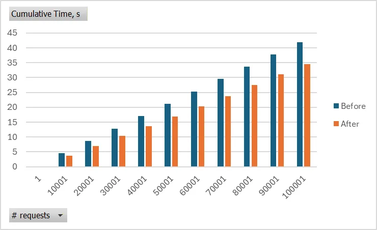

# .NET 10 网络功能改进深度解析

## 引言

随着 .NET 10 的发布，微软在网络堆栈方面带来了一系列令人兴奋的改进。这些更新不仅关注性能优化，还引入了新的 API 来简化开发流程，并增强了安全性。本文将深入探讨 .NET 10 在 HTTP、WebSockets、安全性和网络原语方面的核心变化，帮助开发者快速掌握这些新特性。

---

## HTTP 领域的改进

### WinHttpHandler 证书验证缓存优化

在 .NET 10 中，`WinHttpHandler` 迎来了一项重要的性能优化，特别是在处理服务器证书验证时。

**痛点分析**：
以往，当开发者使用 `WinHttpHandler` 并注册了 `ServerCertificateValidationCallback` 来自定义证书验证逻辑时，`WinHttpHandler` 会跳过底层的 WinHTTP 验证。然而，由于原生 WinHTTP 没有提供与连接建立完全对应的事件，托管层被迫在**每次请求**时都调用自定义的回调函数。这在频繁请求的场景下会带来不必要的性能开销。

**解决方案**：
.NET 10 引入了一种基于服务器 IP 地址的证书缓存机制。一旦证书通过验证，后续对同一 IP 的请求将直接复用验证结果，跳过构建证书链和调用回调的过程。为了安全起见，当连接重建时，缓存会被清除并重新验证。

这项功能目前是**可选的 (Opt-in)**，需要通过 `AppContext` 开关启用。

**实战代码**：

```csharp
using System.Net.Security;

// 启用 WinHttpHandler 证书缓存优化
AppContext.SetSwitch("System.Net.Http.UseWinHttpCertificateCaching", true);

using var client = new HttpClient(new WinHttpHandler()
{
    ServerCertificateValidationCallback = static (req, cert, chain, errors) =>
    {
        Console.WriteLine("服务器证书验证被调用");
        // 实际场景中请进行真正的验证逻辑
        return errors == SslPolicyErrors.None;
    }
});

// 发送多次请求
Console.WriteLine((await client.GetAsync("https://github.com")).StatusCode);
Console.WriteLine((await client.GetAsync("https://github.com")).StatusCode);
Console.WriteLine((await client.GetAsync("https://github.com")).StatusCode);
```

**输出结果**：
启用开关后，你会发现回调仅被调用一次：

```text
服务器证书验证被调用
OK
OK
OK
```

如果不启用该开关，回调则会针对每个请求都被调用。


_图：证书缓存带来的性能提升（随请求数量增加而显著）_

### HTTP QUERY 方法

.NET 10 添加了对 HTTP `QUERY` 方法的支持（目前仅作为常量）。`QUERY` 方法旨在允许在请求体中发送查询详情，同时保持请求的安全性和幂等性。这解决了 GET 请求 URL 长度受限，而 POST 请求在语义上不表示“查询”的问题。

```csharp
using var client = new HttpClient();
// 使用新的 HttpMethod.Query
var response = await client.SendAsync(new HttpRequestMessage(HttpMethod.Query, "https://api.example.com/resource"));
```

### CookieException 构造函数公开

应社区请求，`CookieException` 的构造函数现在是公开的了。这意味着开发者可以手动抛出这个异常，以便在测试或特定逻辑中模拟 Cookie 相关的错误。

```csharp
throw new CookieException("🍪 Cookie Monster is here!");
```

---

## WebSockets 的革新：WebSocketStream

处理原始的 `WebSocket` API 往往比较繁琐，开发者需要手动处理缓冲、帧（framing）、编码以及与流（Stream）的集成。.NET 10 引入了 `WebSocketStream`，这是一个基于流的抽象，极大地简化了 WebSocket 的读写操作。

### 核心优势

- **流式设计**：无缝集成 `StreamReader`, `JsonSerializer` 等现有生态。
- **自动处理**：消除了手动处理消息边界和缓冲区的麻烦。
- **多场景支持**：适用于 JSON、文本协议（如 STOMP）和二进制协议（如 AMQP）。

### 代码对比：读取 JSON 消息

**Before (.NET 9 及以前)**：
你需要手动管理缓冲区，循环接收数据，检查 `EndOfMessage`，然后写入内存流，最后反序列化。

```csharp
// 繁琐的手动缓冲和拼接
static async Task<AppMessage?> ReceiveJsonManualAsync(WebSocket ws, CancellationToken ct)
{
    var buffer = new byte[8192];
    using var mem = new MemoryStream();
    while (ws.State == WebSocketState.Open)
    {
        var result = await ws.ReceiveAsync(buffer, ct);
        if (result.MessageType == WebSocketMessageType.Close) return null;

        await mem.WriteAsync(buffer.AsMemory(0, result.Count), ct);
        if (result.EndOfMessage) break;
    }
    mem.Position = 0;
    return await JsonSerializer.DeserializeAsync<AppMessage>(mem, cancellationToken: ct);
}
```

**After (.NET 10)**：
使用 `WebSocketStream`，代码变得异常简洁。

```csharp
static async Task<AppMessage?> ReceiveJsonAsync(WebSocket ws, CancellationToken ct)
{
    // 创建一个可读的消息流，自动处理消息边界
    using Stream message = WebSocketStream.CreateReadableMessageStream(ws);
    // 直接传递给 JsonSerializer
    return await JsonSerializer.DeserializeAsync<AppMessage>(message, cancellationToken: ct);
}
```

---

## 安全性增强

### macOS 上的 TLS 1.3 支持

这是一个备受期待的功能。由于 macOS 原生 API 的变化，在 macOS 上支持 TLS 1.3 需要切换到底层的 Network.framework。.NET 10 终于带来了这一支持，但目前作为**可选功能**提供。

你可以通过代码或环境变量启用它：

**代码方式**：

```csharp
AppContext.SetSwitch("System.Net.Security.UseNetworkFramework", true);
```

**环境变量**：

```bash
export DOTNET_SYSTEM_NET_SECURITY_USENETWORKFRAMEWORK=1
```

_注意：启用后，客户端 `SslStream` 将仅支持 TLS 1.2 和 1.3。_

### 统一的加密套件信息 (NegotiatedCipherSuite)

`SslStream` 以前通过多个属性（如 `KeyExchangeAlgorithm`, `CipherAlgorithm`）暴露加密套件信息，但这些枚举已过时且不准确。

.NET 10 废弃了旧属性，推荐使用 `NegotiatedCipherSuite` 作为获取协商加密套件详情的**唯一事实来源**。该属性也已添加到 `QuicConnection` 中，确保了 TCP 和 QUIC 协议体验的一致性。

---

## 网络原语与工具

### Server-Sent Events (SSE) 格式化器

继 .NET 9 引入 SSE 解析器后，.NET 10 补全了拼图的另一半：**SSE 格式化器 (`SseFormatter`)**。现在你可以轻松地生成 SSE 数据流。

```csharp
var stream = new MemoryStream();

// 写入强类型的 SSE 数据
await SseFormatter.WriteAsync<int>(GetItems(), stream, (item, writer) =>
{
    // 自定义序列化逻辑
    writer.Write(Encoding.UTF8.GetBytes(item.Data.ToString()));
});

static async IAsyncEnumerable<SseItem<int>> GetItems()
{
    // 支持设置重连间隔和事件ID
    yield return new SseItem<int>(1) { ReconnectionInterval = TimeSpan.FromSeconds(1) };
    yield return new SseItem<int>(2) { EventId = "msg-2" };
}
```

生成的输出将符合 SSE 规范：

```text
data: 1
retry: 1000

data: 2
id: msg-2
```

### IPAddress 增强

- **验证方法**：新增 `IPAddress.IsValid(string)` 和 `IPAddress.IsValidUtf8(ReadOnlySpan<byte>)`，方便快速检查 IP 地址格式是否正确。
- **接口实现**：`IPAddress` 和 `IPNetwork` 现在实现了 `IUtf8SpanParsable<T>`，提升了在高性能场景下的解析能力。

### Uri 长度限制移除

为了更好地支持 Data URI Scheme（如 `data:image/jpeg;base64,...`），`Uri` 类移除了之前的长度限制（约 64KB）。现在，你可以处理包含大型内嵌数据的 URI，而无需担心抛出异常。

---

## 总结

.NET 10 在网络层面的改进体现了微软对**性能**（WinHttpHandler 缓存）、**易用性**（WebSocketStream, SseFormatter）和**现代化**（TLS 1.3 on macOS, HTTP QUERY）的持续追求。

- 如果你在开发高并发的 HTTP 客户端，务必尝试 `WinHttpHandler` 的证书缓存。
- 如果你正在构建实时应用，`WebSocketStream` 和 `SseFormatter` 将大幅减少你的样板代码。
- 对于 macOS 用户，TLS 1.3 的支持填补了一个长期的空白。

这些改进虽然底层，但为构建高效、安全的云原生应用奠定了坚实的基础。
