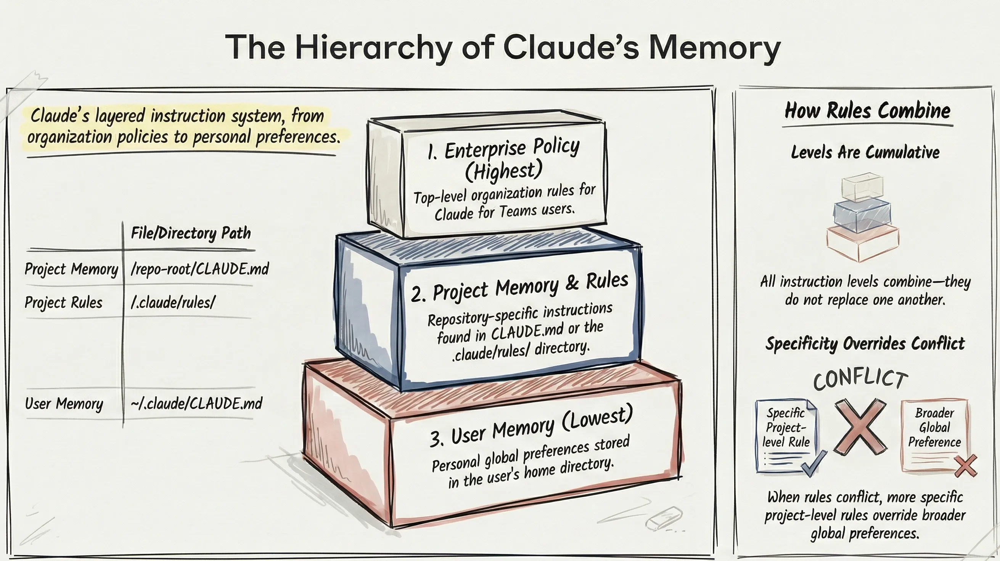

你的 `CLAUDE.md` 文件决定了 Claude Code 是只是一个美化的自动补全工具，还是一个真正理解你代码库的资深工程师。

我花了数月时间在几十个 .NET 项目中打磨我的 `CLAUDE.md` 文件——从简单的 API 到企业级多租户系统。今天分享的这些模式来自于真实的使用场景、Anthropic 官方文档，以及从观察 Claude 完美实现功能或完全搞砸的过程中吸取的教训。

在我[之前的 Claude Code 教程](https://codewithmukesh.com/blog/claude-code-for-beginners/)中，我介绍了 `CLAUDE.md` 作为一种引导 Claude 进入项目的方式。今天，我们将深入探讨——涵盖内存层级、WHAT-WHY-HOW 框架、导入语法，最重要的是，一个**可供 .NET 开发人员直接复制到项目中的生产级模板**。

让我们开始吧。

## 什么是 CLAUDE.md 及其重要性？

`CLAUDE.md` 是一个特殊的 Markdown 文件，它会成为 Claude 系统提示词的一部分。每当你在包含此文件的目录中启动 Claude Code 会话时，其内容都会自动加载到上下文中。

可以把它想象成是在为新加入的团队成员编写入职文档——只不过这个团队成员：

- 在会话中拥有完美的记忆
- 精确遵循指令
- 当你重复自己时从不感到厌烦
- 可以容纳 200,000 个 token 的上下文

**如果没有 CLAUDE.md**，Claude 每次会话都是“盲目”开始的。它不知道你的项目结构、编码规范、首选模式，甚至不知道如何运行测试。你最终只能一遍又一遍地重复相同的背景信息。

**如果有精心制作的 CLAUDE.md**，Claude 就能迅速上手。它从第一个提示开始就知道你的架构，尊重你的模式，并做出符合你代码库的决策。

> 根据 [Anthropic 的官方 Claude Code 文档](https://docs.anthropic.com/en/docs/claude-code)，`CLAUDE.md` 文件应该**“像任何常用的提示词一样进行改进”**。那些不断迭代 `CLAUDE.md` 的团队比那些设置一次就忘掉它的团队能获得更好的结果。

## Claude Code 内存层级——上下文是如何加载的

在我们写下一行代码之前，你需要了解 Claude Code 的内存系统。它是分层的，了解其工作原理有助于你有效地组织指令。



### 内存级别（优先级从高到低）

1.  **企业策略 (Enterprise Policy)** — 组织级规则（如果使用 Claude for Teams）
2.  **项目记忆 (Project Memory)** — 仓库根目录下的 `CLAUDE.md`
3.  **项目规则 (Project Rules)** — `.claude/rules/` 目录中的文件
4.  **用户记忆 (User Memory)** — 用于个人全局偏好的 `~/.claude/CLAUDE.md`

**关键洞察：** 所有级别是结合在一起的——它们不会互相替换。如果有冲突，更具体的规则会覆盖宽泛的规则。这意味着你可以在主目录（Home directory）中有全局偏好，而在每个仓库中有特定项目的覆盖规则。

### 文件位置及其用途

| 位置                   | 用途                     | 提交到 Git?            |
| :--------------------- | :----------------------- | :--------------------- |
| `./CLAUDE.md`          | 与团队共享的项目级指令   | 是                     |
| `./CLAUDE.local.md`    | 个人的项目偏好设置       | 否 (添加到 .gitignore) |
| `./.claude/rules/*.md` | 特定任务或文件夹的规则   | 是                     |
| `~/.claude/CLAUDE.md`  | 跨所有项目的全局偏好设置 | 不适用 (N/A)           |

### 导入语法

对于较大的项目，你可以使用导入语法将指令拆分到多个文件中：

`CLAUDE.md`

```markdown
@.claude/rules/architecture.md
@.claude/rules/testing.md
@.claude/rules/api-conventions.md
```

这可以保持根目录下的 `CLAUDE.md` 整洁，同时将详细指令组织到专注的文件中。导入支持递归解析，最多可达 5 层。

> **专业提示：** 使用导入来引用团队成员主目录中的文件，以包含不应提交的个人偏好：`@~/personal-dotnet-preferences.md`

## WHAT-WHY-HOW 框架

Anthropic 建议围绕三个层级组织你的 `CLAUDE.md`。这个框架确保 Claude 拥有完整的上下文，且没有不必要的冗余。

### WHAT — 你的技术栈和结构

准确告诉 Claude 你正在使用什么技术以及项目的组织方式。

```markdown
## Tech Stack (技术栈)

- .NET 10, ASP.NET Core Minimal APIs
- Entity Framework Core 10 with PostgreSQL
- Mediator for CQRS pattern (source-generated)
- FluentValidation for request validation
- Scalar for API documentation (OpenAPI)

## Project Structure (项目结构)

- `src/Api/` — 入口点、端点、中间件
- `src/Application/` — 命令、查询、处理器、DTOs
- `src/Domain/` — 实体、值对象、领域事件
- `src/Infrastructure/` — EF Core、外部集成
- `tests/` — 单元测试和集成测试
```

### WHY — 目的和架构决策

解释你的架构背后的原因。这有助于 Claude 做出符合你设计理念的决策。

```markdown
## Architecture Philosophy (架构理念)

我们遵循带有 CQRS 分离的 Clean Architecture：

- **Domain** 零依赖 — 纯业务逻辑
- **Application** 通过 Mediator 处理器编排用例
- **Infrastructure** 实现 Application 中定义的接口
- **Api** 很薄 — 仅包含端点定义和 DI 注入

为何使用 CQRS？我们需要不同的读/写模型以提高性能。
为何使用 Mediator？将处理器与 HTTP 层解耦，启用管道行为，源生成以获得更好性能。
```

### HOW — 命令和工作流规则

记录 Claude 应该知道的命令以及你期望它遵循的工作流规则。

```markdown
## Commands (命令)

- Build: `dotnet build`
- Test: `dotnet test --no-build`
- Run: `dotnet run --project src/Api`
- Migrations: `dotnet ef migrations add <Name> --project src/Infrastructure --startup-project src/Api`

## Workflow Rules (工作流规则)

- 在进行更改前务必创建一个功能分支 (feature branch)
- 每次实现后运行 `dotnet test`
- 未经明确批准，切勿修改 `src/Domain/` 中的文件
- 保持提交原子化 — 每次提交只包含一个逻辑变更
```

> **对这些模式不熟悉？** 查看我关于 [ASP.NET Core 中的 CQRS](https://codewithmukesh.com/blog/cqrs-and-mediatr-in-aspnet-core/)（概念也适用于 Mediator）、[FluentValidation](https://codewithmukesh.com/blog/fluentvalidation-in-aspnet-core/) 和 [Clean/Onion Architecture](https://codewithmukesh.com/blog/onion-architecture-in-aspnet-core/) 的详细指南。

## 应该包含什么（以及不该包含什么）

这是大多数开发者容易出错的地方。他们要么包含太少（Claude 盲目操作），要么包含太多（浪费上下文 token 在不相关的细节上）。

### 包含这些

1.  **技术栈和版本** — 具体一点：“Entity Framework Core 10” 而不仅仅是 “EF Core”
2.  **项目结构** — 将文件夹与其用途对应起来
3.  **常用命令** — 构建、测试、运行、迁移
4.  **编码规范** — 命名、模式、风格偏好
5.  **你使用的模式** — Mediator、Result 模式、CQRS
6.  **你不使用的模式** — 同样重要，以防止不需要的建议
7.  **领域术语** — 映射到代码实体的业务术语
8.  **测试说明** — 如何运行测试，使用什么框架
9.  **仓库工作流** — 分支命名、提交规范、PR 流程

### 不要包含

1.  **机密或凭据** — 永远不要放 API 密钥、连接字符串或密码
2.  **Linter 处理的代码风格规则** — 使用 Prettier/ESLint/dotnet format 代替
3.  **显而易见的框架知识** — Claude 知道 ASP.NET Core 是如何工作的
4.  **过多的文档** — 链接到文档而不是复制内容\
5.  **历史背景** — 关注当前状态，而不是项目历史

> **重要提示：** `CLAUDE.md` 中的每个词都会消耗上下文 token。保持在 300 行以内。理想情况下，根文件保持 50-100 行，详细部分使用导入。

## 完整的 .NET CLAUDE.md 模板

这是我为 .NET 项目实战测试过的模板。请根据你的具体技术栈和规范进行自定义。

```markdown
# CLAUDE.md - [项目名称]

## Overview (概述)

[一句话描述该项目的作用]

## Tech Stack (技术栈)

- .NET 10, ASP.NET Core Minimal APIs
- Entity Framework Core 10 with PostgreSQL
- Mediator for CQRS (source-generated, https://github.com/martinothamar/Mediator)
- FluentValidation for request validation
- Scalar for OpenAPI documentation
- xUnit + FluentAssertions for testing

## Project Structure (项目结构)

- `src/Api/` — 端点、中间件、DI 配置
- `src/Application/` — 命令、查询、处理器、验证器
- `src/Domain/` — 实体、值对象、枚举、领域事件
- `src/Infrastructure/` — EF Core、外部服务、仓储
- `tests/UnitTests/` — 领域和应用层测试
- `tests/IntegrationTests/` — API 和数据库测试

## Commands (命令)

- Build: `dotnet build`
- Test: `dotnet test`
- Run API: `dotnet run --project src/Api`
- Add Migration: `dotnet ef migrations add <Name> -p src/Infrastructure -s src/Api`
- Update Database: `dotnet ef database update -p src/Infrastructure -s src/Api`
- Format: `dotnet format`

## Architecture Rules (架构规则)

- 领域层 (Domain layer) 零外部依赖
- 应用层 (Application layer) 定义接口，基础设施层 (Infrastructure) 实现它们
- 所有数据库访问都通过 EF Core DbContext（无 Repository 模式）
- 所有命令/查询处理都使用 Mediator
- API 层很薄 — 仅包含端点定义

## Code Conventions (代码规范)

### Naming (命名)

- Commands: `Create[Entity]Command`, `Update[Entity]Command`
- Queries: `Get[Entity]Query`, `List[Entities]Query`
- Handlers: `[Command/Query]Handler`
- DTOs: `[Entity]Dto`, `Create[Entity]Request`

### Patterns We Use (我们使用的模式)

- 用于 DI 的主构造函数 (Primary constructors)
- DTO 和命令使用 Records
- 用于错误处理的 Result<T> 模式（不使用异常进行流程控制）
- 文件范围的命名空间 (File-scoped namespaces)
- 始终向异步方法传递 CancellationToken

### Patterns We DON'T Use (我们不使用的模式 - 永远不要建议)

- Repository 模式（直接使用 EF Core）
- AutoMapper（编写显式映射）
- 用于业务逻辑错误的异常
- 存储过程

## Validation (验证)

- 所有请求验证都在 FluentValidation 验证器中
- 验证器通过程序集扫描自动注册
- 验证运行在 Mediator 管道行为中

## Testing (测试)

- 单元测试：领域逻辑和处理器
- 集成测试：使用 WebApplicationFactory 进行完整的 API 端点测试
- 使用 FluentAssertions 进行可读断言
- 测试命名：`[Method]_[Scenario]_[ExpectedResult]`

## Git Workflow (Git 工作流)

- 分支命名：`feature/`, `bugfix/`, `hotfix/`
- 提交格式：`type: description` (feat, fix, refactor, test, docs)
- 变更前始终创建分支
- 提交前运行测试

## Domain Terms (领域术语)

- [Term 1] — [映射到的实体/概念]
- [Term 2] — [映射到的实体/概念]
```

## 为大型 .NET 项目组织 CLAUDE.md

对于拥有多个团队或模块的企业级解决方案，单个 `CLAUDE.md` 会变得笨重。使用 `.claude/rules/` 目录来组织指令。

### 目录结构

```text
.claude/
├── rules/
│   ├── architecture.md      # 层级规则和依赖
│   ├── api-conventions.md   # 端点模式
│   ├── testing.md           # 测试模式和命名
│   ├── database.md          # EF Core 规范
│   └── modules/
│       ├── identity.md      # Identity 模块细节
│       ├── catalog.md       # Catalog 模块细节
│       └── orders.md        # Orders 模块细节
```

### 使用 Frontmatter 的作用域规则

你可以使用 YAML frontmatter 将规则限定在特定路径：

```markdown
---
paths:
  - src/Modules/Identity/**
  - tests/**/Identity*
---

# Identity Module Rules (Identity 模块规则)

该模块处理身份验证和授权。

## Patterns (模式)

- 使用 ASP.NET Core Identity 进行用户管理
- 用于 API 认证的 JWT 令牌
- 启用刷新令牌轮换\n- 密码规则定义在 IdentitySettings 中

## Testing (测试)

- 为单元测试 Mock IIdentityService
- 使用 IdentityTestData 中定义的测试用户
```

## 常见错误及如何避免

### 错误 1：将 CLAUDE.md 用作 Linter

**错误：**

```markdown
- 使用 4 个空格缩进
- 始终添加尾随逗号
- 最大行长度：120 字符
```

**正确：** 使用 `.editorconfig` 和 `dotnet format` 处理样式规则。`CLAUDE.md` 用于架构上下文，而非格式化。

### 错误 2：包含来自 /init 的所有内容

`/init` 命令通过扫描你的项目生成一个初始的 `CLAUDE.md`。**务必检查并修剪它。** 自动生成的内容通常包含：

- redundant 冗余描述
- 显而易见的框架模式
- 过多的文件夹列表

只保留对**你的**项目独特的内容。

### 错误 3：忘记更新

你的 `CLAUDE.md` 应该随代码库演进。当你：

- 添加新库 → 更新技术栈
- 更改架构模式 → 更新规则
- 添加新模块 → 添加模块特定规则

把它当作活的文档，而不是一次性的设置。

### 错误 4：复制官方文档

**错误：**

```markdown
## How Mediator Works (Mediator 如何工作)

Mediator 是一个实现中介者模式的库... [500 字解释 Mediator]
```

**正确：**

```markdown
## Mediator Usage (Mediator 用法)

我们使用 Mediator 进行 CQRS。参见：https://github.com/martinothamar/Mediator

我们的规范：

- 每个文件一个处理器
- 处理器与命令/查询在同一文件夹
- 管道行为：Validation → Logging → Transaction
```

## 实际效果：使用前后对比

让我展示一下好的 `CLAUDE.md` 带来的差异。

### 使用 CLAUDE.md 之前

**提示词：** “添加一个用于创建产品的新端点”

**Claude 的响应：** 创建一个使用 Repository 模式的 Controller，添加 AutoMapper 配置，将验证放在 Controller 中，忽略了现有的模式。

**结果：** 花 30 分钟修正 Claude 的假设以匹配你的架构。

### 使用 CLAUDE.md 之后

**提示词：** “添加一个用于创建产品的新端点”

**Claude 的响应：** 使用 Mediator 创建 `CreateProductCommand`，添加 FluentValidation 验证器，使用你的 DTO 模式，遵循你的文件夹结构，甚至首先创建了分支。

**结果：** 代码完美匹配你的代码库。合并并继续。

## 比较 CLAUDE.md 与其他 AI 工具

如果你来自其他 AI 编码助手，以下是 `CLAUDE.md` 与类似项目上下文文件的比较。

| 工具               | 文件                              | 主要区别                               |
| :----------------- | :-------------------------------- | :------------------------------------- |
| **Claude Code**    | `CLAUDE.md`                       | 分层记忆，导入语法，作用域规则         |
| **Cursor**         | `.cursorrules`                    | 已废弃，建议使用 `.cursor/rules/` 目录 |
| **GitHub Copilot** | `.github/copilot-instructions.md` | 支持 glob 模式的路径特定规则           |
| **Windsurf**       | `.windsurfrules.md`               | 由 AI 主动执行的动态文档               |
| **Aider**          | `CONVENTIONS.md`                  | 简单的要点列表，通过 `/read` 加载      |

**CLAUDE.md 的不同之处：**

- **分层加载** — 用户、项目和规则级别相结合
- **导入语法** — 使用 `@path/to/file.md` 引用其他文件
- **作用域规则** — 通过 frontmatter 将规则应用于特定路径
- **200K token 上下文** — 可以处理更详细的指令

如果你是从 Cursor 的 `.cursorrules` 迁移过来，结构是相似的，但 `CLAUDE.md` 通过 `.claude/rules/` 目录支持更高级的组织方式。

## 来自真实使用的专业提示\n\n在几十个 .NET 项目中使用 Claude Code 后，以下模式能持续改善结果。

### 1. 使用井号键进行实时更新

在会话期间，按 `#` 给 Claude 一个指令，它会自动保存到你的 `CLAUDE.md` 中。这非常适合在发现模式时即时捕捉它们。

```text
# 验证失败时始终使用 Result<T> 而不是抛出异常
```

Claude 会将此添加到你的 `CLAUDE.md` 中，而不会打断你的流程。

### 2. 记录你的“非显而易见”的命令

每个项目都有一些不明显的命令。记录下来：

```markdown
## Non-Obvious Commands (非显而易见的命令)

- 重置测试库：`docker-compose down -v && docker-compose up -d db`
- 生成客户端：`npm run generate-api-client --prefix src/Web`\n- 清除 Redis：`docker exec redis redis-cli FLUSHALL`
```

### 3. 包含错误变通方法

如果你的项目有已知问题或变通方法，记录下来：

```markdown
## Known Issues & Workarounds (已知问题和变通方法)

- EF Core 迁移在 Mac M1 上失败：添加 `--runtime osx-arm64` 标志
- 热重载破坏 SignalR：Hub 变更后重启 `dotnet watch`
- 首次运行时测试超时：先运行 `dotnet build` 预热
```

### 4. 引用典型的代码示例

与其用文字解释模式，不如指向现有的代码：

```markdown
## Code Examples (代码示例)

- 新命令实现：参见 `src/Application/Products/Commands/CreateProduct/`
- 集成测试模式：参见 `tests/IntegrationTests/Products/CreateProductTests.cs`
- 带认证的端点：参见 `src/Api/Endpoints/Orders/CreateOrderEndpoint.cs`
```

这消耗的 token 更少，并展示了你代码库中的真实模式。

### 5. 指定命令的工作目录

需要在特定目录运行的命令应该说明：

```markdown
## Commands (命令)

- API 测试：`dotnet test` (在 `tests/Api.IntegrationTests/` 运行)
- 生成迁移：`dotnet ef migrations add <Name>` (在解决方案根目录运行)
- 前端构建：`npm run build` (在 `src/Web/` 运行)
```

## 快速参考：CLAUDE.md 清单

在提交 `CLAUDE.md` 之前，请验证：

- [ ] 列出了带有具体版本的技术栈
- [ ] 带有文件夹用途的项目结构
- [ ] 构建、测试和运行命令
- [ ] 架构理念（为什么，不仅仅是什么）
- [ ] 模式的命名规范
- [ ] 你使用的模式**以及**你避免的模式
- [ ] Git 工作流和分支命名
- [ ] 映射到代码的领域术语
- [ ] 没有机密、凭据或连接字符串
- [ ] 300 行以内（使用导入处理细节）
- [ ] 使用真实提示词测试过以验证有效性

## 常见问题解答

**什么是 CLAUDE.md？**
CLAUDE.md 是一个特殊的 Markdown 文件，它成为 Claude Code 系统提示词的一部分。当你在包含此文件的目录中启动 Claude Code 会话时，其内容会自动加载到上下文中。它作为入职文档，告诉 Claude 你的项目结构、编码规范、技术栈和工作流规则。

**我应该把 CLAUDE.md 放在哪里？**
将你的主 CLAUDE.md 文件放在仓库根目录。对于不应提交的个人偏好，使用 CLAUDE.local.md（将其添加到 .gitignore）。对于跨所有项目的全局偏好，使用 `~/.claude/CLAUDE.md`。对于特定任务的规则，在 `.claude/rules/` 目录中创建文件。

**CLAUDE.md 应该多长？**
保持根 CLAUDE.md 在 300 行以内，理想情况是 50-100 行。使用导入语法（`@path/to/file.md`）在单独的文件中引用详细说明。每个词都消耗上下文 token，所以专注于你项目独特的内容，而不是通用的框架知识。

**我应该在 CLAUDE.md 中包含什么？**
包含带有具体版本的技术栈、带有文件夹用途的项目结构、常用命令（构建、测试、运行）、编码规范和命名模式、架构决策及其背后的原因、你使用的模式和明确避免的模式、git 工作流规则以及映射到代码实体的领域术语。

**我不应该在 CLAUDE.md 中包含什么？**
永远不要包含机密、API 密钥或连接字符串。避免 linters 处理的代码风格规则（改用 .editorconfig），避免 Claude 已经知道的显而易见的框架知识，避免过多的文档（链接到文档），以及与当前开发无关的历史项目背景。

**如何在 CLAUDE.md 中导入其他文件？**
使用 `@` 语法导入其他 Markdown 文件：`@.claude/rules/architecture.md`。导入支持递归解析，最多 5 层。这让你既能将详细指令组织到专注的文件中，又能保持根 CLAUDE.md 的整洁。

**CLAUDE.md 与 .cursorrules 有何不同？**
CLAUDE.md 提供分层记忆（用户、项目和规则级别相结合）、引用其他文件的导入语法、通过 YAML frontmatter 应用于特定路径的作用域规则，以及 200K token 的上下文容量。Cursor 的 .cursorrules 较为简单，但缺乏这些组织特性。

**如何在会话期间更新 CLAUDE.md？**
在 Claude Code 会话期间按 `#` 键，给出一个指令，它将自动保存到你的 CLAUDE.md 中。这对于在不打断工作流的情况下捕捉你发现的模式非常有用。

## 超越 CLAUDE.md：技能 (Skills) 和子代理 (Subagents)

`CLAUDE.md` 告诉 Claude 你的项目是**什么**以及你**如何**工作。但为了最大化生产力，你会希望将其与两个强大的功能结合起来：

### 自定义技能 (Custom Skills)

技能是像 `/pr`、`/review` 和 `/migrate` 这样的可重用命令，它们将你团队的工作流编码为可执行的提示词。当你运行一个技能时，Claude 会自动加载你的 `CLAUDE.md` 上下文——所以你的编码规范、架构规则和项目结构会通知每一次技能执行。

例如，在 Clean Architecture 项目中的 `/pr` 技能将生成引用你的层级结构、提及涉及的 Mediator 处理器并遵循你的提交规范的 PR 描述——这一切都因为它首先读取了你的 `CLAUDE.md`。\n\n### 子代理 (Subagents)

当 Claude 处理复杂的多文件任务时，它会生成**子代理**——专门的工人在并行处理问题的不同部分。每个子代理都继承你的 `CLAUDE.md` 上下文，这意味着它们都理解你的架构，而无需你重复自己。

编写良好的 `CLAUDE.md` 是区分在代码库中跌跌撞撞的子代理和像你团队中的资深开发人员一样导航的子代理的关键。

> **底线：** `CLAUDE.md` 是基础。技能和子代理是建立在该基础上的力量倍增器。先精通 `CLAUDE.md`——然后再通过技能和代理升级。

## 下一步是什么？

我们将在专门的文章中涵盖技能、钩子 (Hooks) 和子代理：

- **自定义命令 (Skills)** — 构建 `/pr`、`/review` 和 `/migrate` 命令
- **Hooks** — 每次变更后自动测试和 linting
- **MCP 集成** — 将 Claude 连接到 GitHub、Jira 和数据库
- **Subagents** — Claude 如何处理复杂的多文件任务

如果你对 AI 辅助开发是认真的，精通 `CLAUDE.md` 是你能做出的单一最高杠杆投资。它将 Claude 从一个通用的 AI 转变为一个真正理解你代码库的队友。
