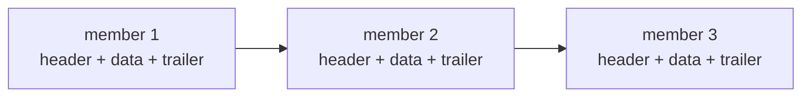

日常开发里，压缩常常是看不见的基础设施。打包构建产物、备份数据、压缩日志、在网络上传输数据，这些场景都离不开 `ZipArchive` 和 `GZipStream`。

Anthony Giretti 的文章提到一个很实用的变化：.NET 10 基本不动这些 API 的表面形状，但在实现细节上做了优化。你的代码大概率不用改，升级目标框架就能更快。

## 背景

在旧版本 .NET 中，压缩相关 API 能工作，也足够稳定，但在一些常见工作流上会遇到瓶颈。

例如：

- 大型 zip 包含大量小文件时，解压会更吃 I/O 和锁竞争
- 异步读写在某些路径上存在额外开销
- 处理拼接式 gzip 时，开销更高，行为也更依赖具体实现

## .NET 10 主要改进点

这次改进的核心方向很明确。

- zip 解压吞吐更好，对大归档和多条目更友好
- 异步路径更像异步，更少的额外开销，取消也更自然
- 拼接式 gzip 更高效，读取多个 gzip member 的成本更低

同时，作者强调了一点：公开 API 设计目标是保持兼容。

- 方法签名不变
- 旧代码通常可以直接编译运行
- 迁移成本很低

## 示例 1：异步解压 zip

下面的写法在很多项目里都见过。重点在于 .NET 10 里这段逻辑通常会跑得更顺。

```csharp
using System;
using System.IO;
using System.IO.Compression;
using System.Threading;
using System.Threading.Tasks;

public static class ZipExtractor
{
    public static async Task ExtractZipAsync(
        string zipPath,
        string destination,
        CancellationToken ct = default)
    {
        Directory.CreateDirectory(destination);

        await using var fs = File.OpenRead(zipPath);
        using var archive = new ZipArchive(fs, ZipArchiveMode.Read, leaveOpen: false);

        foreach (var entry in archive.Entries)
        {
            // 跳过目录条目
            if (string.IsNullOrEmpty(entry.Name))
                continue;

            var outPath = Path.Combine(destination, entry.FullName);
            Directory.CreateDirectory(Path.GetDirectoryName(outPath)!);

            await using var entryStream = entry.Open();
            await using var outStream = File.Create(outPath);

            await entryStream.CopyToAsync(outStream, ct);
            Console.WriteLine($"Extracted: {entry.FullName}");
        }
    }
}

await ZipExtractor.ExtractZipAsync("sample.zip", "./out", CancellationToken.None);
```

如果你经常在慢磁盘、网络盘、容器卷里解压，或者 zip 里有很多小文件，这类优化会更容易感知。

## 示例 2：读取拼接式 gzip

不少工具会输出拼接式 gzip。它看起来像一个 `.gz` 文件，内部却是多个 gzip member 顺序拼起来。



.NET 10 对这类文件的处理更高效。代码仍然很朴素。

```csharp
using System;
using System.IO;
using System.IO.Compression;
using System.Text;
using System.Threading.Tasks;

static async Task ReadConcatenatedGzipAsync(string path)
{
    await using var fileStream = File.OpenRead(path);
    await using var gzip = new GZipStream(fileStream, CompressionMode.Decompress);
    using var reader = new StreamReader(gzip, Encoding.UTF8);

    var content = await reader.ReadToEndAsync();
    Console.WriteLine(content);
}

await ReadConcatenatedGzipAsync("data.gz");
```

如果你的系统要处理按时间切分后再拼接的日志 gzip，这个变化会更有价值。

## 实践建议

升级到 .NET 10 之前和之后，写法上可以保持一致，但有几条建议值得顺手检查一下。

- 优先使用真正的异步 I/O，例如 `CopyToAsync`，并把 `CancellationToken` 传下去
- 对 zip 里目录条目要做判断，避免创建空文件
- 处理大量条目时，注意目标目录创建与磁盘性能，避免把瓶颈误判成压缩算法

## 小结

.NET 10 对 `ZipArchive` 和 `GZipStream` 的改进属于升级就赚到的类型：API 基本不变，但更快、更省、更适合现实世界的文件形态。

原文链接：<https://anthonygiretti.com/2026/01/19/net-10-zip-and-gzip-api-improvements>
