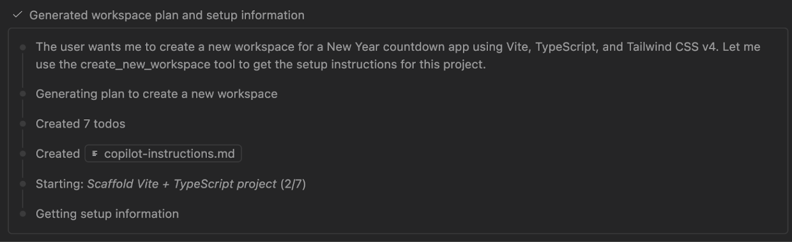
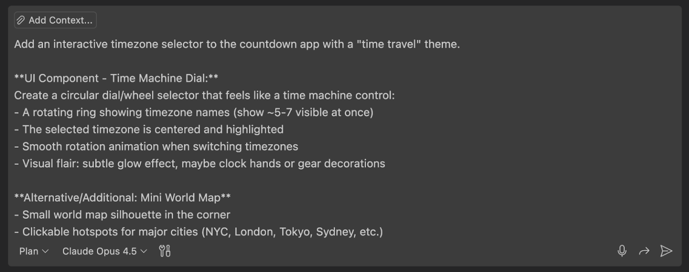
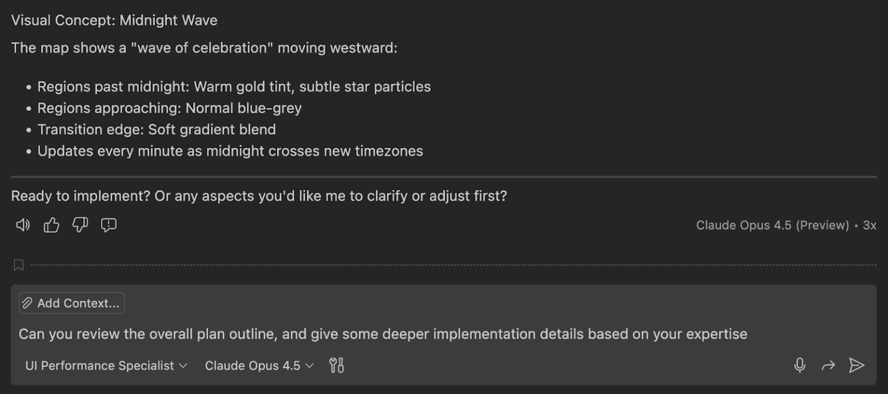
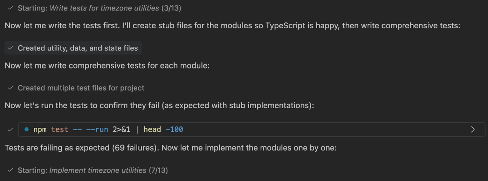
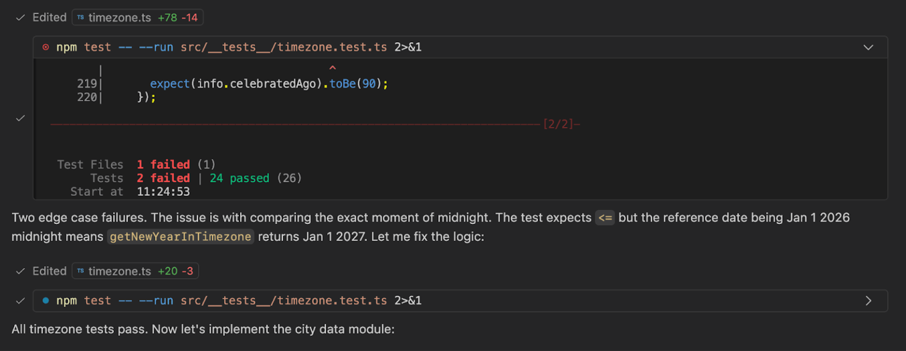
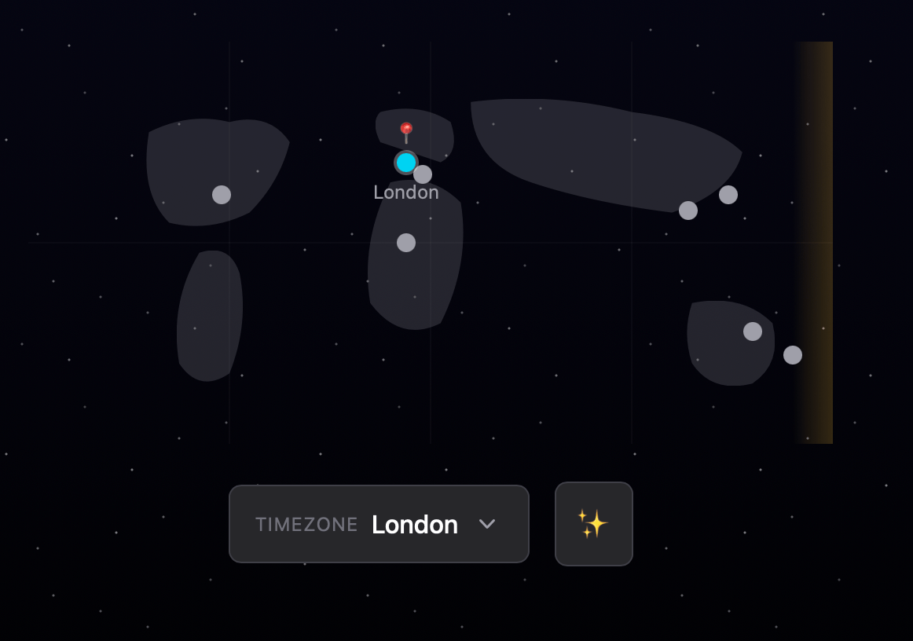
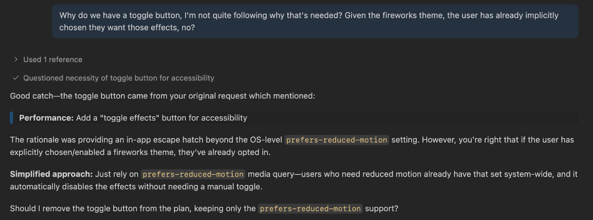
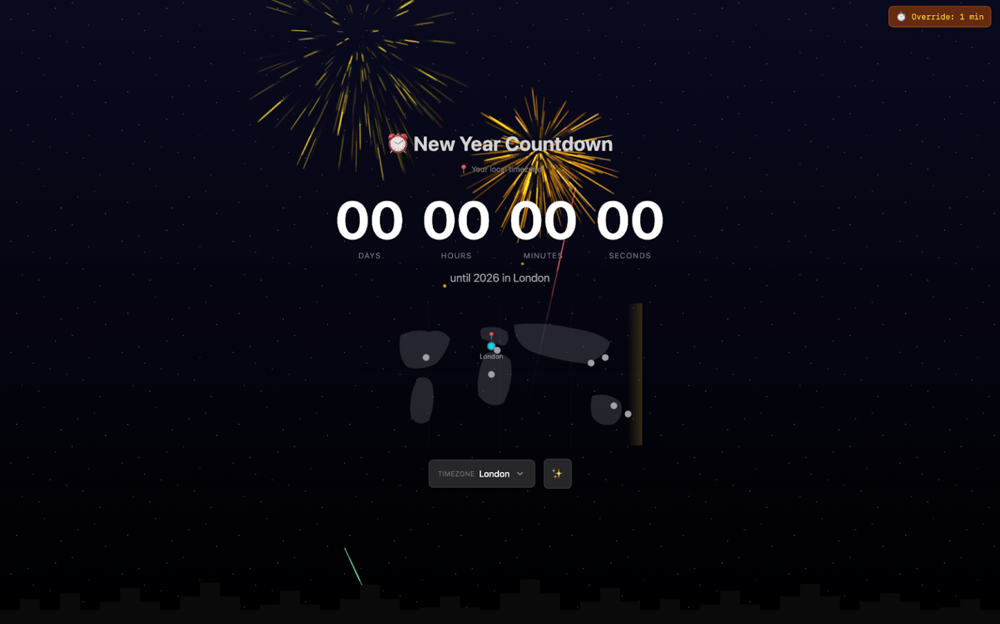
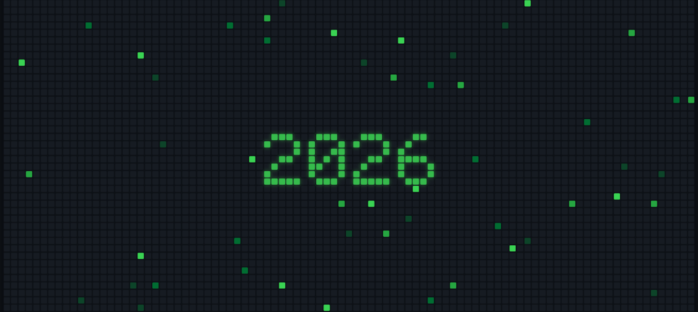

# 上下文窗口、Plan Agent 和 TDD：我在用 GitHub Copilot 构建倒计时应用中学到了什么

## 背景

了解我如何管理上下文以保持 Copilot 的专注，使用 Plan Agent 明确模糊的需求，并采用测试驱动开发（TDD）在用户发现 bug 之前捕获它们。


在 2025 年最后一次 Rubber Duck Thursdays 直播中，我想构建一些具有庆祝意义的东西。以此来体现 Rubber Duck Thursdays 的真正含义：一起构建，从错误中学习，并庆祝来自世界各地的每一位观众的参与。

在这个过程中，我掌握了一些实用的 AI 协作模式，你可以将它们应用于自己的项目中——无论你是构建倒计时应用还是完全不同的东西。从管理上下文窗口以避免对话混乱，到使用 [Plan agent](https://code.visualstudio.com/docs/copilot/chat/chat-planning) 探索需求，再到通过 Copilot 进行测试驱动开发来捕获边缘情况。还有……为什么世界地图比看起来要难搞得多。

## 从简单开始：基础倒计时

倒计时器是一个直观的概念。天数倒计时变为小时，分钟倒计时变为秒。但有时正是这些简单的想法让我们能够发挥最大的创造力。我想利用这个机会，采用规范或需求驱动的方法使用 Copilot，构建一个倒计时应用，随着新年钟声的敲响，它不仅带来期待，还会绽放烟花。

### 💡 什么是规范驱动开发（Spec-driven development）？

规范驱动开发（Spec-driven development）不是先编码后写文档，顾名思义，它始于规范。这是代码行为的契约，也是你的工具和 AI Agent 用来生成、测试和验证代码的事实来源。结果是更少的猜测、更少的意外和更高质量的代码。

[开始使用我们的开源 Spec Kit >](https://github.blog/ai-and-ml/generative-ai/spec-driven-development-with-ai-get-started-with-a-new-open-source-toolkit/)

幸运的是，软件开发是一个迭代的过程，这次直播完全拥抱了这一点。虽然有些需求定义明确，但其他需求则是根据直播观众的建议实时演变的。像 Plan agent 这样的自定义 Agent 帮助弥合了差距，将模糊的想法转化为我可以执行的结构化计划。那么，让我们从最开始的项目设置说起。

我使用 GitHub Copilot 生成了一个新工作区，并使用了非常具体的提示。提示说明我们要构建一个倒计时应用，并希望使用 [Vite](https://github.com/vitejs/vite)、[TypeScript](https://github.com/microsoft/TypeScript) 和 [Tailwind CSS v4](https://github.com/tailwindlabs/tailwindcss)。它还解释了一些需求，包括深色主题、居中布局、带有微妙动画的大号粗体数字、默认目标为 2026 年 1 月午夜，并留有一些自定义空间。

```markdown
#new 

1. Create a new workspace for a New Year countdown app using Vite, TypeScript, and Tailwind CSS v4.

**Setup requirements:**
- Use the @tailwindcss/vite plugin (Tailwind v4 style)
- Dark theme by default (zinc-900 background)
- Centered layout with the countdown as the hero element

**Countdown functionality:**
Create a `countdown.ts` module with:
- A `CountdownTarget` type that has `{ name: string, date: Date }` so we can later customize what we're counting down to
- A `getTimeRemaining(target: Date)` function returning `{ days, hours, minutes, seconds, total }`
- A `formatTimeUnit(n: number)` helper that zero-pads to 2 digits
- Default target: midnight on January 1st of NEXT year (calculate dynamically from current date)

**Display:**
- Large, bold countdown digits (use tabular-nums for stable width)
- Labels under each unit (Days, Hours, Minutes, Seconds)
- Subtle animation when digits change (CSS transition)
- Below the countdown, show: "until [target.name]" (e.g., "until 2026")

**Architecture:**
- `src/countdown.ts` - pure logic, no DOM
- `src/main.ts` - sets up the interval and updates the DOM
- Use `requestAnimationFrame` or `setInterval` at 1 second intervals
- Export types so they're reusable

Keep it simple and clean—this is the foundation we'll build themes on top of.
```

我喜欢“生成新工作区”功能的一点是，Copilot 为我自动生成了[自定义说明文件（custom instruction files）](https://code.visualstudio.com/docs/copilot/customization/custom-instructions)，捕获了我的需求，包括倒计时应用、Vite、TypeScript 和深色主题。在编写任何代码之前，一切都已记录在案。



几分钟内，我就有了一个可以工作的倒计时。天、小时、分和秒都在向 2026 年倒数。虽然它能工作，但在视觉上并不令人兴奋。平心而论，我在最初的提示中没有指定任何设计或主题偏好。所以是时候迭代并让它更有趣了。

## 引导我们方向的社区建议

在直播期间，观众来自印度、尼日利亚、意大利、美国等地（名单还在继续！）；来自世界各地的开发者聚集在一起学习。聊天中的一个人提出了一个建议，调整了我们就下来要做的事情：

> **时区通过怎么样？**

这不是我预计在直播期间要处理的需求，所以我没有关于它如何运作的清晰计划。也许是一个可以旋转来选择时区的地球仪。也许是一个以时间旅行为主题的世界地图。有很多“也许”。我的需求很模糊，这正是我求助于 Plan agent 的地方。

## Plan Agent：我未曾想到的问题

最近我更刻意地使用了 [Plan agent](https://code.visualstudio.com/docs/copilot/chat/chat-planning)，特别是当我感觉我的需求没有完全定义时。Plan agent 不会仅仅基于我的初始提示创建一个计划，它会提出澄清性问题，从而揭示你可能未曾考虑过的边缘情况。



我给出了我的粗略想法：交互式时区选择器、时间旅行主题、在区域之间动画过渡、也许是一张世界地图。Plan agent 返回了一些让我思考的问题：

| 问题 | 为什么它重要 |
| :--- | :--- |
| 圆形表盘应该是主要的，世界地图是次要的，还是反过来？ | 我还没决定视觉层次结构。 |
| 在移动设备上会发生什么：下拉菜单回退还是触摸友好的滚动？ | 对于这个初始版本，我只考虑了桌面实现。移动端可能是未来的需求。 |
| 当一个时区过了午夜，是显示“已经在庆祝”并撒花，还是显示一个计时器，表明自午夜以来过了多久？ | 我想要庆祝活动，而不是反向倒计时。我对我的需求并不清楚。 |
| 旋转表盘时会有微妙的音频反馈，还是仅仅是视觉上的？ | 将音频引入应用属于范围蔓延（scope creep），但这可能是未来的需求。 |

这就是以这种方式与 AI 合作的美妙之处。Plan agent 促使你思考，并在可能的情况下提出澄清问题，提供选项 A 或 B。但在你反思时，你会意识到答案介于两者之间。

例如，在我第二次迭代需求时，计划询问烟花应该持续燃放、燃放一次，还是微妙地循环。我回答说可能有性能方面的考虑，我们应该选择折衷方案。我们要请直播观众投票决定是通过表盘还是地图来实现该组件。地图胜出，所以我们将主要选择器转向了带有八个精选地点的世界地图。

## 上下文窗口管理：只保留你需要的

在实施之前，我特意开始了一个新的 [聊天会话](https://code.visualstudio.com/docs/copilot/copilot-chat)。

我们之前对话的上下文（工作区创建、基本倒计时逻辑）不再需要了。任何可能有用的上下文现在都包含在我们的自定义说明文件中。当与 AI 工具合作时，上下文窗口是宝贵的。引入不相关的历史记录会使对话变得混乱并分散注意力。所以我清除了它，只带入重要的东西：新需求、Plan agent 的输出（我已经要求 Copilot 将其写入单独的 Markdown 文件），以及对时区的新关注。

我还重用了一些自定义指令文件、[自定义 Agent](https://code.visualstudio.com/docs/copilot/customization/custom-agents) 和来自另一个个人项目的 [提示文件](https://code.visualstudio.com/docs/copilot/customization/prompt-files)，以帮助引导 Copilot 朝着正确的方向发展，并整合针对相关任务的专用 Agent。这其中包括一个 UI 性能专家 Agent。

> **💡 你知道吗？**
> GitHub Copilot 的 [自定义 Agent](https://code.visualstudio.com/docs/copilot/customization/custom-agents) 允许你为不同的开发任务创建专门的角色。我在流媒体期间构建的 UI 性能专家 Agent 只是一个例子。你可以为安全审查、架构规划或任何特定于角色的工作流程创建 Agent。[awesome-copilot 存储库有许多示例](https://github.com/github/awesome-copilot/tree/main/agents)。

## 实现：模块化、测试驱动以及那张地图

随着 Plan agent 的工作完成，我切换到我的 UI 性能专家 Agent，并要求它审查计划，根据其专业知识建议更深入的实施细节。



上下文在这里很重要，所以我没有创建一个新对话。相反，我继续了现有的对话。Agent 返回了一组详细的注意事项：

*   动画的帧时间预算
*   地图 SVG 大小优化策略
*   庆祝粒子限制（DOM 元素关注点）和清理注意事项
*   动画属性建议（仅变换/不透明度）
*   减少运动（Reduced motion）支持

看起来不错，但我添加了一些额外的要求。我要求自定义 Agent 使实现模块化，首先根据预期行为编写测试，一旦有失败的测试，再编写实现。

没错：[Copilot 辅助的测试驱动开发](https://code.visualstudio.com/docs/copilot/guides/test-driven-development-guide)。

### TDD 循环

Copilot 为时区实用程序、城市状态管理和倒计时逻辑创建了测试文件。所有测试最初都是失败的红色状态。很好（这是我们少数几次希望看到测试失败的时候）！



然后它实现了：

*   使用 [Intl.DateTimeFormat API](https://developer.mozilla.org/en-US/docs/Web/JavaScript/Reference/Global_Objects/Intl/DateTimeFormat) 的时区实用程序
*   具有精选地点的城市状态（纽约、伦敦、东京、悉尼等）
*   所选时区的 [localStorage](https://developer.mozilla.org/en-US/docs/Web/API/Window/localStorage) 持久化
*   应用状态管理

通过访问工具，自定义 Agent 还在终端中执行了测试。两个测试用例失败了一个确定庆祝活动是否在年份翻转之间正确触发的逻辑。测试期望庆祝活动在午夜处理，以及庆祝活动开始后的持续时间。



由于 Copilot 可以访问输出，自定义 Agent 捕获了测试失败，调整了时区实现，测试变绿（通过）了。

> **💡 思考：**
> 这正是 TDD 和思考代码质量重要的原因。就像我们开发人员一样，AI 辅助开发也可能会出错。测试帮助我们在用户之前发现错误。鉴于这是应用程序的核心功能，如果在 12 月 31 日发现年份翻转的边缘情况，那将是令人尴尬的！

但有些 bug 变成了功能。我发现一个 bug 太搞笑了，以至于没法立即修复。让我们以此谈谈世界地图。

### 世界地图，也许？

当我打开应用程序时，倒计时正常工作。时区选择器正常工作。计算是正确的，从纽约切换到东京显示了正确的时差。

但是世界地图？它的渲染不完全符合预期。屏幕上显示的更像是抽象艺术而不是地理。但这真的让我在直播中笑出了声。



> **💡 思考：**
> 我在指定世界地图时雄心勃勃，但没有提供足够的上下文。没有 SVG 资产，没有引用现有的地图库。只是“添加一个迷你世界地图”。提醒我们 AI 可能会把事情搞错。

我能修复它吗？当然。但我们直播已经进行了一个多小时，还有更多功能要构建。所以我留下了它。地图是迭代开发的一个完美例子，事情并不总是第一次就做对。（你能看出我们是现场构建的吗？）

## 烟花：建立对午夜的期待

倒计时本身是功能性的，但烟花增添了庆祝气氛，并赋予了一些视觉光彩。

我切换回 Plan agent 并创建了一个新的聊天线程（再次强调上下文窗口管理，提示 Copilot 制定计划）：

*   使用 [Fireworks.js](https://github.com/crashmax-dev/fireworks-js) 制作效果
*   根据剩余时间设置烟花行为
*   如果计时器剩余时间超过 24 小时，不显示烟花，只显示环境星光
*   如果计时器剩余时间在 24 到 12 小时之间，每 30 秒燃放一次烟花
*   在剩余一小时到 10 分钟之间，烟花的强度应该增强
*   最后，在最后 10 秒，我们应该有持续的烟花以达到最大的庆祝效果

我还要求在屏幕底部显示天际线剪影、深色夜空渐变和主题控制器。此外，还有一个关键的测试要求：“添加一个查询参数，以便我可以指定距离午夜还有多少分钟，作为手动测试的覆盖。”虽然我喜欢与我们的社区一起直播，但我不确定每个人都愿意等到 2026 年到来才能看到结果！

Plan agent 要求进一步澄清如何显示星星（将其设置为 CSS，还是设置为低强度的烟花），以及一些关于性能的考虑。它还询问了切换开关的位置，这让我措手不及。我不记得要求过切换按钮，可能在计划的迭代中错过了这一点。

仔细审查计划后，Plan agent 发现我最初为了无障碍访问请求了一个动画切换开关。这就是我喜欢 Plan agent 的原因。这是与拥有对话上下文的 AI 进行的“小黄鸭调试”，它可以检查这些需求是否仍然有意义。



一旦 Copilot 和我重新协商了需求，我们就使用了熟悉的测试驱动开发方法。最初有一个测试失败了，因为缺少 JSDOM 环境设置。Copilot 发现了故障，确定了配置错误的测试配置，并进行了修复。之后，所有测试都通过了。

我们现在拥有一个应用程序，它具有不同强度级别的烟花、使用 CSS 的动画星空、城市天际线、减少运动支持和查询参数覆盖。

### 测试强度级别

我将 `?minutesToMidnight=1` 添加到 URL。烟花以中等强度出现，随着天空中颜色和粒子数量的增加，兴奋感也随之建立。在“午夜”，Happy New Year 伴随着更多的庆祝活动出现。强度曲线感觉是对的，积累创造了期待，结局也如期而至。



## 揭秘：那天早上我构建了什么

但我并没有止步于此。在整个直播过程中，我一直在调侃那天早上我制作了另一个倒计时应用，这是一个主题非常相关的应用。我们的观众猜测是另一个烟花倒计时、彩色纸屑计时器，甚至是“启发式井字游戏”（公平地说，我们[以前构建过](https://github.blog/ai-and-ml/github-copilot/building-your-first-mcp-server-how-to-extend-ai-tools-with-custom-capabilities/)）。\n\n但作为一个 GitHub 直播，我们要结束它的方式只有一种。我们必须有一个**贡献图**主题的倒计时！

倒计时位于动画贡献图的中心。每个方块闪烁着绿色的贡献，在波浪中穿过网格出现和消失。就像烟花主题一样，随着倒计时越来越接近零，更多的方块亮起，强度也随之增强。



这次直播是一次庆祝。这是一种将我们的社区跨越时区聚集在一起的方式，我们所有人都在世界各地的角落里构建并倒数同一时刻。

在直播期间，有人问到最适合找工作的编程语言是什么。我的回答与我处理这个项目的方法相同：找到给你带来快乐的东西，然后合适的工具和语言自然会到位。我构建这个 GitHub 倒计时主题是因为它给我带来了快乐。因为我想做一些“GitHubby”的东西，而且我喜欢构建视觉体验。

自从那次直播以来，我一直致力于将这两个项目整合到一个统一的 [开源倒计时应用 Timestamp](http://github.com/chrisreddington/timestamp/) 中。它有一个集中的主题协调器，允许开发人员插入通用架构并通过新主题进行扩展。每个倒计时都是一个 URL，因此可以轻松共享，并且有多种倒计时模式可供选择（本地时间、绝对时刻和计时器）。

你可以 [查看实时应用](https://chrisreddington.github.io/timestamp) 并 [审查代码库](http://github.com/chrisreddington/timestamp)。欢迎查看存储库，加星标，分叉，甚至贡献新主题。

我希望这能激励你构建那个一直在待办事项清单上的项目，并花一些时间在带给你一点快乐的事情上。

## 我们学到了什么？

*   **上下文窗口管理是一项技能。** 当不需要旧上下文时，开始新的聊天会话。保持对话专注。这是 [上下文工程（context engineering）](https://github.blog/ai-and-ml/generative-ai/want-better-ai-outputs-try-context-engineering/)，而不仅仅是提示工程。
*   **Plan Agent 会问你可能忘记的问题。** 当需求模糊时使用它。让它通过澄清性问题揭示边缘情况。有时 A 或 B 的答案是“折衷方案”。
*   **自定义 Agent 是专业的帮手。** 我的 UI 性能专家在帧预算、动画属性和无障碍方面拥有专业知识。它提供了实现细节，而 Plan Agent 则帮助提出澄清问题以确定范围。专业化很重要。
*   **使用 Copilot 进行 TDD 是有效的。** 先写测试。让它们失败。实现以通过。就像我们开发人员一样，AI 辅助工具也会产生 bug。我们需要使用我们习惯的同等实践来检查质量（构建、linter 和测试），以便在用户之前发现问题。
*   **事情并不总是第一次就成功。这没关系。** 世界地图没有按预期渲染，我一直保留这种状态，直到我对倒计时应用进行重大重构和重建。真实的开发意味着展示混乱的中间过程，而不仅仅是完美的结果。我们从意外结果中学到的东西和从成功中学到的一样多。
*   **雄心勃勃地规划范围，迭代地实现。** 我们从基本的倒计时，发展到时区，再到强烈的烟花，最后到一个单独的贡献图主题倒计时。罗马不是一天建成的，你不需要在第一天就拥有所有东西。

**你在 2026 年会构建什么？**

参加英国时间上午 10:30 和东部时间下午 2:00 的下一场 [Rubber Duck Thursdays 直播](https://gh.io/rubberduckthursdays)，让我们构建一些带给我们快乐的东西，那些还没有完全排到“某一天”列表顶端的东西！
