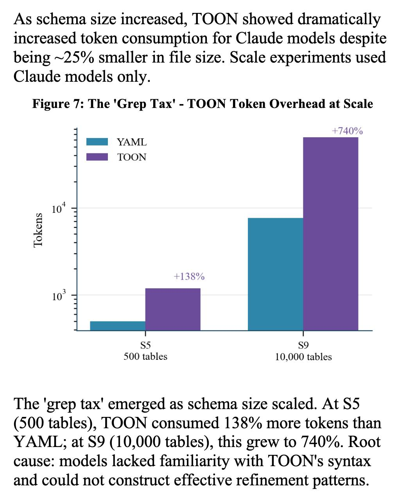

# 结构化上下文工程与文件原生代理系统

Damon McMillan 发布了一篇新论文，深入探讨了在涉及大型 SQL 架构（规模高达 10,000 张表）时，LLM 处理上下文任务所面临的挑战。这项研究横跨不同的模型和文件格式，为文件原生代理系统（File-Native Agentic Systems）提供了重要的数据支持。

研究团队主要利用 SQL 生成作为编程代理操作的代理任务（Proxy），对结构化数据的上下文工程进行了系统性研究。该研究规模庞大，包含 **9,649 次实验**，涵盖了 11 种模型和 4 种数据格式（YAML, Markdown, JSON, 以及 Token-Oriented Object Notation [TOON]），架构规模从 10 张表一直覆盖到 10,000 张表。

## 关键发现

### 1. 模型能力的梯队差异
毫无悬念，模型本身的能力是最大的影响变量。
- **前沿模型**（Opus 4.5, GPT-5.2, Gemini 2.5 Pro）的表现优于目前的领先开源模型。
- **开源模型**（DeepSeek V3.2, Kimi K2, Llama 4）虽然在不断进步，但在处理此类复杂任务时仍有差距。

### 2. 文件系统检索与代理循环
前沿模型能够很好地利用基于文件系统的上下文检索机制。相比之下，开源模型在使用这些机制时的结果并不理想。

这强化了一个观点：目前的开放权重模型在处理**文件系统编码代理循环（filesystem coding agent loops）**方面尚未成熟。这一点在 **Terminal Bench 2.0** 排行榜上也能得到印证，该榜单目前依然由 Anthropic, OpenAI 和 Gemini 占据主导地位。

### 3. "Grep Tax" 与 TOON 格式悖论
研究中一个非常有趣的细节是针对 **TOON** 格式观察到的 "Grep Tax" 现象。

TOON (Token-Oriented Object Notation) 设计初衷是用尽可能少的 Token 来表示结构化数据。然而实际测试发现，由于模型对这种格式缺乏“熟悉度”，导致它们在尝试理解和处理这种格式时，需要经过多次迭代，最终反而消耗了明显更多的 Token。

*图注：随着架构规模增加，“Grep Tax”现象愈发显著。在 S5 规模（500 张表）下，TOON 比 YAML 多消耗 138% 的 Token；而在 S9 规模（10,000 张表）下，这一消耗激增至 740%。根本原因在于模型无法构建有效的细化模式（refinement patterns）来解析陌生的 TOON 语法。*

## 总结
这项研究不仅展示了模型在处理大规模结构化上下文时的能力边界，也提醒我们在设计代理系统的数据交互格式时，不能仅看文件大小，更要考虑模型对格式的“语义理解”成本。对于现阶段的代理系统开发，选择模型“熟悉”的格式可能比单纯追求压缩率更为高效。
