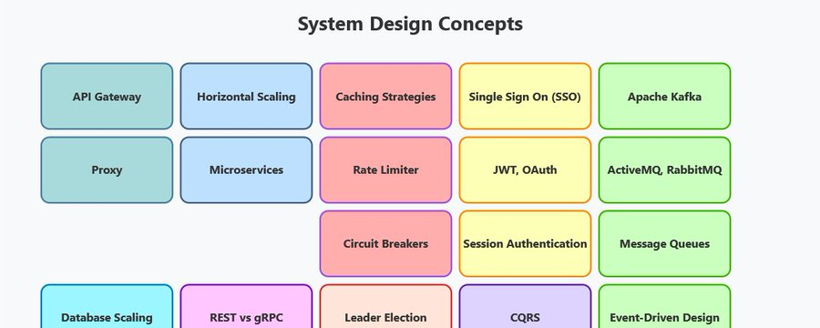
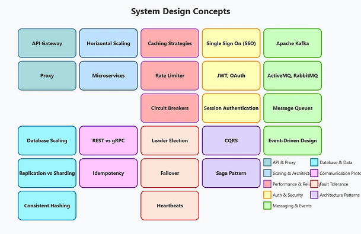
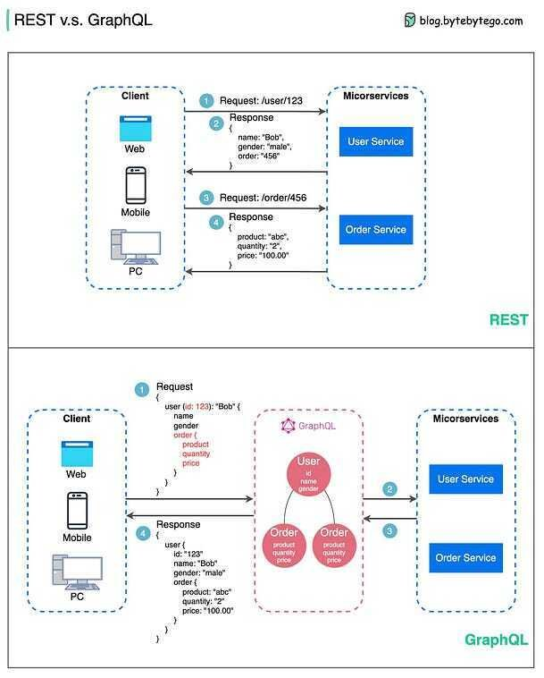
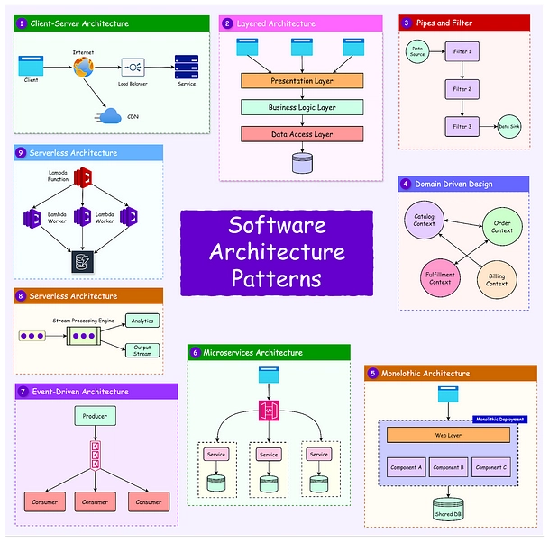
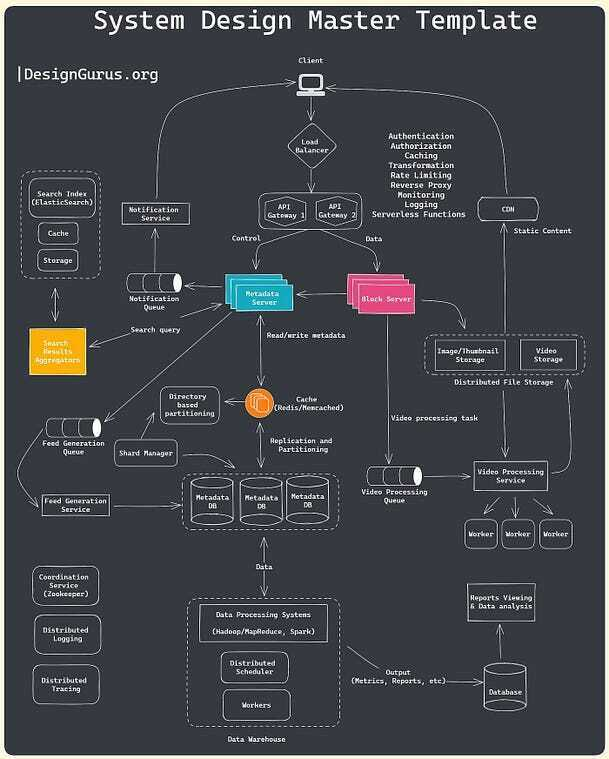
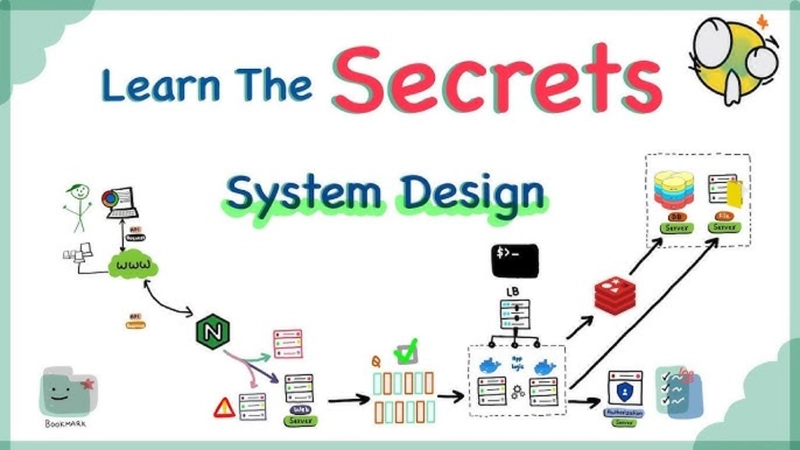
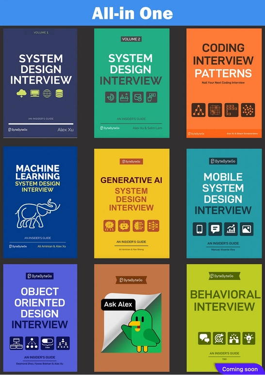

如果你正在准备软件工程师面试，就会面临两个主要挑战：数据结构与算法（DSA）和系统设计。想要通过 FAANG 级别的面试，必须做好系统设计方面的准备，因为这正是大多数人遇到困难的地方。

即使是经验丰富的工程师，也常常在回答"如何设计 WhatsApp 或 YouTube"这类常见问题时感到困难，或者无法清楚地解释 API Gateway 与 Load Balancer、横向扩展与纵向扩展、正向代理与反向代理之间的区别。

回顾我自己学习系统设计的经历，走了不少弯路。我通过阅读博客、Medium 文章、参加课程、观看 YouTube 视频、阅读书籍和白皮书等各种方式学习。

虽然这些方法确实帮助我学会了系统设计，但这显然不是最好或最有条理的学习方式，我不建议其他人这样做，尤其是当你即将面临面试的时候。

如果让我从头开始学习系统设计，我会采用循序渐进的方法，涵盖基本概念、实际应用和权衡取舍。

系统设计一开始可能让人感到不知所措，因为它的范围很广，但如果将它分解成小块来学习，你会惊讶地发现它并没有看起来那么庞大。

顺便说一下，如果你正在准备系统设计面试并想深入学习系统设计，可以看看 ByteByteGo、DesignGuru、Exponent、Educative、bugfree.ai 和 Udemy 这些平台，它们有很多优秀的系统设计课程。

## 学习系统设计的方法

下面我整理了一个学习框架，重点关注核心概念、构建模块、数据库、权衡取舍和架构模式。

### 1. 从核心概念开始

系统设计的基础建立在理解可扩展性、可用性和容错性等核心概念之上。这些概念是设计高效、可靠和可扩展系统的基础。

**可扩展性**：理解纵向扩展与横向扩展的区别，以及何时使用每种方式。

**可用性**：学习如何设计具有最小停机时间的系统（例如，主主架构与主备架构）。

**CAP 定理**：探索分布式系统中一致性、可用性和分区容错性之间的权衡。

**延迟与吞吐量**：掌握低延迟和高吞吐量之间的差异，以及它们如何影响用户体验。

**容错性**：学习冗余和副本等技术，确保系统在出现故障时仍能继续运行。

💡 **学习资源**：可以参加 Alex Xu 的 ByteByteGo 或"Grokking the System Design Interview"这样的综合课程，或者阅读 Netflix 和 Google 等公司的真实案例研究，了解他们如何实现这些概念。

### 2. 掌握系统设计的构建模块

一旦基础概念清晰，就要关注构成系统设计骨干的构建模块。

**内容分发网络（CDN）**：了解 CDN 如何通过将内容缓存到离用户更近的位置来降低延迟。

**负载均衡**：理解轮询、最少连接和 IP 哈希等负载均衡算法。

**缓存**：深入研究缓存策略、缓存淘汰策略和分布式缓存。

**消息队列**：探索队列如何解耦系统并实现异步通信。

**熔断器**：学习它们如何防止分布式系统中的级联故障。

**API 网关**：了解其在管理 API、限流和处理跨域资源共享（CORS）中的作用。

💡 **实践建议**：观看面向面试的系统设计课程，如"Grokking Modern System Design for Software Engineers & Managers"，或者构建一个小项目（例如聊天应用），看看负载均衡、缓存和 API 网关如何协同工作。

### 3. 深入了解数据库

数据库是每个系统的核心。知道如何选择和设计数据库至关重要。

**SQL 与 NoSQL**：理解两者的区别以及何时使用。

**数据库索引**：学习索引如何加快查询性能。

**数据库分片**：探索跨多个节点分布数据的策略。

**副本与扩展**：理解如何复制数据库以提高可用性，以及如何扩展以提高性能。

**ACID 事务**：学习原子性、一致性、隔离性和持久性的重要性。

💡 **练习题**：为大型电商应用设计一个模式，并尝试分片和副本，也可以查看 DesignGurus.io 上的 Grokking the Advanced System Design 课程，获取更多此类主题。

### 4. 理解关键权衡

系统设计通常涉及权衡取舍。学会评估它们对于构建高效系统至关重要。

**强一致性与最终一致性**：研究每种情况对银行系统和社交媒体等真实应用的影响。

**同步与异步通信**：理解何时使用同步 API 和异步队列。

**批处理与流处理**：学习 Apache Hadoop（批处理）和 Apache Kafka（流处理）等系统之间的区别。

**有状态与无状态设计**：探索无状态系统如何更好地扩展，以及为什么有状态系统在某些情况下仍然必不可少。

💡 **实际案例**：分析设计 API 时 REST 和 gRPC 之间的权衡。ByteByteGo 用很好的图表解释了这类概念。

### 5. 学习系统设计架构模式

架构模式为设计系统提供了蓝图。它们指导组件如何交互和扩展。

**客户端-服务器架构**：学习基本的两层架构及其局限性。

**微服务架构**：理解如何将单体应用拆分为更小的、可独立部署的服务。

**无服务器架构**：探索使用 AWS Lambda 或 Azure Functions 的事件驱动架构。

**事件驱动架构**：学习事件如何驱动电商和物联网等系统中的工作流程。

**点对点（P2P）架构**：研究像 BitTorrent 或区块链这样的去中心化系统。

💡 **项目创意**：使用事件驱动和微服务架构的组合设计一个类似 Uber 的系统。你可以在 codemia.io 上练习此类问题，这是一个很好的系统设计练习平台。

### 6. 动手实践学习

掌握系统设计的最佳方式是构建真实系统。从小处开始，逐步增加设计的复杂性。

**基础项目**：设计一个 URL 缩短服务（学习哈希、数据库和可扩展性）。

**中级项目**：构建一个类似 Twitter 的应用（探索 API 设计、限流和缓存）。

**高级项目**：设计一个网约车服务（专注于基于位置的系统、分布式数据库和容错性）。

💡 **模拟面试**：在 Pramp、Designgurus.io 或 InterviewKickStart 等平台上与同行进行系统设计面试，以增强信心。

### 7. 学习真实世界的系统

研究 Netflix、Facebook 和 Google Drive 等系统的架构。分析它们如何应对扩展、高可用性和容错性等挑战。

💡 **学习资源**：查看 ByteByteGo、Tech Dummies 和 System Design Simplified 等 YouTube 频道，了解真实架构的详细分析。

### 8. 使用结构化学习资源

最后，通过精选的课程、书籍和博客来补充你的学习。

**书籍**：Martin Kleppmann 的《Designing Data-Intensive Applications》或 Alex Xu 的《System Design Interview Inside Guide》

**课程**：Alex Xu 的 ByteByteGo 或 Exponent 的系统设计课程

**博客**：查看 Medium、GitHub 和 Educative.io 等教育平台上的文章。

## 总结

如果让我重新开始，我会优先理解基本概念，掌握核心构建模块，并通过实践项目学习。系统设计既需要实践，也需要理论。

通过构建、分析和实验，你将培养出自信应对复杂设计问题所需的直觉。

你学习系统设计的方法是什么？欢迎在评论中分享你的想法！

附：你还可以在 Codemia.io 和 Bugfree.ai 等平台上练习系统设计问题，这两个平台就像系统设计领域的 LeetCode，极大地帮助我提升了对设计分布式系统的知识和理解。
