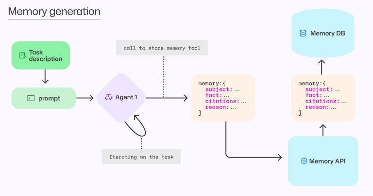

> 本文介绍 GitHub Copilot 的跨智能体记忆系统，让智能体能够在整个开发工作流程中学习和改进，从编码、代码审查到安全、调试、部署和维护。

## 为什么需要记忆系统

GitHub 的愿景是将 Copilot 发展成一个智能体生态系统，这些智能体能够在整个开发生命周期中协作。为了释放多智能体工作流的全部潜力，需要超越每次会话从头开始的孤立交互，转向随着使用而增长的累积知识库。

跨智能体记忆使智能体能够记住并学习整个开发工作流程中的经验，无需依赖显式的用户指令。每次交互都会让 Copilot 更多地了解代码库和约定，随着时间推移变得越来越有效。

### 实际应用场景

- 如果 Copilot 编码智能体在修复安全漏洞时学习了仓库如何处理数据库连接，Copilot 代码审查就可以使用这些知识在未来的 PR 中发现不一致的模式
- 如果 Copilot 代码审查注意到某些文件必须保持同步，未来 Copilot 编码智能体在生成新代码时会自动一起更新它们

## 核心挑战：记住什么和何时忘记

智能体持续改进提取特定任务所需上下文的能力。记忆系统的核心挑战不是信息检索，而是确保任何存储的知识在代码跨分支和时间演变时保持有效。

实际上，这意味着记忆系统必须处理代码更改、废弃的分支和冲突的观察结果，同时确保智能体只对与当前任务和代码状态相关的信息采取行动。例如，在一个分支中观察到的日志约定可能随后被修改、取代，或者根本没有合并。

## 解决方案：即时验证

信息检索是一个不对称的问题：难以解决，但容易验证。通过使用实时验证，我们获得了预存储记忆的能力，同时避免了过时或误导性信息的风险。

### 记忆创建作为工具调用

记忆创建被实现为一个工具，当智能体发现可能对未来任务具有可操作意义的内容时可以调用它。



考虑这个例子：在审查经验丰富的开发人员的 PR 时，Copilot 代码审查发现 API 版本跟踪必须在代码库的不同部分保持同步。它可能在同一个 PR 中遇到三处更新：

- 在 `src/client/sdk/constants.ts` 中
- 在 `server/routes/api.go` 中
- 在 `docs/api-reference.md` 中

作为响应，Copilot 代码审查可以调用记忆存储工具创建这样的记忆：

```json
{
  "subject": "API 版本同步",
  "fact": "API 版本必须在客户端 SDK、服务器路由和文档之间保持匹配",
  "citations": [
    "src/client/sdk/constants.ts:12",
    "server/routes/api.go:8",
    "docs/api-reference.md:37"
  ],
  "reason": "如果 API 版本未正确同步，集成可能失败或出现细微错误。记住这些位置将有助于确保它们在未来更新中保持同步"
}
```

结果：下次智能体在任何这些位置更新 API 版本时，它会看到这个记忆并意识到必须更新其他位置，防止可能破坏集成的版本不匹配。

### 记忆使用

**检索**：当智能体开始新会话时，系统会检索目标仓库最近的记忆并将它们包含在提示中。

**验证**：在应用任何记忆之前，智能体被提示通过检查引用的代码位置来验证其准确性和相关性。如果代码与记忆矛盾，或者引用无效（例如指向不存在的位置），智能体会存储反映新证据的更正版本。

**隐私和安全**：记忆的作用域严格限定。给定仓库的记忆只能由具有写入权限的贡献者在该仓库内的操作中创建，并且只能在具有读取权限的用户发起的该仓库任务中使用。就像源代码本身一样，关于仓库的记忆保留在该仓库内，确保隐私和安全。

### 跨智能体记忆共享

当不同的 Copilot 智能体相互学习时，记忆系统的全部威力就会显现：

1. Copilot 代码审查在审查 PR 时发现日志约定："日志文件名应遵循 'app-YYYYMMDD.log' 模式。使用 Winston 进行日志记录，格式包括：时间戳、错误代码、用户 ID"
2. Copilot 编码智能体随后被分配实现新微服务的任务，它看到并验证记忆，自动应用相同的日志格式
3. Copilot CLI 帮助开发人员调试问题，根据代码审查智能体学到的日志格式，高效检索正确的日志文件并找到相关时间戳

## 评估结果

### 压力测试智能体韧性

团队最大的担忧是过时、不正确甚至恶意注入的记忆的影响。为了测试系统的韧性，他们故意在仓库中植入对抗性记忆——与代码库矛盾的事实，引用指向无关或不存在的代码位置。

在所有测试案例中，智能体始终验证引用，发现矛盾并更新不正确的记忆。记忆池随着智能体基于观察存储更正版本而自我修复。引用验证机制有效防止了误导性记忆的风险。

### 模拟真实记忆池

对于评估集中的每个仓库，团队在各种历史任务上运行智能体，让它们使用提供的 "store_memory" 工具有机地填充记忆数据库。为了模拟最坏情况，他们过度代表来自废弃或未合并分支的记忆，确保现实的噪声记忆。

当在评估集的 PR 上运行 Copilot 代码审查时，记忆使用导致：

- **精确度提高 3%**
- **召回率提高 4%**

### 对开发人员的影响

记忆系统的最终测试是对实际开发人员日常工作流程的影响。团队对前两个部署记忆的 Copilot 智能体进行了 A/B 测试，测量对关键用户指标的影响：

- **Copilot 编码智能体**：PR 合并率提高 7%（有记忆 90% vs 无记忆 83%）。这意味着当开发人员向 Copilot 分配任务时，他们更频繁地节省时间并获得期望的结果
- **Copilot 代码审查**：正面反馈提高 2%（有记忆 77% vs 无记忆 75%）。这意味着自动化代码审查产生了更好的质量保证
- 两项增长均具有高度统计显著性，p 值 < 0.00001

这些结果表明，跨智能体记忆为开发人员的日常工作流程提供了可衡量的价值。

## 当前状态与未来展望

GitHub 已在 Copilot CLI、Copilot 编码智能体和 Copilot 代码审查中以选择加入的方式部署了仓库范围的记忆存储和使用功能，适用于所有付费 Copilot 计划。该功能默认关闭且完全可选，因此你可以决定何时何地 Copilot 应该开始从工作流程中学习。

团队正在密切关注用户反馈和性能指标，同时迭代并准备在更多 Copilot 工作流程中进行更广泛的推出。他们还在探索一系列方法来调整记忆生成、管理、优先级排序和使用。

跨智能体记忆通过允许经过验证的信息在智能体工作流程中持久存在，减少了在每个任务开始时重新建立上下文的需要。这只是开始，GitHub 期待你的反馈，以确保 Copilot 继续以最好地支持你需求的方式发展。

## 参考资源

- [GitHub Copilot 记忆功能文档](https://docs.github.com/copilot/concepts/agents/copilot-memory)
- [如何启用记忆功能](https://docs.github.com/copilot/how-tos/use-copilot-agents/copilot-memory)
