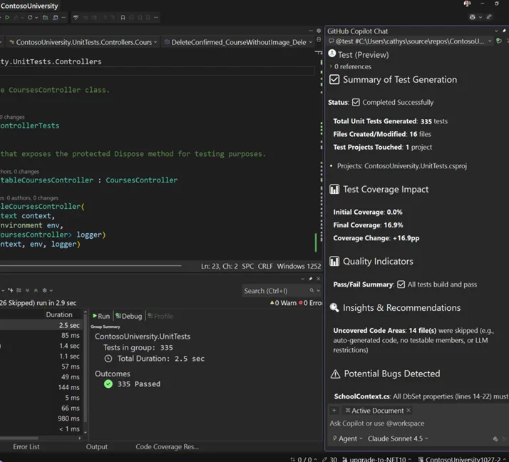
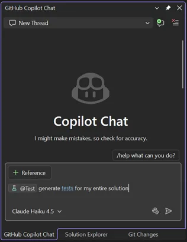
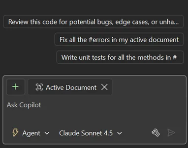
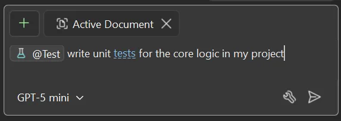
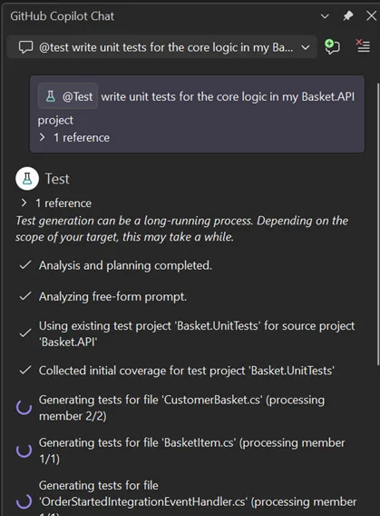
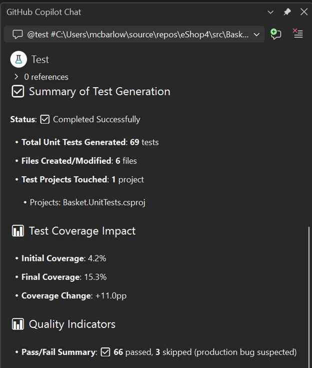

# Visual Studio 2026 中 GitHub Copilot 测试功能正式发布：为 .NET 开发带来 AI 驱动的单元测试

GitHub Copilot 测试功能现在可以让开发者在不离开代码编辑器的情况下，更快速、更便捷地生成高质量单元测试。今天，微软很高兴地宣布这项功能现已在 Visual Studio 2026 v18.3 正式发布。

这次发布为所有用户带来了 GitHub Copilot .NET 测试能力，提供了更深度的 IDE 集成、更自然的提示方式，以及让单元测试生成变得轻松直观的新入口。

基于真实使用场景和用户反馈，这次正式版本专注于消除使用障碍，帮助开发者只需几次交互就能从编写代码到完成测试验证。如果你在 Visual Studio Insiders 版本中尝试过这个功能，本次发布直接采纳了你的反馈。如果你是第一次使用，现在正是最好的开始时机。

## 专为单元测试打造的 AI

GitHub Copilot .NET 测试功能专门为单元测试而设计，内置了对解决方案结构、测试框架和构建系统的感知能力。它作为端到端的测试工作流运行，不仅仅是单次响应的提示。

你可以在对任务有意义的范围内生成测试，无论是单个成员、类、文件、整个项目、完整解决方案，还是当前的 git diff。GitHub Copilot 测试会根据这个范围来决定生成什么、如何组织测试，以及如何在 Visual Studio 中执行它们。该代理还可以与你在 Copilot Chat 中选择的任何模型配合使用，让你能够使用首选模型，同时利用专门构建的测试工作流。

当你开始测试请求时，GitHub Copilot 测试会：

- 生成针对你选定代码的单元测试
- 自动构建并运行这些测试
- 检测失败并尝试修复
- 重新运行直到获得稳定的起点

在整个过程中，代理会使用你的项目配置和选定的测试框架，确保测试在 Visual Studio 中被正确组织、发现和执行。

测试生成完成后，Copilot 会提供结构化摘要，帮助你了解发生了什么变化：

- 创建或修改的测试文件和项目
- 前后对比的覆盖率信息
- 通过/失败信号和不稳定的情况
- 对可测试性缺口的洞察
- 直接链接到生成的测试，以便你可以立即查看和迭代

这种方式缩短了编写代码和验证代码之间的反馈循环，帮助你充满信心地前进。所有这些都由你与代理的交互方式驱动。第一步就是简单地告诉 GitHub Copilot 你想测试什么。

## 更自然的自由格式提示

GitHub Copilot .NET 测试现在支持自由格式提示，让你更容易用自己的话描述想要测试的内容。你仍然使用 `@Test` 来调用测试代理，但不再局限于固定的命令格式。

你可以使用自然语言编写提示，代理会理解你的意图，同时在后台处理测试生成、执行和恢复。

### 使用自由格式提示，你可以

- 精确或模糊地引用任何代码
  - "`@Test` 为我的核心业务逻辑生成单元测试"
  - "`@Test` 类 Foo"
  - "`@Test` 请求解析逻辑"
- 提到当前的 Git 更改
  - "`@Test` 为我当前的更改编写单元测试"
  - "`@Test #git_changes`"
- 要求修复特定或所有失败的测试
  - "`@Test` 修复我失败的测试"
- 要求达到特定的目标代码覆盖率
  - "`@Test` 类 Bar，目标覆盖率 80%"
- 指定测试偏好和约定
  - "`@Test` 使用 xUnit 和 FluentAssertions 生成测试"

对于需要明确范围的场景，仍然支持结构化语法：

- `@Test #<target>`
  - 其中 `<target>` 可以是成员、类、文件、项目、解决方案或 git diff

这种提示灵活性让表达意图变得更容易，无论你是想扩展覆盖率、稳定失败的测试，还是生成符合团队现有约定的测试。

## 在你工作的地方遇见你的新入口

GitHub Copilot .NET 测试设计得易于查找和使用，因此生成单元测试可以自然地融入你现有的开发工作流。

你始终可以通过在 Copilot Chat 中以 `@Test` 开始提示来直接调用测试体验。此外，新的入口点从 IDE 中熟悉的位置展现相同的工作流，帮助你发现和使用该功能，无需改变工作方式。

### 在编辑器中右键点击

- 右键点击 → Copilot Actions → Generate Tests
- 范围从你右键点击的位置推断，遵循与其他 Copilot Actions 相同的行为（例如成员、类或文件）
- 该命令将为 C# 项目启动专用测试体验，并自动应用适当的 `@Test` 上下文

### Copilot 聊天破冰提示

- 当编辑器焦点在 C# 代码上时，选择与编写单元测试相关的提示会启动测试代理
- 提示会自动填充 `@Test`，默认范围为你的活动文档

## 快速开始

前提条件：Visual Studio 18.3、C# 代码和付费的 GitHub Copilot 许可证。

1. 在 Visual Studio 18.3 中打开你的 C# 项目或解决方案，并确保它可以无错误构建，以简化流程。

2. 开始新的 Copilot Chat 对话，并以 `@Test` 开始你的提示。你可以使用自然语言或上述结构化语法来定义请求。

3. 在 Chat 窗口中，选择发送。GitHub Copilot .NET 测试将启动迭代过程。Copilot 会分析你的代码，如果不存在则创建测试项目。然后生成测试、构建并运行它们，全部自动完成。

4. 测试资源管理器显示测试生成时的结果。如果测试资源管理器没有自动打开，你可以选择 Test → Test Explorer 来打开它。

5. 测试生成完成后，GitHub Copilot 测试会在 Copilot Chat 中提供摘要。

更多使用信息，请查看[快速入门文档](https://learn.microsoft.com/visualstudio/test/unit-testing-with-github-copilot-test-dotnet?view=visualstudio)。

## 下一步计划

GitHub Copilot .NET 测试的正式发布反映了我们从开发者在真实项目中使用该体验所学到的东西。早期使用的反馈直接影响了提示、可发现性以及测试工作流如何融入日常开发的改进。

正式发布是一个重要的里程碑，但这不是旅程的终点。我们继续进行用户研究并收集反馈，以了解开发者如何在真实场景中使用 GitHub Copilot .NET 测试，特别是当请求在规模和复杂性上增长时。

我们正在积极探索的一个领域是为更高级的测试请求提供计划阶段。对于更大的范围或更具体的要求，开发者希望预先获得更大的控制权，包括澄清意图、确认假设以及在生成测试之前查看建议的计划的能力。我们正在研究如何将这种体验直接集成到 Visual Studio 中，以更好地支持复杂的工作流和精确的需求。

如果你有机会尝试该工具，我们很乐意通过[这个调查](https://www.surveymonkey.com/r/QMBPQ7B)听到你的想法，包括对今天体验的反馈以及你希望看到这项功能的未来发展方向，包括 Visual Studio 之外的方向。

## 提供反馈

随着 AI 继续影响开发者构建和验证软件的方式，我们的重点仍然是让这些功能实用、可预测，并很好地集成到你已经使用的工具中。

如果你还没有尝试，请在 Visual Studio 18.3 中试用 GitHub Copilot .NET 测试，并告诉我们你的想法！你可以使用 Visual Studio 中的"提供反馈"按钮告诉我们什么运行良好以及我们可以在哪些方面继续改进。你的反馈非常宝贵，直接影响未来的产品决策。
