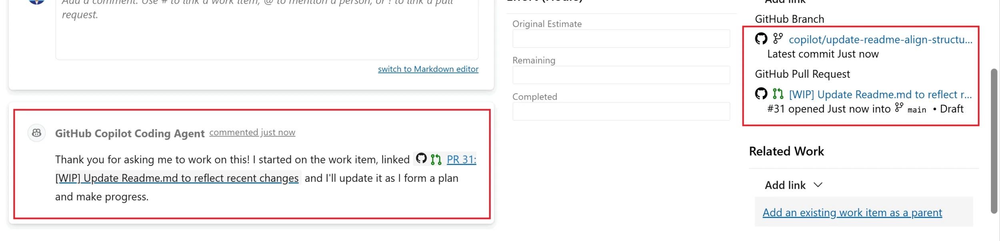
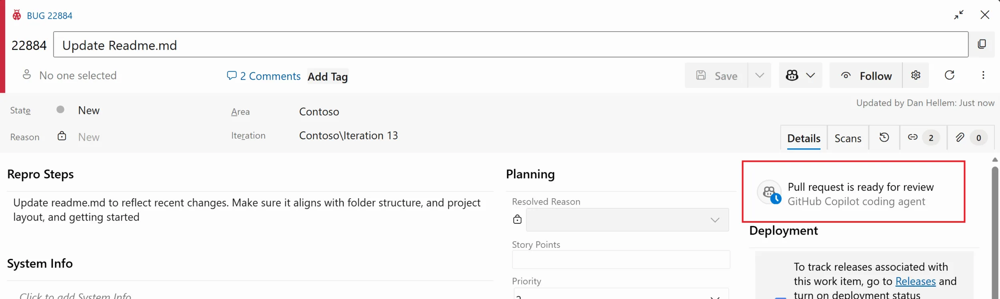
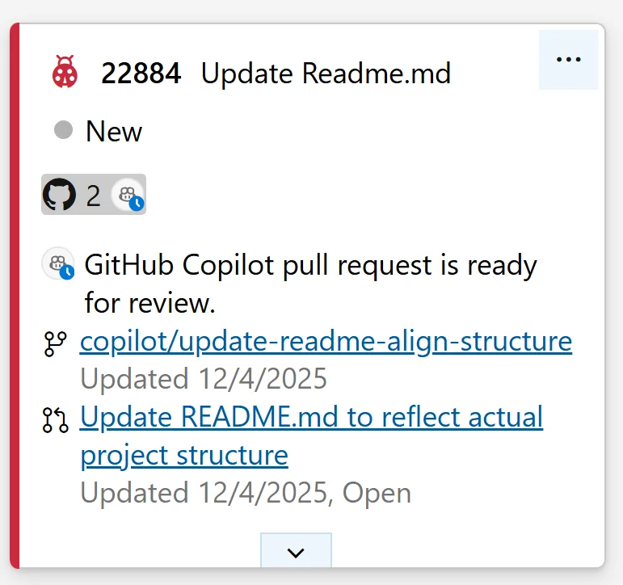

几个月前，微软推出了 Azure Boards 与 GitHub Copilot 集成的私有预览版。目标很简单：允许团队将 Azure Boards 上的工作项直接发送给 GitHub Copilot 编码代理，由它来开始编码、跟踪进度并生成拉取请求。

现在，这项集成功能已正式面向所有用户发布（GA）。参与预览的客户帮助团队验证了使用体验、发现了问题并推动了改进。GA 版本包含了预览期间的所有工作流，以及基于客户反馈新增的功能。

## 工作流程

第一步是在工作项的描述（或其他大型文本字段）中提供清晰的说明。

接下来，点击工作项上的 Copilot 按钮，选择"使用 GitHub Copilot 创建拉取请求"，然后选择目标仓库、分支，并根据需要添加额外说明。

点击创建后，工作项会被发送给 Copilot 编码代理开始处理。系统会传递所有大型文本字段中的相关内容（如描述或重现步骤），以及最近的 50 条评论。编码代理随后生成一个分支和一个草稿拉取请求，该请求会自动链接回工作项，实现完整的可追溯性。

根据请求变更的复杂程度，编码代理可能需要一些时间来创建和执行计划。工作完成后，状态会在工作项和看板卡片上更新，同时系统会在讨论区添加一条评论，通知你拉取请求已准备好接受审查。

之后，就由你来审查拉取请求，并直接在 GitHub 中进行交互了。

## 使用前提

在从工作项与 GitHub 编码代理交互之前，需要满足以下条件：

1. 代码仓库必须托管在 GitHub 上。
2. 必须启用 Azure Boards 与 GitHub 的集成，并将仓库连接到你的 Azure DevOps 项目。[了解更多](https://learn.microsoft.com/en-us/azure/devops/boards/github)
3. 连接到 Azure DevOps 项目的仓库必须启用 Copilot 编码代理。如果你是 GitHub Copilot Enterprise 或 Business 订阅者，编码代理默认关闭，需要管理员手动开启。如果你是 GitHub Copilot Pro 或 Pro+ 订阅者，编码代理默认已启用。[了解如何启用编码代理](https://docs.github.com/en/copilot/concepts/coding-agent/enable-coding-agent)
4. 前往已安装的 GitHub App 页面，更新 Azure Boards 应用以批准最近的权限变更，这样 Azure Boards 应用才能与 GitHub Copilot 通信。

## 新功能

此次正式发布带来了两项新功能。

**分支选择**：在预览期间，Copilot 总是以仓库的默认分支为目标。现在你可以选择 Copilot 生成代码变更时使用的分支，方便团队在长期运行的功能分支或独立的发布分支上工作。

**看板卡片上的 Copilot 状态**：看板上的工作项卡片现在会直接显示 Copilot 的活动状态。你可以快速查看哪些工作项正在被 Copilot 处理，哪些已经有拉取请求等待审查，无需打开工作项即可跟踪进度。

## 即将推出

团队还在开发两项增强功能，将在 GA 初始发布之后交付。

首先，目前集成使用的是默认编码代理和模型，未来拥有自定义代理的组织将能够选择创建草稿拉取请求时使用哪个代理和模型。

其次，计划增加 REST API 支持，允许你创建工作项并直接将其发送给编码代理。这将实现完全自动化的工作流，例如通过 MCP Server 生成工作项并立即触发 Copilot 开始工作。

## 发布计划

该功能现已作为正式版本逐步发布，将在各组织间分阶段上线。由于假期因素，发布速度比平时稍慢，团队以小批次方式启用该功能以监控性能和确保稳定性。部分客户会立即看到该功能，其余客户可能要到 2026 年 2 月初才能使用。
