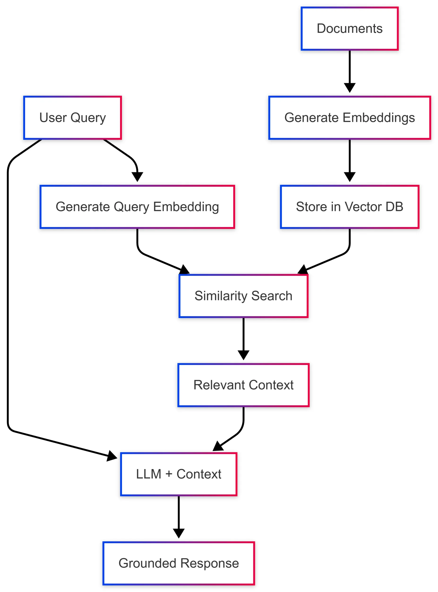

在[系列第一篇](https://devblogs.microsoft.com/dotnet/dotnet-ai-essentials-the-core-building-blocks-explained/)中，我们了解了 Microsoft Extensions for AI（MEAI）如何统一 LLM 的访问方式。但大多数实际应用不可能只靠一段简单的提问和一个小型上下文文件运作。你可能希望 LLM 能查阅所有产品手册来协助排查客户问题，或者把员工手册喂给 HR 聊天机器人。

这就引出了第二个构建模块：`Microsoft.Extensions.VectorData`。

## 向量和语义搜索是怎么回事

智能应用中一个高频需求是语义搜索（Semantic Search）。和传统的关键字匹配不同，语义搜索理解查询的含义。它通过把文本转换成 embeddings（一组捕获语义信息的数值），再利用向量之间的关系来找到最相关的结果。

假设数据库里有三条记录：

- Hall pass（通行证）
- Mountain pass（山口）
- Pass（动词，传递）

传统搜索碰到 "How do I get over the pass?" 和 "Where do I pick up a pass?" 这两个查询，都会匹配到全部三条记录，因为它们都包含 "pass" 这个词：

```text
"How do I get over the pass?"
How | do | I | get | over | the | pass
Pass - 匹配所有三条记录

"Where do I pick up my pass?"
Where | do | I | pick | up | my | pass
Pass - 匹配所有三条记录
```

但如果用 embedding 编码语义，结果就完全不同了。嵌入模型会根据上下文理解 "pass" 在不同场景下的含义：

```text
"How do I get over the pass?"
0 | 5 | etc. | 2
2 - 匹配第 2 条记录 "Mountain pass"

"Where do I pick up my pass?"
6 | 9 | etc. | 1
1 - 匹配第 1 条记录 "Hall pass"
```

embedding 模型经过训练，能通过一个词前后出现的相关词汇来理解它的语义。与其每次运行应用都重新生成 embeddings，把它们存到数据库中显然更合理，还能利用数据库本身的查询能力来返回结果。

向量数据库（Vector Database）就是专门为存储向量和 embeddings 设计的。Qdrant、Redis、SQL Server、Cosmos DB 都是支持向量存储的产品。和 MEAI 统一 LLM 访问一样，Vector Data 扩展为向量存储提供了通用抽象。

## 向量在 AI 应用中扮演什么角色

当你让 LLM 回答关于公司文档的问题时，模型本身并不知道你的内容。应用的典型工作流程是：

1. 把文档转换成 embeddings
2. 将 embeddings 连同原始内容存入向量数据库
3. 用同一个模型将用户查询转换成 embedding
4. 执行相似度搜索，找到最相关的文档
5. 把相关上下文和用户查询一起传给 LLM



这个模式叫做 RAG（Retrieval-Augmented Generation，检索增强生成），让模型能够基于你的特定数据给出准确、有据可查的回答。问题在于，每个向量数据库都有自己的 SDK、数据结构和查询模式。`Microsoft.Extensions.VectorData` 就是来解决这个问题的。

## 一套接口，多种向量存储

看一下直接使用 Qdrant 原生 SDK 的写法：

```csharp
var qdrantClient = new QdrantClient("localhost", 6334);

var collection = "my_collection";
await qdrantClient.CreateCollectionAsync(collection, new VectorParams
{
    Size = 1536,
    Distance = Distance.Cosine
});

var points = new List<PointStruct>
{
    new()
    {
        Id = new PointId { Uuid = Guid.NewGuid().ToString() },
        Vectors = embedding,
        Payload =
        {
            ["text"] = "Sample document text",
            ["category"] = "documentation"
        }
    }
};

await qdrantClient.UpsertAsync(collection, points);

var searchResults = await qdrantClient.SearchAsync(collection, queryEmbedding, limit: 5);
```

再看用统一抽象的版本：

```csharp
// 在 vector store 上配置一次 embedding 生成器
var embeddingGenerator = new OpenAIClient(apiKey)
    .GetEmbeddingClient("text-embedding-3-small")
    .AsIEmbeddingGenerator();

var vectorStore = new QdrantVectorStore(
    new QdrantClient("localhost"),
    ownsClient: true,
    new QdrantVectorStoreOptions { EmbeddingGenerator = embeddingGenerator });

var collection = vectorStore.GetCollection<string, DocumentRecord>("my_collection");
await collection.EnsureCollectionExistsAsync();

var record = new DocumentRecord
{
    Key = Guid.NewGuid().ToString(),
    Text = "Sample document text",
    Category = "documentation"
};

await collection.UpsertAsync(record);

var searchResults = collection.SearchAsync("find documents about sample topics", top: 5);
```

第二种写法的好处很直接：换一个 `VectorStore` 实现就能对接不同的向量数据库，业务逻辑完全不用改。

## 定义数据模型

向量数据抽象通过 Attribute 将 C# 类映射到向量数据库 schema：

```csharp
public class DocumentRecord
{
    [VectorStoreKey]
    public string Key { get; set; }

    [VectorStoreData]
    public string Text { get; set; }

    [VectorStoreData(IsIndexed = true)]
    public string Category { get; set; }

    [VectorStoreData(IsIndexed = true)]
    public DateTimeOffset Timestamp { get; set; }

    // 当 collection 或 vector store 上配置了 IEmbeddingGenerator 时，
    // 向量会自动从 Text 生成
    [VectorStoreVector(1536, DistanceFunction.CosineSimilarity)]
    public string Embedding => this.Text;
}
```

三个 Attribute 各自的职责：

- `VectorStoreKey`：唯一标识每条记录
- `VectorStoreData`：元数据字段，可用于过滤和检索
- `VectorStoreVector`：embedding 向量，指定维度和距离函数

## 操作集合

定义好数据模型后，集合操作的接口在所有向量存储上都保持一致：

```csharp
// 获取或创建集合
var collection = vectorStore.GetCollection<string, DocumentRecord>("documents");

// 检查集合是否存在
bool exists = await collection.CollectionExistsAsync();
await collection.EnsureCollectionExistsAsync();

// 插入或更新记录
await collection.UpsertAsync(documentRecord);

// 批量操作
await collection.UpsertBatchAsync(documentRecords);

// 按 key 检索
var record = await collection.GetAsync("some-key");

// 删除记录
await collection.DeleteAsync("some-key");
await collection.DeleteBatchAsync(["key1", "key2", "key3"]);
```

## 语义搜索

真正发挥威力的地方是 `SearchAsync` 方法。当 vector store 或 collection 上配置了 `IEmbeddingGenerator`，直接传查询文本就行，embeddings 会自动生成：

```csharp
// 配置了 IEmbeddingGenerator 后，embeddings 自动生成
await foreach (var result in collection.SearchAsync("What is semantic search?", top: 5))
{
    Console.WriteLine($"Score: {result.Score}, Text: {result.Record.Text}");
}
```

如果你已经有预先计算好的 `ReadOnlyMemory<float>` embedding（比如自己做了批量 embedding），也可以直接传入：

```csharp
// 直接传入预计算的 embedding 向量
ReadOnlyMemory<float> precomputedEmbedding = /* 你的 embedding */;
await foreach (var result in collection.SearchAsync(precomputedEmbedding, top: 5))
{
    Console.WriteLine($"Score: {result.Score}, Text: {result.Record.Text}");
}
```

## 过滤结果

向量相似度搜索可以和元数据过滤结合使用：

```csharp
var searchOptions = new VectorSearchOptions<DocumentRecord>
{
    Filter = r => r.Category == "documentation" &&
                  r.Timestamp > DateTimeOffset.UtcNow.AddDays(-30)
};

var results = collection.SearchAsync("find relevant documentation", top: 10, searchOptions);
```

过滤器用的是标准 LINQ 表达式，支持等值比较（`==`、`!=`）、范围查询（`>`、`<`、`>=`、`<=`）、逻辑运算符（`&&`、`||`）和集合判断（`.Contains()`）。

## 配置 Embedding 生成

推荐的做法是在 vector store 或 collection 上配置 `IEmbeddingGenerator`，这样在 upsert 和 search 时 embeddings 都会自动生成，不需要手动预处理：

```csharp
// 在 vector store 上配置 embedding 生成器
var embeddingGenerator = new OpenAIClient(apiKey)
    .GetEmbeddingClient("text-embedding-3-small")
    .AsIEmbeddingGenerator();

var vectorStore = new InMemoryVectorStore(new() { EmbeddingGenerator = embeddingGenerator });
var collection = vectorStore.GetCollection<string, DocumentRecord>("documents");
await collection.EnsureCollectionExistsAsync();

// upsert 时自动生成 embeddings
var record = new DocumentRecord
{
    Key = Guid.NewGuid().ToString(),
    Text = "Sample text to store"
};
await collection.UpsertAsync(record);

// search 时也自动生成 embeddings
await foreach (var result in collection.SearchAsync("find similar text", top: 5))
{
    Console.WriteLine($"Score: {result.Score}, Text: {result.Record.Text}");
}
```

## 实现 RAG 模式

把前面的东西串起来，这是一个用 `Microsoft.Extensions.AI` 和 `Microsoft.Extensions.VectorData` 配合实现的简化版 RAG：

```csharp
public async Task<string> AskQuestionAsync(string question)
{
    // 查找相关文档，embeddings 自动生成
    var contextParts = new List<string>();
    await foreach (var result in collection.SearchAsync(question, top: 3))
    {
        contextParts.Add(result.Record.Text);
    }

    // 从搜索结果构建上下文
    var context = string.Join("\n\n", contextParts);

    // 创建带上下文的 prompt
    var messages = new List<ChatMessage>
    {
        new(ChatRole.System,
            "Answer questions based on the provided context. If the context doesn't contain relevant information, say so."),
        new(ChatRole.User,
            $"Context:\n{context}\n\nQuestion: {question}")
    };

    // 从 LLM 获取回答
    var response = await chatClient.GetResponseAsync(messages);
    return response.Message.Text;
}
```

## 支持哪些向量数据库

`Microsoft.Extensions.VectorData` 通过官方连接器支持多种向量数据库：

| 向量存储 | NuGet 包 |
|---------|---------|
| Azure AI Search | `Microsoft.Extensions.VectorData.AzureAISearch` |
| Qdrant | `Microsoft.SemanticKernel.Connectors.Qdrant` |
| Redis | `Microsoft.SemanticKernel.Connectors.Redis` |
| PostgreSQL | `Microsoft.SemanticKernel.Connectors.Postgres` |
| Azure Cosmos DB (NoSQL) | `Microsoft.SemanticKernel.Connectors.AzureCosmosDBNoSQL` |
| SQL Server | `Microsoft.SemanticKernel.Connectors.SqlServer` |
| SQLite | `Microsoft.SemanticKernel.Connectors.Sqlite` |
| In-Memory | `Microsoft.SemanticKernel.Connectors.InMemory`（适合测试和开发） |

完整的连接器列表（包括 Elasticsearch、MongoDB、Weaviate、Pinecone 等）可以查看[官方文档](https://learn.microsoft.com/semantic-kernel/concepts/vector-store-connectors/out-of-the-box-connectors/?pivots=programming-language-csharp)。

## 为什么独立于核心 AI 扩展

你可能会问：向量数据为什么要从 `Microsoft.Extensions.AI` 中独立出来？原因很简单，不是每个智能应用都需要向量存储。聊天机器人、内容生成、分类任务这些场景，只用 LLM 抽象就够了。把向量数据独立出来，核心库可以保持轻量和专注。

当你确实需要语义搜索、RAG 或 AI Agent 的长期记忆时，加上向量数据包就行，立刻就能复用 MEAI 中已经熟悉的那套一致模式。

在下一篇中，我们会探索 Microsoft Agent Framework，看看这些构建模块如何协作来创建复杂的 Agent 工作流。相关学习资源：

- 代码示例：[AI samples repository](https://github.com/dotnet/ai-samples)
- 教程文档：[.NET AI documentation](https://learn.microsoft.com/dotnet/ai/)
- 视频讲解：[AI building blocks](https://youtu.be/qcp6ufe_XYo) | [Building intelligent apps with .NET](https://youtu.be/N0DzWMkEnzk)
