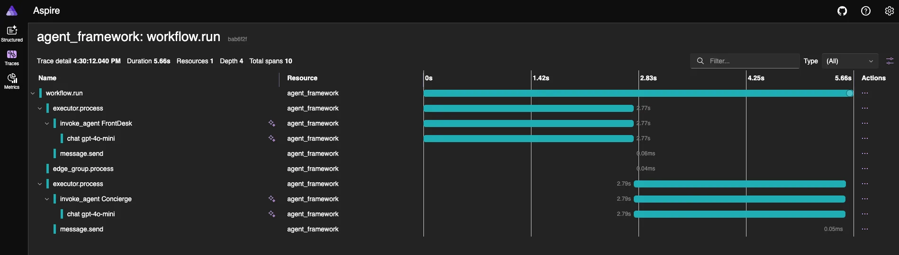

你正在用 .NET 写一个需要接入大模型的应用，手头有 OpenAI 的 SDK，也想跑一下本地的 Ollama 模型做对比。两套 SDK、两套 API 风格、两套请求响应结构，光是初始化代码就得写两遍。当你还想加上遥测、限流、内容审核这些横切关注点时，事情会变得更麻烦。

.NET 团队给出的答案是 Microsoft Extensions for AI（简称 MEAI），一个统一的 AI 抽象层。如果你用过 ASP.NET 的依赖注入和中间件管道，MEAI 的设计思路会非常熟悉。这是 .NET AI 四大基础组件系列文章的第一篇，后续还会覆盖 `Microsoft.Extensions.VectorData`（向量数据）、Microsoft Agent Framework（智能体框架）和 Model Context Protocol（MCP，模型上下文协议）。

## 一套接口，多个提供商

先看问题有多具体。用 OllamaSharp 调模型，代码长这样：

```csharp
var uri = new Uri("http://localhost:11434");
var ollama = new OllamaApiClient(uri)
{
    SelectedModel = "mistral:latest"
};
await foreach (var stream in ollama.GenerateAsync("How are you today?"))
{
    Console.Write(stream.Response);
}
```

换成 OpenAI 的 SDK：

```csharp
OpenAIResponseClient client = new("o3-mini", Environment.GetEnvironmentVariable("OPENAI_API_KEY"));

OpenAIResponse response = await client.CreateResponseAsync(
            [ResponseItem.CreateUserMessageItem("How are you today?")]
  );
foreach (ResponseItem outputItem in response.OutputItems)
{
    if (outputItem is MessageResponseItem message)
    {
        Console.WriteLine($"{message.Content.FirstOrDefault()?.Text}");
    }
}
```

两段代码做的事完全一样，但 API 形状完全不同。MEAI 引入了 `IChatClient` 接口来抹平这个差异。OllamaSharp 已经原生实现了 `IChatClient`，OpenAI 则通过适配器包 [Microsoft.Extensions.AI.OpenAI](https://www.nuget.org/packages/Microsoft.Extensions.AI.OpenAI/) 来桥接：

```csharp
IChatClient client =
    new OpenAIClient(key).GetChatClient("o3-mini").AsIChatClient();
```

拿到 `IChatClient` 之后，不管底层是哪家提供商，调用方式完全一致：

```csharp
await foreach (ChatResponseUpdate update in client.GetStreamingResponseAsync("How are you today?"))
{
    Console.Write(update);
}
```

换模型只改初始化那一行，业务逻辑一行不动。

## 结构化输出可以更简单

结构化输出让模型按你定义的 schema 返回数据，省去手动解析 JSON 的麻烦，同时也给模型提供了更多关于期望输出的上下文。用原生 OpenAI SDK 实现结构化输出，需要手动配置 `ResponseFormat`、设置 `MaxOutputTokenCount`、`Temperature` 等参数：

```csharp
class Family
{
    public List<Person> Parents { get; set; }
    public List<Person>? Children { get; set; }

    class Person
    {
        public string Name { get; set; }
        public int Age { get; set; }
    }
}

ChatCompletionOptions options = new()
{
    ResponseFormat = StructuredOutputsExtensions.CreateJsonSchemaFormat<Family>("family", jsonSchemaIsStrict: true),
    MaxOutputTokenCount = 4096,
    Temperature = 0.1f,
    TopP = 0.1f
};

List<ChatMessage> messages =
[
    new SystemChatMessage("You are an AI assistant that creates families."),
    new UserChatMessage("Create a family with 2 parents and 2 children.")
];

ParsedChatCompletion<Family?> completion = chatClient.CompleteChat(messages, options);
Family? family = completion.Parsed;
```

同样的需求，用 MEAI 的泛型扩展方法只需要：

```csharp
class Family
{
    public List<Person> Parents { get; set; }
    public List<Person>? Children { get; set; }

    class Person
    {
        public string Name { get; set; }
        public int Age { get; set; }
    }
}

var family = await client.GetResponseAsync<Family>(
    [
        new ChatMessage(
            ChatRole.System,
            "You are an AI assistant that creates families."),
        new ChatMessage(
            ChatRole.User,
            "Create a family with 2 parents and 2 children."
        )]);
```

适配器在幕后帮你搞定了 schema 生成、响应解析和反序列化。

## 标准化的请求与响应参数

你可能听说过模型的 temperature 参数。简单理解：temperature 越低，输出越确定、越贴近事实；temperature 越高，输出越随机，可能更"有创意"，但也可能出现幻觉（模型给出与事实不符或脱离上下文的信息）。

分类、摘要这类确定性任务适合低 temperature，而市场营销文案的头脑风暴可能需要高一些。MEAI 把这些参数统一收拢到 `ChatOptions` 类中，不管用哪家模型，设置方式一致。

响应端也是类似的思路。每个响应都带有 `UsageDetails` 实例，用来追踪 token 消耗量。

## 中间件管道

.NET Web 开发者对中间件管道（Middleware Pipeline）不会陌生。MEAI 把同样的模式用在了 AI 交互流程上，你可以在请求到达模型之前或响应返回之后插入自定义逻辑：

- 拦截恶意内容，阻止其发送到模型
- 限流或熔断
- 遥测和链路追踪

MEAI 内置了遥测和追踪中间件，通过熟悉的 builder 模式来配置。下面这个方法给任意 `IChatClient` 加上日志和 Open Telemetry（OTEL）事件，跟提供商无关：

```csharp
public IChatClient BuildEnhancedChatClient(
            IChatClient innerClient,
            ILoggerFactory? loggerFactory = null)
        {
            var builder = new ChatClientBuilder(innerClient);

            if (loggerFactory is not null)
            {
                builder.UseLogging(loggerFactory);
            }

            var sensitiveData = false; // true for debugging

            builder.UseOpenTelemetry(
                configure: options =>
                    options.EnableSensitiveData = sensitiveData);
            return builder.Build();
        }
```

OTEL 事件可以发送到 Application Insights 这类云服务，也可以发到 Aspire Dashboard。Aspire 已经针对智能应用做了增强，在 Dashboard 中通过"闪光"图标标识与模型交互相关的 trace。



## 多模态对话：DataContent

现在的模型不只是收发文本。越来越多的多模态模型可以接受图片、音频等格式的输入并返回类似的内容。MEAI 中文本交互用 `TextContent` 表示，同时提供了多种基于 `AIContent` 的内容类型：

- `ErrorContent`：包含错误代码的详细错误信息
- `UserInputRequestContent`：请求用户输入（包括 `FunctionApprovalRequestContent` 和 `FunctionApprovalResponseContent`）
- `FunctionCallContent`：表示工具调用请求
- `HostedFileContent`：引用 AI 服务托管的数据
- `UriContent`：Web 资源引用

实际使用最多的是 `DataContent`，它本质上就是一个带 media type 的字节数组，能表示几乎任何媒体类型。比如要把一张照片传给模型做分析：

```csharp
var instructions = "You are a photo analyst able to extract the utmost detail from a photograph and provide a description so thorough and accurate that another LLM could generate almost the same image just from your description.";

var prompt = new TextContent("What's this photo all about? Please provide a detailed description along with tags.");

var image = new DataContent(File.ReadAllBytes(@"c:\photo.jpg"), "image/jpeg");

var messages = new List<ChatMessage>
            {
                new(ChatRole.System, instructions),
                new(ChatRole.User, [prompt, image])
            };

record ImageAnalysis(string Description, string[] tags);

var analysis = await chatClient.GetResponseAsync<ImageAnalysis>(messages);
```

结构化输出和多模态输入可以组合使用，直接拿到强类型的分析结果。

## 还有什么

除了上面这些核心能力，MEAI 还提供了取消令牌支持、内置的错误处理与弹性机制、向量和嵌入的基础原语，以及图像生成相关的抽象。

这是 .NET AI 基础组件系列的第一篇。下一篇会聊向量数据扩展（`Microsoft.Extensions.VectorData`），解释为什么向量相关的功能被独立出来，之后还有 Agent Framework 和 MCP。如果想动手试试，这些资源可以跟进：

- 代码学习：[MEAI 源码仓库](https://github.com/dotnet/extensions/blob/main/src/Libraries/Microsoft.Extensions.AI.Abstractions/) 和 [MEAI 示例](https://github.com/dotnet/ai-samples/tree/main/src/microsoft-extensions-ai)
- 文档和教程：[Microsoft Extensions for AI 文档](https://learn.microsoft.com/dotnet/ai/microsoft-extensions-ai)、[构建 AI 聊天应用教程](https://learn.microsoft.com/dotnet/ai/quickstarts/build-chat-app?pivots=openai)
- 视频：[AI building blocks](https://youtu.be/qcp6ufe_XYo)、[Building intelligent apps with .NET](https://youtu.be/N0DzWMkEnzk)
