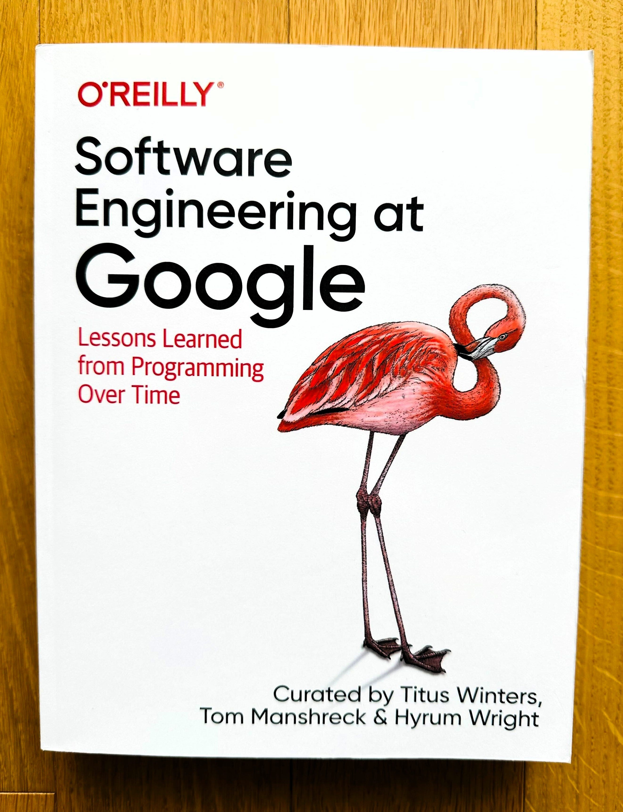
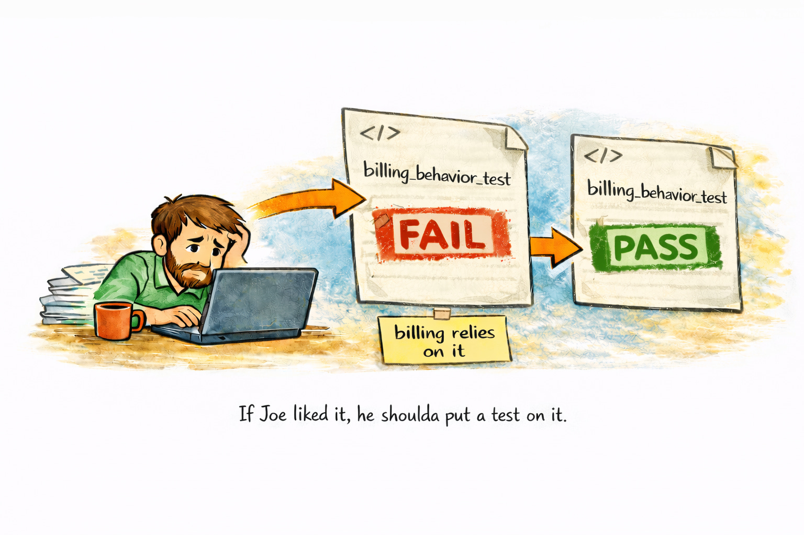
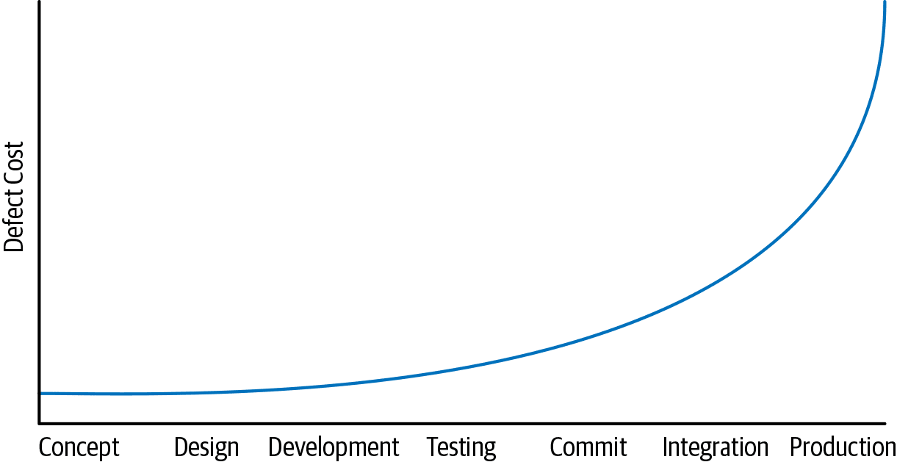
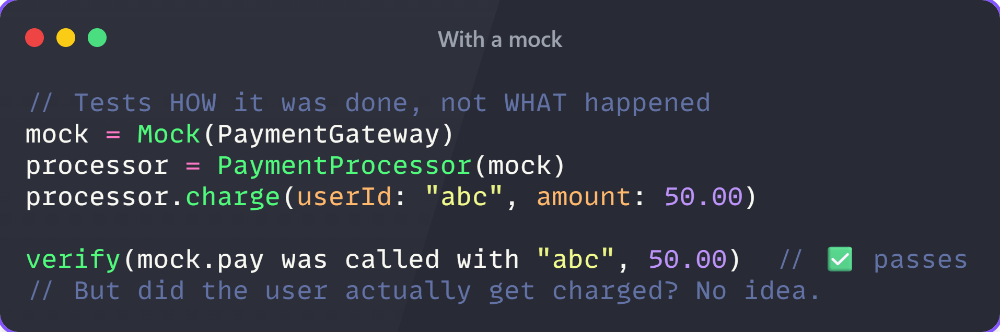
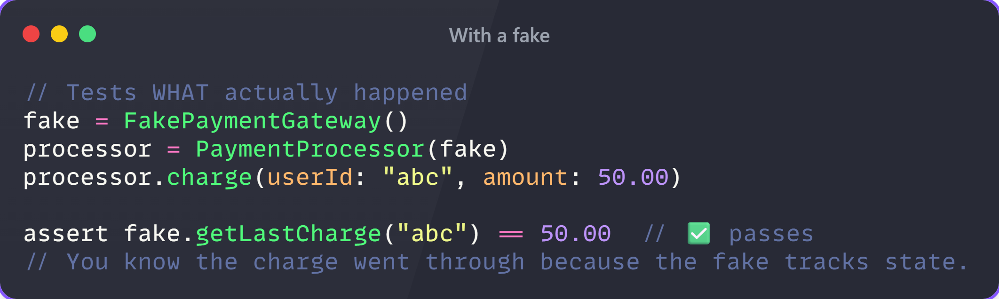
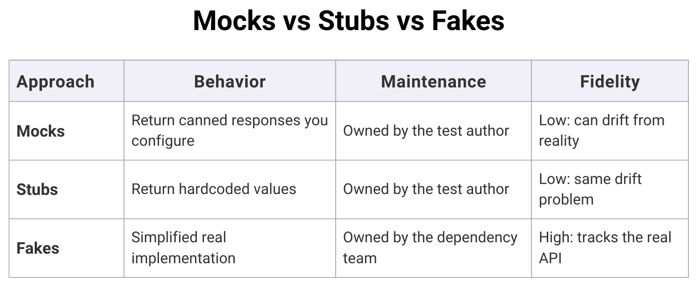
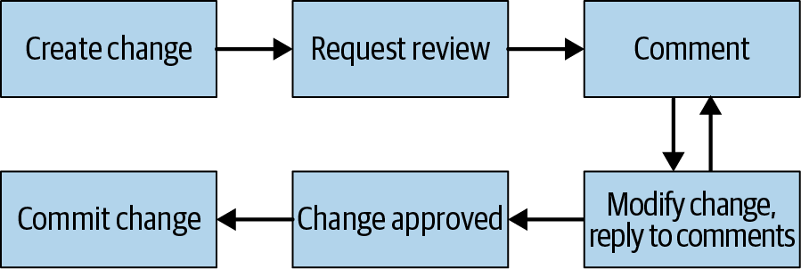
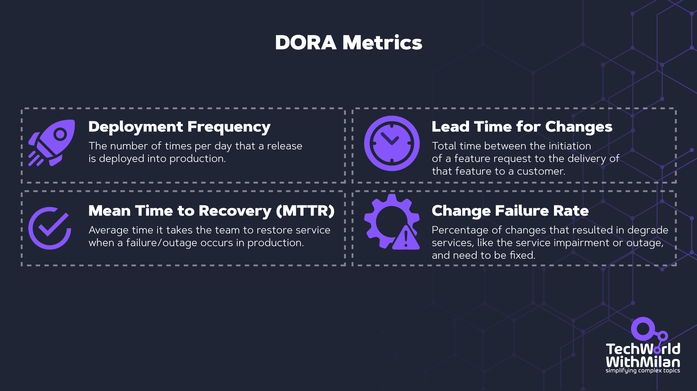
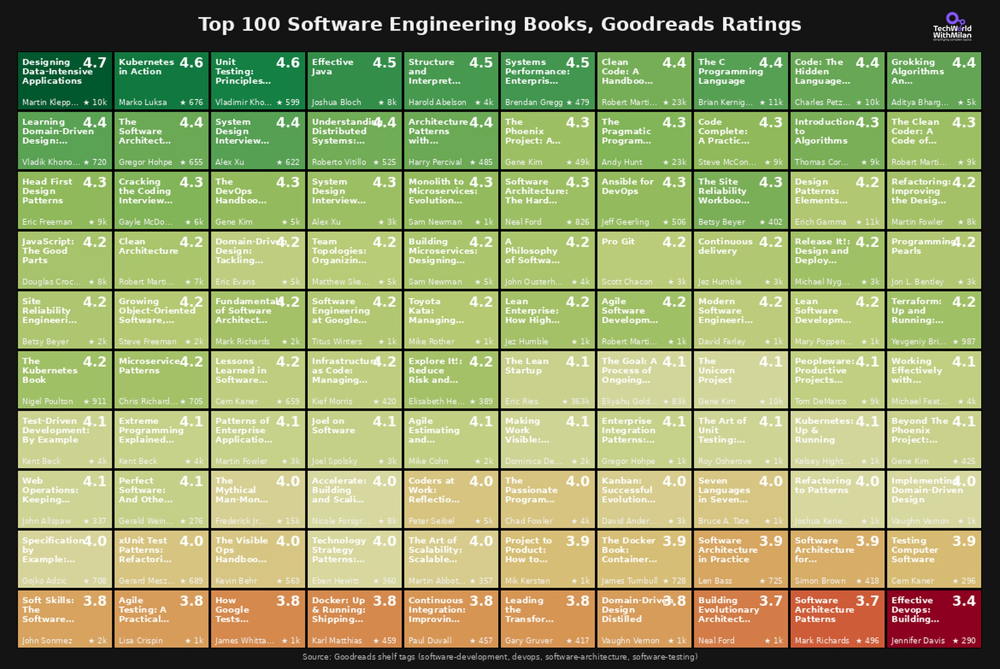

拿到《Software Engineering at Google》的时候，我以为又是一本大厂秀肌肉的书，讲的那套实践大概只有拥有十亿用户和三万工程师的公司才用得上。结果我错了。书里的经验适用于 5 人团队，也适用于 5000 人的组织。这本书来自一个管理着超过 20 亿行代码、每周变更 2500 万行的组织，积累了整整二十年。

这本书不是在教编程。它讲的是 Google 多年来用于维护一个健康代码库的工程实践。更准确地说，它关注的是写完代码之后的事情：你怎么演进它，怎么共享它，怎么测试它，以及最终怎么删掉它。

## 软件工程 ≠ 编程

这是整本书的核心观点。Titus Winters 在[第一章](https://abseil.io/resources/swe-book/html/ch01.html#software_engineering_versus_programming)就说清楚了，这个区分也彻底改变了我对自己工作的理解。我们日常把"编程"和"工程"混着用，但这两件事真的不一样。

编程（Programming）是产出代码。你拿到一个任务，写代码解决问题，测试通过，发布上线，然后去做下一件事。

软件工程（Software Engineering）是编程之前和之后发生的一切。你开始对着那段代码提问：我们为什么要做这件事？这对用户有什么影响？需求变化时这段代码怎么演进？它在技术和组织层面怎么扩展？

Titus Winters 有一句精辟的话："软件工程是编程对时间的积分。" 这句话的分量很重。每一行代码都有生命周期，而工程师的职责是考虑这个生命周期的全部成本，而不只是写代码那个最有趣的部分。

一个黑色星期五活动页面的临时脚本？那是编程。一个未来十年要处理数百万笔交易的支付系统？那需要工程。

*[Software Engineering at Google](https://abseil.io/resources/swe-book)（策划：Titus Winters, Tom Manshreck & Hyrum Wright）*

## Hyrum 定律和 Beyoncé 规则

这两个概念是我在书中最喜欢的部分，它们总是成对出现，背后有充分的理由。

### Hyrum 定律

这大概是全书被引用最多的概念。以 [Hyrum Wright](https://www.linkedin.com/in/hyrum-wright)（本书策划之一）的名字命名，它的表述是：

> 当一个 API 的用户数量足够多时，你在契约中承诺了什么已经不重要了：系统所有可观察到的行为都会被某些人依赖。

听起来很理论化，直到它咬你一口。经典案例是哈希迭代顺序。Java 的 `HashMap` API 明确声明不保证任何顺序，但当 Google 试图升级 Java 版本（导致哈希顺序变化）时，大量测试失败了。工程师们在测试中对 `HashMap` 的输出使用了 `containsElementInOrder()` 断言，有人甚至用哈希迭代顺序当低效的随机数生成器。Google 的解决方案是防御性随机化：他们修改了 JDK，让哈希迭代顺序每次运行都不同，从根本上杜绝了对未定义行为的依赖。Python 和 Go 后来也独立做了同样的事。这里的经验是：指责工程师解决不了问题，让犯错变得不可能才行。

Hyrum 定律不只在 Google 的圈子里生效。2024 年，[Recall.ai 发布了一个变更，在 S3 URL 路径前加了一个冒号](https://www.recall.ai/blog/encountering-hyrums-law-in-the-wild)。冒号在 URL 中完全合法，但客户的应用挂了，原因是一个传递性依赖（yarl 库）会自动对 URL 中的"安全"字符做 URL 解码，导致 S3 签名失效。没有人直接解析这些 URL，三层之下的一个依赖建立了一个隐式契约。

*Hyrum 定律*

Hyrum 定律本质上是软件版本的熵增。你可以缓解它，但永远无法完全消除它。用户越多，你的隐式接口（那些没人写文档但所有人都依赖的行为）就和显式接口一起增长。这就是向后兼容如此困难、破坏性变更在规模化场景下代价如此高昂的原因。

### Beyoncé 规则

这条规则很直白：如果你在乎某个行为，就该为它写测试。

假设你修了一个小 bug，没什么大不了的。但账单团队的 Joe 一直依赖那个 bug 让他的代码正常工作，现在 Joe 的东西崩了。谁的错？

Beyoncé 规则说：如果 Joe 在乎那个行为，他就应该写测试。当你的修复破坏了他的测试时，你会立刻看到："对，得顺便修一下 Joe 的代码。" 因为 Joe 测试了所有他在意的东西，你不需要理解他那堆复杂的业务就能修好它。

我们在自己的项目中也引入了这个做法：当收到带修复方案的 bug 报告时，我们先写测试来证明 bug 被修复了，测试方法的注释里包含 Jira 工单号，方便追溯。

*Beyoncé 规则*

这背后更深层的道理是关于共享所有权。在一个大型代码库中，任何人都可能改动你的代码。测试成为一种沟通机制，它们告诉整个组织哪些行为对你来说是重要的。没有测试，你就只能依赖口口相传的部落知识，而那玩意儿没法扩展。

## 左移（Shift Left）

这个概念很简单但很有力：发现问题越早，修复成本越低。

Google Web Server（GWS），也就是 Google 搜索引擎的基础设施，在 2005 年处于危机状态。超过 80% 的生产部署导致了影响用户的 bug，不得不回滚。技术负责人要求工程师强制自动化测试新代码。一年内，尽管新变更量创了纪录，bug 数减少了一半。今天的 GWS 有数万个测试，每天发布，几乎看不到客户可见的故障。

这清楚地解释了 [Google 的测试哲学](https://abseil.io/resources/swe-book/html/ch11.html)。书中推崇一个非常精简的测试金字塔：

- 约 80% 小型（单元）测试
- 约 15% 中型（集成）测试
- 约 5% 大型（端到端）测试

*Google 版 Mike Cohn 测试金字塔（来源：[Software Engineering at Google](https://abseil.io/resources/swe-book/html/ch11.html)）*

更关键的是，Google 的测试按大小（资源消耗）分类，而不是传统的单元/集成分类。小型测试在单进程、单线程中运行，不做任何 I/O、网络或磁盘访问。中型测试可以在 localhost 上使用多进程。大型测试可以跨机器运行。被优化的核心特性是速度和确定性。

不稳定测试（Flaky tests）得到了特别关注。即使在 Google 0.15% 的不稳定率下，那么大的单仓（monorepo）每天仍然产生数千个不稳定的测试。书中指出，当不稳定率达到约 1% 时，测试就彻底失去意义了，工程师不再关心测试结果，开始无视失败。

*开发者工作流时间线（来源：[Software Engineering at Google](https://abseil.io/resources/swe-book/html/ch01.html#shifting_left)）*

三项文化举措让测试在 Google 内部全面铺开。新员工入职培训将测试作为最佳实践来介绍，两年内，受过测试培训的工程师人数超过了测试文化出现之前的工程师人数：

[Test Certified](https://mike-bland.com/2011/10/18/test-certified.html) 是一个五级双年度计划，通过公开仪表盘产生的社交压力，推动了 1500 多个项目采纳测试流程。

[Testing on the Toilet](https://testing.googleblog.com/2007/01/introducing-testing-on-toilet.html) 是从 2006 年 4 月开始贴在厕所隔间里的一页纸测试建议。作者们把它形容为"所有测试倡议中持续时间最长、影响最深远的一项。"

*Google 的 Testing on the Toilet 实践（来源：[Mike Bland](https://mike-bland.com/2011/10/25/testing-on-the-toilet.html)）*

左移在实践中意味着在开发过程中加入多个质量关卡：

**静态分析**发生在编辑器里，实时发现拼写错误、错误的函数调用和类型不匹配。修复成本：秒级。

**单元测试**运行几秒钟，验证代码是否按你的预期工作。修复成本：分钟级。

**集成测试**运行几分钟，验证系统组件能否协同工作，捕获单元测试遗漏的边界情况。修复成本：一小时左右。

**代码评审**需要几小时，回答的问题是：这符合团队规范吗？方案合理吗？这也是团队知识共享最好的机制之一。修复成本：大约半天。

**QA** 需要数小时到数天。所有东西放在一起运行正常吗？修复成本：天级，甚至一周。

**生产环境中的用户**会发现你遗漏的一切，暴露你从未想象过的边界情况。修复成本：可能巨大，技术上和声誉上都是。

越往右走，修复代价越高。这就是为什么 Google 在静态分析工具（如 [Tricorder](https://abseil.io/resources/swe-book/html/ch20.html)）、快速单元测试基础设施和预提交检查上投入如此之大。目标是在人类介入之前尽可能多地发现问题。

*Critique 的 diff 视图，灰色部分是 Tricorder 的静态分析警告（来源：[Software Engineering at Google](https://abseil.io/resources/swe-book/html/ch20.html)）*

## 别用 Mock 框架

书中[第 13 章](https://abseil.io/resources/swe-book/html/ch13.html)关于测试替身（Test Doubles）的建议最出人意料：尽可能使用真实实现而非假对象（Fake）和存根（Stub），Mock 只作为最后手段。当 Mock 框架刚进入 Google 时，它们"看上去是一把万能锤子"。写出高度聚焦的测试确实很容易，但代价后来才显现：测试变成了"需要持续维护却很少能发现 bug 的东西"。钟摆现在已经摆到了另一边，很多 Google 工程师选择完全不使用 Mock 框架。

Mock 的根本问题在于它测试的是事情怎么做的，而不是实际发生了什么。一个支付处理器的 Mock 测试可能会检查 `pay()` 方法是否被用正确的参数调用了，但它无法告诉你付款是否真的成功了。Fake 则是一个跟踪状态的轻量实现，你可以调用 `processPayment()` 然后检查 `getMostRecentCharge()` 来看实际发生了什么。Google 甚至在他们的 [ErrorProne 静态分析工具](https://github.com/google/error-prone)中加入了 `@DoNotMock` 注解。当一个 API 在整个代码库中被 Mock 了数万次，它会"严重限制 API 所有者做出变更的能力"，因为 Mock 在测试中违反了 API 契约，而真实实现和 Fake 根本做不到这一点。

下面是一个 Mock 的例子：

同样的测试用 Fake 来写：

想象一下这个 Mock 在代码库中重复了一万次。每次重构只要改变了 `pay()` 的实现方式就会全部挂掉，即使支付功能仍然完好无损。

权衡在于 Fake 需要投入来构建。拥有真实实现的团队应该维护对应的 Fake，用契约测试同时验证两者。如果消费者只有几个，写 Fake 可能不值得。但对于热门 API，生产力提升是巨大的。

*Mock vs Stub vs Fake*

## 代码评审不是 Bug 过滤器

大多数团队把代码评审当质量关卡用。有人检查你的逻辑，点下批准，变更就发了。Google 不是这么玩的，这个差距比你想的要大。

书中说得很直白：检查代码正确性并非 Google 从代码评审中获得的首要收益。更大的回报在于理解力、知识共享和长期可维护性。一个能通过但没人能看懂的变更本身就是问题。看不懂的代码改不了，改不了的代码维护不了。

[评审流程](https://abseil.io/resources/swe-book/html/ch19.html#critique_googleapostrophes_code_review)比大多数团队想象的要正式：一个同事的 LGTM（这段代码正确且可理解吗？），一个代码所有者的签字（这段代码适合代码库的这个部分吗？），一个可读性批准（它遵循语言标准吗？）。一个人可以同时担任三个角色，实际上也经常如此。但拆分这些角色很重要，每个角色审视的是不同的方面，没有一个审查者需要一次性搞定所有事情。

*代码评审流程（来源：[Software Engineering at Google](https://abseil.io/resources/swe-book/html/ch19.html#critique_googleapostrophes_code_review)）*

让整个系统正常运转的两个关键：变更保持在 200 行以内，反馈在 24 个工作小时内给出。Google 三分之一的变更只涉及一个文件。小变更会被仔细阅读，大变更只会被扫一眼。人类天性如此，Google 设计了一个顺应而非对抗这个天性的系统。

最让我记住的一句话是："如果你从零开始写，你就做错了。" 代码是负债。每一行代码都是未来的维护负担。代码评审是这个现实得到执行的地方，不是作为惩罚，而是一个刚好让你慢下来的机制，让你问自己：这段代码需要存在吗？别人能看懂吗？两年后它还能撑住吗？

*Google Critique 工具（来源：[Software Engineering at Google](https://abseil.io/resources/swe-book/html/ch19.html#critique_googleapostrophes_code_review)）*

在人的层面上，书中很明确："你不是你的代码。" 对自己创造的东西产生归属感是自然的。但代码一提交评审，它就不再只属于你了。评审中的每条评论都是一件需要做的事，不是对代码的批评。即使你不同意某条评论，也要解释原因并请对方再看一遍。

书末列出了五个值得贴在墙上的实践：

**保持礼貌和专业。** 如果觉得有问题，先问，不要假设就是错误。你可能缺少上下文。如果你是作者，把每条评论当 TODO，而不是裁决。

**写小变更。** 200 行的 diff 会被认真读，2000 行的 diff 只会被批准。把变更聚焦在单个问题上，你得到的反馈才真正有用。

**写好变更描述。** 描述的第一行会出现在邮件标题、代码搜索结果和未来的调试会话中。"Fix bug" 什么都没说。用一句话解释改了什么以及为什么改。

**审查者要少。** 一个审查者几乎总是够了。审查者越多，周转越慢，责任越分散。需要第二个意见的话，明确提出。

**能自动化的都自动化。** 静态分析、格式化、测试覆盖率，机器能抓住的东西不应该浪费人类审查者的注意力。把注意力留给真正需要判断力的决策。

## 小而频繁的发布

小发布更容易管理、理解和回滚。道理就这么简单。但令人惊讶的是，仍然有大量团队把好几周的工作打包成一个巨型部署，然后花接下来三天调查哪里出了问题。

逻辑很直白：当生产环境出问题时，一个小发布能让你一眼看出是哪个变更造成的。一个包含 50 个提交的巨型发布？祝你好运。

Google 在公司范围内用每秒提交数来追踪速度。为此他们投入了大量 CI/CD 基础设施，让部署小变更变得容易。Feature flags 让他们把"部署代码"和"开启功能"分离开来，代码可以持续部署，即使功能还没准备好面向用户。

[DORA（DevOps Research and Assessment）](https://dora.dev/)的研究用数据证实了这一点：执行持续交付、每天或每小时发布的团队，在速度、质量、稳定性和开发者满意度方面全面领先。

*DORA 指标*

Titus Winters 明确[引用了 DORA](https://abseil.io/resources/swe-book/html/ch16.html#release_branches) 的研究，称其提供了因果性而非仅仅相关性的证据，证明基于主干的开发和持续交付能带来更好的技术结果。

## 尽早、快速、频繁地升级依赖

和发布的道理一样，只不过针对的是你的第三方代码。

从 4.5.8 升到 4.5.9 没什么大不了的。一个补丁版本更新，跑一遍测试就完事了。从 4.5.8 升到 4.8.0 可能需要一些改动，处理几个弃用的 API 和配置变更，但一个下午搞得定。

但从 4.5.8 升到 7.0.0？那就遭罪了。即使所有中间版本都是向后兼容的，差距本身已经大到令人崩溃。隐式接口（Hyrum 定律又来了）变化太多，升级本身已经是一个独立项目了。

书中说得很清楚："软件工程中最难的未解决问题是依赖管理。" [Google 的单仓系统](https://research.google/pubs/why-google-stores-billions-of-lines-of-code-in-a-single-repository/)在这方面帮了大忙，但对于我们其他人来说，最好的方案很简单：尽可能保持依赖最新。更小、更频繁的更新永远比更大、更少的迁移便宜。

书中一个很有力的洞察：应该由专家来做更新，而不是消费者。如果你弃用了一个函数，不要只是跟所有人说"请升级"，他们不会动的。你应该去他们的代码里自己做更新。你是最了解该改什么的人，你做得最快。其他人都得切换上下文、翻阅迁移指南、在本轮迭代中挤时间……永远不会发生。

## 度量生产力是必须的

[第 11 章](https://abseil.io/resources/swe-book/html/ch07.html)值得单独拎出来说，因为它引入了 Goals/Signals/Metrics（GSM）框架。这是整本书中最能立刻投入使用的工具之一。

在度量任何东西之前，Google 的研究团队会问一系列筛选问题：这值得度量吗？结果会改变某个决策吗？决策者信任我们将产出的数据类型吗？如果任何一个回答是"否"，就不浪费精力。在一个迷恋指标的行业里，光是这一点就够激进了。

### GSM 框架

当度量确实值得做时，他们用三个层次来组织：

**目标（Goal）**：期望的最终结果，表述中不引用任何具体指标。（"工程师写出更高质量的代码。"）

**信号（Signal）**：你怎么知道目标达成了，你想度量什么，即使你无法直接度量。（"工程师反馈他们从这个过程中学到了东西。"）

**指标（Metric）**：信号的可测量代理，你实际上度量的东西。（"报告自己在四个相关主题上有所收获的工程师比例，通过调查获取。"）

*Goals-Signals-Metrics 流程*

GSM 的威力在于它防止了"路灯效应"（Streetlight Effect），也就是度量容易度量的东西而不是真正重要的东西。从目标出发往下推导，你能确保每个指标都追溯到有意义的目的。

### QUANTS：五个维度

Google 的研究团队把生产力分成五个维度，确保改善一个维度时不会悄悄损害另一个：

| 维度 | 关注的问题 |
|---|---|
| Quality（质量） | 产出的代码质量如何？ |
| Attention（注意力） | 工程师能否进入心流状态？是否分心？ |
| iNtellectual complexity（认知复杂度） | 任务需要多少认知负荷？ |
| Tempo（节奏） | 工程师完成工作的速度如何？ |
| Satisfaction（满意度） | 工程师对工具、产品和工作的满意程度？ |

书中最尖锐的警告涉及个人度量："如果生产力指标被用于绩效评估，工程师会迅速博弈指标，指标就失去了意义。" 唯一让这些度量有效的办法是度量聚合效果，永远不度量个人。Google 的生产力研究团队专门配备了行为经济学家，用来理解激励结构并防止 Goodhart 定律腐蚀数据。

一个出人意料的发现："在 Google，我们的经验一再表明，当定量数据和定性数据不一致时，原因是定量指标没有捕捉到预期结果。"

关键收获：如果一个度量不能驱动行动，它就不值得做。每次研究结束后，Google 的团队都会准备一份具体的建议清单：一个新的工具功能、一项文档改进、一次流程变更。如果结果无法推动行动，那这次度量就是白费的。

## 文化篇：没人想谈但必须谈的事

书的[开头几章](https://abseil.io/resources/swe-book/html/part2.html)讲的是文化：团队合作、知识共享、心理安全感和领导力。正如 Titus Winters 在他的 [GOTO 演讲](https://www.youtube.com/watch?v=7zZ0u5aClAg)中所说，软件工程归根结底只关乎两件事：时间和人。我们教工程师独立写代码，但一旦他们加入团队，这就变成了一项团队运动。

有几个观点特别有共鸣：

**天才神话有毒。** 真正的成功来自团队协作，而非一个 10x 开发者。天才神话不过是不安全感的另一种表现。书中引用了 [Project Aristotle](https://rework.withgoogle.com/intl/en/guides/understanding-team-effectiveness)，Google 著名的研究项目，发现心理安全感是高效团队最关键的要素。

**"因为我说了算"是领导力的失败。** 有分歧的时候，解释你的推理。通过传授来引导人们改变决策，而不是靠权威。作为领导者，我们手里一直有权力和权威，但不应该强制行使。根据我的经验，有能力的人更愿意跟引导型的领导者（仆人式领导者）共事，而不是独裁者。

**问"蠢"问题。** Titus 描述过他在主持 C++ 标准子委员会时，会故意问看似天真的问题，确保房间里的每个人在投票前都真正重新理解了材料。展示"不知道也没关系"能创造一种人们真正学习的文化。

**把任务委派给能胜任的最初级的人**（配合适当的监督）。这直接对抗了 Fred Brooks 的"外科手术团队"模型。团队因此成长，高级工程师被释放出来去攻克下一个不可能的问题。

大多数团队的失败原因不是代码烂，而是缺乏信任。任何团队冲突往回追溯得足够远，你都会发现三样东西中有一样出了裂缝：谦逊（你觉得你的方式是唯一正确的方式）、尊重（你不再关心这个人，只关心工作），或者信任（你宁愿自己做也不愿让别人来驱动）。

**从错误中学习，用文档记录下来。** 出了事故就写事后复盘（Postmortem）。复盘不是追责，而是趁记忆还热乎的时候记录真相。里面应该包含完整的时间线、真正的根因（不是"人为错误"这类笼统说法），最后以有具体负责人和具体截止日期的行动项结尾。大多数团队在经验教训部分敷衍了事，这是个问题，因为正是这部分能让下一次事故更短。

把这些都做到位了，才能打下坚实的基础，让团队在困难时期能创造价值而不失控。

## 作者们自己承认的 Google 做不好的事

Titus Winters 对这本书的局限性相当坦诚。在一次 [GOTO 播客](https://www.youtube.com/watch?v=7zZ0u5aClAg)采访中，他说依赖管理那一章让他"做噩梦"：有很多关于什么行不通的想法，但没有清晰、便宜、可扩展的解决方案。他的指导原则是："比起一个依赖管理问题，我宁愿面对任意数量的版本控制问题。"

书中对语义化版本（Semantic Versioning）的批评很尖刻：[SemVer](https://semver.org/) 本质上是一个估计值，而不是兼容性的证明。一个因为函数 Bar 的破坏性变更而发布的主版本升级，会错误地阻止那些只使用函数 Foo 的消费者升级。而补丁版本虽然理论上安全，实际上经常违反 Hyrum 定律。

*语义化版本*

Winters 也承认文化章节"有一点理想化"，并不完全描述 Google 的真实状况。批评者指出了一个讽刺的矛盾：Google 一面建议"不要在没有长期支持计划的情况下发布产品"，一面维护着一个臭名昭著的[产品坟场](https://killedbygoogle.com/)。

*[Google Graveyard](https://killedbygoogle.com/)*

另一个真正的弱点是，书中很少为其主张提供超越"在 Google 管用"之外的实证依据。如果能补上这一点，这本书的价值会大得多。

## 你明天就能用上的实践

Google 的做法不是每一条都适用于每个组织。作者们自己也说了：不要盲目复制 Google 的做法。理解方法背后的"为什么"，然后把"做什么"适配到你的环境。

可以普遍适用的几条：

- **为你在乎的一切写测试。** Beyoncé 规则在任何规模下都有效。
- **审查流程，不只是代码。** 在团队中明确谁负责签字把关正确性、所有权和可读性。如果一个人包揽了所有角色，那就是瓶颈。
- **投资你的构建系统和 CI 管线。** 回报会随时间复利增长。
- **更小、更频繁地发布。** 不管你现在的发布节奏是什么，试试减半。
- **保持依赖新鲜。** 启用 Dependabot 或 Renovate，别再无视那些 PR 了。
- **尽可能用 Fake 替代 Mock。** 你的测试套件会感谢你的。
- **带着目的去度量。** 在创建任何新仪表盘或指标之前，用 GSM 框架过一遍。
- **把文档当代码对待。** 评审它、维护它、过时了就弃用它。
- **在团队中建立心理安全感。** 这是一切的基础。

这本书可以在 [abseil.io/resources/swe-book](https://abseil.io/resources/swe-book/html/toc.html) 免费阅读，对于任何软件工程师或技术负责人来说，都是时间投入回报最高的读物之一。

## 附录：Goodreads 上的 Top 100 软件工程书籍

Dr Milan Milanović 分析了 [Goodreads](https://www.goodreads.com/) 上排名前 100 的软件工程书籍，有几个有意思的发现：

读得最多的书不是评分最高的。《The Phoenix Project》有 49000 多个评分，得分 4.26。《Clean Code》有 23000 多个评分，得分 4.36。而《Designing Data-Intensive Applications》以仅 10000 个评分拿到了 4.7 的高分，超过了前两者。

老书依然坚挺。K&R 的《The C Programming Language》（1978 年）评分 4.44。《Structure and Interpretation of Computer Programs》（1984 年）评分 4.47。经典之作不是怀旧，它们仍然是标杆。

系统设计内容在快速崛起。Alex Xu 的两本系统设计面试书都进了前 15。五年前，这些书还不存在。

列表底部也很有说明力。《Effective DevOps》的评分只有 3.41。一些架构模式书徘徊在 3.7 附近。期望高，执行参差。

*Top 100 软件工程书籍，Goodreads 评分排名*

完整清单在[这里](https://gist.github.com/milanm/e3394edf78145445cf9f6b85e0e00ea8)。
