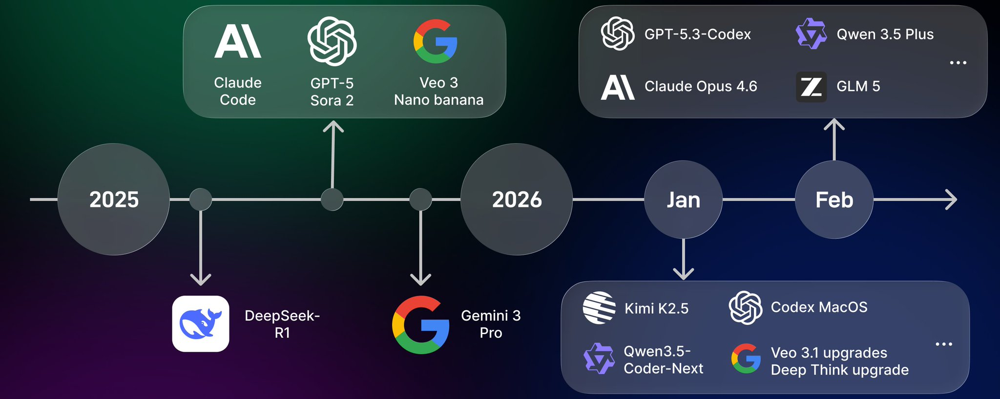

2026 年开年就不平静。1 月份，Moonshot AI 开源了 Kimi K2.5，一个万亿参数的多模态 Agent 模型。OpenAI 在 macOS 上发布了 Codex 编程助手应用。这些动作背后的趋势已经酝酿了好几个月。

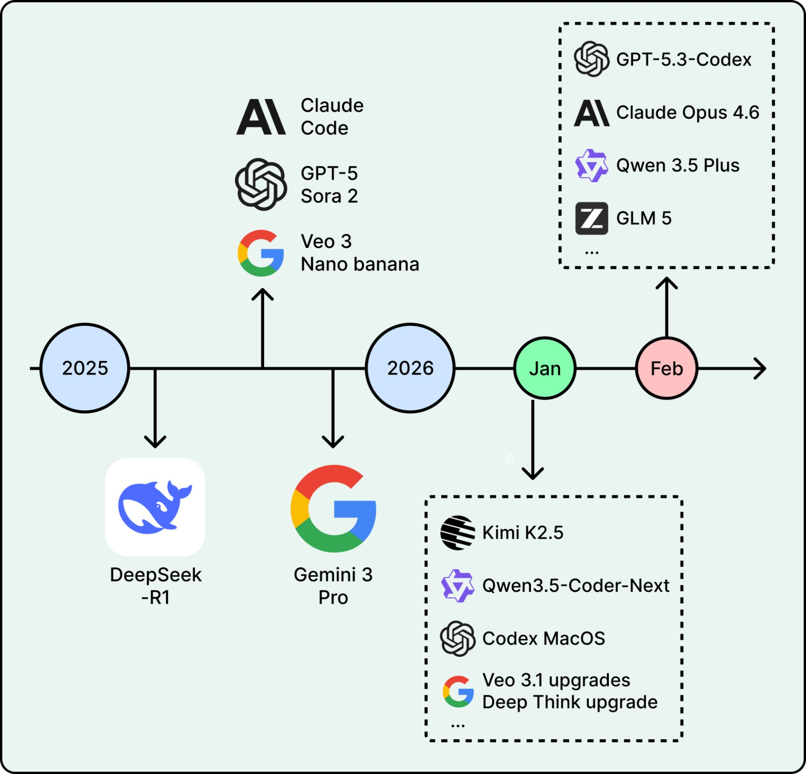

这篇文章梳理五个可能定义今年 AI 团队如何构建产品的关键趋势。

## 推理模型与 RLVR

早期的语言模型（比如 GPT-4）是"直给型"的，你问一个问题，模型就逐 token 往外吐文本。简单任务没问题，但碰到需要多步推演的数学题或复杂逻辑，第一次回答往往就错了。


从 OpenAI 的 o1 开始，情况变了。新一代模型在回答之前会花时间"思考"，生成中间推理步骤，再输出最终答案。代价是消耗更多时间和算力，但能解决难度高得多的逻辑和多步规划问题。

o1 之后，各大实验室纷纷跟进训练推理模型。到 2026 年初，主流 AI 公司基本都发布了自己的推理模型或把推理能力集成进主力产品。

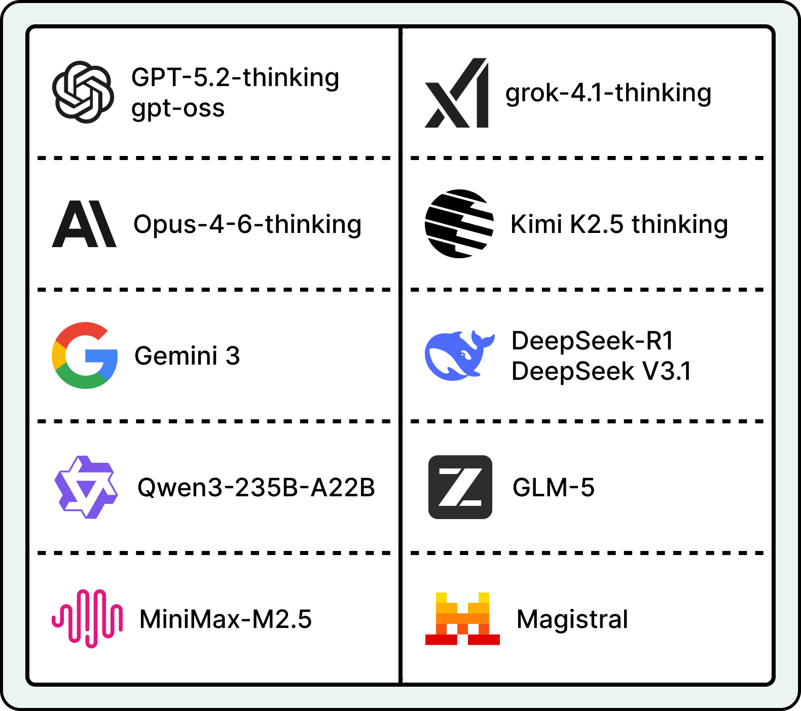

### RLVR 是什么

让模型训练在规模上真正可行的关键方法是 RLVR（Reinforcement Learning with Verifiable Rewards，可验证奖励的强化学习）。这个方法最早由 AI2 的 Tülu 3 提出，但 DeepSeek-R1 把它推到了聚光灯下，在大规模训练中验证了它的效果。要理解 RLVR 的改进之处，得先看看标准训练流水线。

LLM 训练分两个阶段：预训练和后训练。后训练阶段，强化学习（RL）算法让模型反复"练习"，模型生成回答，算法调整权重，让更好的回答在未来获得更高概率。

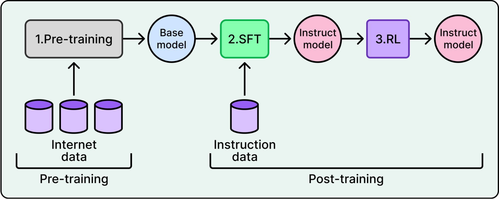

传统做法是训练一个独立的奖励模型（Reward Model）来近似人类偏好。这意味着要收集人类标注数据、训练奖励模型、再用它来指导 LLM。这就是 RLHF（Reinforcement Learning from Human Feedback）。

<!-- 图片下载失败：06-rlhf-diagram.jpg，原始 URL https://pbs.twimg.com/media/HB97E1LaMAIgg1o?format=jpg&name=900x900 返回 404，需人工补充 -->

RLHF 的瓶颈很明显：依赖人工标注数据，成本高、速度慢，任务越复杂越难标。人很难可靠地评判一个长推理链条到底好不好。

RLVR 去掉了这个瓶颈。它依然用强化学习，但奖励信号来自**正确性验证**而非"预测人类偏好"。在数学、编程这类领域，很多问题的答案可以自动检查：代码能不能跑通？数学解是不是和标准答案一致？正确就给奖励，不需要单独的奖励模型。

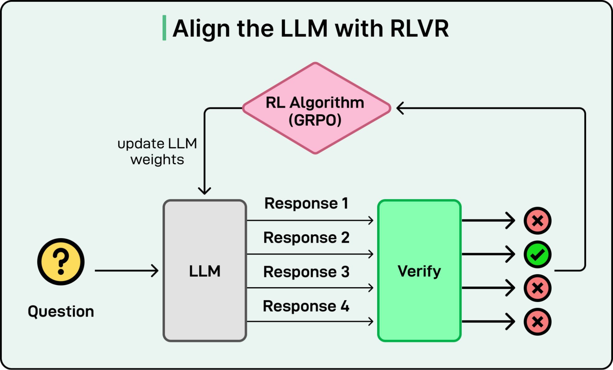

RLVR 能大规模运行，因为正确性检查可以快速、自动化地执行。模型可以在数百万道题目上练习，获得即时反馈。DeepSeek-R1 证明了这种方法能达到前沿推理水平，把训练的主要瓶颈从人工标注转移到了可用算力。

### 2026 年看什么

推理能力本身已经不是差异化优势了，各大实验室都在用 RLVR 训练推理模型。焦点转向了效率。

AI 团队正在做的是自适应推理（Adaptive Reasoning），模型根据问题难度调节推理强度。一句简单的"你好"不需要铺开长链思考，真正需要深度推理的问题才全力以赴。Gemini 3 就是一个具体例子，它支持 `thinking_level` 控制参数，默认使用动态推理，在不同 prompt 之间灵活调配推理资源。这种对效率的追求会让推理模型在实际生产场景中真正可用，因为速度和成本始终是绕不开的。

## Agent 与工具调用

早期语言模型擅长生成文本，但做不了任何"动作"。你让它订机票，它能描述步骤但没法操作订票系统。因为不能检查真实世界的信息，它经常在猜：你问"这家餐厅现在开门吗？"，它可能从过时的信息里拼凑答案，而不是去查实时营业时间。

这些局限催生了 AI Agent。Agent 把 LLM 和工具组合起来，放进一个循环里运行：拿到目标，拆解步骤，调用工具，根据返回结果决定下一步做什么。

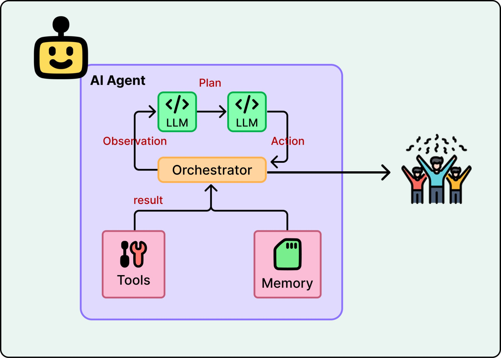

大多数 Agent 的结构相似：一个语言模型负责理解请求、选择行动；工具把模型连接到搜索、日历、文件、API 等外部系统；一个循环负责执行、检查结果、失败时重试或换路线。

### Agent 为什么最近才跑通

Agent 已经不再是实验性的东西，它们正在进入真实产品。OpenAI 的 ChatGPT Agent 可以帮你浏览网页、完成任务。Anthropic 的 Claude 能使用工具，写代码、跑代码、处理多步问题。

三个变化让这成为可能。

推理能力的提升让模型能规划多步任务，追踪中间结果，选择下一步行动，而不是直接跳到最终答案。

工具连接变得简单了。以前每个工具集成都是定制开发。Anthropic 的 Model Context Protocol（MCP）降低了模型连接外部系统的摩擦，加一个新工具现在只需要几行代码。

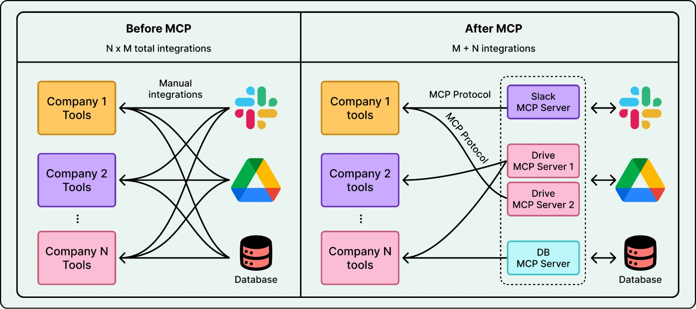

LangChain、LlamaIndex 这类框架的成熟也降低了门槛。它们提供了工具调用、多步流程、日志记录的现成组件，让更多团队能快速实验 Agent。

```python
from langchain_ollama import ChatOllama
from langchain.agents import create_agent

# 创建 LLM 实例
llm = ChatOllama(model="gemma3:1b")

# 定义工具列表
tools = [get_weather, web_search]

# 创建 Agent
agent = create_agent(llm, tools)

# 调用 Agent
agent.invoke({"messages":
    [{"role": "user", "content": "Events in SF"}]
})
```

### 2026 年看什么

Agent 擅长短流程任务，但长任务仍然是难题。跑几十步后，它们会丢失上下文，错误不断累积。而且大多数 Agent 运行在沙盒环境中，看不到你的邮件、文件或本地应用，除非你主动接入。

2026 年一个可预见的趋势是持久化 Agent（Persistent Agents），它们始终在线，能处理更长周期的工作流。很多会运行在本地，更容易连接你的文件、应用和系统设置，同时数据留在你自己手里。OpenClaw 就是这种向个人本地 Agent 转变的早期案例。

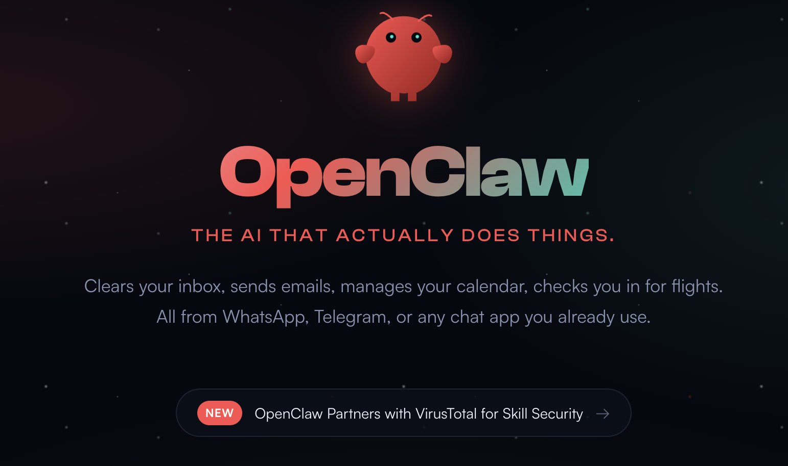

访问权限越大，风险也越大。当 Agent 能读取个人数据、执行操作时，犯错的后果更严重。所以 2026 年的另一个重点是可靠性和安全性。可靠性指的是在长任务中保持方向、从错误中恢复、行为可预期。安全性指的是保护数据、抵御 prompt 注入、不经明确确认不执行不可逆操作。

## 编程 Agent

AI 辅助编程最初只有简单的自动补全。模型只能看到光标附近几行代码，不理解整个代码库的结构，也不知道你在构建什么。

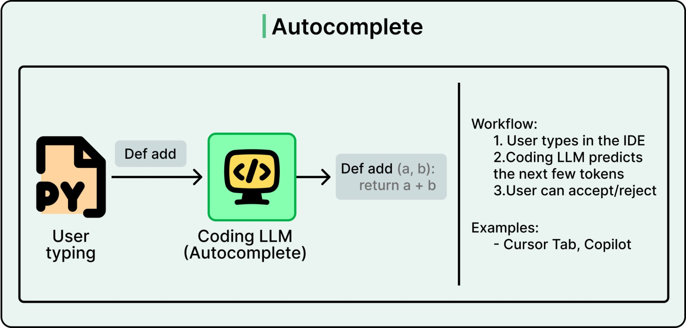

AI 实验室把 Agent 思路引入编程后，情况发生了质变。他们不再依赖通用模型，而是在代码仓库、文档和编程模式上做大量微调，训练出专门的编程 LLM。同时把通用工具替换成编程专用工具：`read_file`、`search_codebase`、`edit_file`、`run_terminal_command`、`execute_tests`。

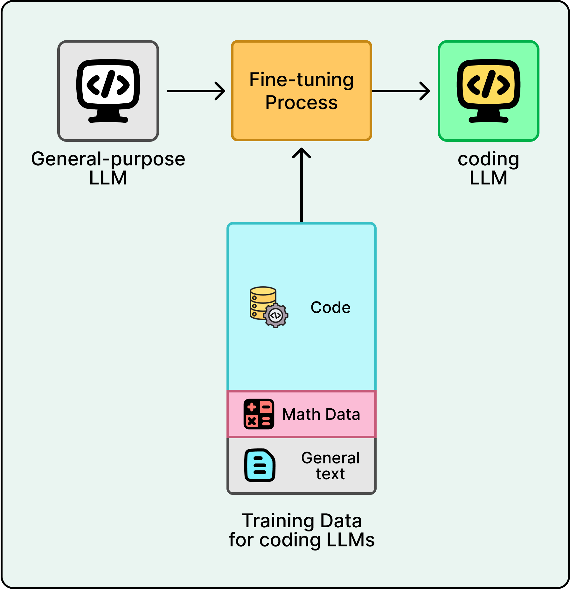

结果是一个理解软件工程实践的模型，它懂项目结构、依赖关系和调试流程，知道该调哪个工具、按什么顺序来完成任务。

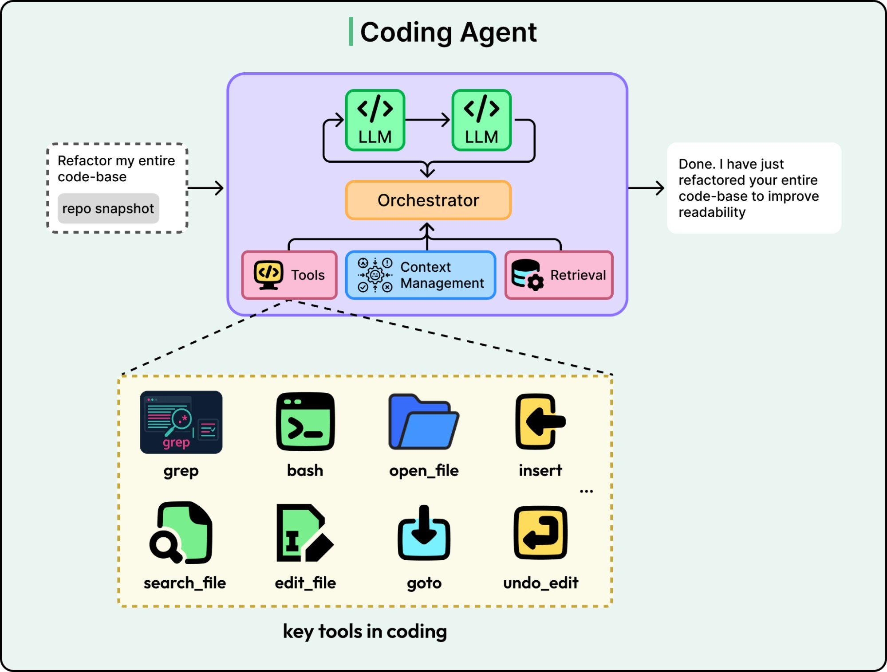

Anthropic 的 Claude Code 和 OpenAI 的 Codex 这类闭源编程 Agent 正在推动这场变革，它们能读取整个仓库、理解复杂的项目结构。同时，开源模型也在快速追赶。Qwen3-Coder-Next 是一个 80B 参数的模型，2026 年初发布，性能接近顶级闭源模型，而且能在消费级硬件上本地运行。


编程 Agent 是 AI 改变日常工作最直观的领域。工程师可以让它做仓库级别的修复和改进，拿到可运行补丁的速度快了很多。这些工具也降低了入门门槛，编程经验较少的人可以通过 Replit、Lovable 这类建立在编程 Agent 之上的服务来构建可用的应用。

### 2026 年看什么

编程 Agent 的基线标准已经不只是写代码，而是在规模上管理软件。三个方向会有最大进展：

**更深的仓库级理解。** 当前的 Agent 在大型代码库中有时会丢失文件之间的关联。更好地追踪依赖关系、架构和跨文件上下文，能让 Agent 处理更大更复杂的项目。

**安全感知编程。** 随着 Agent 编写越来越多的生产代码，在发布前捕获漏洞变得至关重要。预期 Agent 会把安全扫描和自动化测试生成直接集成到工作流中，而不是作为单独步骤。

**更快的完成速度。** 今天的 Agent 处理复杂任务时可能很慢，一个多文件变更有时要花几分钟来规划和执行。AI 实验室正在努力缩短从请求到可运行代码的时间。

## 开源权重模型

LLM 时代的头几年，最强的模型都是闭源的。想要顶级性能，你只能调 OpenAI、Anthropic 或 Google 的 API。拿不到权重，不能本地运行，也无法微调。开源模型虽然存在，但明显落后。

这个差距没持续多久，缩小的速度比大多数人预想的快，分两个阶段。

### DeepSeek 时刻

2025 年 1 月，DeepSeek 发布 DeepSeek-R1 并开源了权重、代码和训练方法。这个推理模型在关键基准上匹配甚至超过了闭源竞争者，证明了前沿级推理不需要私有 API。人们开始把类似的突破称为"DeepSeek 时刻"。

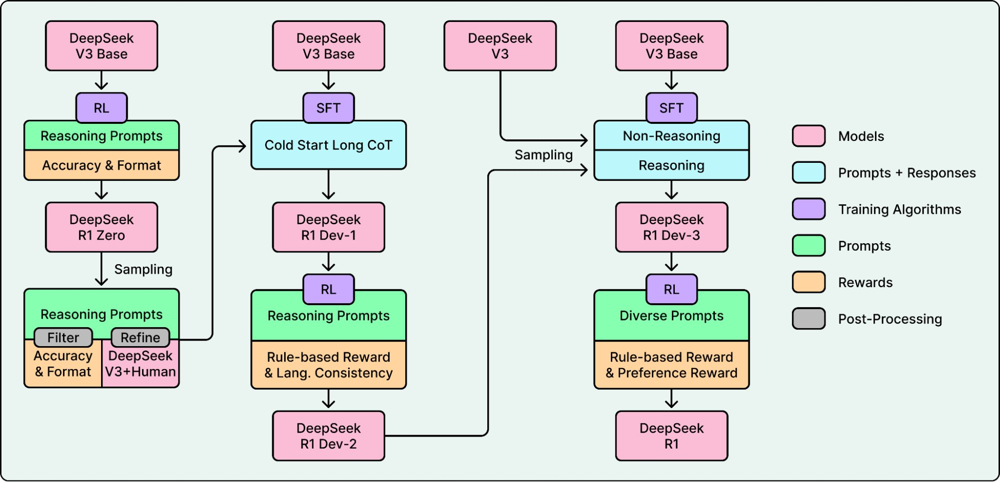

R1 引发关注的一个关键原因是训练方法。在此之前，很多聊天机器人在后训练阶段大量依赖 RLHF。DeepSeek 则重度使用 RLVR，在数学和编程这类可验证任务上更容易扩展，大幅减少了对人工标注的依赖。

### 快速跟进

之后，更多实验室公开发布了完整权重和训练细节。阿里巴巴的 Qwen 系列成为开源开发的重要基座。Z.ai 的 GLM 把多语言和多模态能力推进了开源生态。Moonshot 的 Kimi 家族提供了强大的 Agent 和工具调用特性。随着更多团队加入，开源权重生态迅速壮大。

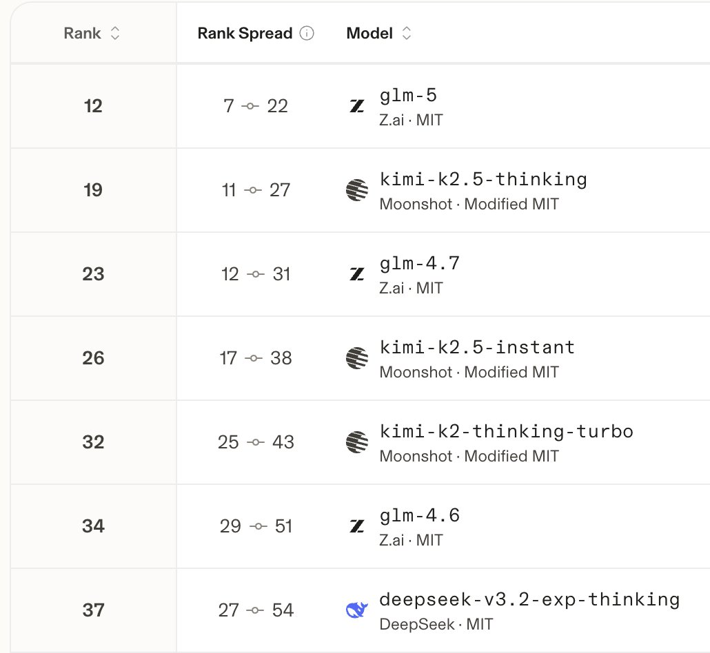

2025 年 8 月，OpenAI 发布了 gpt-oss，这是继 GPT-2 之后它的首批开源权重模型，包括 120B 和 20B 参数版本，采用 Apache 2.0 许可证。Mistral、Meta 和 Allen Institute 也发布了有竞争力的模型。

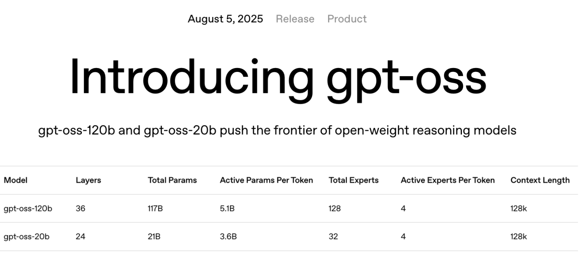

有了详细的技术报告和可复现的方案，技术传播得很快。团队复现结果、改进方案、发布变体。今天，开源权重模型在很多标准基准上已经接近顶级闭源模型。

### 2026 年看什么

2026 年，开源权重发布已经不再让人惊讶。下一波进展的重心不再是规模，而是效率、实际部署和 Agent 能力。

**架构效率。** 模型架构越来越高效，通常采用稀疏 MoE（Mixture of Experts）设计加长上下文，每个 token 只激活模型的一小部分。Qwen3-Coder-Next 就是一个例子，超稀疏结构加 256k 原生上下文窗口。

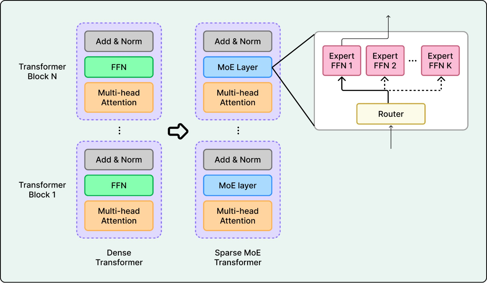

**Agent 就绪。** 开源权重模型正在为 Agent 用途训练，而不仅仅是聊天。工具调用、结构化输出和长上下文推理从一开始就被设计进去。随着 Agent 成为 AI 交付价值的核心方式，Agent 就绪的开源模型将驱动更多自主工作流。

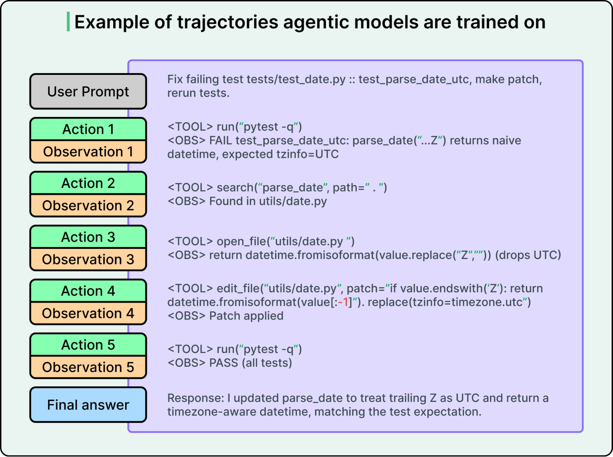

**更简单的部署。** 新的推理格式和压缩技术正在降低运行这些模型的门槛。硬件厂商也在加强对开源权重模型的原生支持，把它们当作一等公民来对待。

## 多模态模型

早期聊天机器人是纯文本输入、纯文本输出。即便能力在提升，它们依然以文本为中心。图像、音频和视频通常由独立系统处理。早期图像生成器能产出视觉冲击力强的图片，但结果不稳定，也难以控制。

变化发生在两个方向：聊天机器人变成原生多模态的，生成模型有了质的飞跃。

### 原生多模态聊天

纯文本模型的时代结束了。Gemini 3 和 ChatGPT-5 能在同一个系统中处理文本和图像，它们的产品也支持更丰富的媒体交互。在开源侧，Qwen2.5-VL 展现了类似的视觉-语言能力和跨模态理解。

这种统一方式带来了更自然的交互和新的应用场景。比如你可以上传一张架构图，对特定元素提问，模型回答时能引用图中的视觉细节，全部在一个对话中完成。

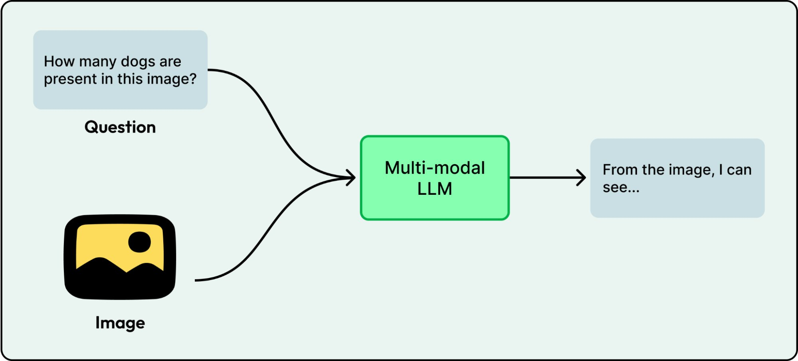

### 图像与视频生成

图像和视频生成也从演示级别进化到了真正的工具。OpenAI 的 Sora 2 展示的视频生成水平让整个行业不得不认真对待。Google 的 Veo 3.1（2025 年 10 月发布，2026 年 1 月更新）推进了视频生成能力，音频更丰富，编辑控制更精细（比如对象插入）。Nano Banana Pro（Gemini 3 Pro Image，2025 年 11 月发布）改进了图像生成和编辑，特别是文字渲染和精细控制。

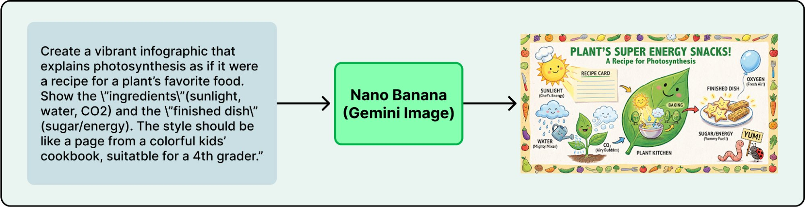

### 2026 年看什么

两个趋势可能定义多模态进展的下一阶段：物理 AI 和世界模型。

**物理 AI。** 机器人正从实验室走向真实部署。CES 2026 上出现了大量人形机器人演示。Boston Dynamics 发布了电动版 Atlas 并宣布与 Google DeepMind 合作，集成 Gemini Robotics 模型。Tesla 也表示计划加速 Optimus 的量产。

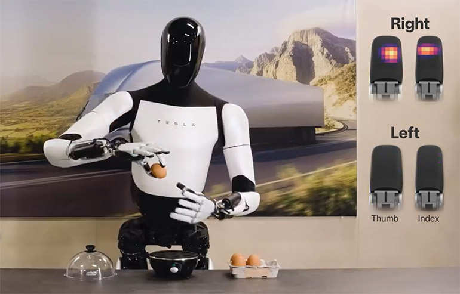

这些系统结合了视觉-语言理解、强化学习和规划能力。正如 Jensen Huang 在 CES 2026 前后所说："机器人的 ChatGPT 时刻到了"，他指的是那些能理解真实世界并规划行动的物理 AI 模型。

**世界模型。** 前面提到的视频生成系统正在学习比"生成逼真像素"更深层的东西：它们在构建对物理世界运作方式的基础模型，能够模拟物理规律、预测结果、对真实世界进行推理。

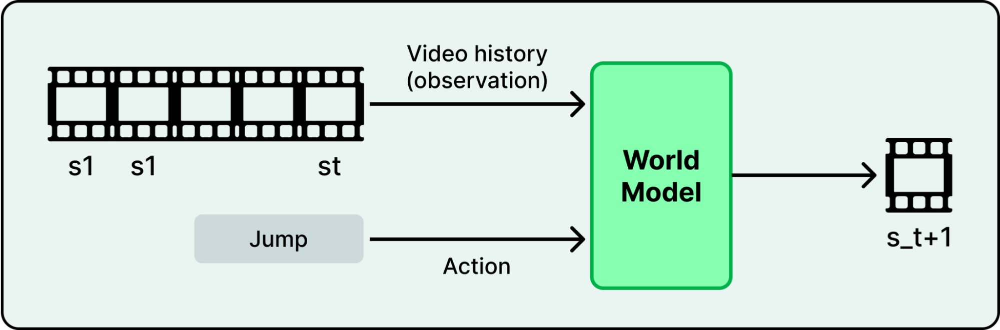

2025 年 11 月，Yann LeCun 离开 Meta 创办了 AMI Labs，融资 5 亿欧元，目标是构建理解物理而非仅仅预测文本的 AI 系统。Google DeepMind 发布了 Genie 3，第一个能实时交互的世界模型，能生成持久化的 3D 环境。NVIDIA 的 Cosmos Predict 2.5 在 2 亿条精选视频片段上训练，统一了文本到世界、图像到世界、视频到世界的生成能力，用于在模拟环境中训练机器人和自动驾驶车辆。

训练更好的世界模型很可能会贯穿 2026 全年。如果模型能可靠地模拟环境，它们就成为了训练机器人、自动驾驶和其他必须在物理世界运行的系统的基础设施。视频生成、机器人和模拟正在汇聚成一个方向。2026 年会揭示这种汇聚是加速还是停滞。

## 向前看

2026 年不会被某个单一突破所定义，而是被一组相互强化的能力所塑造。这些能力已经在组合成新的工作流，从自主代码重构到机器人通过模拟环境学习任务。这会是有意思的一年。
