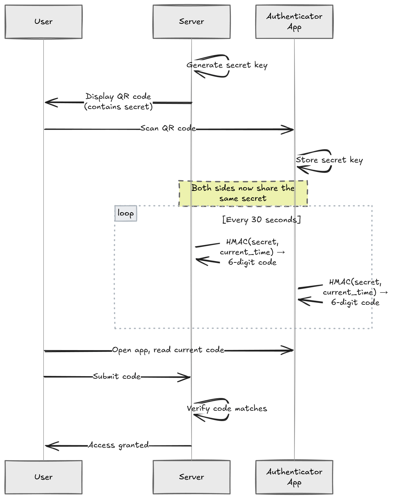
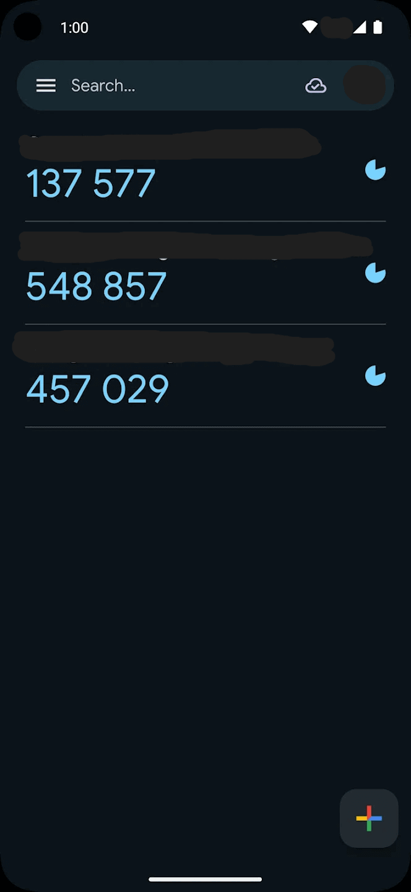
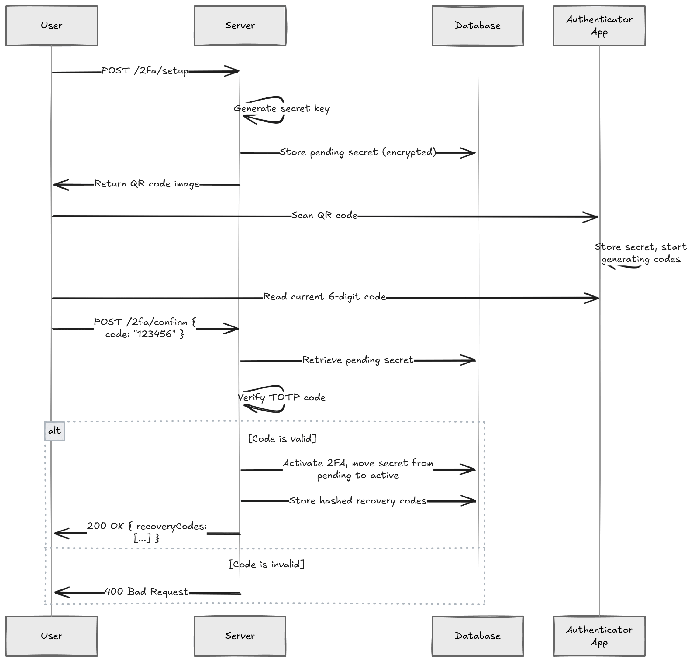

我最近遇到了一次安全事件。有人访问了我的一个账户，那个账户用了强密码、唯一密码，但没有开启第二因素验证。

密码被钓鱼、在数据泄露中暴露、被暴力破解，这些事情每天都在发生。双因素认证（Two-Factor Authentication，2FA）在密码之外加了一道验证，即使攻击者拿到了密码，没有第二因素也进不来。这是你能实现的最有效的安全措施之一，而且并不难做。

这篇文章用 TOTP（Time-based One-Time Password）配合 QR 码和 Google Authenticator 这类验证器应用，在 .NET 中实现完整的 2FA 流程。

## TOTP 的工作原理

[TOTP](https://www.rfc-editor.org/rfc/rfc6238) 是 Google Authenticator、Microsoft Authenticator、Authy 等应用背后的算法。

核心思路很简单：服务端和用户的验证器应用之间建立一个共享密钥（shared secret）。双方用这个密钥加上当前时间，各自独立生成一个 6 位数字码，每 30 秒轮换一次。

具体流程是这样的：服务端为用户生成一个唯一的密钥，用户通过扫描 QR 码把这个密钥导入验证器应用。之后，服务端和应用就能各自独立计算出相同的时间码。登录时，用户输入应用上显示的当前码，服务端验证它是否匹配。



因为双方各自计算，验证过程不需要网络调用。服务端只需要检查：给定这个密钥和当前时间，码是否匹配？

这让 TOTP 速度快、支持离线，并且能抵御重放攻击（每个码只在短暂的时间窗口内有效）。

## 生成密钥

每个用户需要自己的唯一密钥。这个密钥是整个 2FA 系统的基础，必须是密码学安全的随机值。

用 [Otp.NET](https://github.com/kspearrin/Otp.NET) 库来处理 TOTP 操作：

```bash
dotnet add package Otp.NET
```

为用户生成密钥：

```csharp
using OtpNet;

byte[] secretKey = KeyGeneration.GenerateRandomKey(); // 默认 20 字节 (SHA-1)
string base32Secret = Base32Encoding.ToString(secretKey);
```

`KeyGeneration.GenerateRandomKey()` 生成密码学安全的随机密钥，然后编码为 Base32 格式，因为 [otpauth URI 规范](https://github.com/google/google-authenticator/wiki/Key-Uri-Format)要求这个编码。

这个密钥必须安全存储，它的敏感程度等同于密码。如果攻击者拿到了密钥，就能生成有效的验证码。后面会讲怎么在存储时加密它。

## 生成 QR 码

设置 2FA 时，用户需要用验证器应用扫描一个 QR 码。这个 QR 码编码了一个 `otpauth://` URI，包含密钥和元数据。

安装 [QRCoder](https://github.com/codebude/QRCoder) 库：

```bash
dotnet add package QRCoder
```

生成 QR 码的代码：

```csharp
using QRCoder;

const string issuer = "MyApp";
const string user = "user@example.com";

string escapedIssuer = Uri.EscapeDataString(issuer);
string escapedUser = Uri.EscapeDataString(user);

string otpUri =
    $"otpauth://totp/{escapedIssuer}:{escapedUser}" +
    $"?secret={base32Secret}" +
    $"&issuer={escapedIssuer}" +
    $"&digits=6" +
    $"&period=30";

using var qrGenerator = new QRCodeGenerator();
using var qrCodeData = qrGenerator.CreateQrCode(otpUri, QRCodeGenerator.ECCLevel.Q);
using var qrCode = new PngByteQRCode(qrCodeData);
byte[] qrCodeImage = qrCode.GetGraphic(10);
```

`otpauth://` URI 各参数的含义：

- `secret`：Base32 编码的共享密钥
- `issuer`：应用名称，会显示在验证器应用中
- `digits`：验证码位数，标准是 6 位
- `period`：码的轮换间隔（秒），标准是 30 秒

`ECCLevel.Q` 提供了不错的纠错能力和 QR 码尺寸之间的平衡，即使 QR 码有约 25% 的损坏也能正常扫描。

生成的 QR 码长这样：


用户扫描后，验证器应用中会出现对应条目：



你也可以在 QR 码旁边显示 `base32Secret` 字符串，有些用户更喜欢手动输入。

## 设置流程

把设置流程搞对非常关键。如果用户一请求开启 2FA，你就立刻激活它，而用户还没扫描 QR 码，那就等于把用户锁在门外了。

正确的流程：用户请求设置 2FA 时，生成密钥并存为"待确认"状态（不是激活状态）。展示 QR 码让用户扫描。用户输入验证器应用生成的第一个码。服务端验证这个码，如果匹配，才真正激活 2FA。最后生成恢复码交给用户。

关键点在于确认步骤。在用户证明他们能生成有效的验证码之前，永远不要激活 2FA。否则你会遇到一堆用户"开启了 2FA"却没办法生成验证码的情况。



API 端点实现如下。所有 2FA 端点都必须受保护，用户需要先通过身份验证：

```csharp
app.MapPost("2fa/setup", async (HttpContext context, UserService userService) =>
{
    var userId = context.User.GetUserId();

    byte[] secretKey = KeyGeneration.GenerateRandomKey();
    string base32Secret = Base32Encoding.ToString(secretKey);

    // 存储待确认的密钥（加密），还没有激活
    await userService.StorePendingTwoFactorSecret(userId, base32Secret);

    string otpUri =
        $"otpauth://totp/{Uri.EscapeDataString("MyApp")}:{Uri.EscapeDataString(userId)}" +
        $"?secret={base32Secret}" +
        $"&issuer={Uri.EscapeDataString("MyApp")}" +
        $"&digits=6&period=30";

    using var qrGenerator = new QRCodeGenerator();
    using var qrCodeData = qrGenerator.CreateQrCode(otpUri, QRCodeGenerator.ECCLevel.Q);
    using var qrCode = new PngByteQRCode(qrCodeData);
    byte[] qrCodeImage = qrCode.GetGraphic(10);

    return Results.File(qrCodeImage, "image/png");
})
.RequireAuthorization();
```

确认端点：

```csharp
app.MapPost("2fa/confirm", async (
    ConfirmTwoFactorRequest request,
    HttpContext context,
    UserService userService) =>
{
    var userId = context.User.GetUserId();

    string? pendingSecret = await userService.GetPendingTwoFactorSecret(userId);
    if (pendingSecret is null)
    {
        return Results.BadRequest("No pending 2FA setup found.");
    }

    byte[] secretKey = Base32Encoding.ToBytes(pendingSecret);
    var totp = new Totp(secretKey);

    bool isValid = totp.VerifyTotp(
        request.Code,
        out _,
        VerificationWindow.RfcSpecifiedNetworkDelay);

    if (!isValid)
    {
        return Results.BadRequest("Invalid code. Please try again.");
    }

    // 验证码正确，激活 2FA
    await userService.ActivateTwoFactor(userId, pendingSecret);

    // 生成恢复码
    var recoveryCodes = await userService.GenerateRecoveryCodes(userId);

    return Results.Ok(new { recoveryCodes });
})
.RequireAuthorization();

internal record ConfirmTwoFactorRequest(string Code);
```

这种两步式设计保证了你永远不会为一个无法实际使用 2FA 的用户激活它。如果用户中途放弃设置，待确认的密钥会被清理掉，什么都不会出问题。

## 带 2FA 的登录流程

一个很容易搞错的地方：在用户通过 2FA 验证之前，不要签发完整的访问令牌。

如果用户开启了 2FA，你在他们输入密码后就签发 JWT，那就等于已经给了完整访问权限。2FA 步骤就变得毫无意义了。

正确的做法是两步登录。用户提交用户名和密码。如果凭据有效且开启了 2FA，返回一个权限受限的令牌，只允许调用 `2fa/validate` 端点。用户提交 TOTP 验证码。验证码正确后，才签发完整的访问令牌。

```csharp
app.MapPost("auth/login", async (LoginRequest request, UserService userService) =>
{
    var user = await userService.ValidateCredentials(request.Email, request.Password);
    if (user is null)
    {
        return Results.Unauthorized();
    }

    if (user.TwoFactorEnabled)
    {
        // 签发一个短期的、权限受限的令牌，只允许进行 2FA 验证
        var limitedToken = TokenService.GenerateLimitedToken(user.Id, purpose: "2fa");

        return Results.Ok(new { requiresTwoFactor = true, token = limitedToken });
    }

    // 没有开启 2FA，直接签发完整访问令牌
    var accessToken = TokenService.GenerateAccessToken(user);

    return Results.Ok(new { accessToken });
});
```

受限令牌应该有很短的过期时间（2-3 分钟），并带有一个声明或作用域，把它限制在 `2fa/validate` 端点。验证端点的授权策略可以检查这个特定声明。

这样一来，仅凭偷来的密码永远无法获得完整的访问令牌。

## 验证 TOTP 码

2FA 激活后，登录时需要验证用户提交的验证码：

```csharp
app.MapPost("2fa/validate", async (
    ValidateOtpRequest request,
    HttpContext context,
    UserService userService) =>
{
    var userId = context.User.GetUserId();

    string? secret = await userService.GetTwoFactorSecret(userId);
    if (secret is null)
    {
        return Results.BadRequest("2FA is not enabled.");
    }

    byte[] secretKey = Base32Encoding.ToBytes(secret);
    var totp = new Totp(secretKey);

    bool isValid = totp.VerifyTotp(
        request.Code,
        out long timeStepMatched,
        VerificationWindow.RfcSpecifiedNetworkDelay);

    return Results.Ok(new { isValid });
})
.RequireAuthorization();

internal record ValidateOtpRequest(string Code);
```

`VerificationWindow.RfcSpecifiedNetworkDelay` 参数很重要。它允许在当前时间步前后有一个小的容差窗口，用来应对服务端和用户设备之间的时钟偏差。

没有验证窗口的话，一个 2 秒前还有效的码，可能因为服务端刚好跨入下一个 30 秒周期而被拒绝。RFC 规定的窗口通常允许当前时间步前后各一个时间步。

### 防止验证码重用

一个容易忽略但很重要的细节：TOTP 验证码应该只能被接受一次。

如果攻击者截获了一个有效的码（比如通过偷看屏幕），他们不应该能重复使用它。`timeStepMatched` 输出参数告诉你这个码属于哪个时间步。你可以存储最后使用的时间步，然后拒绝任何相同或更早时间步的码：

```csharp
bool isValid = totp.VerifyTotp(
    request.Code,
    out long timeStepMatched,
    VerificationWindow.RfcSpecifiedNetworkDelay);

if (isValid)
{
    long? lastUsedTimeStep = await userService.GetLastUsedTimeStep(userId);

    if (lastUsedTimeStep.HasValue && timeStepMatched <= lastUsedTimeStep.Value)
    {
        return Results.BadRequest("Code already used.");
    }

    await userService.UpdateLastUsedTimeStep(userId, timeStepMatched);
}
```

这样就能防止验证窗口内的重放攻击。

### 速率限制

验证端点是暴力破解的目标。6 位验证码只有 100 万种可能。没有速率限制的话，攻击者几分钟就能尝试完所有组合。

你至少应该做到：限制每个用户的尝试次数，3-5 次失败后锁定账户或增加延迟；使用指数退避，每次失败后等待时间翻倍；记录失败尝试，大量来自同一 IP 的失败是危险信号。

ASP.NET Core 内置了[速率限制中间件](https://www.milanjovanovic.tech/blog/how-to-use-rate-limiting-in-aspnet-core)，加上去很方便。

## 加密存储密钥

TOTP 密钥是 2FA 系统中最敏感的数据。如果有人拖了你的数据库，他们不应该能为你的用户生成有效的验证码。

永远不要以明文存储 TOTP 密钥。

写入数据库前加密，验证时才解密。具体实现可以参考 [AES 加密](https://www.milanjovanovic.tech/blog/implementing-aes-encryption-with-csharp)。

```csharp
public class UserService
{
    private readonly IEncryptionService _encryptionService;

    public async Task StorePendingTwoFactorSecret(string userId, string secret)
    {
        string encryptedSecret = _encryptionService.Encrypt(secret);

        // 将加密后的密钥存入数据库
        await _dbContext.Users
            .Where(u => u.Id == userId)
            .ExecuteUpdateAsync(u => u
                .SetProperty(x => x.PendingTwoFactorSecret, encryptedSecret));
    }

    public async Task<string?> GetTwoFactorSecret(string userId)
    {
        var user = await _dbContext.Users.FindAsync(userId);
        if (user?.TwoFactorSecret is null) return null;

        return _encryptionService.Decrypt(user.TwoFactorSecret);
    }
}
```

加密密钥本身应该放在密钥管理服务中，比如 [Azure Key Vault](https://learn.microsoft.com/en-us/azure/key-vault/)、[AWS KMS](https://aws.amazon.com/kms/) 或 [HashiCorp Vault](https://www.vaultproject.io/)。千万不要放在 `appsettings.json` 或源代码里。

## 恢复码

用户丢了手机怎么办？

没有恢复机制的话，他们就被永久锁在账户外面了。恢复码（Recovery Codes）就是用来解决这个问题的。它们是用户启用 2FA 时生成的一次性使用码。

```csharp
public async Task<List<string>> GenerateRecoveryCodes(string userId, int count = 8)
{
    var codes = new List<string>();

    for (int i = 0; i < count; i++)
    {
        // 生成密码学安全的随机码
        var bytes = RandomNumberGenerator.GetBytes(5);
        var code = Convert.ToHexString(bytes).ToLower();
        codes.Add(code);
    }

    // 存储前对恢复码做哈希，和密码一样是单向的
    var hashedCodes = codes
        .Select(c => BCrypt.Net.BCrypt.HashPassword(c))
        .ToList();

    await _dbContext.RecoveryCodes
        .Where(rc => rc.UserId == userId)
        .ExecuteDeleteAsync();

    _dbContext.RecoveryCodes.AddRange(
        hashedCodes.Select(h => new RecoveryCode
        {
            UserId = userId,
            CodeHash = h,
            IsUsed = false
        }));

    await _dbContext.SaveChangesAsync();

    // 返回明文恢复码，只展示给用户一次
    return codes;
}
```

几个重要细节：存储前对恢复码做哈希，它们本质上是一次性密码，用 bcrypt（如 [Bcrypt.Net](https://github.com/BcryptNet/bcrypt.net)）或类似算法。只展示一次，用户关闭对话框后，明文恢复码就消失了。每个恢复码只能用一次，用过就标记。一般生成 8 到 10 个，用户快用完时可以重新生成。

验证恢复码时，逐个检查存储的哈希直到找到匹配：

```csharp
public async Task<bool> ValidateRecoveryCode(string userId, string code)
{
    var storedCodes = await _dbContext.RecoveryCodes
        .Where(rc => rc.UserId == userId && !rc.IsUsed)
        .ToListAsync();

    var matchingCode = storedCodes
        .FirstOrDefault(rc => BCrypt.Net.BCrypt.Verify(code, rc.CodeHash));

    if (matchingCode is null) return false;

    matchingCode.IsUsed = true;
    await _dbContext.SaveChangesAsync();

    return true;
}
```

## 完整示例

下面是一个精简但完整的设置，展示了完整的 2FA 流程。用路由组配合 `.RequireAuthorization()`，让所有端点都受保护：

```csharp
using OtpNet;
using QRCoder;

var builder = WebApplication.CreateBuilder(args);

builder.Services.AddAuthentication().AddJwtBearer();
builder.Services.AddAuthorization();

var app = builder.Build();

app.UseAuthentication();
app.UseAuthorization();

var twoFactorGroup = app.MapGroup("2fa").RequireAuthorization();

twoFactorGroup.MapPost("setup", async (HttpContext context, UserService userService) =>
{
    var userId = context.User.GetUserId();

    byte[] secretKey = KeyGeneration.GenerateRandomKey();
    string base32Secret = Base32Encoding.ToString(secretKey);

    await userService.StorePendingTwoFactorSecret(userId, base32Secret);

    string otpUri =
        $"otpauth://totp/{Uri.EscapeDataString("MyApp")}:{Uri.EscapeDataString(userId)}" +
        $"?secret={base32Secret}" +
        $"&issuer={Uri.EscapeDataString("MyApp")}" +
        $"&digits=6&period=30";

    using var qrGenerator = new QRCodeGenerator();
    using var qrCodeData = qrGenerator.CreateQrCode(otpUri, QRCodeGenerator.ECCLevel.Q);
    using var qrCode = new PngByteQRCode(qrCodeData);
    byte[] qrCodeImage = qrCode.GetGraphic(10);

    return Results.File(qrCodeImage, "image/png");
});

twoFactorGroup.MapPost("confirm", async (
    ConfirmTwoFactorRequest request,
    HttpContext context,
    UserService userService) =>
{
    var userId = context.User.GetUserId();

    string? pendingSecret = await userService.GetPendingTwoFactorSecret(userId);
    if (pendingSecret is null)
    {
        return Results.BadRequest("No pending 2FA setup found.");
    }

    byte[] secretKey = Base32Encoding.ToBytes(pendingSecret);
    var totp = new Totp(secretKey);

    bool isValid = totp.VerifyTotp(
        request.Code,
        out _,
        VerificationWindow.RfcSpecifiedNetworkDelay);

    if (!isValid)
    {
        return Results.BadRequest("Invalid code. Please try again.");
    }

    await userService.ActivateTwoFactor(userId, pendingSecret);
    var recoveryCodes = await userService.GenerateRecoveryCodes(userId);

    return Results.Ok(new { recoveryCodes });
});

twoFactorGroup.MapPost("validate", async (
    ValidateOtpRequest request,
    HttpContext context,
    UserService userService) =>
{
    var userId = context.User.GetUserId();

    string? secret = await userService.GetTwoFactorSecret(userId);
    if (secret is null)
    {
        return Results.BadRequest("2FA is not enabled.");
    }

    byte[] secretKey = Base32Encoding.ToBytes(secret);
    var totp = new Totp(secretKey);

    bool isValid = totp.VerifyTotp(
        request.Code,
        out long timeStepMatched,
        VerificationWindow.RfcSpecifiedNetworkDelay);

    if (isValid)
    {
        long? lastUsedTimeStep = await userService.GetLastUsedTimeStep(userId);
        if (lastUsedTimeStep.HasValue && timeStepMatched <= lastUsedTimeStep.Value)
        {
            return Results.BadRequest("Code already used.");
        }

        await userService.UpdateLastUsedTimeStep(userId, timeStepMatched);
    }

    return Results.Ok(new { isValid });
});

app.Run();

internal record ConfirmTwoFactorRequest(string Code);
internal record ValidateOtpRequest(string Code);
```

如果不需要完全控制流程，[Keycloak](https://www.milanjovanovic.tech/blog/integrate-keycloak-with-aspnetcore-using-oauth-2) 和 [ASP.NET Core Identity](https://learn.microsoft.com/en-us/aspnet/core/security/authentication/identity) 都内置了 TOTP 2FA 支持。但自己实现一遍，在你需要自定义流程或想搞清楚底层发生了什么的时候，是值得的。

2FA 是你能为应用加上的影响最大的安全功能之一。TOTP 配合验证器应用是个靠谱的选择，因为它支持离线、广泛兼容，而且不依赖 SMS（SMS 容易被 SIM 卡劫持攻击）。如果你在构建处理敏感操作的 API，加上 2FA 能把攻击者的门槛抬高一大截。
