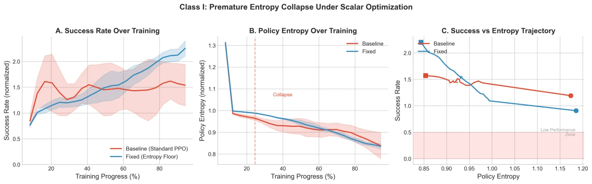
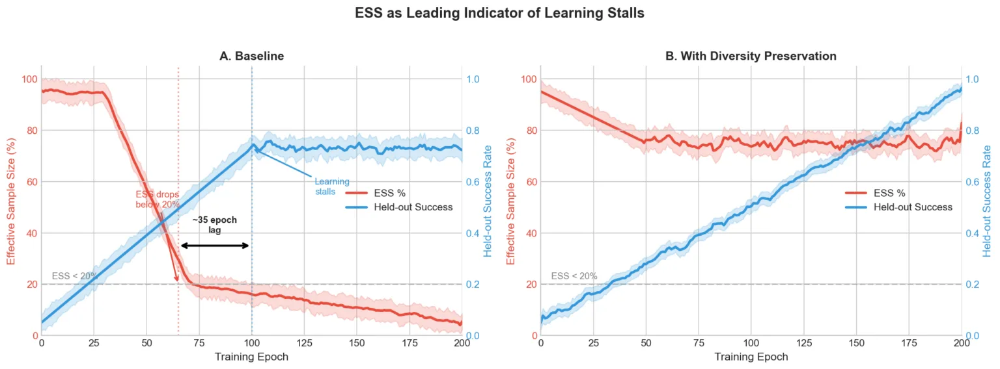
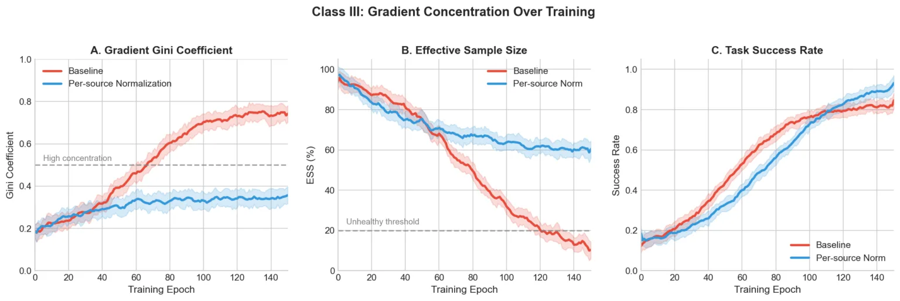
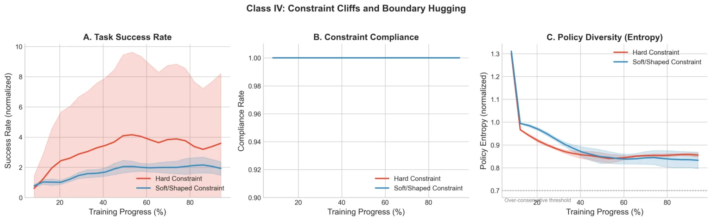
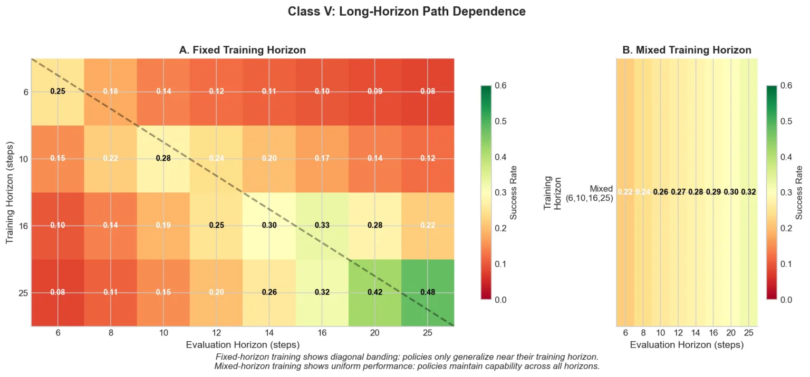

Aditya Challapally 领导微软 Copilot 的后训练研究，他的系统每天处理数百万次多模态交互。这篇文章是他们之前那篇[诊断生产级智能体强化学习不稳定性](https://devblogs.microsoft.com/engineering-at-microsoft/diagnosing-instability-in-production-scale-agent-rl/)的续集，讲的是他们实际用来解决那些问题的工程方案。

他开门见山：大规模多模态智能体后训练的失败方式，是文献根本没有准备你去应对的。算法没有问题，它们按照描述在运行，但失败模式只在生产规模、真实约束、真实异构性下才会变得可见。

他们训练的模型是真正插入 Copilot 的生产模型——跨 Microsoft 各产品线的模块化智能体能力。这些模型要同时协调工具调用、对企业文档进行多模态推理、做内容审核，并在严格的延迟和安全约束下工作。单一策略必须同时处理工具编排、多模态推理、内容审核和多步骤任务执行，轨迹长度从 100 到 2000+ token，交互视野从 6 到 25+ 步。奖励信号来自程序化验证器、人类评估者和隐式使用信号，各有不同的量级、噪声特征和延迟。每天为数百万用户服务，静默失败不是指标回归，是大规模损坏的用户体验。

标准后训练手册假设的条件比这干净得多。在他们的异构性和规模下，策略梯度估计器会静默退化——聚合奖励持续上升，而实际更新的信息量却在崩溃，能力在看起来健康的仪表盘背后悄悄回退，策略退化到满足约束但不解决任务的退化行为。

## 问题的共同根源

这些问题大多源于同一个底层缺陷。标准策略梯度估计器假设你的轨迹批次包含足够的结果方差来产生有用的梯度信号：

$$g(\theta) = \mathbb{E}[\nabla_\theta \log \pi_\theta(a|s) \cdot \hat{A}(s,a)]$$

在规模下，这个假设以几种独立的方式崩溃，而且是静默崩溃：聚合奖励持续攀升，而更新的实际信息量却在退化。他们做的所有事情，本质上都是在规模、异构性和视野增加的情况下，保持优势估计 $\hat{A}(s,a)$ 的信息量。

## 分阶段目标课程，防止过早专化

聚合奖励稳定上升，而部署关键行为悄悄回退。鲁棒性下降，长视野执行失败更频繁。两周内没有发现，因为仪表盘看起来健康。

教科书答案是熵正则化。他们试过了：熵保持高位，但错误行为得到了强化，因为问题不是探索不足。问题在于，标量奖励把高维行为压缩成单一统计量，优化收敛于最容易打分的行为，而不是下游真正重要的那些。

他们的方案：把奖励拆分为可验证信号（工具语法、格式合规，可以程序化检查的东西）和偏好信号（工具选择、由评估者判断的响应质量）。训练前 30% 专门训练可验证目标，偏好信号之后线性加入。他们用熵下限锚定早期学习——不是奖励加成，是下限，实现为一个只在 $H(\pi)$ 低于阈值时才激活的 KL 惩罚。

30% 的预热比例是从经验中找到的。10% 不够，策略在偏好信号变得有信息量之前就完成了专化。50% 太保守，策略把一半训练浪费在它已经掌握的目标上。30% 在他们的任务家族中是稳健的，很可能不是最优的，但它成立了。

图 1 中，基准在第 25 轮前后发生熵崩溃，之后成功率趋于平缓。分阶段课程把多样性维持足够长，让偏好信号在进入时真正有用。熵下限偶尔会在早期专化本来没问题的任务上过度约束探索，他们接受这个权衡。

这个原则超越标量奖励。在多模态系统中，他们发现纯文本监督在训练早期可以比直接多模态监督更可靠地激活跨模态能力——前提是联合预训练建立了足够的对齐。任何在策略还没准备好使用之前引入的嘈杂信号都会产生同样的失败模式。

## 从估计器健康状况做自适应课程

训练停滞，即使平均奖励略有上升。更多数据和算力带来的边际回报递减，标准指标里没有任何解释。

诊断来自追踪有效样本量 (ESS, Effective Sample Size)——衡量实际贡献梯度的轨迹有多少的重要性加权度量：

$$\text{ESS} = \frac{(\sum w_i)^2}{\sum w_i^2}$$

ESS 在第 60 轮跌破标称批次大小的 20%，学习在第 95 轮附近停滞。那 35 轮的滞后在多次运行中是一致的。ESS 崩溃是学习停滞的领先指标，在任何下游指标移动之前就可以检测到。

这在事后看很显然：当 ESS 低时，你的 10000 条轨迹批次实际上是 500 条，那 500 条是极端重要性权重的那些。但他们没有追踪它，大多数训练仪表盘里也没有。

他们的方案：构建一个实时监控 ESS 的自适应循环，当 ESS 跌破 20% 时介入。触发时，系统从储备缓冲区中注入接近成功的轨迹 (near-miss trajectories) 来恢复批次中的结果对比度，并临时增加 KL 惩罚来减缓策略漂移，同时让估计器恢复。

为什么是接近成功的轨迹，而不是困难负样本 (hard negatives)？他们最初尝试了困难负样本，确实恢复了 ESS，但降低了学习效果——梯度指向远离失败，却没有指向成功。接近成功的轨迹保留了决策边界附近动作的相对顺序，信息量就在那里。

图 2 显示基准 ESS 崩溃，学习在约 35 轮后停滞。修复方案将 ESS 全程维持在 70% 以上。储备缓冲区增加约 15% 内存开销，自适应 KL 偶尔会减缓简单任务的学习，这些代价是可接受的。

## 从估计器结构做方差校正归一化

某些任务家族在改善，其他的在回退。小的数据混合变化导致不成比例的行为偏移。系统脆弱，让迭代变得痛苦。

标准方法是按任务进行梯度归一化，平衡跨任务的量级，但忽略任务内部的方差结构。一个"代码"桶可能包含 100-token 到 2000-token 的轨迹，有 20 倍的方差差距。在重要性加权下，长轨迹无论按任务归一化如何，都会主导有效梯度。轨迹级方差在标准独立性假设下随长度线性增长，所以少量长轨迹消耗了大部分梯度预算。

他们追踪了每条轨迹梯度范数的[基尼系数](https://zh.wikipedia.org/wiki/%E5%9F%BA%E5%B0%BC%E7%B3%BB%E6%95%B0)，发现基准中上升到约 0.75——大约 5% 的轨迹贡献了大多数更新。

他们的方案：将每条轨迹的梯度贡献归一化为 $\sigma_\text{source} \cdot \sqrt{\text{trajectory\_length}}$。每来源的项捕获奖励量级和评估者噪声差异，长度项来自对每 token 贡献的独立性假设。这是方差加权估计器，原理上不新颖，但具体分解由他们的数据和观察到的失败模式驱动。

他们还将训练重组围绕目标能力（推理、编码、智能体执行），而非输入模态——每种能力在文本和多模态数据上联合训练。按模态划分导致梯度贡献集中在更容易优化的模态上，这是同一失败模式在不同组织层级的体现。

图 3 展示了因果链：基准基尼上升至约 0.75，ESS 崩溃至约 10%，学习停滞。修复方案将基尼保持在约 0.35，ESS 保持在约 60%。系统也变得对之前会导致不稳定的数据混合变化有了鲁棒性，因为归一化适应了到来的任何数据，而不是假设固定分布。

## 约束软化，解决智能体编排退化

智能体编排器满足了每一个设定的约束，然后变得没用。它们拒绝使用并行（串行崩溃）或产生不必要的子智能体。合规是完美的。行为很糟糕。

问题是拓扑性的。硬约束惩罚在边界处产生悬崖。优化器无法区分"接近边界因为策略在变得更有能力"和"接近边界因为它即将违规"，所以它退回到安全内部。调整惩罚量级无济于事：宽松惩罚导致违规，严格惩罚加剧串行崩溃，没有稳定的中间地带。

他们的方案包含两个改变。一是用 softplus 惩罚替换惩罚悬崖：

$$\text{penalty} = -k \cdot \text{softplus}(\text{distance\_to\_boundary})$$

这保留了边界附近的梯度信息。二是专门针对并行性，添加退火辅助奖励：

$$r_\text{total} = r_\text{task} + \beta(t) \cdot r_\text{parallelism}$$

其中 $\beta$ 指数衰减。训练早期辅助奖励给出朝向并行性的梯度信号，逃出串行崩溃盆地。随着训练进行，它退火至零，任务奖励单独决定最终行为。

他们还将编排器训练与子智能体执行解耦——子智能体被冻结，其输出被当作观测，放弃了端到端优化。代价是编排器无法学习补偿子智能体的弱点，但当子智能体输出反馈到编排器奖励时，编排决策的梯度信号被子智能体方差污染。干净的编排信号比联合优化更值钱。

图 4 显示两种约束都能达到约 100% 合规，约束层面没差别。但硬约束产生高方差任务成功率并最终退化，而软化约束维持稳定改善。硬约束下的策略学会了拒绝而非执行。代价是工程开销——软化约束需要为每种约束类型调优 softplus 缩放和衰减常数。他们维护着约十几种跨智能体技能的配置。

## 混合视野训练

在视野 6 训练的策略在这个视野达到 0.25 成功率，但在视野 25 只有 0.08。标准答案是课程学习——逐渐增加视野。他们尝试了几种调度方案，都以同样的原因失败了：

优化是路径依赖的。在短视野训练会剪枝长视野执行所需的行为模式。策略学习了一种压缩的"如何在 N 步内解决任务"的表示，无法推广到 2N 步——而一旦这些模式被剪枝，在相同计算预算下恢复它们是不现实的。在长视野任务上微调短视野策略会产生特征性的下跌再恢复模式：模型在重新分配容量时原有视野性能下降，然后部分恢复，最终策略在两个视野上都比从头开始在两个视野上同时训练更差。

他们的方案：从一开始就做混合视野训练。从 $\{6, 10, 16, 25\}$ 中均匀采样 $h$，以预算 $h$ 执行，计算优势。没有课程，没有分阶段。这是个粗糙的工具——策略在完全不知道自己在做什么的时候就在长视野轨迹上花费计算，训练的样本效率低于理论上好的课程方案。但它有效，课程没有。

图 5 展示了泛化矩阵。固定视野训练产生对角线带状——每种策略只在训练视野附近泛化。混合视野训练在所有评估视野（包括比任何单一训练条件长 4 倍的视野）产生均匀表现（0.22–0.32）。你为泛化付出代价，绝对数字低于最佳固定视野在自身评估视野上的结果，但对于在生产中处理可变长度交互的系统，稳健泛化比单视野峰值性能更重要。

同样的原则在模态引入上也成立。在预训练后期注入视觉 token，即使比例更高，在相同总 token 预算下，也始终比早期以低比例引入表现差。早期建立的优化轨迹剪枝了难以恢复的表示容量。

## 后续要解决的问题

干预 II 和 III 都是在异构性下保持梯度估计器健康的机制，今天他们可能会把它们统一成一个单一的自适应归一化层，联合监控 ESS 和方差结构。它们分开发布，因为失败模式在不同时间浮现——向前推进优先于架构纯粹性。

分阶段目标课程仍然是手动调优最多的组件。他们怀疑底层原则——按可靠性顺序引入信号类型，而非同时引入——超越他们的场景而通用，但基于奖励方差和置信度信号自动化拆分是未完成的工作。

串行崩溃（受约束的智能体在约束边界附近学习拒绝而非有能力的执行）似乎是硬约束智能体优化的普遍失败模式，不特定于他们的设置。类似地，ESS 崩溃作为训练停滞的领先指标可能也具有普遍性。他们好奇其他在规模化训练的团队是否观察到类似模式。

这些问题不会随着更多数据或算力消失。他们贡献的是对标准算法在何时以及为何在规模下失败的具体诊断，以及关于哪些组合实际上能在生产中解决这些问题的工程判断。
