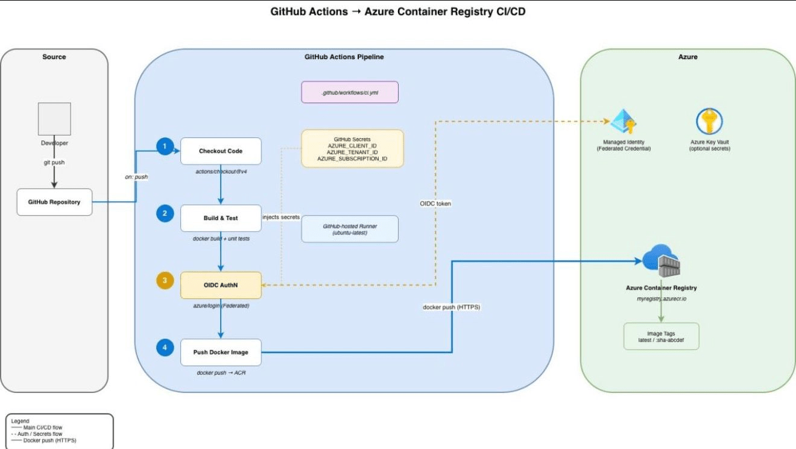

我开始用 [Draw.io MCP](https://github.com/lgazo/drawio-mcp-server) 之前，画一张架构图的标准流程是：打开 diagrams.net，拖拽形状，手动连线，排版，导出为 PNG，粘贴进 Confluence 或 slide deck，然后两周后忘记更新它。这个流程很常见，也很没效率。

Draw.io MCP 改变了这个循环。给它结构化的输入，几秒钟内就有可编辑的 `.drawio` 文件。更重要的是，这个文件可以和代码一起进 Git，可以被 diff，可以在流水线变更后重新生成。图表从此有了生命，而不是一张被遗忘在 slide 里的截图。

## Draw.io MCP 实际做了什么

它在 Draw.io（也叫 diagrams.net）和 AI 工具之间建了一层桥，通过 Model Context Protocol (MCP) 传递结构化指令。你不用拖动任何形状，只需提供文本、CSV 或 Mermaid 格式的输入，MCP 就会生成 `.drawio`、`.png` 或 `.svg` 文件，或者返回一个托管链接。

有几种运行方式可以选择：

- **MCP App Server**：直接在兼容的 AI 聊天界面中渲染图表
- **MCP Tool Server**：生成草稿后在浏览器中打开供编辑
- **CLI/skill 集成**：本地生成并导出
- **Hosted Instructions 模式**：不用安装任何东西就能创建图表

支持的格式包括原生 Draw.io XML、CSV（简单但出奇地好用），以及 Mermaid.js。50 个节点以下的图，草稿在几秒内出来。更大的图可能需要五秒或更久，但比手工画快太多了。

没有什么魔法，就是实用的自动化。用过之后我现在遇到需要图表的场景，第一反应就是先问 MCP。

## 为什么它适合工程工作流

云平台和基础设施的架构图不该是静态文档。需求、服务边界、CI/CD 流程都在变，图也应该跟着变。问题是手动维护的成本太高，所以大多数团队选择不维护。

Draw.io MCP 解决的正是这个问题：

**速度**：几分钟出草稿，不是几小时。草稿不需要完美，需要足够快。

**一致性**：结构化输入强制执行固定的布局风格，团队里不同人生成的图遵循同样的规范。

**版本控制**：`.drawio` 文件进 Git，diff 和 merge 真的有意义。图表改了什么，一目了然。

**可复现性**：架构变更后重新生成图只需几秒，而不是重画。

图表从此成为工程工作流的一部分，而不是可有可无的附属品。

## 一个真实示例：生成 CI/CD 图

用一个专门[为 Draw.io MCP 构建的 GitHub Copilot skill](https://github.com/thomast1906/github-copilot-agent-skills/tree/main/.github/skills/drawio-mcp-diagramming) 发出这条指令：

> "Create a clean CI/CD diagram for GitHub Actions deploying to an Azure Container Registry using drawio mcp"

几秒钟后，生成一个 `.drawio` 文件，内容包含：

- Workflow 触发条件
- 构建步骤
- 推送到 Azure Container Registry
- 部署到容器

草稿不是完美的，但已经 80-90% 正确。调整几个组件名称，微调布局，然后和 YAML workflow 文件一起提交。后来 pipeline 变更了，重新生成图只花了几秒。

从空白画布开始画，变成从一个已经接近正确的东西开始改。这个差别在实际工作中非常明显。

## 在 AI 辅助开发场景下，它为什么变得更重要

AI 工具的文字输出对架构理解来说往往不够直观。一张图能在人和系统意图之间建立比文字更快的共识。

有一个我常用的工作模式：

1. 用 prompt 表达架构意图
2. 生成图表草稿
3. 检查清晰度和正确性
4. 精炼后和文档一起发布

这不是用图代替思考，而是让意图在早期就可视化。团队里的人能更快看出问题，反馈循环更短，讨论有了焦点。

## 它填补的那个空缺

很多团队的图表有「半衰期短」的问题。kickoff 时画了，下个 sprint 就和实际情况脱节了。原因很简单：更新图的成本太高，优先级总是排不上去。

Draw.io MCP 让更新成本下降到接近零：架构变了，重跑一次，新图出来，commit。图表的命名和结构保持一致，因为每次都从同样的结构化输入生成。

一旦图表进了 Git，就会被 review、被 diff、被讨论，就像代码一样。这才是真正的「图即代码」。

### 让自动生成的图保持可用的几个原则

自动化图有一个风险：如果输入太细，图会变成一团乱麻，什么都看不清楚。我自己用下来，几条原则比较有用：

- 每张图最多 3-4 个泳道或区域
- 保持清晰的从左到右的主流向
- 用阶段编号代替大量边标签
- 每个方块一个明确的职责
- 避免交叉箭头

云架构图还可以加简单的校验逻辑，确保输出的连贯性。输入干净，输出才干净。

### 什么时候该用，什么时候不用

适合用 Draw.io MCP 的场景：

- 需要快速的架构迭代
- 需要一致的图表规范
- 需要可版本控制、可复现的输出

不适合完全依赖它的场景：营销 slide、高管演示这类需要高度打磨的视觉材料。在这类场景，用 MCP 生成一个扎实的基线，再手动精炼。

## 它在生命周期中的位置

Draw.io MCP 不只是项目初期用一次：

- **设计阶段**：快速对比不同方案
- **实施阶段**：验证部署意图
- **运营阶段**：保持 runbook 更新

在使用 infrastructure as code 的环境里，甚至可以在 CI/CD 流水线里自动生成图，比如从 Terraform plan 生成更新后的架构图。图表成为交付物的一部分，而不是可选的附属任务。

## 团队如何落地

向团队引入 MCP 时，保持轻量的 onboarding 是关键：

1. 先标准化一种图类型（比如服务流程图）
2. 定义简单的视觉规范（泳道、方向、命名）
3. 把图表加入 PR 和设计评审的检查清单
4. 再扩展到领域特定的 skill（云图标校验、合规映射）

从小处开始，快速交付价值，再逐步扩展。

## 最后说一句

Draw.io MCP 把画图变成了工程工作的一部分，而不是一件一拖再拖的杂事。它降低了保持图表更新的成本，让视觉资产真正融入交付流程，在 AI 辅助和代码驱动的工作环境里自然契合。

第一稿的精致度会有所取舍，换来的是速度和适应性。实践下来，这正是让图表保持诚实、与现实对齐的代价。

从你的团队最常用的一种图开始，定好视觉规范，把 MCP 集成进 review 流程。当图表和系统住在一起而不是 slide deck 里，价值才真正显现。

## 参考

- [原文](https://thomasthornton.cloud/draw-io-mcp-for-diagram-generation-why-its-worth-using/) — Thomas Thornton
- [Draw.io MCP Server (GitHub)](https://github.com/lgazo/drawio-mcp-server)
- [GitHub Copilot Draw.io MCP Skill](https://github.com/thomast1906/github-copilot-agent-skills/tree/main/.github/skills/drawio-mcp-diagramming)
