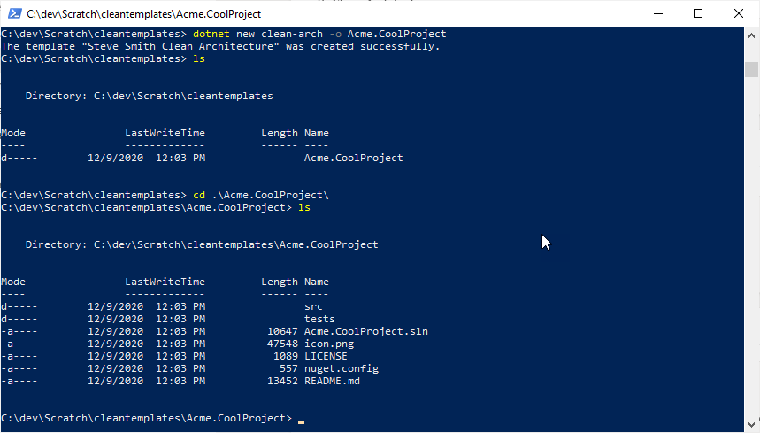
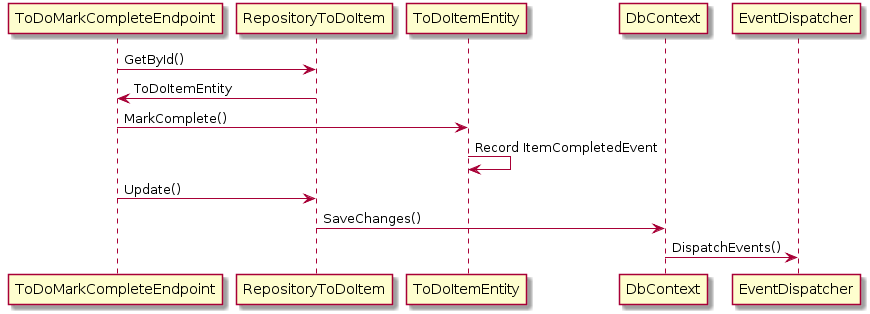

很多项目失败不是因为没人写代码，而是因为代码写在了错误的地方。当 Controller 里塞满业务逻辑，当数据库实体被直接暴露给前端，当单元测试因为依赖 EF Core 而跑不起来——这些问题的根源都指向同一件事：层次边界腐烂了。

[ardalis/CleanArchitecture](https://github.com/ardalis/CleanArchitecture) 是 Steve Smith（@ardalis）维护了十年的 ASP.NET Core 项目模板，当前已获得 18k star、3.1k fork，被 Amazon AWS 的 FOSS 基金选中赞助。它不是一个完整的参考应用，而是一个**有正确层次骨架的起点**——告诉你什么代码应该放在哪里，然后由你填充真正的业务内容。

## 两套模板，两种权衡

从版本 10.x 开始，这个仓库提供了两套 `dotnet new` 模板，对应两种不同的场景选择。

**Full Clean Architecture（`clean-arch`）** 是传统的四层方案：Core、UseCases、Infrastructure、Web 各成独立项目，层与层之间通过抽象接口解耦。这是团队规模较大、业务域较复杂、需要长期演进的应用的自然选择。

**Minimal Clean Architecture（`min-clean`）** 则是单 Web 项目 + 垂直切片架构。它省掉了多项目的配套开销，用 FastEndpoints 按功能特性（feature）组织代码，适合 MVP、小型应用或者"先跑起来再说"的场景。

| 维度            | Full Clean                                               | Minimal Clean                     |
| --------------- | -------------------------------------------------------- | --------------------------------- |
| 项目数量        | 4+（Core、UseCases、Infrastructure、Web）                | 1（Web）                          |
| 组织方式        | 按层（水平切分）                                         | 按特性（垂直切片）                |
| DDD 模式        | Aggregates、Value Objects、Domain Events、Specifications | 简化领域模型                      |
| Repository 模式 | 是，配合 Specifications                                  | 可选（直接 DbContext 或简单仓储） |
| 学习曲线        | 较陡                                                     | 平缓                              |
| 最适合          | 大型企业应用，长期维护                                   | MVP、小型应用、快速迭代           |

拿不定主意时，从 Minimal Clean 开始，等业务复杂度真的需要更严格的边界时再迁移到 Full Clean。

## 安装与创建

两套模板都通过 NuGet 安装：

```bash
# Full Clean Architecture
dotnet new install Ardalis.CleanArchitecture.Template

# Minimal Clean Architecture
dotnet new install Ardalis.MinimalClean.Template
```

创建项目：

```bash
# Full
dotnet new clean-arch -o Your.ProjectName

# Minimal
dotnet new min-clean -o Your.ProjectName
```

`Your.ProjectName` 目录会自动创建，所有命名空间已经按项目名替换好，打开就能直接运行和测试。有两个已知限制：项目名不能包含连字符，也不要用 `Ardalis` 作为命名空间（会和依赖包冲突）。

模板安装后的第一次使用示例：



## Full Clean Architecture 的四层设计

### Core 项目

这是整个架构的核心，所有其他项目的依赖箭头都指向它，但它自己几乎不依赖任何外部包。Core 项目包含领域模型的全部元素：实体（Entity）、聚合根（Aggregate Root）、值对象（Value Object）、领域事件（Domain Event）及其处理器、领域服务、规约（Specification）和接口定义。

> Core 不依赖 Infrastructure，这是依赖倒置原则（Dependency Inversion）的直接体现。Infrastructure 实现 Core 定义的接口，而不是反过来。

### UsesCases 项目

可选层，也常被称为 Application Layer 或 Application Services。按 CQRS 组织成 Commands 和 Queries 两类，每个命令或查询各自一个文件夹，而不是在外面再套一层 Commands/Queries 目录（扁平一级更易导航）。

Command 需要用 Repository 抽象来访问数据（因为它要写入领域模型）；Query 则不强制使用 Repository，可以直接写 SQL 或调用存储过程——只要能高效拿到数据就行。

这一层的另一个价值是：可以在消息处理管道里注入横切关注点（logging、validation、caching、auth），使用责任链（Chain of Responsibility）模式，不污染 Core 和 Web。

### Infrastructure 项目

所有对外部资源的依赖都在这里实现：Entity Framework Core 数据访问、邮件发送、文件读写、外部 API 调用……这些类都实现 Core 中定义的接口。如果项目足够大，Infrastructure 可以拆成多个子项目（如 Infrastructure.Data、Infrastructure.Email），但对大多数项目来说，一个项目按文件夹划分就够了。

### Web 项目

应用程序的入口点。使用 FastEndpoints 库实现 REPR 模式（Request-Endpoint-Response），每个 API 端点对应独立的类，包含自己的请求与响应类型。从版本 9 起，模板不再内置 Controller 和 Razor Pages 支持，但两者都可以在安装后手动添加：

```csharp
// 添加 Controller 支持
builder.Services.AddControllers();
app.MapControllers();

// 添加 Razor Pages 支持
builder.Services.AddRazorPages();
app.MapRazorPages();
```

## 领域事件：解耦的利器

模板内置了领域事件模式的完整示例。领域事件的核心价值在于：**将触发某个操作的动作与该操作的实现解耦**。实体本身不依赖任何基础设施，但事件处理器可以注入任意服务。

以 `ToDoItem.MarkComplete()` 为例，下图展示了一个 API 端点触发这个方法时，事件是如何流转的：



实体方法里只负责修改状态并挂上一个领域事件对象，真正的副作用（发邮件、更新统计、触发集成事件）由注入了依赖的事件处理器完成。

## 在哪里做验证

模板的 README 对这个常见问题给出了明确的分层建议：

Core 的领域模型依靠面向对象封装保证状态一致性，假定传入参数已经验过，碰到异常值直接抛异常而不是返回验证结果。

UseCases 层负责验证 Command/Query 对象本身，推荐通过 Mediator behavior（管道行为）插入 FluentValidation，避免污染 Handler 逻辑。

Web 层的 FastEndpoints 内置了请求验证支持，在请求进入系统边界时做第一道过滤。

两个地方都加验证（Web + UseCases）看起来重复，但对 API 请求和内部消息分别验证的开销极小，换来的是更高的健壁性。

## SharedKernel 的位置

模板曾在仓库里内置一个 SharedKernel 项目，现已拆成独立的 NuGet 包 [Ardalis.SharedKernel](https://github.com/ardalis/Ardalis.SharedKernel)。README 明确建议：**当你使用这个模板时，用你自己的 SharedKernel 替换它**。如果你的应用横跨多个限界上下文（Bounded Context），SharedKernel 应该单独维护并作为内部 NuGet 包发布，而不是直接引用源码。

## .NET Aspire 支持

从 `clean-arch` 模板开始，可以在创建时加上 `--aspire` 标志（默认 false）来附带 .NET Aspire 集成，获取结构化日志、分布式追踪和服务编排能力。`.aspire` 目录会出现在项目根目录，其中包含 AppHost 和相关配置。

## 测试项目组织

模板在 `tests/` 目录下按测试类型划分：单元测试（Unit Tests）、功能测试（Functional Tests）和集成测试（Integration Tests）。其中功能测试是一种特殊的集成测试——**皮下测试（Subcutaneous Tests）**，直接测试 Web 项目的 API，不启动真实的 HTTP 服务器，也不经过网络。

现在模板也支持并行测试执行（Parallel Test Execution），三个测试项目可以同时跑，配合 Testcontainers 给功能测试提供真实数据库环境。

## 参考

- [原文](https://github.com/ardalis/CleanArchitecture) — ardalis/CleanArchitecture GitHub 仓库
- [Ardalis.CleanArchitecture.Template on NuGet](https://www.nuget.org/packages/Ardalis.CleanArchitecture.Template/)
- [Ardalis.SharedKernel](https://github.com/ardalis/Ardalis.SharedKernel)
- [Clean Architecture with ASP.NET Core 8（YouTube）](https://www.youtube.com/watch?v=yF9SwL0p0Y0)
- [eShopOnWeb on GitHub](https://github.com/nimblepros/eShopOnWeb)
- [Architecting Modern Web Applications with ASP.NET Core（微软电子书）](https://aka.ms/webappebook)
