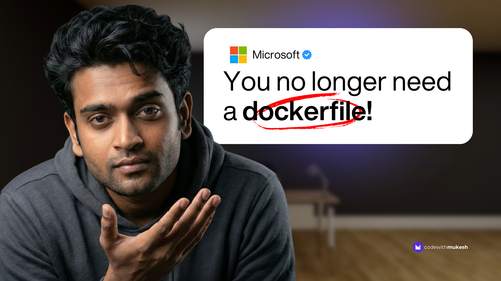

维护 Dockerfile 是一件隐性成本很高的事。你给项目加了一个新的库引用，Dockerfile 里的 `COPY` 指令可能就需要同步更新。`Directory.Build.props` 放在仓库根目录，但 Dockerfile 的构建上下文默认只看自己那一层，稍不注意就 `restore` 失败。如果是五个微服务，就是五个几乎一模一样的 Dockerfile，每次升级 .NET 版本都得逐一改基础镜像标签。

.NET SDK 早就提供了摆脱这些麻烦的方式。从 .NET 8.0.200 开始，不需要任何额外 NuGet 包，SDK 本身就能把你的应用打包成 OCI 标准容器镜像。`dotnet publish /t:PublishContainer` 这一条命令，负责选择基础镜像、创建镜像层、打标签、推送，全部搞定。



## .NET 内置容器支持到底是什么

用一句话说：SDK 在 `dotnet publish` 阶段直接生成容器镜像，不需要你写 `FROM`、`COPY`、`RUN`、`ENTRYPOINT`。容器配置通过 `.csproj` 里的 MSBuild 属性完成，发布时 SDK 负责把这些属性翻译成镜像层。

这个特性在 .NET 7 以独立 NuGet 包形式引入，.NET 7.0.200 开始对 Web SDK 项目自动引入该包，.NET 8.0.200 起对所有项目类型内置于 SDK，无需任何引用。.NET 10 里，控制台应用也不需要额外配置就能直接发布容器。

默认行为是把镜像推送到本地 Docker 守护进程，所以标准用法还是需要 Docker 或 Podman 在运行。但如果你直接指定远程仓库（`ContainerRegistry`）或导出成 tarball（`ContainerArchiveOutputPath`），连容器运行时都不需要。

## 从零开始跑起来

创建一个 ASP.NET Core Web API 项目：

```bash
dotnet new webapi -n ContainerDemo --framework net10.0
cd ContainerDemo
```

然后一条命令发布为容器：

```bash
dotnet publish --os linux --arch x64 /t:PublishContainer
```

SDK 会自动完成构建、选择基础镜像（`mcr.microsoft.com/dotnet/aspnet:10.0`）、生成镜像层，最后推送到本地 Docker 守护进程。终端会看到类似这样的输出：

```
Building image 'containerdemo' with tags 'latest' on top of 'mcr.microsoft.com/dotnet/aspnet:10.0'.
Pushed image 'containerdemo:latest' to local registry.
```

本地运行容器：

```bash
docker run -d -p 8080:8080 --name my-api containerdemo:latest
```

访问 `http://localhost:8080/weatherforecast`，JSON 响应就出来了。

命令参数说明：`--os linux` 指定目标 OS，`--arch x64` 指定架构，`/t:PublishContainer` 告诉 MSBuild 走容器发布路径而非普通发布。

## 在 .csproj 里配置镜像

SDK 的默认值覆盖了绝大多数场景，但生产环境通常需要微调。所有配置通过 MSBuild 属性完成。

**镜像名称和标签：**

```xml
<PropertyGroup>
  <ContainerRepository>my-company/container-demo</ContainerRepository>
  <ContainerImageTags>1.0.0;latest</ContainerImageTags>
</PropertyGroup>
```

**基础镜像变体（推荐用 ContainerFamily）：**

```xml
<PropertyGroup>
  <ContainerFamily>alpine</ContainerFamily>
</PropertyGroup>
```

`ContainerFamily` 让 SDK 自动管理基础镜像标签，只需指定变体名。可用的值：`alpine`、`noble-chiseled`、`noble-chiseled-extra`、`noble`。比手动写完整 `ContainerBaseImage` 路径更安全，升级 .NET 版本时不会漏改标签。

**端口和环境变量：**

```xml
<ItemGroup>
  <ContainerPort Include="8080" Type="tcp" />
  <ContainerEnvironmentVariable Include="ASPNETCORE_ENVIRONMENT" Value="Production" />
  <ContainerEnvironmentVariable Include="DOTNET_EnableDiagnostics" Value="0" />
</ItemGroup>
```

从 .NET 8 起，端口可从基础镜像的环境变量自动推断，通常不需要手动设置 `ContainerPort`。

**OCI 元数据标签：**

```xml
<ItemGroup>
  <ContainerLabel Include="org.opencontainers.image.authors" Value="Your Name" />
  <ContainerLabel Include="org.opencontainers.image.vendor" Value="your-company" />
</ItemGroup>
```

下面是所有可用属性的完整参考：

| 属性                           | 用途                          | 默认值                        |
| ------------------------------ | ----------------------------- | ----------------------------- |
| `ContainerRepository`          | 镜像名称                      | `AssemblyName`                |
| `ContainerImageTags`           | 分号分隔的标签列表            | `latest`                      |
| `ContainerBaseImage`           | 完整基础镜像引用              | 根据项目类型推断              |
| `ContainerFamily`              | 基础镜像变体                  | —                             |
| `ContainerRegistry`            | 目标仓库地址                  | 本地 Docker 守护进程          |
| `ContainerPort`                | 暴露端口 (TCP/UDP)            | 从环境变量推断                |
| `ContainerEnvironmentVariable` | 运行时环境变量                | —                             |
| `ContainerLabel`               | OCI 元数据标签                | 自动生成                      |
| `ContainerUser`                | 容器运行用户                  | .NET 8+ 默认 `app`（非 root） |
| `ContainerWorkingDirectory`    | 工作目录                      | `/app`                        |
| `ContainerArchiveOutputPath`   | 导出为 tarball                | —                             |
| `ContainerRuntimeIdentifier`   | 目标 OS/架构                  | 来自 `RuntimeIdentifier`      |
| `ContainerRuntimeIdentifiers`  | 多架构目标（分号分隔）        | —                             |
| `ContainerAppCommand`          | 覆盖入口点                    | AppHost 二进制                |
| `ContainerImageFormat`         | 镜像格式：`Docker` 或 `OCI`   | 从基础镜像推断                |
| `LocalRegistry`                | 强制指定 `docker` 或 `podman` | 自动检测                      |

## 六种基础镜像的大小对比

这是最有说服力的数据。同一个 ASP.NET Core 10 Web API（默认模板），六种配置下的镜像大小：

| 基础镜像                           | 配置                             | 镜像大小 | 与默认对比 | 建议场景              |
| ---------------------------------- | -------------------------------- | -------- | ---------- | --------------------- |
| `aspnet:10.0`（Ubuntu Noble）      | 无需任何配置                     | ~232 MB  | 基准       | 开发和通用场景        |
| `aspnet:10.0-alpine`               | `ContainerFamily=alpine`         | ~123 MB  | **-47%**   | **生产环境推荐**      |
| `aspnet:10.0-noble-chiseled`       | `ContainerFamily=noble-chiseled` | ~110 MB  | **-53%**   | 安全优先的生产环境    |
| `aspnet:10.0-noble`                | `ContainerFamily=noble`          | ~225 MB  | -3%        | 明确指定 Ubuntu 24.04 |
| `runtime-deps:10.0-alpine`         | 自包含 + Alpine                  | ~85 MB   | **-63%**   | 性能敏感的 API        |
| `runtime-deps:10.0-noble-chiseled` | 自包含 + Chiseled + AOT          | ~15 MB   | **-94%**   | 极致体积（仅 AOT）    |

Alpine 是大多数生产工作负载的最优选择，零代码改动换来 47% 的体积缩减。Chiseled 镜像更小也更安全（没有 shell、没有包管理器、精简了 OS 组件），但默认不含 ICU 库。如果你的应用用了区域化格式（日期、货币、数字），需要用 `noble-chiseled-extra` 变体。

Native AOT + 自包含发布 + Chiseled 基础镜像可以达到 15 MB 以内，是默认大小的 6%。但 AOT 有自身的约束（不支持重度反射、不支持动态程序集加载），不是每个项目都适合。

## SDK 发布还是 Dockerfile？

每个团队都会问这个问题。直接给结论：

| 场景                      | SDK 发布                       | Dockerfile                       | 建议           |
| ------------------------- | ------------------------------ | -------------------------------- | -------------- |
| 简单 Web API / Worker     | 单命令，零配置                 | 多阶段样板                       | **SDK 发布**   |
| 多项目解决方案            | Directory.Build.props 统一管理 | 每个项目都要列 .csproj           | **SDK 发布**   |
| 需要安装 OS 包（apt-get） | 不支持，需自定义基础镜像       | `RUN apt-get install` 直接用     | **Dockerfile** |
| 多阶段构建（含 npm/前端） | 不能混用 .NET + Node           | 完全可控                         | **Dockerfile** |
| 私有 NuGet 源             | nuget.config 自动处理          | 需要 `COPY nuget.config` + `ARG` | **SDK 发布**   |
| 基础镜像自动更新          | 从 TargetFramework 推断        | 手动改标签                       | **SDK 发布**   |
| CI/CD 集成                | 一步 dotnet publish            | 独立的 docker build + push       | **SDK 发布**   |
| 离线/隔离环境             | tarball 导出支持               | docker save                      | 平手           |
| docker-compose build      | 不直接支持                     | 原生支持                         | **Dockerfile** |

85% 到 90% 的 .NET 项目可以直接用 SDK 发布。只有当你需要在构建时执行 `RUN` 命令（安装 OS 软件包）、需要非 .NET 组件参与的多阶段构建，或者需要 `docker-compose build` 时，才必须保留 Dockerfile。

还有一种折中方案：用 Dockerfile 构建一个自定义基础镜像并推送到仓库，然后所有项目通过 `ContainerBaseImage` 引用它。这样 OS 层的定制集中在一个地方，应用本身的构建仍然享受 SDK 发布的便利。

## .NET 10 里的多架构镜像

从 .NET SDK 8.0.405+ 和 9.0.102+ 开始，SDK 支持多架构容器镜像。在 x64 和 ARM64（AWS Graviton、Azure Arm VM）都要部署的团队，这个特性很关键：

```xml
<PropertyGroup>
  <ContainerRuntimeIdentifiers>linux-x64;linux-arm64</ContainerRuntimeIdentifiers>
</PropertyGroup>
```

执行 `dotnet publish /t:PublishContainer` 后，SDK 为每个指定的 RID 分别发布应用，然后将结果合并成一个 OCI Image Index。这个 index 允许多个架构特定的镜像共享同一个名称，`docker pull my-app:latest` 会自动拉取适合当前机器的版本。

`ContainerRuntimeIdentifiers` 必须是 `.csproj` 里 `RuntimeIdentifiers` 的子集。多架构镜像的输出格式始终是 OCI。

## 推送到容器仓库

默认推送到本地 Docker 守护进程。要推送到远程仓库，设置 `ContainerRegistry`：

```bash
# Docker Hub
dotnet publish --os linux --arch x64 /t:PublishContainer \
  -p ContainerRegistry=docker.io \
  -p ContainerRepository=yourusername/container-demo

# GitHub Container Registry
dotnet publish --os linux --arch x64 /t:PublishContainer \
  -p ContainerRegistry=ghcr.io \
  -p ContainerRepository=yourusername/container-demo

# Amazon ECR
dotnet publish --os linux --arch x64 /t:PublishContainer \
  -p ContainerRegistry=123456789.dkr.ecr.us-east-1.amazonaws.com \
  -p ContainerRepository=container-demo
```

身份验证复用 `docker login` 的凭据，发布前运行 `docker login <registry-url>` 即可。CI/CD 环境里也可以通过环境变量 `DOTNET_CONTAINER_REGISTRY_UNAME` 和 `DOTNET_CONTAINER_REGISTRY_PWORD` 传入凭据。

SDK 支持任何实现了 Docker Registry HTTP API V2 的仓库，包括 Docker Hub、GitHub Packages、Amazon ECR、Azure Container Registry、Google Artifact Registry、GitLab Container Registry 和 Quay.io。

如果需要在推送前做安全扫描（Trivy、Snyk、Grype），用 tarball 导出：

```bash
dotnet publish --os linux --arch x64 /t:PublishContainer \
  -p ContainerArchiveOutputPath=./images/container-demo.tar.gz
```

不需要运行中的 Docker 守护进程，导出完成后可以通过 `docker load -i ./images/container-demo.tar.gz` 或 `podman load` 加载。

## GitHub Actions 集成

下面是一个完整的工作流，构建 .NET 10 Web API 并推送到 GitHub Container Registry：

```yaml
name: Build and Push Container
on:
  push:
    branches: [main]
  workflow_dispatch:

env:
  REGISTRY: ghcr.io
  IMAGE_NAME: ${{ github.repository }}

jobs:
  build-and-push:
    runs-on: ubuntu-latest
    permissions:
      contents: read
      packages: write

    steps:
      - name: Checkout
        uses: actions/checkout@v6

      - name: Setup .NET 10
        uses: actions/setup-dotnet@v5
        with:
          dotnet-version: 10.0.x

      - name: Login to GitHub Container Registry
        uses: docker/login-action@v3
        with:
          registry: ${{ env.REGISTRY }}
          username: ${{ github.actor }}
          password: ${{ secrets.GITHUB_TOKEN }}

      - name: Publish Container
        run: |
          dotnet publish --os linux --arch x64 /t:PublishContainer \
            -p ContainerRegistry=${{ env.REGISTRY }} \
            -p ContainerRepository=${{ env.IMAGE_NAME }} \
            -p ContainerImageTags="${{ github.sha }};latest"

      - name: Verify Image
        run: docker pull ${{ env.REGISTRY }}/${{ env.IMAGE_NAME }}:latest
```

注意工作流里没有 `docker build` 步骤。`dotnet publish` 一条命令完成构建、打包、推送，比传统 Dockerfile 工作流少了一整个构建步骤，也不需要配置构建上下文和层缓存。

## 多项目解决方案用 Directory.Build.props

Clean Architecture、模块化单体或微服务架构下，通常有多个需要容器化的项目。在仓库根目录放一个 `Directory.Build.props`，统一容器配置：

```xml
<Project>
  <PropertyGroup>
    <ContainerFamily>alpine</ContainerFamily>
    <ContainerImageTags>1.0.0;latest</ContainerImageTags>
  </PropertyGroup>
</Project>
```

各项目的 `.csproj` 里只写自己的特定配置：

```xml
<!-- catalog-api/catalog-api.csproj -->
<PropertyGroup>
  <ContainerRepository>mycompany/catalog-api</ContainerRepository>
</PropertyGroup>
```

```xml
<!-- orders-api/orders-api.csproj -->
<PropertyGroup>
  <ContainerRepository>mycompany/orders-api</ContainerRepository>
</PropertyGroup>
```

每个项目发布时都会用共享的 Alpine 基础镜像和共享标签，只有镜像名称不同。升级到 .NET 11 时，改一次 `TargetFramework`，所有项目的容器基础镜像自动跟着更新。Dockerfile 时代需要逐个改的重复工作就消失了。

## 生产环境加固清单

上线前逐项确认：

**以非 root 用户运行** — .NET 8 起，Microsoft 的官方容器镜像默认使用 `app` 用户（UID 1654）。SDK 发布自动继承这个设置，验证方法：

```bash
docker run --rm containerdemo:latest whoami
# 应该返回 app，而不是 root
```

**使用最小化基础镜像** — 生产环境用 Alpine 或 Chiseled 镜像，减少攻击面：

```xml
<PropertyGroup>
  <ContainerFamily>noble-chiseled</ContainerFamily>
</PropertyGroup>
```

**版本标签要精确** — 不要只用 `latest`，至少包含一个版本标签：

```xml
<PropertyGroup>
  <ContainerImageTags>1.0.0;latest</ContainerImageTags>
</PropertyGroup>
```

**关闭诊断** — 减少运行时 surface area：

```xml
<ItemGroup>
  <ContainerEnvironmentVariable Include="DOTNET_EnableDiagnostics" Value="0" />
</ItemGroup>
```

**健康检查端点** — 确保 API 暴露 `/health`，让 Kubernetes 或 ECS 的存活探针能够正常工作。SDK 不会自动添加 `HEALTHCHECK` 指令，需要在编排层配置。

**部署前安全扫描** — 用 tarball 导出流程配合 Trivy 扫描：

```bash
dotnet publish --os linux --arch x64 /t:PublishContainer \
  -p ContainerArchiveOutputPath=./image.tar.gz
trivy image --input ./image.tar.gz
```

## 常见报错处理

`"The CreateNewImage task failed unexpectedly"` — 没有运行中的容器运行时。启动 Docker Desktop 或 Podman，或改用 `ContainerArchiveOutputPath` 导出 tarball。

`"Error: ...does not support the runtime identifier linux-musl-x64"` — 指定了 musl 的 RID 但默认 Debian 基础镜像不支持。设置 `ContainerFamily=alpine` 或手动指定 `ContainerBaseImage` 为 Alpine 镜像。

`"Globalization mode is invariant, but the app requires ICU"` — Alpine 和 Chiseled 镜像默认不含 ICU 库。如果应用需要区域化格式（日期、货币），改用 `-extra` 变体：

```xml
<PropertyGroup>
  <ContainerFamily>noble-chiseled-extra</ContainerFamily>
</PropertyGroup>
```

或者应用本身不依赖区域化格式的话，开启不变全球化模式：

```xml
<PropertyGroup>
  <InvariantGlobalization>true</InvariantGlobalization>
</PropertyGroup>
```

`"docker-compose build doesn't work"` — `docker-compose build` 需要 Dockerfile，不支持 SDK 发布路径。改用 `image:` 字段替代 `build:`，先用 SDK 发布镜像，再在 compose 文件里引用：

```yaml
services:
  api:
    image: my-app:latest
    ports:
      - "8080:8080"
```

Podman 用户无需任何修改，SDK 自动检测环境。如果 Docker 和 Podman 同时存在且 Docker 被别名到了 Podman，会用 Podman。强制指定的话加 `<LocalRegistry>podman</LocalRegistry>`。

写了五年 Dockerfile，维护了无数几乎相同的 `COPY` 指令，这个特性出现的时候确实让人松了口气。不是所有项目都适合，但对于纯 .NET 服务，它就是更好的默认选择。

## 参考

- [原文](https://codewithmukesh.com/blog/containerize-dotnet-without-dockerfile/) — Mukesh Murugan, codewithmukesh
- [.NET SDK 容器发布官方文档](https://learn.microsoft.com/en-us/dotnet/core/containers/sdk-publish) — Microsoft Learn
- [容器发布配置参考](https://learn.microsoft.com/en-us/dotnet/core/containers/publish-configuration) — Microsoft Learn
- [OCI Image Index 规范](https://specs.opencontainers.org/image-spec/image-index/) — OCI 规范
