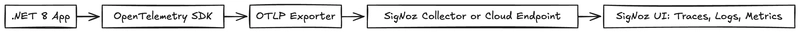
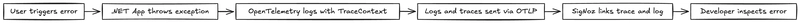
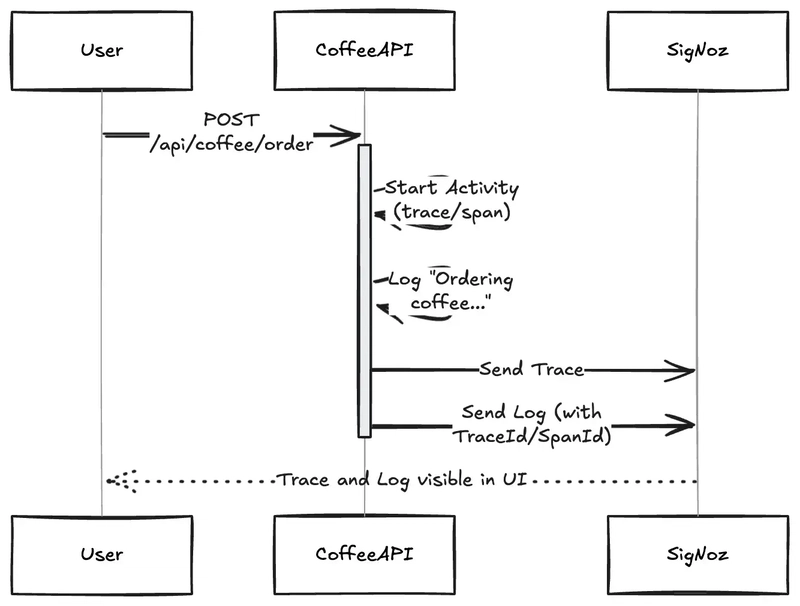

调试线上问题时，你拿到了一条错误日志，却不知道它属于哪条请求链路。TraceId 在日志里是空的，或者日志和 trace 压根用的不是同一套上下文。这是可观测性没做到位的典型症状，.NET 8 加上 OpenTelemetry 可以把这个问题彻底解掉。

.NET 8 通过 `System.Diagnostics` 命名空间内置了对 OpenTelemetry (OTel) 的支持，配合 NuGet 包可以实现：ASP.NET Core 和 HTTP 客户端的自动埋点、用 Activity 手动创建 span、通过 OTLP exporter 把遥测数据推送到 SigNoz 这类后端系统。

## 两种导出方式的取舍

把 .NET 应用的遥测数据发到 SigNoz 有两条路：直接用 OTLP exporter，或者先走一个 OpenTelemetry Collector 中转。

**OTLP exporter** 直接从应用往 SigNoz 推数据，配置简单，没有额外组件，适合本地开发或轻量应用。代价是应用和后端系统耦合较紧，对遥测流量几乎没有控制空间。

**OpenTelemetry Collector** 作为网关接收、处理、转发遥测数据，支持批处理、重试、过滤和多目的地导出，但需要额外维护一个基础设施组件。生产环境或多服务架构推荐走这条路。

| 场景              | OTLP Exporter | OTel Collector |
| ----------------- | ------------- | -------------- |
| 开发/测试快速接入 | ✅            | ❌             |
| 生产规模应用      | ⚠ 有限       | ✅ 推荐        |
| 集中管控遥测管道  | ❌            | ✅             |
| 高级过滤与采样    | ❌            | ✅             |

本文用 OTLP exporter 快速跑通，后续架构演进时再切换 Collector 不需要改业务代码。

## SigNoz 做了什么

SigNoz 是基于 OpenTelemetry 构建的开源可观测平台，把日志、指标、链路追踪放在一起。最有价值的能力是日志与 trace 的关联：当用户触发 500 错误时，你可以直接看到这条请求对应的完整调用链，以及链路上每个 span 内产生的日志。



SigNoz 的自动关联依赖 `TraceId` 和 `SpanId`：只要日志在一个活跃的 `Activity` 上下文里产生，OpenTelemetry SDK 就会把这两个字段注入进去，SigNoz 就能把日志归到对应的 trace 上。



## 配置过程

项目结构保持简单，以一个咖啡订单 API 为例：

```
/CoffeeApi
  ├── Program.cs
  ├── Controllers/
  │   └── CoffeeController.cs
  ├── Logs/
  │   └── ApplicationLogs.cs
```

### 安装 NuGet 包

```
dotnet add package OpenTelemetry.Extensions.Hosting
dotnet add package OpenTelemetry.Exporter.OpenTelemetryProtocol
dotnet add package OpenTelemetry.Instrumentation.AspNetCore
dotnet add package OpenTelemetry.Instrumentation.Http
```

### 配置 OpenTelemetry

`Program.cs` 里同时配置 tracing 和 logging 两个管道，关键点是两者使用相同的 `serviceName`，这样 SigNoz 才能把它们关联起来：

```csharp
using Microsoft.AspNetCore.Builder;
using Microsoft.Extensions.DependencyInjection;
using Microsoft.Extensions.Logging;
using OpenTelemetry.Logs;
using OpenTelemetry.Resources;
using OpenTelemetry.Trace;

var builder = WebApplication.CreateBuilder(args);

// 配置链路追踪
builder.Services.AddOpenTelemetry()
    .WithTracing(tpb =>
    {
        tpb.SetResourceBuilder(ResourceBuilder.CreateDefault().AddService("coffee-api"))
           .AddAspNetCoreInstrumentation() // 自动埋点 ASP.NET Core 中间件
           .AddHttpClientInstrumentation()  // 自动埋点 HTTP 客户端
           .AddOtlpExporter(otlp =>
           {
               otlp.Endpoint = new Uri("https://<your-signoz-endpoint>:4318");
               otlp.Headers = "signoz-ingestion-key=<your-signoz-key>";
           });
    });

// 配置日志
builder.Logging.ClearProviders();
builder.Logging.AddOpenTelemetry(opt =>
{
    opt.IncludeFormattedMessage = true; // 包含格式化后的日志消息
    opt.IncludeScopes = true;           // 包含 scope 信息
    opt.ParseStateValues = true;        // 启用结构化日志解析
    opt.SetResourceBuilder(ResourceBuilder.CreateDefault().AddService("coffee-api")); // 与 trace 保持一致
    opt.AddOtlpExporter(otlp =>
    {
        otlp.Endpoint = new Uri("https://<your-signoz-endpoint>:4318");
        otlp.Headers = "signoz-ingestion-key=<your-signoz-key>";
    });
});

builder.Services.AddControllers();

var app = builder.Build();
app.MapControllers();
app.Run();
```

### Controller 实现

每个接口动作里手动创建一个 Activity，日志在这个 span 上下文里产生，TraceId 和 SpanId 就会自动附加上去：

```csharp
using Microsoft.AspNetCore.Mvc;
using System.Diagnostics;

namespace CoffeeApi.Controllers;

[ApiController]
[Route("api/[controller]")]
public class CoffeeController : ControllerBase
{
    private readonly ILogger<CoffeeController> _logger;
    private static readonly ActivitySource ActivitySource = new("CoffeeApi.Order");

    public CoffeeController(ILogger<CoffeeController> logger)
    {
        _logger = logger;
    }

    [HttpPost("order")]
    public IActionResult OrderCoffee()
    {
        using var activity = ActivitySource.StartActivity("OrderCoffeeOperation");
        ApplicationLogs.OrderingCoffee(_logger);
        return Ok("Coffee order placed.");
    }

    [HttpPost("update-order")]
    public IActionResult UpdateOrder()
    {
        using var activity = ActivitySource.StartActivity("UpdateOrderOperation");
        ApplicationLogs.UpdatingOrder(_logger);
        return Ok("Coffee order updated.");
    }
}
```

### 结构化日志定义

用 `LoggerMessage` source generator 定义日志，性能更好，类型更安全：

```csharp
namespace CoffeeApi;

public static partial class ApplicationLogs
{
    [LoggerMessage(EventId = 2001, Level = LogLevel.Information, Message = "Ordering coffee...")]
    public static partial void OrderingCoffee(ILogger logger);

    [LoggerMessage(EventId = 2002, Level = LogLevel.Information, Message = "Updating coffee order...")]
    public static partial void UpdatingOrder(ILogger logger);
}
```

## 日志与 Trace 的关联机制

这套机制的工作原理很直接：`ActivitySource.StartActivity()` 创建一个 span，SDK 跟踪当前的 `TraceId` 和 `SpanId`；在这个 span 作用域内调用 `ILogger<T>` 写日志时，OpenTelemetry 自动把 trace 上下文注入日志。`OTEL_LOGS_INCLUDE_TRACE_CONTEXT` 环境变量默认为 `true`，不需要额外配置。



整个流程用三步概括：

1. `ActivitySource.StartActivity("BrewOperation")` 开启一个带唯一 TraceId 的 span
2. 在 span 内调用 `ApplicationLogs.OrderingCoffee(_logger)`，日志自动携带当前 trace 上下文
3. 日志和 trace 通过 OTLP exporter 一起发到 SigNoz，SigNoz 用共享的 TraceId/SpanId 把它们串起来

如果日志和 trace 在 SigNoz 里没有关联，排查方向：确认 `ActivitySource` 的 span 在日志产生时仍处于活跃状态；确认 OTLP exporter 在 tracing 和 logging 两侧都配置了；临时加一个 console exporter，看日志里是否已经带上了 TraceId 字段。

## 参考

- [原文](https://dev.to/ankit01oss/how-to-collect-net-application-logs-with-opentelemetry-34bk) — Ankit Anand，dev.to
- [OpenTelemetry .NET 文档](https://opentelemetry.io/docs/languages/dotnet/)
- [SigNoz 官网](https://signoz.io/)
- [OpenTelemetry Collector 完整指南](https://signoz.io/blog/opentelemetry-collector-complete-guide/)
- [SigNoz 自托管安装说明](https://signoz.io/docs/install/)
