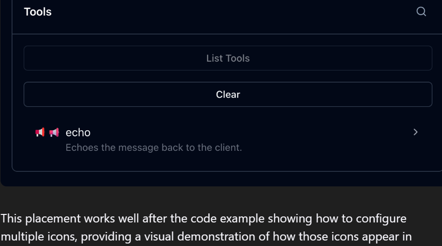

如果你之前看待 MCP C# SDK 的方式还是“能跑一个 demo server，Inspector 里点两下，挺不错”，那这次 `v1.0` 得换个眼光了。

微软在 2026 年 3 月 5 日发布的这篇文章，不是在庆祝版本号终于变成 1.0，而是在告诉你一件更重要的事：官方 MCP C# SDK 已经完整跟上 `2025-11-25` 版 MCP 规范，很多过去只适合演示、不适合上线的环节，现在有了更像样的答案。授权发现、最小权限、敏感信息采集、sampling 里的工具调用、长请求轮询、任务持久化，这些都不是边角功能，它们决定了 MCP 能不能进真实系统。

> 真正拉开“玩具协议”和“工程协议”差距的，从来不是能不能列出工具，而是授权、状态、恢复和长流程处理。

## 这次 1.0，补的是生产环境最疼的那几块

这次发布带来的变化可以分成五条线来看。

一条线是鉴权。SDK 现在完整支持增强版授权服务器发现、增量 scope 同意，以及 Client ID Metadata Documents（CIMD）。另一条线是交互层，工具、资源和 prompts 都能挂图标，服务端还能通过 URL mode elicitation 把敏感采集移到浏览器里处理。再往下，是更硬核的运行时能力：sampling 期间的工具调用、基于 SSE 的长请求轮询恢复、还有实验性的 tasks 原语。

文章原文里把这些能力铺得很开，我读完后的判断很直接：这次 1.0 不是“API 更多了”，而是 MCP 在 .NET 里第一次像一套能认真设计边界的基础设施。

## 鉴权终于不再是临时拼的

过去很多 MCP 示例一谈授权就开始发虚。原因很简单，真正的授权流程本来就复杂，尤其是你要兼顾服务端声明、客户端发现、OAuth 交互和最小权限控制。

这次规范把 Protected Resource Metadata（PRM）文档的发现方式扩展成三种，客户端会按顺序尝试：`WWW-Authenticate` 头里的 `resource_metadata`，由 MCP 端点路径推导出的 well-known URL，以及根级别的 well-known URL。服务端这边，C# SDK 直接通过 `AuthenticationBuilder` 上的 `AddMcp` 就能把这件事接起来：

```csharp
.AddMcp(options =>
{
    options.ResourceMetadata = new()
    {
        ResourceDocumentation = new Uri("https://docs.example.com/api/weather"),
        AuthorizationServers = { new Uri(inMemoryOAuthServerUrl) },
        ScopesSupported = ["mcp:tools"],
    };
});
```

这段配置的意义不在于“少写几行代码”，而在于 SDK 会自动把 PRM 文档挂到 well-known 位置，并在 `WWW-Authenticate` 头里补上链接。客户端也会自动完成发现流程。很多重复样板代码，到这里终于可以少写。

更关键的是增量 scope 同意（incremental scope consent）。以前客户端往往一上来就把可能要用到的 scope 全要了，因为它事先并不知道某次具体操作需要哪些权限。现在不一样了。未认证请求如果需要某个 scope，服务端可以在 `401 Unauthorized` 的 `WWW-Authenticate` 头里把所需 scope 明确说出来；如果 token 已经有了，但还不够，则返回 `403 Forbidden`，并带上 `insufficient_scope` 和补充 scope。客户端再按需扩权并重试。

这就是最小权限原则在 MCP 里的落地版本。它不花哨，但非常重要。

## CIMD 让客户端身份这件事顺了很多

另一个很实用的变化，是规范开始把 Client ID Metadata Documents 当成 MCP 里的优先注册方式。你可以把它理解成：客户端不再只扔给授权服务器一个静态 ID，而是把一个 URL 当作 `client_id`。授权服务器去解这个 URL，读到一份 JSON 文档，从中拿到 `client_id`、`client_name`、`redirect_uris` 这些元数据，再决定如何给策略。

在 C# SDK 里，客户端直接通过 `ClientOAuthOptions` 指定 CIMD URL：

```csharp
const string ClientMetadataDocumentUrl =
    $"{ClientUrl}/client-metadata/cimd-client.json";

await using var transport = new HttpClientTransport(new()
{
    Endpoint = new(McpServerUrl),
    OAuth = new ClientOAuthOptions()
    {
        RedirectUri = new Uri("http://localhost:1179/callback"),
        AuthorizationRedirectDelegate = HandleAuthorizationUrlAsync,
        ClientMetadataDocumentUri = new Uri(ClientMetadataDocumentUrl)
    },
}, HttpClient, LoggerFactory);
```

SDK 会优先尝试 CIMD；如果授权服务器不支持，而且你又启用了 DCR，再自动回退。这个设计很务实。新协议能力能吃到，老环境也不至于直接挂掉。

## 图标和 URL elicitation，看上去是体验，实质是边界

光看“工具、资源、prompt 支持图标”这件事，好像只是 UI 层的小升级。真放进 MCP Inspector 或未来更完整的 Host 里，这种元数据会直接影响可发现性、辨识度和可信感。对多工具、多资源服务器来说，这种小东西积累到最后，体验差很多。



最简单的写法，是在 `McpServerToolAttribute` 上直接填 `IconSource`：

```csharp
[McpServerTool(
    Title = "This is a title",
    IconSource = "https://example.com/tool-icon.svg")]
public static string ToolWithIcon(...)
```

更复杂的场景也支持，比如多图标、不同 MIME 类型、尺寸提示，以及 light/dark theme 的区分。服务端和客户端元数据里的 `Implementation` 现在也能挂 `Icons` 和 `WebsiteUrl`。

但我更看重的是 URL mode elicitation。这个能力把敏感信息采集从 MCP 客户端通道里挪了出去。API Key、第三方授权、支付信息、身份证明这类内容，不再必须经过 host 或 client 的会话上下文，而是可以由服务端返回一个安全 URL，把用户导向浏览器中的独立页面来处理。

这个方向很对。很多系统不是不能做 elicitation，而是不敢把敏感数据塞进模型上下文或 MCP 消息流里。URL mode 给了一个更安全的出口。

## sampling 终于能带工具了，智能工作流会完全不一样

这次规范里最有分量的一项能力，是 sampling 期间的工具调用支持。服务端现在可以在 sampling request 里声明工具，LLM 在生成过程中可以请求调用这些工具。服务端本地执行工具，再把“工具调用请求 + 工具结果”一起放进下一轮 sampling，直到模型给出最终答案。

这和普通的 MCP tools 看起来像，运行逻辑其实不是一回事。工具元数据可以复用，但执行循环是服务端自己维护的。原文里把这个过程讲得很清楚，我把它翻成一句话就是：采样过程不再只是“向模型问一句”，而是可以变成“模型边思考边让你补工具结果”的多轮闭环。

客户端如果要支持这件事，需要声明 sampling tools capability，并提供 `SamplingHandler`。如果你已经在 .NET 里用 `Microsoft.Extensions.AI`，接起来会轻松不少，因为可以直接从 `IChatClient` 生成 sampling handler：

```csharp
IChatClient chatClient =
    new OpenAIClient(
        new ApiKeyCredential(token),
        new OpenAIClientOptions { Endpoint = new Uri(baseUrl) })
    .GetChatClient(modelId)
    .AsIChatClient();

var samplingHandler = chatClient.CreateSamplingHandler();
```

不过原文也提醒了一个非常工程化的问题：这个 handler 解决的是格式转换，不会替你处理用户同意。真正上线时，你还是得自己决定哪些工具调用要弹确认，哪些审批可以缓存。

## 长请求不该因为 HTTP 超时就前功尽弃

MCP 在协议层是消息协议，没有天然时限；HTTP 不是。请求一长，代理层、负载均衡、客户端超时全都来了。`2025-11-25` 规范对这件事做了一个很聪明的修正：服务端在开启 SSE 流时，先发一个空事件，其中带 `Event ID`，还可以附带 `Retry-After`。发完后，服务端可以随时主动断开流，客户端再用这个 `Event ID` 重连继续拿结果。

在 C# SDK 里，服务端要启用这套机制，需要配置事件流存储。官方现成给了 `DistributedCacheEventStreamStore`，兼容 `IDistributedCache`：

```csharp
builder.Services.AddDistributedMemoryCache();

builder.Services
    .AddMcpServer()
    .WithHttpTransport()
    .WithDistributedCacheEventStreamStore()
    .WithTools<RandomNumberTools>();
```

当处理器判断这次请求太长，不适合继续占着 SSE 连接时，直接从 `McpRequestContext` 调 `EnablePollingAsync`：

```csharp
await context.EnablePollingAsync(
    retryInterval: TimeSpan.FromSeconds(retryIntervalInSeconds));
```

这套设计很像成熟系统该有的样子：连接可以断，状态不能丢。

## Tasks 还是实验特性，但方向很对

这次更新里，我最愿意持续关注的是 tasks。它还标着 experimental，但思路非常清楚。stream resumability 解决的是传输层恢复，tasks 解决的是数据层持久化。客户端在请求里加上 task 元数据，服务端就不直接回普通结果，而是回一个带 `taskId`、状态、TTL、建议轮询间隔的 `CreateTaskResult`。之后客户端可以 `tasks/get`、`tasks/result`、`tasks/list`、`tasks/cancel`。

任务状态模型也很完整：

| 状态 | 含义 |
| --- | --- |
| `working` | 正在处理 |
| `input_required` | 等待额外输入，比如 elicitation |
| `completed` | 已完成，结果可取 |
| `failed` | 执行失败 |
| `cancelled` | 已取消 |

客户端调用方式长这样：

```csharp
var result = await client.CallToolAsync(
    new CallToolRequestParams
    {
        Name = "processDataset",
        Arguments = new Dictionary<string, JsonElement>
        {
            ["recordCount"] = JsonSerializer.SerializeToElement(1000)
        },
        Task = new McpTaskMetadata
        {
            TimeToLive = TimeSpan.FromHours(2)
        }
    },
    cancellationToken);
```

后续再轮询直到进入终态，必要时取回最终结果。对 CI/CD、批处理、仓库分析、多步骤审计这类天然异步的场景来说，这个模型非常顺手。MCP 以前在这类工作流里总有点别扭，现在开始有对应的原语了。

服务端如果要接 tasks，也不复杂，关键是有一个真正可靠的 `IMcpTaskStore`。官方示例里的 `InMemoryMcpTaskStore` 更适合开发或单机环境；你真要上多实例，就该自己做持久化实现。

我对这次 v1.0 的总体判断很明确：如果你只是想写一个 echo server，这些能力你一周都碰不到；可一旦你要把 MCP 接到真实的 .NET 系统里，事情立刻就变成授权、恢复、状态、审批、异步执行。这次官方 MCP C# SDK 终于把这些拼图拼出了轮廓。MCP 在 .NET 里，开始有工程味了。

## 参考

- [原文](https://devblogs.microsoft.com/dotnet/release-v10-of-the-official-mcp-csharp-sdk) — Mike Kistler / .NET Blog
- [Model Context Protocol C# SDK](https://github.com/modelcontextprotocol/csharp-sdk) — 官方仓库
- [MCP 2025-11-25 Changelog](https://modelcontextprotocol.io/specification/2025-11-25/changelog) — 本次规范更新清单
- [mcp-whats-new demo repository](https://github.com/mikekistler/mcp-whats-new) — 文中功能对应示例
