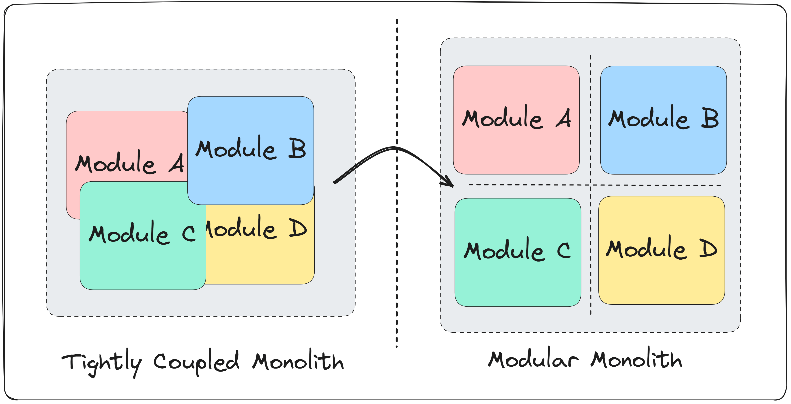
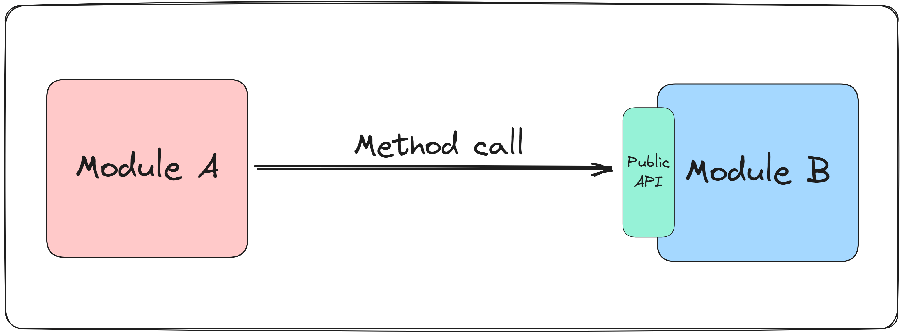
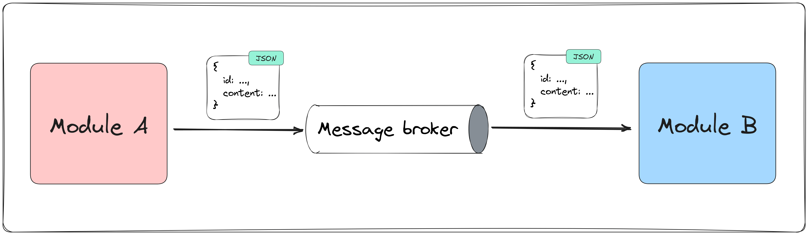

一提到系统拆分，很多团队脑子里先跳出来的还是 Microservices。好像只要业务一复杂，服务不拆几十个都不够体面。

这几年风向已经变了。不是大家突然不爱分布式了，而是越来越多人被运维、部署、链路追踪、故障排查和跨服务协作狠狠干过一轮之后，开始重新尊重“先把边界想清楚”这件事。

模块化单体（Modular Monolith）就站在这个位置上。它保留了按业务边界组织代码的好处，却不急着把系统扔进分布式复杂度的深坑。真正的问题随之而来：模块拆开之后，它们之间到底怎么通信？

> 模块化单体的核心不是“拆文件夹”，而是让模块只能通过公开边界协作。

## 模块化单体到底解决了什么

普通单体最常见的问题，不是“代码都在一个仓库”这件事本身，而是时间一长，依赖关系会越长越歪。一个模块直接摸另一个模块的内部实现，第三个模块再顺手依赖前两个模块的细节，最后整个系统就变成一坨会工作的意大利面。

模块化单体想处理的，正是这种持续失控的耦合。

它会把系统按职责拆成一组内聚的模块，比如支付、订单、发货、评价。每个模块都有自己的实现细节、自己的公开 API，以及尽量清晰的业务边界。这个形状看起来和 Microservices 很像，只不过它们还跑在同一个部署单元里。

这就是它有吸引力的原因。你能先把边界练出来，再决定以后是否要物理拆分。代价没那么夸张，回旋空间大很多。



## 真正的分水岭，在通信方式

模块一旦隔离出来，通信就成了架构里最敏感的地方。因为通信方式不只是“怎么调接口”这么简单，它会直接决定耦合程度、故障传播方式、代码复杂度，以及未来能不能平滑演进到分布式系统。

这篇文章讨论了两种最常见的模式：同步方法调用和异步消息通信。规律很明确，轻巧的那种通常更紧，灵活的那种通常更贵。

## 同步调用，最直给，也最容易上手

第一种做法最朴素：模块 A 直接调用模块 B 暴露出来的公共接口，然后等待结果返回。

在 .NET 里，这通常意味着模块 B 对外暴露一个接口，内部自己实现，外部只能依赖接口而不能摸到实现细节。运行时再通过依赖注入（Dependency Injection）把实现装进去。

```csharp
public interface IShippingModule
{
    Task<ShipmentResponse> CreateShipmentAsync(OrderDto order, CancellationToken cancellationToken);
}

internal sealed class ShippingModule : IShippingModule
{
    public async Task<ShipmentResponse> CreateShipmentAsync(OrderDto order, CancellationToken cancellationToken)
    {
        // 处理发货逻辑
        return new ShipmentResponse(order.Id, "Pending");
    }
}
```

订单模块要发货时，直接调这个接口就行：

```csharp
public sealed class CompleteOrderHandler
{
    private readonly IShippingModule _shippingModule;

    public CompleteOrderHandler(IShippingModule shippingModule)
    {
        _shippingModule = shippingModule;
    }

    public async Task HandleAsync(Order order, CancellationToken cancellationToken)
    {
        var shipment = await _shippingModule.CreateShipmentAsync(
            new OrderDto(order.Id, order.CustomerId, order.TotalAmount),
            cancellationToken);

        order.MarkAsReadyForShipment(shipment.Status);
    }
}
```

这个模式为什么受欢迎？原因很简单：快，而且不绕。

调用发生在内存里，没有消息代理（Message Broker），没有重试队列，没有最终一致性，没有额外的基础设施。开发时非常顺手，调试也直接，断点一路打过去就知道系统在发什么疯。



可问题也很直白。模块 A 依赖模块 B 当前就得活着、得可用、得按时回结果。只要 B 慢了、挂了、超时了，A 也会被拖下水。

这就是同步调用的代价。它让系统更简单，同时也让依赖关系更硬。

## 模块边界清晰，不等于模块天然独立

很多人做模块化单体时，容易掉进一个很微妙的坑：代码目录已经分开了，就以为模块已经独立了。

没这么简单。

如果你的订单模块在一次请求里连续依赖支付模块、库存模块、发货模块的同步结果，那它虽然看起来是“模块化”的，运行时行为还是一条长长的串行链路。任何一个点出问题，整条业务都会跟着抖。

所以，同步调用适合什么场景？适合那种强一致、必须立即返回、而且调用链本身不长的业务动作。比如在同一个事务边界里查询某个模块对外暴露的只读能力，或者执行一个必须马上拿结果的校验动作。

它也很适合系统早期。你想先把业务做通，先把模块边界站稳，再决定以后要不要升级通信方式，这个选择非常现实。

## 异步消息，把模块真正拉开

第二种做法是异步消息（Asynchronous Messaging）。模块 A 不直接等模块 B 给答案，而是把一条消息发出去。谁订阅这类消息，谁来处理。

这时候，模块之间不再直接认识彼此，它们只需要认识消息契约（Message Contract）。换句话说，公开 API 不再是一组接口，而是一组事件和命令模型。

```csharp
public sealed record OrderCompleted(Guid OrderId, Guid CustomerId, decimal TotalAmount);

public sealed class OrderService
{
    private readonly IMessageBus _messageBus;

    public OrderService(IMessageBus messageBus)
    {
        _messageBus = messageBus;
    }

    public async Task CompleteAsync(Order order, CancellationToken cancellationToken)
    {
        order.MarkAsCompleted();

        await _messageBus.PublishAsync(
            new OrderCompleted(order.Id, order.CustomerId, order.TotalAmount),
            cancellationToken);
    }
}
```

发货模块只关心自己订阅的事件：

```csharp
public sealed class OrderCompletedHandler : IIntegrationEventHandler<OrderCompleted>
{
    public async Task HandleAsync(OrderCompleted message, CancellationToken cancellationToken)
    {
        // 创建发货单
    }
}
```

这套模式最迷人的地方，就是解耦。订单模块不需要知道发货模块是不是在线，也不需要知道到底是谁在消费这条消息。消息一发，自己的事务就可以先结束。



这就是为什么很多人会把消息通信看成模块化单体通往 Microservices 的预演。哪天你真要把发货模块拆成独立服务，通信方式几乎可以原样保留。部署单元变了，协作模型没变。

## 便宜的解耦，通常不存在

异步消息当然不是免费午餐。

一旦你把消息代理引进来，系统里就多了一个必须维护的基础设施组件。消息顺序、重复消费、失败重试、死信队列、幂等处理、监控告警，这些东西都会跟着一起长出来。

而且别忘了，消息代理自己也会挂。它不是魔法盒子，它只是把复杂度从业务代码里挪到了通信基础设施里。

如果模块通信非常频繁，而你的团队对消息系统的治理能力又一般，最后很容易出现一种尴尬局面：逻辑上的确更松了，排查成本却陡增。线上出问题时，你要顺着事件流、消费者日志和重试记录一点点捞证据，体验不会太温柔。

原文提到了 Outbox（发件箱）模式，这个点很关键。消息写入数据库，再由后台机制可靠发布，可以降低消息丢失的风险。真遇到代理故障，你至少还有补发的抓手。

## 到底该选哪种

这个问题没有标准答案，只有你愿不愿意为目标付多少钱。

如果你现在最在意的是开发速度、部署简单、链路清晰，而且模块之间的依赖关系还能接受，同步调用完全没问题。别为了“以后可能会拆服务”就把系统提前做成半套分布式，最后连本地调试都变成体力活。

如果你更在意模块独立性，希望系统能自然朝分布式演进，或者某些业务天然适合事件驱动（Event-Driven），那异步消息会更像长期选项。它前期麻烦一些，但边界会更干净，模块也更像真正独立的能力单元。

你甚至不一定非得二选一。

在很多靠谱的模块化单体里，这两种模式本来就会并存：查询和强一致动作走同步，领域事件和跨模块副作用走异步。只要边界和理由说得清楚，这种混搭很正常。

## 真正该警惕的，不是模式本身

最危险的情况，从来不是你选了同步还是异步，而是你没看清自己在交换什么。

同步调用交换的是简单性和速度，代价是更强的运行时依赖。异步消息交换的是独立性和演进空间，代价是基础设施和治理复杂度。

这就是模块化单体里通信设计的本质。不是“哪种更先进”，而是“哪种更适合你现在这支团队、这套系统和这个阶段”。

架构从来不是选边站。它更像预算分配。

## 参考

- [原文: Modular Monolith Communication Patterns](https://www.milanjovanovic.tech/blog/modular-monolith-communication-patterns) — Milan Jovanović
