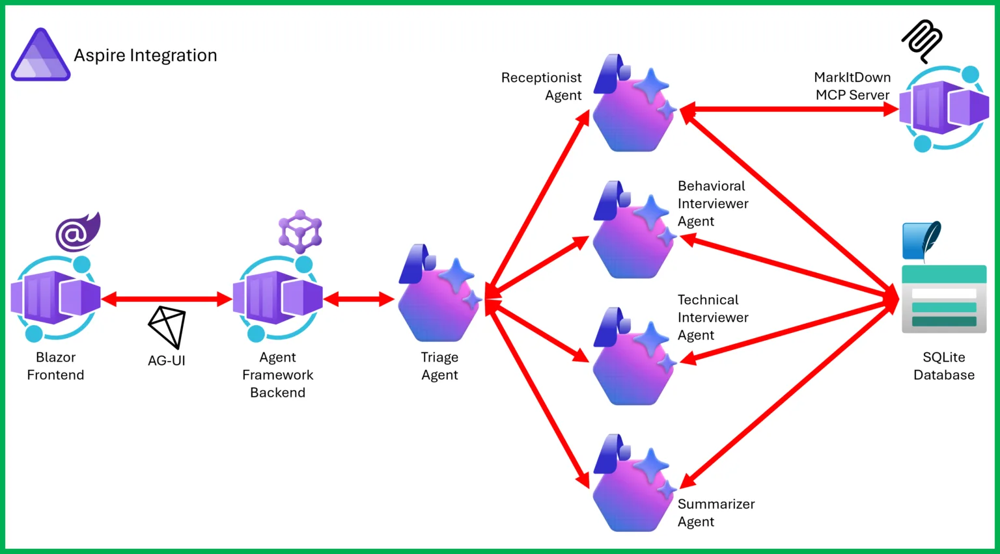
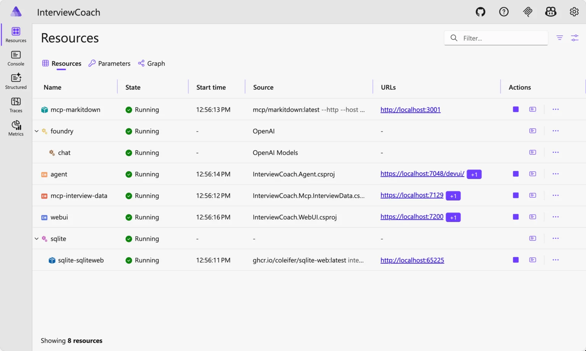
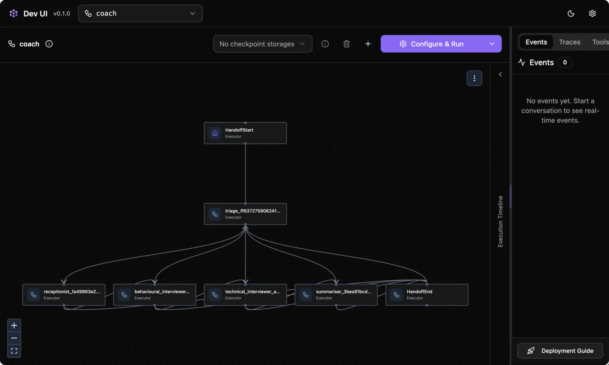
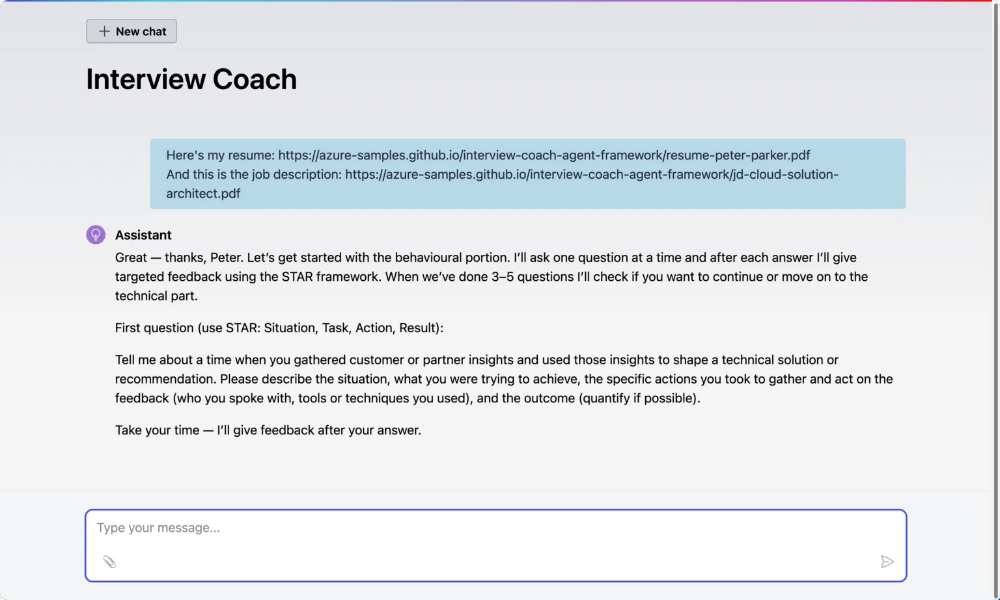

大家现在对 Agent 的耐心，其实已经被练出来了。

写个能跑的 demo，不难。弄一个能聊天、能回话、还能调个工具的 AI 助手，也不算新鲜。真正让人头疼的，是你一旦想把它放进真实系统里，麻烦就开始排队上门：服务怎么拆？状态放哪？工具怎么接？本地能不能跑？上云之后怎么观测、怎么部署、怎么排错？

微软这篇文章的价值，就在这里。它没有继续拿一个“Hello World Agent”糊弄人，而是直接给了一个完整样板：**Interview Coach**。这个样板把 Microsoft Agent Framework、Microsoft Foundry、MCP（Model Context Protocol）和 Aspire 串在一起，做成了一个能本地跑、也能上 Azure 的面试模拟系统。

> 这就是这篇文章最值得看的地方：它讲的不是“Agent 能做什么”，而是“Agent 应用到底该怎么搭”。

## 难点从来都不在模型本身

文章开头先点了一个很现实的问题。现在做 AI Agent 已经越来越容易，真正复杂的部分不是让模型开口说话，而是把它放进一个带持久化状态、多服务协作和生产环境约束的应用里。

这个判断很准。很多团队卡住，不是不会写 Prompt，也不是不会调 API，而是走到工程化这一步就开始散架。一个 demo 看着挺灵，结果没有清晰的服务边界，没有稳定的工具协议，没有完整的可观测性，最后只能停在“演示可用，落地心虚”的阶段。

微软这次选的样板也很讨巧。Interview Coach 不是那种为了炫技硬拼出来的复杂场景，它就是一个很容易理解、又天然适合多阶段交互的应用：用户上传简历和岗位描述，系统发起行为面试、技术面试，最后再给出总结反馈。场景不玄，结构却很完整。

## 为什么是 Microsoft Agent Framework

如果你这段时间一直在看 .NET Agent 生态，应该已经见过 Semantic Kernel 和 AutoGen。微软现在给出的方向很明确，**Microsoft Agent Framework** 是往前收口的一步。

它把 AutoGen 里偏 Agent 抽象和编排的部分，跟 Semantic Kernel 里更偏企业级能力的部分拼到了一起，包括状态管理、类型安全、中间件、遥测这些能力。对 .NET 开发者来说，最直接的意义不是“又多了一个新框架”，而是终于不用在两个微软系方案之间反复横跳。

文章里总结得也很直接：一个框架、熟悉的依赖注入（Dependency Injection）和 `IChatClient` 模型、内建生产特性、再加上多 Agent 编排能力。听起来像宣传词，但放到这个样板里，确实不是空话。

因为 Interview Coach 这个案例刚好证明了一件事：你需要的不是“一个会聊天的 Agent”，而是一组职责不同、能交接上下文的 Agent。框架如果不能把这件事表达清楚，后面全是手搓。

## Foundry 在这里不是配角

很多人看 Agent 文章，容易把模型供应端一笔带过，觉得换哪个 API 都差不多。这个样板偏偏在提醒你，不是这么回事。

微软把 **Microsoft Foundry** 放在推荐后端的位置，不只是因为它是自家平台，而是因为它补的是 Agent 应用真正缺的那部分基础设施：模型入口统一、内容安全、PII 检测、评估、微调、治理和权限控制。

文章里有个表述很实在。对于 Agent Framework 来说，Foundry 在代码层面只是 `IChatClient` 背后的一个配置选择；但在工程层面，它是那个能把模型调用、治理、评估和运维工具一起打包给你的底座。

这差别很大。

写 demo 的时候，大家都爱说“模型抽象做了，所以随便换”。真到项目上线，团队首先关心的通常不是“能不能换”，而是“谁来管安全、成本、审计和运维”。Foundry 就是在回答这个问题。

## 这个 Interview Coach 到底怎么工作

Interview Coach 的交互流程不复杂，但结构很适合拿来做 Agent 架构样板。

系统先收集用户的简历和岗位描述，然后发起行为面试，再进入技术面试，最后输出一份总结。前端是一个 Blazor Web UI，回复以流式方式返回，整体体验更像一个真的面试陪练，而不是问一句答一句的脚本机器人。

更关键的是，文章没有把所有逻辑塞进一个大 Agent，而是老老实实把职责拆开了。

## 架构图一眼就能看出他们想解决什么

整个应用由 Aspire 编排，核心组件包括 WebUI、基于 Agent Framework 的 Agent 服务、负责解析简历文件的 MarkItDown MCP Server，以及负责会话持久化的 InterviewData MCP Server，底层模型能力则由 Foundry 提供。



看到这张图，很多事就清楚了。微软不是在展示“单个 Agent 有多聪明”，而是在展示一个多服务 Agent 应用应该怎样组织：前端单独跑，Agent 逻辑单独跑，工具服务器单独跑，状态存储单独管，服务间关系交给编排层处理。

这种拆法很像正常的后端系统，而不是把 Agent 当成一个神奇黑盒塞进项目中央。这个方向我挺认同。因为 Agent 应用如果想长期维护，最后还是得回到工程边界清晰这件事上。

## 多 Agent handoff，终于不是嘴上说说

这篇文章最有意思的部分，是它把 **handoff（交接）模式** 讲得很具体。

Interview Coach 里一共有五个 Agent：Triage、Receptionist、Behavioral Interviewer、Technical Interviewer 和 Summarizer。它们不是挂名分工，而是真的按职责接管对话。

Triage 负责分流，Receptionist 负责建立会话并收集简历和 JD，Behavioral Interviewer 负责行为面试，Technical Interviewer 负责技术问题，Summarizer 负责最后总结。流程顺下来，就是 Receptionist → Behavioral → Technical → Summarizer；如果用户中途跑偏，流程再退回 Triage 重新分流。

文章特意强调了一点，这和“agent-as-tools”不是一回事。在 handoff 模式里，当前 Agent 会把对话控制权完整交给下一个 Agent。接手之后，新的 Agent 不是临时助手，而是这轮对话的主导者。

这个区别很重要。

因为很多所谓多 Agent 系统，说到底只是一个主 Agent 在调用几个副手。那样做当然也行，但它更像函数调用，不像角色切换。面试这个场景显然更适合 handoff。前台接待、行为面试官、技术面试官和总结者，本来就不是同一个角色。你硬让一个 Agent 一直演到底，逻辑也许能通，边界却会发虚。

文章里给了工作流代码，核心大概是这样：

```csharp
var workflow = AgentWorkflowBuilder
    .CreateHandoffBuilderWith(triageAgent)
    .WithHandoffs(triageAgent, [receptionistAgent, behaviouralAgent, technicalAgent, summariserAgent])
    .WithHandoffs(receptionistAgent, [behaviouralAgent, triageAgent])
    .WithHandoffs(behaviouralAgent, [technicalAgent, triageAgent])
    .WithHandoffs(technicalAgent, [summariserAgent, triageAgent])
    .WithHandoff(summariserAgent, triageAgent)
    .Build();
```

这段代码好就好在，它把“对话如何转交”变成了一个显式的图结构。不是藏在 Prompt 里，不是写死在业务分支里，而是直接进入工作流定义。后面如果你要扩展更多角色，或者给某一步加回退路径，改起来就顺很多。

## MCP 在这里终于像个正经协议，而不是热词

另一个值得看的点，是 **MCP 的用法**。

现在很多文章一提 MCP，就停在“统一工具协议”这层。说没错，但没什么现场感。微软这次给的样板就具体多了：工具不塞进 Agent 进程里，而是放到独立的 MCP Server 里。MarkItDown MCP Server 负责把 PDF、DOCX 这些简历文件转成 Markdown；InterviewData MCP Server 负责把会话状态存进 SQLite。

这套设计的妙处，在于工具团队和 Agent 团队可以分开演进。

MarkItDown 是 Python 服务，主 Agent 是 .NET 服务，二者通过 MCP 对接。你不需要为了语言统一把所有东西重写一遍，也不需要为了图方便把工具层直接糊到 Agent 内部。协议层一旦稳定，边界就能保持住。

文章里还有一个细节我很喜欢。不是每个 Agent 都拿到全部工具。Triage 没有工具，只做路由；面试官只拿会话相关工具；Receptionist 同时拿文档解析和会话工具。这其实就是最小权限原则（Principle of Least Privilege）在 Agent 系统里的落地版本。

很多 Agent 项目一上来就把全量工具塞给主流程，觉得这样最方便。方便是真方便，后患也是真后患。工具访问范围越模糊，行为越难控，排障也越难做。微软这里的做法明显更稳。

## Aspire 负责把“能跑”变成“能管”

如果说 Agent Framework 解决的是角色和流程，MCP 解决的是工具边界，那 **Aspire** 解决的就是运行时组织问题。

这篇文章里，Aspire 扮演的是整套系统的调度层：服务发现、健康检查、遥测、配置注入，以及一键启动。开发者可以直接用一条命令把所有组件拉起来：

```bash
aspire run --file ./apphost.cs
```

这不是小事。

多服务 Agent 样板最容易死在“说明看起来很清楚，结果本地根本拉不起来”。你只要有前端、Agent 服务、MCP 服务、数据库和模型配置，安装门槛马上就堆高了。Aspire 的价值，就是把这些东西统一进一个 app host 里，至少在本地开发和测试阶段，不用每次靠人工记忆拼启动顺序。



文章里还展示了 DevUI 和聊天界面，能看到 handoff 流程是怎么流转的，前端交互又是怎么承接的。





这种可视化其实很关键。Agent 系统一旦开始涉及多角色、多服务、多工具，出问题时最怕的不是报错，而是你根本不知道错在哪一层。能直接在 Dashboard 里看组件状态、在 DevUI 里看流程切换，排障体验会完全不同。

## 本地跑和上云，两套路径都给到了

文章没有故作玄虚，直接给出了本地运行和 Azure 部署的命令。

本地运行的前提包括 .NET 10 SDK、Azure 订阅、Foundry 项目，以及 Docker Desktop 之类的容器运行时。拉下仓库以后，配置 Foundry endpoint 和 API key，再跑 `aspire run` 就行。

部署到 Azure 也没绕弯子，直接用：

```bash
azd auth login
azd up
```

如果测试完不想继续烧钱，还可以用：

```bash
azd down --force --purge
```

这类命令看起来普通，实际很说明问题。微软显然想让这个样板承担两个角色：既是学习材料，也是部署模板。你可以把它当教程，也可以把它当起点，把自己的 Agent 应用往上改。

## 这篇文章真正教会你的，不是一个 demo

文章最后列了一串你能从这个样板里学到的内容：Foundry 作为模型后端、单 Agent 和多 Agent 的构建方式、handoff 编排、MCP 工具服务、Aspire 多服务编排、结构化 Prompt，以及 `azd up` 的部署流程。

这些点单看都不新鲜，放在一张图里就不一样了。

因为 Agent 领域现在最缺的，从来不是概念，而是**完整样板**。你当然可以分别找到多 Agent、MCP、Aspire、Foundry 的介绍文章，但真要把这几样东西装进同一套系统里，中间的空白地带往往只能自己补。微软这篇文章做的，就是把这片空白尽量填上。

我觉得它最有价值的地方，是把一套常见但难讲清的工程判断说实了：多角色系统要显式建工作流，工具最好协议化并独立部署，状态要有专门的存储边界，运行时需要一个统一编排层，云端部署不能靠手工拼装。

这不是新瓶装旧酒，这就是正经工程。

## 什么时候值得认真看这个样板

如果你只是想体验一下 Agent 能不能陪你聊天，这个项目可能有点重。可如果你正在做下面这些事，它就很值得拆开细看：你准备把 Agent 放进现有 .NET 应用；你在纠结多 Agent 究竟该怎么分工；你已经开始接 MCP 工具，但边界有点乱；你希望本地开发和云端部署用同一套结构；或者你单纯想找一个不像玩具的 .NET Agent 样板。

微软最后还提到，他们后面会继续补更多集成场景，包括 Microsoft Foundry Agent Service、GitHub Copilot 和 A2A。这个方向我挺看好。因为有了像 Interview Coach 这种基座，后续加能力就不再只是拼功能，而是能往一套已经成型的应用骨架里填。

Agent 应用接下来拼的，不是谁先把 demo 做得更花，而是谁先把工程结构做得更稳。

微软这次，至少拿出了一份像样的作业。

## 参考

- [原文: Build a real-world example with Microsoft Agent Framework, Microsoft Foundry, MCP and Aspire](https://devblogs.microsoft.com/blog/build-a-real-world-example-with-microsoft-agent-framework-microsoft-foundry-mcp-and-aspire) — Justin Yoo / Microsoft for Developers
- [Interview Coach 示例仓库](https://aka.ms/agentframework/interviewcoach) — Azure-Samples/interview-coach-agent-framework
- [Microsoft Agent Framework 文档](https://aka.ms/agent-framework) — 官方文档入口
- [Microsoft Foundry 文档](https://learn.microsoft.com/azure/foundry/what-is-foundry) — Foundry 平台说明
- [Model Context Protocol](https://modelcontextprotocol.io/) — MCP 官方规范
- [Aspire 文档](https://aspire.dev/) — .NET Aspire 官方站点
