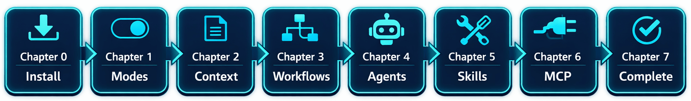

打开终端，输入一句 `copilot`，然后像对同事说话一样描述你的问题。几秒后，代码质量问题、函数实现、单元测试全出来了，而你从没离开过命令行。

这就是 GitHub Copilot CLI 要做的事。GitHub 最近发布了一门完整的开源入门课程 [copilot-cli-for-beginners](https://github.com/github/copilot-cli-for-beginners)，从安装到 MCP 集成，8 个章节，贯穿一个 Python 书单应用的迭代过程。

## GitHub Copilot 家族里的这一员

在理解这门课之前，值得先区分一下 Copilot 家族里各个产品的位置：

| 产品                             | 运行环境                             | 定位                   |
| -------------------------------- | ------------------------------------ | ---------------------- |
| **GitHub Copilot CLI**（本课程） | 你的终端                             | 终端原生 AI 编程助手   |
| **GitHub Copilot**               | VS Code、Visual Studio、JetBrains 等 | 代理模式、内联建议     |
| **Copilot on GitHub.com**        | GitHub 网页                          | 仓库级对话、创建 Agent |
| **GitHub Copilot 编程 Agent**    | GitHub                               | 接收 Issue、自动提 PR  |

Copilot CLI 的不同之处在于：它住在终端，适合偏爱键盘驱动工作流的开发者，也适合需要在 CI/CD 脚本里调用 AI 的团队。

## 课程结构



课程分 8 章，全程配合同一个 Python 书单应用持续迭代：

- **Chapter 00**：安装和认证，支持 npm、Homebrew、WinGet 多种方式，Codespace 直接开箱即用
- **Chapter 01**：三种交互模式 + 常用 slash 命令
- **Chapter 02**：`@` 文件引用语法、上下文管理、`--resume` 会话恢复
- **Chapter 03**：代码审查、Debug、测试生成等开发工作流
- **Chapter 04**：自定义 Agent 和 instructions 文件
- **Chapter 05**：Skills 自动加载机制
- **Chapter 06**：接入 GitHub、数据库和外部 API 的 MCP 集成
- **Chapter 07**：综合 Feature 开发演练

"不需要 AI 经验，能用终端就能学"——课程对受众的定位很准：不是 AI 研究者，是每天写代码的开发者。

## 三种交互模式，这是最重要的判断


Copilot CLI 提供三种交互模式。选错模式不会出错，但会让你多走弯路。

### Interactive 模式：从这里开始

```bash
copilot
```

启动后进入 REPL 环境，每条消息都在同一个上下文里累积。

```
> Review @samples/book-app-project/book_app.py for code quality issues
> Refactor the if/elif chain into a more maintainable structure
> Add type hints to all the handler functions
```

三条 prompt，每条都建立在上一条的基础上。这就是 Interactive 模式的价值：不需要每次重新解释背景，就像和一个记得你刚才说了什么的同事对话。

适合用的场景：探索不熟悉的代码库、迭代地改写某个模块、调试过程中需要多次追问。


### Plan 模式：复杂任务先规划

在 Interactive 会话里输入 `/plan`，或按 **Shift+Tab** 切换：

```
> /plan Add a "mark as read" command to the book app
```

Copilot 会先输出分步实现计划，等你确认后再开始写代码。对于偏大的 Feature，这比"直接生成代码然后发现方向不对"要省时间。


Plan 模式还支持存档：告诉 Copilot "把这个计划保存到 `feature-plan.md`"，它就会帮你生成一份 Markdown 文档。这在团队协作里其实有用。

课程里提到了一个第三模式——**Autopilot**，在 Shift+Tab 循环里会经过它。Autopilot 会不等你确认、自主跑完整个计划。课程建议先熟练用 Interactive 和 Plan，再去研究 Autopilot。这个建议是合理的：让 AI 在你不知道它在做什么的情况下跑代码，是需要对上下文有把握才能放心的事。

### Programmatic 模式：脚本和自动化

```bash
copilot -p "Write a function that checks if a number is even or odd"
```

`-p` 标志让 Copilot 给出一次性回答然后退出，没有会话，没有来回。这正是适合放进 shell 脚本的形态：

```bash
# 自动生成 commit message
COMMIT_MSG=$(copilot -p "Generate a commit message for: $(git diff --staged)")
git commit -m "$COMMIT_MSG"
```

注意 `--allow-all` 这个 flag：programmatic 模式没有交互界面来逐条审批权限，`--allow-all` 跳过所有确认提示。课程特别警告——只在你信任的目录和你自己写的 prompt 里用这个 flag。


## 实际能改变什么

把 Copilot CLI 和传统的"边写代码边开 ChatGPT 标签页"相比：

**会话上下文更连贯**。Interactive 模式的上下文在同一个会话里累积，不需要每次粘贴文件内容解释背景。`@file.py` 语法直接引用本地文件，Copilot 读了再回答。

**代码审查流程变了**。以前要么靠 review 工具、要么靠人工阅读，现在 `copilot -p "Review @myfile.py for issues"` 一行命令跑完整个文件。这不是让人停止 code review，而是让"初审"这件事的成本降到接近零。

**测试生成的门槛低了**。不熟悉测试框架、不知道边界条件是什么——这些以前是写测试最费时间的部分，交给 Copilot 先出一版，再在此基础上调整，比完全手写要快得多。

**MCP 集成打开了新的可能**。Chapter 06 里讲的 MCP（Model Context Protocol）集成意味着 Copilot CLI 可以直接查询 GitHub、访问数据库、调用外部 API。这让终端 AI 助手从"问答工具"变成了真正能触达外部系统的 Agent。

## 什么没有被改变

有几件事 AI 目前接管不了，也不应该接管：

**是否合并这段代码的判断**。Copilot 能生成代码，但"这个实现适不适合当前架构、会不会引入安全隐患、是否符合团队风格"仍然需要人来决定。代码审查里的这一层判断不能外包。

**对 prompt 的设计能力**。课程里有一整章讲如何用 `/plan` 把需求描述清楚。写得含糊，Copilot 给出的计划也会含糊。这考验的是你能否把工程问题描述成可操作的步骤——这本质上是软件工程的基本功，AI 改变不了它的重要性。

**对生成代码的验证责任**。`--allow-all` 让 Copilot 有权限跑命令、读文件，你需要知道它给你什么之前先想清楚会不会出问题。课程在这点上反复强调"只在你信任的环境里用"。

## 参考

- [原文：copilot-cli-for-beginners](https://github.com/github/copilot-cli-for-beginners) — GitHub 官方
- [GitHub Copilot CLI 官方文档](https://docs.github.com/copilot/concepts/agents/about-copilot-cli)
- [CLI 命令参考](https://docs.github.com/en/copilot/reference/cli-command-reference)
- [Autopilot 模式文档](https://docs.github.com/copilot/concepts/agents/copilot-cli/autopilot)
