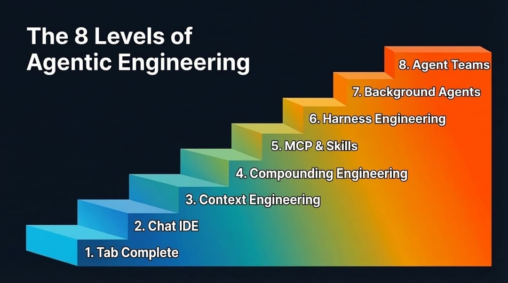
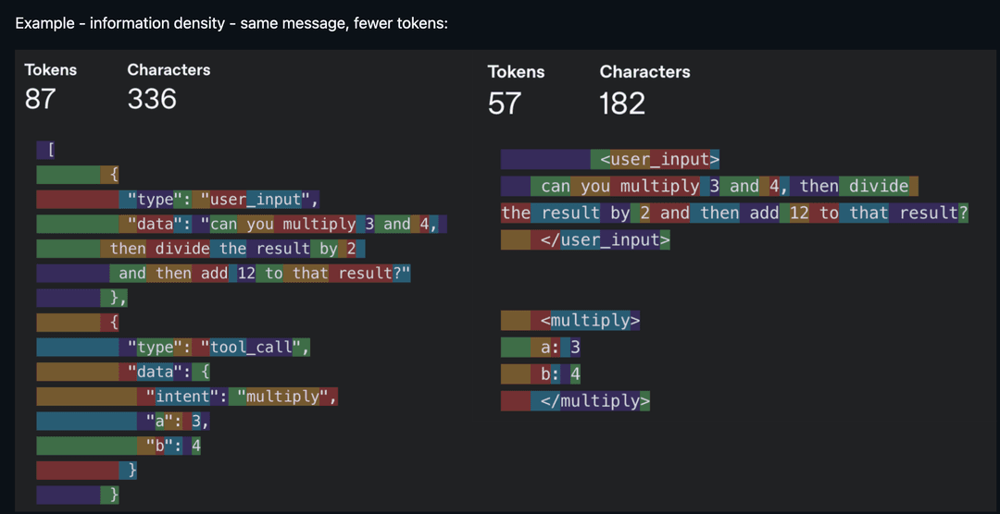
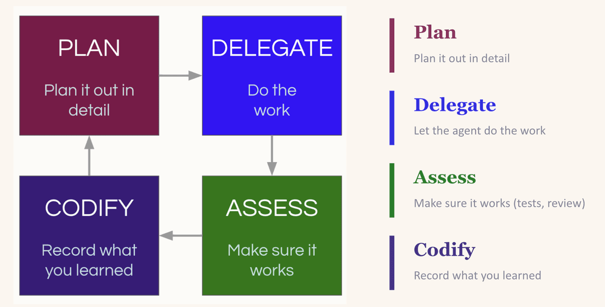
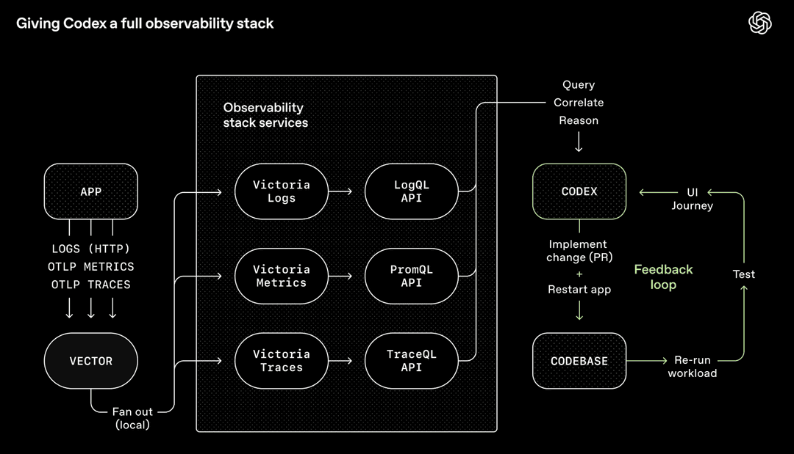
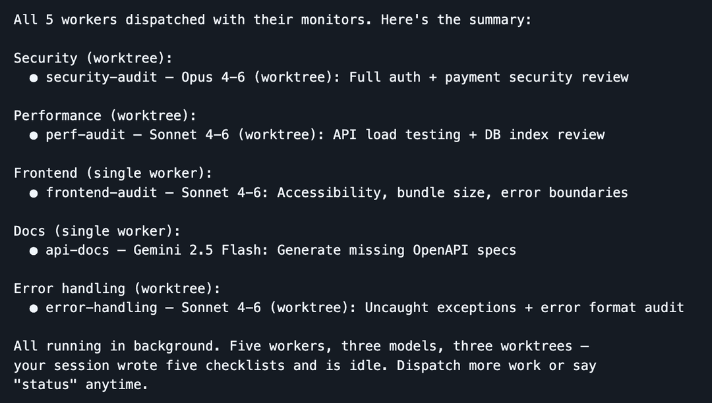

AI 的编码能力已经超过了大多数人驾驭它的能力——SWE-bench 分数的飙升，并没有转化成工程团队实际感知到的生产力提升。Anthropic 团队用同样的模型在 10 天内做出了 Cowork，另一个团队却卡在一个跑不通的 POC 上。区别不是模型，是实践层级的差距。

这个差距不会凭空消失，它一层一层地关闭，一共 8 层。多数读到这里的人已经过了前几层，但越往后，每一层的产出增幅越大，而每一次模型迭代都会进一步放大这种增幅。

还有一个不容忽视的"多人效应"：你的产出，比你以为的更依赖队友的层级。假设你是第 7 层，守着几个后台 Agent 在你睡觉时提 PR，但如果代码库要求一个停留在第 2 层的同事人工审查后才能合并，你的吞吐量照样被卡死。所以拉高团队层级，本质上也是保护自己的产出。

以下是作者 Bassim Eledath 从与多个团队和个人的交流中提炼出来的进阶路径，顺序不是绝对的：

## 第 1、2 层：Tab 补全与 Agent IDE

这两层快速带过，更多是为了记录历史。

Tab 补全是起点。GitHub Copilot 启动了这场运动：按 Tab，代码自动补全。大多数人早就不记得了，或者直接跳过了这一层。它更适合有经验的开发者，先搭好代码骨架，AI 来填充细节。

以 Cursor 为代表的 AI IDE 把聊天接入了代码库，多文件编辑变得顺畅得多。但天花板始终是上下文：模型只能处理它看到的内容，而它看到的，要么不够，要么太杂。多数人在这个阶段也开始尝试"计划模式"：先把粗糙的想法转成分步计划，迭代这个计划，再触发实现。这在当时合理，也是维持控制感的方式，不过到了后面的层级，对计划模式的依赖会越来越少。

## 第 3 层：上下文工程（Context Engineering）

真正有意思的地方从这里开始。

2025 年最热的词之一，上下文工程成立的前提是：模型开始可靠地遵循合理数量的指令，只要上下文信息密度足够高。噪音上下文和信息不足一样糟糕，所以重点变成了让每个 token 都有价值——"每个 token 都必须为自己赢得一席之地"是当时的核心信条。

实践中，上下文工程触及的表面远比想象中广。它是你的系统提示和规则文件（`.cursorrules`、`CLAUDE.md`）。它是工具描述的写法，因为模型通过阅读描述来决定调用哪个工具。它是长对话历史的管理，让运行许久的 Agent 不会在第十轮时迷失。它还是决定每一轮对话暴露哪些工具，因为选项太多会让模型和人一样不知所措。

这个话题在 2026 年讨论得少了，原因是模型对噪音上下文的容忍度提高了，推理能力也更强了（更大的上下文窗口也有帮助）。但几个地方还是会被咬到：

- **小参数模型**对上下文更敏感，语音应用常用小模型，上下文大小还直接影响首 token 延迟。
- **高 token 消耗的工具和模态**，例如 Playwright MCP 和图像输入，会把 Claude Code 的会话推进"压缩模式"比预期快得多。
- **工具数量过多的 Agent**，模型可能把大量 token 花在解析工具 schema 上，而不是做正事。

上下文工程没有消失，只是进化了——焦点从过滤坏上下文，变成了确保正确的上下文在正确的时点出现。这个转变，正是第 4 层的基础。

## 第 4 层：复利工程（Compounding Engineering）

上下文工程改善当前这次会话，[复利工程](https://every.to/source-code/my-ai-had-already-fixed-the-code-before-i-saw-it)改善之后的每次会话。由 Kieran Klaassen 推广，复利工程是很多人（包括作者本人）的思维转折点："氛围编程"（vibe coding）能做的，远不只是原型。

它的核心是一个循环：规划 → 委托 → 评估 → 固化。你带着足够上下文规划任务，把它委托给 LLM，评估输出，然后把学到的东西固化下来：什么有效，什么不行，下次该遵循什么模式。

魔法在"固化"这一步。LLM 是无状态的。你昨天明确删掉的依赖，它明天照样会重新引入，除非你告诉它不要这样做。最常见的做法是更新 `CLAUDE.md`（或等效规则文件），让经验写入每一次未来会话。有一点要注意：把所有东西都塞进规则文件的冲动很危险，指令太多等于没有指令。更好的做法是创造一个环境，让 LLM 能轻松自主地发现有用的上下文，比如维护一个保持更新的 `docs/` 目录（第 7 层会细讲）。

实践复利工程的人，通常对喂给 LLM 的上下文格外敏感。LLM 出错时，他们的本能反应是先想"上下文缺了什么"，而不是"模型能力不行"。这个本能，是第 5 到第 8 层的基础。

## 第 5 层：MCP 与技能扩展

第 3、4 层解决上下文的问题，第 5 层解决能力的问题。MCP 和自定义 skill 让 LLM 能访问你的数据库、API、CI 流水线、设计系统、Playwright、Slack。模型不只是思考代码库，开始对它采取行动。

一个实际案例：作者的团队共用一个迭代了很久的 PR 审查 skill，它在运行时根据 PR 性质动态启动子 Agent，分别处理数据库集成安全性、复杂度分析（标记冗余或过度工程化）、prompt 健康检查（确保 prompt 格式符合团队标准），还会跑 linter 和 Ruff。

为什么值得在审查 skill 上投入这么多？因为当 Agent 开始批量生成 PR 时，人工审查变成了瓶颈，而不是质量门。Latent Space 有[一篇很有说服力的文章](https://www.latent.space/p/reviews-dead)，论点是代码审查已经死了，取而代之的是自动化的、基于 skill 的审查。

在 MCP 这侧，作者使用 Braintrust MCP 让 LLM 直接查询评估日志并做出修改，用 DeepWiki MCP 让 Agent 访问任意开源仓库的文档，而不需要手动把文档引入上下文。

当多人各自写出相似的 skill 时，就值得整合成共享注册表了。[Block](https://engineering.block.xyz/blog/3-principles-for-designing-agent-skills) 建了一个内部 skill 市场，超过 100 个 skill，并为特定角色和团队提供精选包。skill 享受和代码一样的待遇：PR、审查、版本历史。

另一个值得关注的趋势：LLM 越来越倾向于使用 CLI 工具，而不是 MCP。原因是 token 效率。MCP 服务器在每一轮都会把完整的工具 schema 注入上下文，不管 Agent 用不用。CLI 反过来：Agent 运行一个具体命令，只有相关输出进入上下文窗口。

**在继续之前要说一句。** 第 3 到第 5 层，是后面所有层的基础。LLM 在某些事情上出奇地好，在另一些事情上出奇地差，你需要先建立起对这个边界的直觉，才能在上面叠加更多自动化。如果上下文还是乱的，prompt 还是欠指定或错误指定，工具描述还是写得一塌糊涂，第 6 到第 8 层只会把这些问题放大。

## 第 6 层：Harness 工程与自动化反馈循环

火箭真正开始飞的地方。

上下文工程是关于精心挑选模型看什么。[Harness 工程](https://openai.com/index/harness-engineering/)是关于构建整个环境、工具链和反馈循环，让 Agent 能可靠地完成工作，而不需要你介入。给 Agent 反馈循环，不只是给它编辑器。

OpenAI Codex 团队把 Chrome DevTools、可观测性工具和浏览器导航接入了 Agent 运行时，这样它可以截图、驱动 UI 路径、查询日志、验证自己的修复。给定一个 prompt，Agent 能复现 bug、录制视频、实现修复，然后通过驱动应用来验证，再开 PR、回应审查意见、合并，只在需要人类判断时才上报。Agent 不只是写代码，它能看到代码的产出结果并迭代，就像人一样。

作者的团队构建了一个叫 `converse` 的 CLI 工具，让任何 LLM 都能和后端 endpoint 进行多轮对话测试。LLM 做出代码变更，用 `converse` 对实时系统进行对话测试，再迭代。这种自我改进循环有时能连续跑几个小时。当结果可验证时尤其有效：对话必须遵循某个流程，或在特定情况下调用特定工具（比如升级到人工客服）。

支撑这一切的概念是[反压（backpressure）](https://latentpatterns.com/glossary/agent-backpressure)：类型系统、测试、linter、pre-commit hook 这些自动化反馈机制，让 Agent 能在无需人工干预的情况下检测和纠正错误。想要自主性，你就得有反压，否则你得到的只是一台糟粕机器。

这同样延伸到安全领域。[Vercel 的 CTO 论证了](https://vercel.com/blog/security-boundaries-in-agentic-architectures)，Agent、它生成的代码、以及你的密钥应该处于独立的信任域。如果所有东西共享同一个安全上下文，藏在日志里的一次 prompt 注入就能欺骗 Agent 把你的凭证泄露出去。安全边界就是反压：它限制 Agent 出轨时**能**做什么，而不只是它**应该**做什么。

两个让这个层级更清晰的原则：

**为吞吐量设计，不为完美设计。** 如果每次提交都要求完美，Agent 会在同一个 bug 上反复叠加，互相覆盖彼此的修复。更好的做法是容忍小的非阻塞错误，在发布前做一次质量收尾——我们对人类同事也是这样做的。

**约束优于指令。** 逐步式 prompt（"先做 A，再做 B，然后做 C"）已经越来越过时。从实际经验看，定义边界比给清单更有效——Agent 会死盯清单而忽视清单之外的所有事情。更好的 prompt 是："这是我想要的，做到通过所有测试为止。"

Harness 工程的另一半，是确保 Agent 能在没有你陪同的情况下在代码库里导航。OpenAI 的方案：把 `AGENTS.md` 控制在大约 100 行，作为指向其他结构化文档的目录，并把文档的新鲜度作为 CI 的一部分，而不是依赖容易过时的临时更新。

一旦做好了这些，一个自然的问题浮现出来：如果 Agent 能验证自己的工作，在代码库里导航，并在没有你的情况下纠正错误，你为什么还需要坐在椅子上？

## 第 7 层：后台 Agent

计划模式正在消亡。

Claude Code 的创建者 Boris Cherny 今天仍有 80% 的任务从计划模式开始，但每一代新模型，经过规划的单次成功率都在提高。我们正在接近一个临界点：计划模式作为独立的人在循环中的步骤，会逐渐淡出。不是因为规划不重要，而是因为模型自己规划已经可以足够好。

**重要前提**：只有当你完成了第 3 到第 6 层的工作，这才成立。上下文干净，约束明确，工具描述准确，反馈循环紧凑，模型才能可靠地独立规划。没有这些基础，你还是得盯着计划看。

规划本身没有消失，只是形态变了。在第 7 层处理复杂功能时，"规划"不再是写分步大纲，更多是探索：探查代码库、在 worktree 里快速原型、绘制解决方案空间。而且越来越多时候，后台 Agent 在替你做这些探索。

这正是后台 Agent 得以解锁的原因。如果 Agent 能生成可靠的计划并执行，不需要你签字，它就可以在你做别的事的时候异步运行。这是从"我同时管着多个标签页"到"有事情在不需要我的情况下完成"的关键转变。

[Ralph 循环](https://ghuntley.com/loop/)是常见的入门方案：一个自主 Agent 循环，反复运行编码 CLI 直到 PRD 中所有条目完成，每次迭代都启动一个带有新鲜上下文的新实例。实际操作中，Ralph 循环很难配置正确，PRD 中任何欠指定的地方都会在后续被反咬。它有点太"射后不管"了。

可以并行跑多个 Ralph 循环，但 Agent 启动越多，就越会注意到时间实际花到了哪里：协调它们、为工作排序、检查输出、推进进度。你不再写代码了，变成了中层管理。你需要一个编排 Agent 来处理分发，这样你才能专注于意图而不是物流。

作者自己大量使用的工具是 [Dispatch](https://github.com/bassimeledath/dispatch)，这是他构建的一个 Claude Code skill，把会话变成指挥中心：你留在一个干净的会话里，worker 在隔离的上下文里完成繁重工作。分发器负责规划、委托和跟踪，主上下文窗口专门用于编排。当 worker 卡住时，它会提出一个澄清问题，而不是悄悄失败。

Dispatch 本地运行，适合需要靠近工作的快速开发场景：反馈快，交互调试方便，没有基础设施开销。[Ramp 的 Inspect](https://builders.ramp.com/post/why-we-built-our-background-agent) 是互补方案，适用于运行时间更长、自主性更强的工作：每个 Agent 会话在云托管的沙箱 VM 中启动，带有完整的开发环境。PM 在 Slack 里标注了一个 UI bug，Inspect 接手并在你电脑关闭的情况下运行。代价是运维复杂度（基础设施、快照、安全），但换来了本地 Agent 无法匹配的规模和再现性。两种方式都该用。

这一层还有一个出人意料的强力模式：对不同任务使用不同的模型。最优秀的工程团队不是由克隆体组成的，而是由思维方式各异、经历和强项不同的人构成。同样的逻辑适用于 LLM。这些模型的后训练方式不同，倾向有实质性差异。用 Opus 实现，用 Gemini 探索研究，用 Codex 做审查，累积产出比任何单一模型独立完成都要强。

还有一个重要教训，来之不易：把实现者和审查者解耦。如果同一个模型实例既实现又评估自己的工作，它会有偏见，会忽视问题并告诉你所有任务都完成了，其实并没有。不是恶意，和你不该给自己的考卷打分是同一道理。让不同的模型（或者带有审查专用 prompt 的不同实例）做复核，信号质量会大幅提升。

后台 Agent 也打开了把 CI 和 AI 结合起来的大门。一个每次合并时重新生成文档并发 PR 更新 `CLAUDE.md` 的文档机器人（作者的团队在用，省了大量时间）；一个扫描 PR 并自动开修复的安全审查器；一个真正升级依赖包并跑测试套件而不只是标记警告的依赖机器人。干净的上下文、累积的规则、高效的工具、自动化的反馈循环，现在都在自主运行。

## 第 8 层：自主 Agent 团队

还没有人真正掌握这一层，但少数团队正在向它推进。这是当前的活跃前沿。

在第 7 层，你有一个编排 LLM 以中心辐射模式向 worker LLM 分发工作。第 8 层移除了这个瓶颈。Agent 之间直接协调，领取任务、分享发现、标记依赖、解决冲突，不需要把一切都路由给单一编排者。

Claude Code 的实验性 [Agent Teams](https://code.claude.com/docs/en/agent-teams) 是一个早期实现：多个实例并行工作在共享代码库上，每个队员在自己的上下文窗口中运行并互相直接通信。Anthropic 用 16 个并行 Agent 从头构建了一个能编译 Linux 的 C 编译器。Cursor 用数百个并发 Agent 运行了数周，从头构建了一个浏览器，并把自己的代码库从 Solid 迁移到 React。

但仔细看就能看到裂缝。Cursor 发现，没有层级结构，Agent 会变得风险规避，在原地打转没有进展。Anthropic 的 Agent 持续破坏已有功能，直到加入 CI 流水线才防止回归。所有在这一层实验的人说法一致：多 Agent 协调是一个难题，目前没有人接近最优。

对于大多数任务，模型还没有准备好这种级别的自主性。即便足够聪明，对于编译器和浏览器这种"登月计划"以外的日常工作，速度太慢、token 成本太高，还算不上经济可行。第 7 层才是当下最值得投入的地方。第 8 层最终成为主流的那一天可能会来，但不是现在。

## 下一层？

一旦你能无摩擦地调度 Agent 团队，界面没有理由只停留在文字。语音与 coding agent 的对话式交互，代替语音转文字的低效输入，是顺理成章的下一步。看着你的应用，口述一系列变更，然后看它们在眼前发生。

还有很多人在追求完美的"一次性输出"：说出你想要的，AI 一次性完美完成。问题是这预设了人类自己清楚地知道想要什么。事实上我们并不。软件一直是迭代的，我认为它永远都会是。只是会变得容易得多，不再局限于纯文字交互，速度也会快得多。

那么，你现在在哪一层？你在做什么来进入下一层？

## 参考

- [原文：The 8 Levels of Agentic Engineering](https://www.bassimeledath.com/blog/levels-of-agentic-engineering) — Bassim Eledath
- [Compounding Engineering](https://every.to/source-code/my-ai-had-already-fixed-the-code-before-i-saw-it) — Kieran Klaassen
- [Harness Engineering](https://openai.com/index/harness-engineering/) — OpenAI
- [Code Review is Dead](https://www.latent.space/p/reviews-dead) — Latent Space
- [Block: 3 Principles for Designing Agent Skills](https://engineering.block.xyz/blog/3-principles-for-designing-agent-skills)
- [Security Boundaries in Agentic Architectures](https://vercel.com/blog/security-boundaries-in-agentic-architectures) — Vercel
- [The Ralph Loop](https://ghuntley.com/loop/)
- [Dispatch](https://github.com/bassimeledath/dispatch) — Bassim Eledath
- [Agent Backpressure](https://latentpatterns.com/glossary/agent-backpressure) — Latent Patterns
