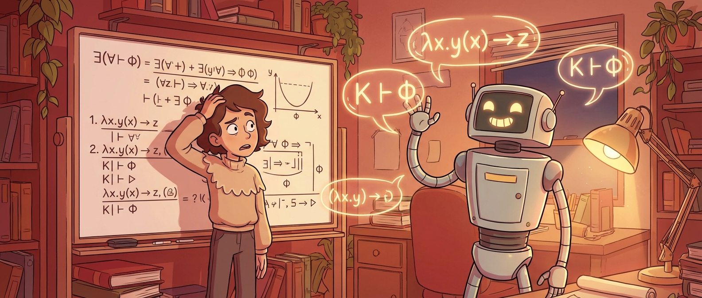

GitHub 上 4% 的 TLA+ 规约文件里出现了 "Claude" 这个词。这个数字来自 Hillel Wayne 的最新观察，一个在形式化方法社区有十多年实践经验的人。他一年前还写过"AI 是 TLA+ 用户的倍增器"，如今自己推翻了那个乐观判断的一半。

问题不在于 LLM 不能生成规约，而在于它生成的规约**没有在验证任何东西**。

## 看一个真实的 Vibe Coding 规约

Hillel 拿了一个公开项目的 Alloy 规约做案例分析。先看代码本身：

```alloy
sig Snapshot {
  owner: one Node,
  signed: one Bool,
  signatures: set Signature
}

pred canImport[p: Policy, s: Snapshot] {
  (p.allowUnsignedImport = True) or (s.signed = True)
}

assert UnsignedImportMustBeDenied {
  all p: Policy, s: Snapshot |
    p.allowUnsignedImport = False and s.signed = False implies not canImport[p, s]
}
```

两个问题。第一，这段代码根本跑不了。它用了 Boolean 标准模块却没写 `open util/boolean`。第二，更关键的是，用 Boolean 本身就是错误的做法，Alloy 正确的写法应该用子类型（subtyping）：

```alloy
sig SignedSnapshot in Snapshot {}

pred canImport[p: Policy, s: Snapshot] {
  s in SignedSnapshot
}
```

看得出来，写这段代码的人根本没有运行过规约。

但编译问题只是表面。真正致命的是那两个 assert：`canImport` 的定义是 `P || Q`，而 `UnsignedImportMustBeDenied` 检查的是 `!P && !Q => !canImport`，`SignedImportMayBeAccepted` 检查的是 `Q => canImport`。这些命题是**同义反复**（tautology），无论模型怎么写都一定通过。它们唯一的作用，充其量是确认 `canImport` 的定义没有手滑打错。

TLA+ 那边也一样。AI 生成的属性全都是"显而易见"的那种：gadget 被检测到了，就应该 block。这类属性在实际工程中确实有用，可以帮你建立基本的信心。但形式化方法真正的价值在于**发现你想不到的问题**：并发条件下的竞态、非确定性导致的状态爆炸、隔几步才暴露的错误路径。

> AI 只写"显而易见的属性"（obvious properties），而形式化方法的核心价值在于"微妙的属性"（subtle properties）。

## 专家用 LLM 和新手用 LLM，结果完全不同

Hillel 提到了一个有趣的对照。Cheng Huang 用 AI 写了一个 CRAQ（一种分布式协议）的 TLA+ 规约，里面的 `NoStaleStrictRead` 属性比前面那些同义反复复杂得多：

```tla+
NoStaleStrictRead ==
  \A i \in 1..Len(eventLog) :
    LET ev == eventLog[i] IN
      ev.type = "read" =>
        LET c == ev.chunk IN
        LET v == ev.version IN
        /\ \A j \in 1..i :
             LET evC == eventLog[j] IN
               evC.type = "commit" /\ evC.chunk = c => evC.version <= v
```

这段规约有意义得多。但 Hillel 指出了一个关键背景：Cheng Huang 本身就是有经验的规约工程师，而且对应的系统已经有一套完整的 P 语言规约可以参考。换句话说，他能从 LLM 那里"压"出更好的结果，不是因为 LLM 变强了，而是因为他自己已经知道该问什么。

Hillel 自己也承认有类似体验：他能引导 LLM 做出比大多数客户更有深度的规约。这对他的咨询业务来说是好消息，但对"AI 让形式化方法普及"这个愿望来说是坏消息。

**如果你得先懂形式化方法才能让 LLM 写好形式化方法，那 AI 真的在降低门槛吗？**

也许是的，如果它把学习时间从 80 小时降到了 20 小时。但目前的证据也可能只是从 80 降到了 75。

## 活性属性是块硬骨头

还有一类属性似乎是 LLM 的根本性盲区。Hillel 和一个客户上周尝试让 Claude 生成 liveness 属性（活性属性，描述"系统最终一定会做某件事"）和 action 属性（动作属性，描述"状态转换的约束"），结果 Claude 就是写不出来，即使给了明确的指令。

这类属性比安全属性（safety property，描述"坏事不会发生"）更"微妙"。安全属性可以通过检查单个状态来验证，活性属性需要推理整条执行路径。是训练数据不够？还是活性属性本身的复杂度超出了当前模型的推理能力？目前还不清楚。

## AI 时代，形式化方法的处境

对"AI 将使形式化验证进入主流"这个论断，现在需要打一个问号。Martin Kleppmann 和 Leonardo de Moura 各自撰文预测 AI 会推动形式化验证的普及，理由是 LLM 降低了"写规约"的门槛。但 Hillel 的观察指向一个更根本的问题：能写出来 ≠ 能验证到位。

这跟 AI 辅助写代码面临的问题类似但更严重。代码写错了至少还有测试和运行时反馈。规约写得没意义，通过了所有检查（因为检查本身就是同义反复），你反而会获得一种**虚假的安全感**。这比没有规约更危险。

从工具链角度看，TLA+ 已经有了官方的 MCP server，LLM 可以直接跑模型检查。这至少能拦住"代码不能编译"这一类低级错误。但"属性写得没意义"这种语义级问题，工具链帮不了你。

对于想用 AI 来接触形式化方法的开发者，Hillel 的案例指向几个务实的判断：

- **别指望 Vibe Coding 能搞定规约**。你可以让 AI 帮你起草语法，但属性的选择和设计需要你自己的领域理解
- **先学 20 小时基础**。理解安全属性和活性属性的区别，理解什么是有意义的不变量，然后 LLM 才能当倍增器
- **永远运行你的规约**。不能编译就不算规约。通过的 assert 不等于验证了什么，要问自己"如果我故意写错一个 guard，这个 assert 能抓住吗？"

Hillel 自己也说，这些观察截至 2026 年 3 月。也许到 6 月这篇文章就过时了。这种谦逊倒是值得记住：在 AI 能力快速迭代的当下，对 LLM 的不足保持敏感，同时对改进保持开放，是一种比"AI 能/不能做 X"更有用的姿态。

## 参考

- [LLMs are bad at vibing specifications](https://buttondown.com/hillelwayne/archive/llms-are-bad-at-vibing-specifications/) — Hillel Wayne, Computer Things newsletter
- [AI is a gamechanger for TLA+ users](https://buttondown.com/hillelwayne/archive/ai-is-a-gamechanger-for-tla-users/) — Hillel Wayne 此前的乐观文章
- [Prediction: AI will make formal verification go mainstream](https://martin.kleppmann.com/2025/12/08/ai-formal-verification.html) — Martin Kleppmann
- [When AI Writes the World's Software, Who Verifies It?](https://leodemoura.github.io/blog/2026/02/28/when-ai-writes-the-worlds-software.html) — Leonardo de Moura
- [Strong and Weak Properties](https://buttondown.com/hillelwayne/archive/some-tests-are-stronger-than-others/) — Hillel Wayne 关于属性强弱的讨论
- [Safety and Liveness](https://www.hillelwayne.com/post/safety-and-liveness/) — 安全属性与活性属性的基础概念
