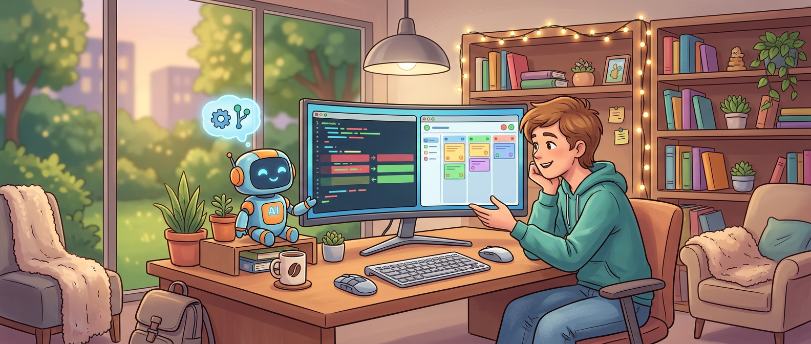

很多人刚上手 coding agent，第一反应都是研究提示词秘方：这句要不要更礼貌，那个命令要不要换个说法，前面加不加“你是世界级工程师”。这种路子不能说完全没用，但它通常不是决定上限的东西。

OpenAI 这篇关于 Codex 的 best practices，真正值得看的地方，不是又教你怎么“更会提问”，而是把一件事说透了：**coding agent 的效果，更多取决于你的工作流设计，而不是单条 prompt 的雕花水平。** 你把它当一次性问答工具，它就只能偶尔灵。你把它当一个可配置、可约束、可复用、可自动化的队友，它才会越来越稳。

这也是为什么这篇内容不只是给 Codex 用户看的。只要你平时会碰 Claude Code、Copilot CLI、OpenCode，甚至 OpenClaw 这类 agent 工作流，里面很多原则都通用，而且挺接近现在真正有产出的那批团队在做的事。

## 真正的起点，不是提示词，是任务上下文

文中先讲 prompt，但重点其实不是“修辞”，而是**上下文质量**。OpenAI 给了一个很实用的四段式框架：目标是什么，哪些上下文重要，有什么约束，做到什么算完成。

这个思路看起来朴素，实战里却很顶用。因为 agent 最容易翻车的地方，从来不是“不会写代码”，而是搞错范围、默认了不该默认的前提，或者压根不知道你要它遵守哪套规则。尤其在大仓库里，你不给边界，它就只能靠猜。

把任务描述成下面这类结构，通常就够用了：

- **Goal**：这次到底要改什么，或者要做出什么
- **Context**：相关文件、目录、报错、参考实现在哪
- **Constraints**：架构限制、团队约定、安全要求、代码风格
- **Done when**：测试过了、bug 不复现了、某个行为变了，还是文档补齐了

这类写法值钱的地方在于，它逼你先把“我要什么”讲清楚。AI 时代，写 prompt 本质上越来越像写 task contract（任务契约）。

> 好 prompt 的核心，不是会不会念咒，而是有没有把任务边界、验证方式和约束条件说完整。

这几年 AI 确实把写代码的门槛往下拉了，但它没有消灭含糊指令带来的成本。相反，agent 越能干，模糊需求造成的返工就越贵。今天真正该练的，不是“花式提示词”，而是把模糊问题收束成可执行任务的能力。

## 难题先别急着写，让 agent 先规划

这篇 best practices 里我最认同的一点，是它明确建议：**复杂任务先 plan，再 code。**

很多人第一次用 coding agent，容易陷进一种奇怪节奏，像带实习生一样盯着它边写边纠偏。结果不是它写得慢，而是你们俩都在没有地图的情况下乱跑。对复杂任务，这种模式非常亏。

OpenAI 提了几种做法：直接开 Plan mode、让 Codex 先反问你、或者用 `PLANS.md` 这类执行计划模板。背后的逻辑很一致，都是先把模糊问题变成结构化问题，再进入实现。

这点在 2026 年更重要，而不是更次要。因为现在 agent 能跑得更远了，能自己找上下文、调工具、改多文件、做 review。也正因为它跑得远，一开始方向歪了，后面就不是“小误差”，而是整段工作流都在偏航。

所以今天看“先规划”这条，不是保守，而是放大 agent 上限的前提。AI 改变的是执行速度，没有改变复杂工程任务需要拆解、澄清、排序和验收标准这件事。

## AGENTS.md 才是长期收益最高的杠杆

如果只让我从整篇里挑一个最值钱的点，我会选 `AGENTS.md`。

原因很简单：很多人把高频规则都堆在 prompt 里，每次都重说一遍。今天要提醒它先跑测试，明天要提醒它别改某目录，后天又要强调 PR 描述格式。短期能凑合，长期很蠢，像每天都在给同一个同事做新人培训。

OpenAI 对 `AGENTS.md` 的定义很准确，可以把它理解成给 agent 看的开放格式 README。里面最适合放这些东西：

- 仓库结构和关键目录
- 本地开发、构建、测试、lint 命令
- 团队约定和工程规范
- 不能碰的红线
- 什么叫 done，怎么验证

这类信息最大的特点，就是**稳定、重复、高频**。它们不该跟着每次对话重新输入，而该沉淀成长期上下文。

更妙的是，这篇还提到一个非常实用的习惯：当 Codex 在同一类事情上犯了两次错，就让它做 retrospective（复盘），然后把结论写回 `AGENTS.md`。这个动作非常像给团队补 runbook，也非常像在训一个逐渐靠谱的同事。

这就是 AI 时代一个容易被低估的变化：很多“提示词工程”最后都会退化成“工作流文档工程”。真正能复利的不是某条神 prompt，而是你有没有把经验写进系统里。

## 配置不是琐碎杂活，它决定了 agent 的稳定性

文里还有一段很容易被忽略，但特别务实：把 Codex 的一致性问题，归因到配置层。

这个判断我很赞同。很多人觉得 agent 输出不稳定，是模型今天聪明、明天犯病。实际上，真实原因经常更土：工作目录错了、默认模型不对、写权限没开、工具没接上、MCP 没配、sandbox 太松或太死。

OpenAI 建议把个人默认配置放到 `~/.codex/config.toml`，仓库特定配置放到 `.codex/config.toml`，命令行覆盖只留给一次性情况。这个思路很工程化，也很健康。因为只要一个行为需要反复手工指定，它迟早就会出错。

放到更广义的 agent 工作流里，这条可以翻译成一句更通用的话：**别把稳定性寄托在聊天时临场发挥，尽量让环境、权限、默认值、工具接入在会话开始前就站好队。**

AI 改变了我们写代码的入口，但没改变一个老事实：环境问题永远比你想象的更影响产出质量。

## 测试、验证、review，不是收尾动作，而是 agent 回路的一部分

很多团队现在已经接受“让 agent 先改代码”，但还没完全接受“让 agent 把验证链也跑完”。这篇 best practices 说得很直接，不要停在“让它改一下”，还要让它补测试、跑检查、确认结果、审视 diff。

这其实是在把 coding agent 从“代码生成器”升级成“带自检的执行单元”。

文中提到几件很实用的事：

- 需要时让它写或更新测试
- 跑对应测试套件
- 检查 lint、format、类型检查
- 确认最终行为和需求一致
- 用 `/review` 或 diff 视图审 diff

这部分最值得记住的，不是哪一个命令，而是顺序。先做、再证、再审，这才是稳定工作流。很多“AI 写的代码不靠谱”，本质上不是写的时候不靠谱，而是没有把验证和审查纳入同一个任务定义里。

> 当你告诉 agent 什么叫完成，它才有机会替你把“验证”一起完成。否则它默认的 done，通常只是“代码已经改完”。

AI 现在已经能明显提速实现阶段，但判断风险、识别回归、确认行为边界，这些还得靠验证回路兜底。变的是执行效率，没变的是工程质量最终仍然来自测试和 review。

## MCP、skills、automations：别一股脑全接上

OpenAI 对外部上下文、技能化和自动化的建议，也挺清醒，没有那种“能接就全接”的兴奋劲。

它对 MCP 的定位很明确：当关键信息不在仓库里，而且会频繁变化，或者你需要 agent 真正调用工具，而不是吃一段复制粘贴的说明时，再上 MCP。这个边界很重要，因为 MCP 当然强，但接多了也会把系统复杂度、权限面和维护成本一起带上来。

它还特别强调，先从一两个真正能消掉手工循环的工具开始。这个建议听起来平平无奇，其实很反潮流。现在很多人一配置 agent，就恨不得把所有 SaaS、数据库、issue tracker、监控平台、文档系统全接进来，最后搞成一个表面豪华、实际难维护的拼装怪。

skills 的建议同样靠谱：一件 skill 做一件事，先拿 2 到 3 个具体场景打磨输入输出；别一上来想覆盖所有边角。你会反复使用同一个 prompt，或者总在修正同一种流程，那它大概率就该沉淀成 skill。

automations 也是一样。文章里那句我挺喜欢：**skills 定义方法，automations 定义时间表。** 如果一个流程还需要你频繁盯着纠偏，那说明它还没稳定，先别急着定时跑。否则你自动化的不是效率，而是不稳定本身。

这其实正好点中了 AI 时代一个常见误区：很多人太急着把 agent 接进所有流程，却没先把“什么流程已经稳定”想明白。自动化最怕放大噪音，agent 自动化也一样。

## 会话管理不是细节，它直接影响输出质量

这篇还有一段很像老手经验：会话不是聊天记录，而是带上下文积累的工作线程。

OpenAI 推荐一项任务尽量保持在同一线程里，只有真正分叉时再 fork；线程太长了就 compact；需要并行探索时，用 subagents 去做边界清晰的工作。这个思路我很认同，因为很多人把 agent 用乱，问题不在模型，而在 session hygiene（会话卫生）太差。

最常见的翻车方式是两种：

- 一个项目永远只开一个线程，导致上下文越来越肥，最后谁都看不清
- 同时开多个线程改同一批文件，却没有 worktree 或隔离策略

这两种都会让结果质量肉眼下降。前者会让 agent 的注意力越来越散，后者会把改动互相覆盖得七零八落。

AI 把并行处理的能力变强了，但没让上下文管理自动变简单。你还是得像管理真正的工程任务一样，给线程分边界、给并行工作留隔离层、在需要时压缩历史上下文。

## 这篇最值得带走的，不是命令清单，而是一套 agent 工作观

如果把整篇压成一句话，我会这么说：**把 Codex 当成一个需要被配置、约束、训练、复用和自动化的工程系统，而不是一个偶尔灵验的聊天框。**

OpenAI 这篇 best practices 的价值，正在于它没把重点放在“怎么写一句更神的 prompt”，而是把注意力拉回那些真正影响长期产出的东西：上下文设计、规划、文档化、配置、验证、外部工具接入、技能沉淀和稳定后自动化。

这也是 AI 已经改变的地方。过去我们主要在优化“人怎么写代码”，现在越来越多时候，我们在优化“人怎么组织 agent 写代码”。但也有些东西没变：任务定义、边界意识、工程验证、风险判断、经验沉淀，这些仍然决定最后质量。

所以如果你最近正好在用 Codex、Claude Code、Copilot CLI，甚至在搭自己的 agent 工作流，我会建议你别只研究 prompt 花活，先问三个更硬的问题：

- 我有没有把稳定规则沉淀下来，而不是反复重说
- 我的 agent 知不知道怎么验证它自己的工作
- 哪些流程已经足够稳定，值得做成 skill 或 automation

想明白这三件事，agent 才会从“偶尔帮上忙”变成“真的能交活”。

## 参考

- [Best practices](https://developers.openai.com/codex/learn/best-practices/) — OpenAI Developers
- [Codex overview](https://developers.openai.com/codex/overview) — OpenAI Developers
- [Model Context Protocol (MCP)](https://modelcontextprotocol.io/introduction) — 外部工具接入与上下文扩展的开放协议
