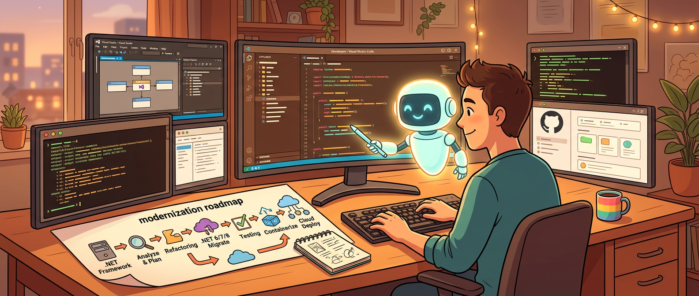

升级 .NET 项目这件事，表面上看像技术债清理，实际上更像组织协作问题。你很少是点一个按钮就完事了，更多时候得先摸清现状、看依赖链、排 breaking changes、拆升级顺序、和团队对齐风险，然后才轮得到真正改代码。

Microsoft 这篇关于 `modernize-dotnet` agent 的文章，表面上是在说它现在不只在 Visual Studio 里可用，还能跑到 VS Code、GitHub Copilot CLI 和 GitHub。真正更关键的变化其实是另一层：**.NET 升级流程开始从“某个开发者本机上的 IDE 功能”，变成“一个能跨环境运行、能产出可审阅工件、能让团队协作的升级工作流”。**

这不是界面扩容那么简单，而是在重新定义 modernization（现代化升级）这类任务到底该怎么做。

## 升级项目最怕的，从来不是代码改不动，而是改之前没把账算清楚

文章一开头就说得很实在：modernizing a .NET application is rarely a single step。这个判断太对了。

因为真正让升级项目卡住的，往往不是少会一个 API，而是这些问题：

- 当前代码基线到底有多旧
- 有哪些关键依赖会卡版本
- 哪些 breaking changes 会波及核心路径
- 升级顺序应该先框架、再库、再部署，还是反过来
- 哪些改动可以自动做，哪些必须人工判断

很多团队过去做升级，流程本质上像“本地试试看”。谁电脑上装着 Visual Studio，谁去点升级向导；谁比较懂这套项目，谁先尝试迁一版。能不能成，常常取决于个人环境和个人经验。

这种方式不是完全没用，但它有个天然短板：**升级过程很难被协作化。** 你的分析、你的计划、你的试错顺序，很多都停留在个人工作区里，团队只能在结果出来后被动跟上。

Microsoft 这次把 `modernize-dotnet` agent 从单一 IDE 场景拉出来，意义就在于：它开始把升级任务拆成明确的、可共享的工件，而不是一坨只在本地发生的黑箱动作。

## 真正有价值的，不是“哪里都能跑”，而是 assess → plan → execute 这条链被显式化了

这篇文章里最重要的一句，我觉得不是“现在支持 VS Code 和 CLI”，而是它明确说 `modernize-dotnet` 背后遵循 **assess → plan → execute** 模型。

这个设计太关键了。因为很多升级工具的问题，不是不会改，而是一上来就太急着改。结果就是：还没把依赖、风险、顺序搞清楚，就先动刀，最后一边补锅一边后悔。

而 assess → plan → execute 这个三段式，把升级任务从“一次性操作”变成了“有前置分析和执行顺序的工程过程”。这意味着升级不再只是一个自动化动作，而是一套可讨论、可审阅、可回滚思路的 workflow。

文中还特别提到，每次 modernization run 会在仓库里生成三类显式工件：

- assessment：当前范围和潜在阻塞项
- upgrade plan：升级顺序和建议路径
- upgrade tasks：真正执行代码转换的任务

这套东西为什么值钱？因为它把升级从“工具替你做了什么”变成“团队可以先看清将要做什么”。

> 升级工作流一旦有了 assessment、plan、tasks 这些可落盘工件，升级就不再只是自动化，而开始具备工程可治理性。

AI 时代很多工具都在强调自动执行，但真正好的自动执行，前提恰恰是先把意图、范围和顺序显式化。否则自动化放大的就不是效率，而是不透明。

## 从 Visual Studio 扩到 CLI / VS Code / GitHub，真正改变的是工作流的入口权

文章用的一个关键词其实挺准：你可以在自己已经使用的环境里做 modernization，而不用为了升级专门切换到某个工具里。

这背后的变化，不只是 convenience（方便），而是 workflow ownership（工作流归属权）。

过去如果 modernization 主要在 Visual Studio 里，默认前提其实是：你的团队工作方式已经围绕 VS 建好了。但现实不是所有团队都这样。有人重度 VS Code，有人终端优先，有人很多讨论压根就在 GitHub PR 和仓库层完成。

所以当 `modernize-dotnet` agent 能进入 GitHub Copilot CLI、GitHub 和 VS Code，它实际完成的是一件更重要的事：**升级流程不再附着在某一个 IDE 里，而是开始贴着团队已有协作表面流动。**

这对组织来说很重要。因为一旦工具只能活在某个入口，采用成本就会被那个入口绑死。可如果它能在 shell、编辑器、仓库协作界面里都工作，你讨论升级、审阅计划、执行任务这几件事，就更容易发生在团队本来就常驻的地方。

这和早年很多开发工具从“桌面软件功能”变成“仓库级工作流能力”的路线很像。工具成熟的标志之一，往往不是功能更多，而是它开始顺着你的工作流走，而不是逼你迁工作流去适配它。

## GitHub Copilot CLI 这部分尤其说明：升级已经不再是 IDE 特权

文章单独写了 GitHub Copilot CLI 的用法，还给了 `/plugin marketplace add`、安装 plugin、选择 agent、再让它帮你升级到新版本 .NET 的路径。这个部分看起来像产品演示，其实传达了一个挺大的信号：**modernization 已经被视作 terminal-first engineers 的正经任务，而不是 IDE 附属能力。**

这很符合现在的开发现实。越来越多工程师本来就把主要节奏放在终端里：查仓库、跑命令、切分支、看 diff、调用 agent、做 review。升级如果还只能在某个重 IDE 场景里完成，天然就会和一部分团队的习惯脱节。

CLI 入口的好处，不只是轻，而是更容易嵌进现有工程流程。你可以在本地 shell 里评估、生成计划、审查任务，再决定是否执行。也更容易和其他自动化链路、脚本、agent 工作流结合。

AI 在这里改变的，不是“有没有命令行”，而是终端终于不只是执行器，也开始承载分析、规划、任务生成这些以前更像 IDE wizard 的能力。

## GitHub 场景真正值钱的，是让升级从个人试验变成仓库内协作提案

文章里关于 GitHub 的部分写得不长，但我觉得意义很大。它说 generated artifacts 会和代码一起放在仓库里，让 modernization 从 local exercise 变成 collaborative proposal。

这句话几乎就是整篇的核心之一。

为什么？因为很多升级项目真正难的，不是某个 API 替换，而是团队要不要认同这次升级的范围、顺序和代价。过去这些讨论常常发生在会议、聊天或者某个开发者的脑内。现在如果 assessment / plan / tasks 能直接进入仓库上下文，事情就完全不同了。

你不再需要靠口头转述“我大概看了一下，升级风险主要在这几块”，而是可以直接让团队围绕仓库里的工件讨论：

- assessment 有没有漏风险
- plan 的顺序合不合理
- task 粒度是不是太粗
- 哪些步骤要人工接管

这才是 agent 真正适合做的事之一：不是直接替所有人拍板，而是把模糊的升级工作先整理成一个大家都能看的 proposal。

AI 把“生成升级方案”变便宜了，GitHub 这一层则把“共同审这份方案”变顺手了。两者叠在一起，才有团队价值。

## Custom Skills 说明 Microsoft 已经把 modernization 当成组织知识的载体，不只是工具能力

文中还有一段我挺喜欢，它提到 `modernize-dotnet` 支持 custom skills，团队可以把内部框架、迁移模式、架构标准编码进 modernization workflow 里，仓库里的 skills 会自动被 agent 用上。

这个信号非常清楚：Microsoft 不再把 modernization 只看成通用升级规则，而是开始承认**企业和团队自己的迁移经验，本身就是升级过程的一部分。**

这点非常重要。因为真实项目升级时，最麻烦的地方往往不是官方文档没写，而是你们团队自己有一套历史包袱：

- 某个内部 SDK 必须先迁
- 某种目录结构需要特殊处理
- 某些服务注册方式和标准模板不同
- 某类 breaking change 在你们系统里风险特别高

这些东西如果每次都靠人临场解释，效率很低，也不稳。把它们沉淀成 skill，等于是在说：升级流程不只是套微软的默认路径，还要能吃进你们自己的工程习惯。

这其实也和我前面说的 assess → plan → execute 一脉相承。真正可落地的 modernization，不是一个万能按钮，而是一个能吸收组织上下文的半自动系统。

## 这篇文章最值得带走的，不是“现在支持更多入口”，而是 modernization 被重新定义成了可审计工作流

如果只把这篇理解成“Visual Studio 之外现在也能升级 .NET 了”，那就低估它了。

我更愿意把它看成一种工作方式变化：**升级不再只是某个开发者在本地 IDE 里执行的一次操作，而开始变成仓库内有工件、有计划、有任务、有协作界面的可审计流程。**

这个变化为什么重要？因为 modernization 本来就不适合纯黑盒自动化。你当然希望 agent 帮你省时间，但你也需要知道它准备改什么、为什么这么排、哪些风险已经看见、哪些地方还要人介入。

而 assessment、plan、tasks 这三类输出，恰好让升级具备了“先看懂，再动手”的节奏。对老项目、复杂依赖、跨团队系统，这个节奏比“多快能改完”更值钱。

## AI 改写升级流程的方式，不是替你一键升级，而是先把升级变得更像工程

现在不少人一看到“AI for modernization”，第一反应都是：是不是能一键把 .NET Framework 迁完？这种期待也不能说完全错，但容易把问题想简单了。

真正成熟的方向不是 magical upgrade，而是让升级过程更像一条工程流水线：先 assessment，再 plan，再 execution，中间有审阅、有技能注入、有团队协作、有环境自由度。

这也是我觉得这篇文章最靠谱的地方。它没有把 `modernize-dotnet` 吹成“点一下自动完成所有迁移”的神工具，而是把它放在一个更现实的位置：它帮助你把升级过程显式化、结构化、跨环境化。

AI 已经改变的是，生成分析和初步计划的成本正在大幅下降；没变的是，升级依然是一个关于依赖、风险、顺序和组织协作的工程问题。谁把这一点看清楚，谁才更可能真的用好 modernization agent，而不是把它当成另一个容易演示、却很难真正落地的炫技插件。

## 参考

- [Modernize .NET anywhere with GHCP](https://devblogs.microsoft.com/dotnet/modernize-dotnet-anywhere-with-ghcp) — Microsoft DevBlogs
- [modernize-dotnet repository](https://github.com/github-copilot/modernize-dotnet) — GitHub
- [GitHub Copilot skills documentation](https://docs.github.com/en/copilot/how-tos/agents/copilot-coding-agent/skills) — GitHub Docs
