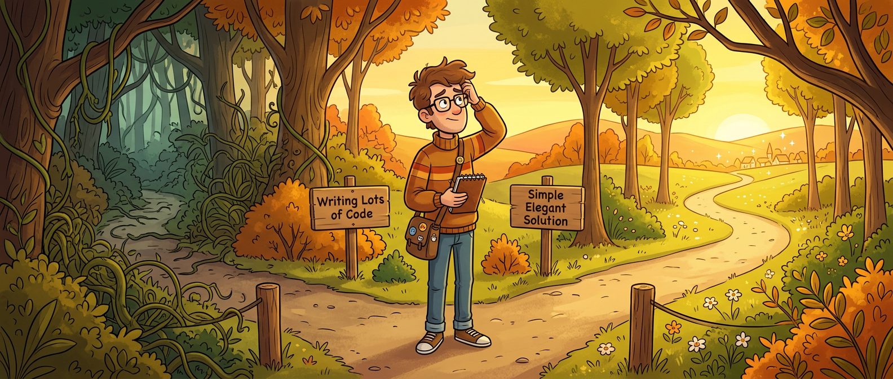
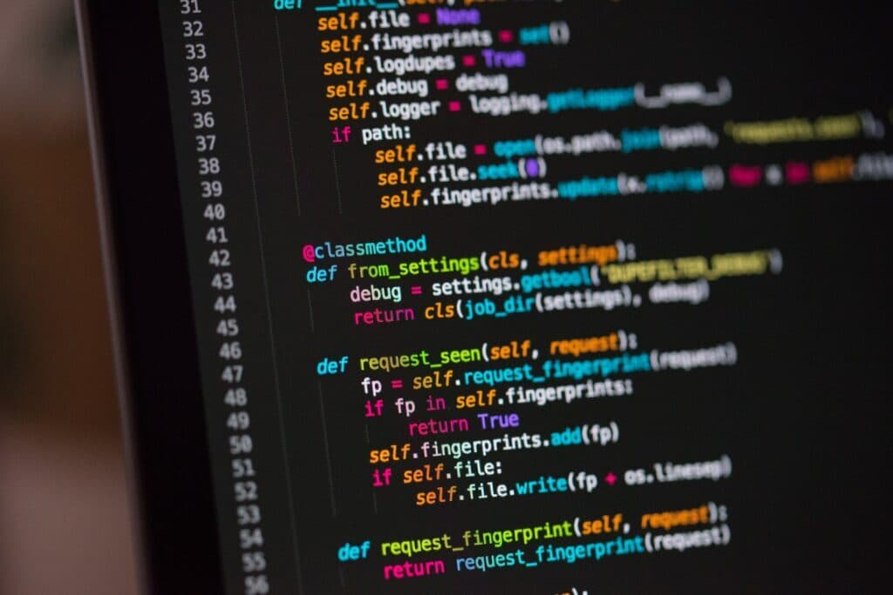

现在聊工程师，很容易把话题聊歪。大家最爱比的是谁写得快、谁产出多、谁一晚上搓完一个 feature，连 AI 工具的宣传也总在强化同一件事：更快生成代码，更快交付，更快合并。

问题在于，速度一旦变便宜，真正值钱的东西反而暴露得更明显了。

Dr Milan Milanović 这篇《You’re Not Paid to Write Code》戳中的，不是“程序员不该写代码”这种废话，而是另一个更扎心的现实：**工程师的工作从来不是把 ticket 翻译成更多代码，而是把模糊问题翻译成正确结果。** AI 越会写，越说明这件事不能偷懒。

## 写代码当然重要，但那不是工作的起点

很多团队一接到需求，默认动作就是开编辑器、拉分支、开始改。这个反应太熟了，熟到大家经常把它当成专业度本身。可真正成熟的工程师，起手通常不是工具，而是问题。

他们会先问：这件事到底要解决什么？谁真的被影响了？如果什么都不做，会发生什么？现在这个说法，是现象、猜测，还是已经被数据验证过的结论？

这几句听起来不酷，却决定后面几天的方向是不是跑偏。尤其在 AI 时代，写一个“看起来像答案”的实现太容易了，难的是确认这是不是那个值得被实现的答案。

> 当代码生成越来越廉价，问题定义就不再是前菜，它本身就是主菜。

Milan 提醒了一件很多人不愿承认的事：如果衡量工程师价值的方式只是提交了多少代码、合了多少 PR、上线了多少功能，那最像“优秀工程师”的，很可能反而是一个高产的代码生成器。显然这套衡量方式出了问题。

## 代码是能力的载体，不是天然资产

这篇文章里我最认同的一句，是“code is a liability, not an asset”。这话听着有点刺耳，但真做过长期维护的人都知道，它几乎就是经验的压缩包。

每一行代码都要被理解、测试、部署、监控、修改，还要在半年后被某个倒霉同事重新读一遍。它不是写完就升值的收藏品，更像你主动签下的一份长期维护合同。代码真正有价值，靠的不是“存在”，而是它带来的业务能力，值不值得覆盖未来持续付出的维护成本。

这也是为什么“删代码”经常是高水平动作，不是摆烂。你用更简单的流程解决问题，用现成系统替代自研，用 40 行改动换来明确收益，这通常比写一大坨自嗨实现更像工程。

AI 会把这个矛盾放大。因为以前写很多代码还需要体力，现在只需要提示词。产出门槛下降以后，团队更容易误把“生成了很多东西”当成“问题被认真解决了”。这两件事根本不是一回事。

## 真正贵的错误，不是代码写慢，而是问题看错

Milan 举了一个很典型的例子：用户抱怨 checkout 很慢，于是工程师第一反应去查数据库、加索引、补测试，性能数字也许还真的变好了。三周后工单重开，转化率还是没起来。问题不在速度，而在支付表单太长，用户懒得填。

这就是工程现场最常见、也最费钱的误伤：实现干得挺漂亮，靶子从一开始就瞄歪了。

如果先做一点思考，路径就会完全不同。你先看埋点、翻近几个月反馈、问客服一线、确认用户究竟在哪一步流失，再写下一句可以被检验的判断：问题是支付表单摩擦太大，而不是系统响应慢。接下来也许只需要一个更短的表单、一次 A/B test，再加几十行改动，结果却能直接抬升转化。

这里最值得记住的不是某个案例细节，而是一个判断标准：**写得快，不等于解决得对。**

AI 把“写得快”这件事进一步商品化了，所以“解决得对”的含金量只会继续涨。

## 团队为什么总忍不住先写再说

这事也不能全怪个人。很多组织就是在奖励 code-first 行为。

晋升看 feature 数量，周报写交付速度，大家讨论“有无进展”时最容易展示的也是可见的实现痕迹。没人会因为“我今天花了两小时确认这事不该做”而赢得掌声，哪怕这恰恰替团队省掉了一周错误开发。

所以很多工程师并不是不懂思考，而是被环境训练得更愿意快速给出实现。钟表一响，ticket 一接，先写点什么看起来最像在推进。组织如果看不见“少做”和“做对”的价值，团队就会自然滑向“多做”和“先做”。

AI 让这个倾向更危险。因为过去冲错方向，至少还要花几天；现在冲错方向，半小时就能生成一大片看上去很像样的错误答案。

## AI 真正放大的，不只是效率，还有误判

这篇文章里引用了一个很值得咂摸的研究。METR 在 2025 年做过实验，让有经验的开源开发者分别在使用和不使用 AI 工具的情况下完成任务。开发者原本以为自己会快 24%，用完后主观感受仍觉得快了 20%，但实际结果却是**慢了 19%**。

这组数字很妙，因为它直接戳破了一个常见幻觉：人不只会高估 AI 的能力，还会高估自己驾驭 AI 的能力。

这不表示 AI 没用，恰恰相反，它说明 AI 不是一台“自动兑现正确决策”的机器。它更像一个极快的放大器。问题框定清楚了，它能把执行速度抬起来；问题本身糊着，它也会把误解、臆断和多余实现一起放大。

所以今天真正该补的，不只是 prompt 技巧，而是这几种更难学、也更不性感的能力：

- 把含糊需求改写成可验证问题
- 在动手前说清适用前提和边界
- 判断该 build、buy，还是干脆别做
- 审核 AI 输出时看懂业务语义，而不只看语法对不对

说白了，AI 不是把工程判断淘汰了，而是把工程判断推到了台前。

## “先想清楚”不是开更多会，而是先留下可检验的判断

一说 thinking-first，很多人脑子里就会冒出另一种灾难：文档地狱、会议地狱、流程体操。Milan 这点说得还挺实在，他并不是主张每次都写一份厚 PRD，而是建议在动手前先写一个短段落，把三件事讲清楚：

- 真实问题是什么
- 它影响谁
- 什么时候算修好了

我觉得这招尤其适合现在。因为 AI 最擅长把“怎么做”铺开，却不擅长替你确认“为什么做”和“做到什么程度算够”。你如果连这三件事都没写明白，AI 只会非常高效地帮你跳过理解阶段。

更大的项目当然可以再往上加，像短文档、方案比较、风险说明、原型验证这些都值得做。但重点不是文档长度，而是有没有把判断留成团队可以讨论、可以反驳、可以回看的东西。

> 能被写清楚的问题，才更有机会被真正解决；只能靠脑补的问题，通常会被仓促实现。

这也是为什么 Amazon 的 Working Backwards、Google 的很多设计评审机制直到今天仍然有生命力。AI 改写了实现速度，没有改写一个基本事实：大部分昂贵错误都发生在实现之前。

## 2026 年的工程师，更像“问题架构师”而不是“代码打字员”

Milan 在结尾对工程师工作的描述，我觉得可以再往前推一步。今天的工程师，核心职责越来越像四件事的组合。

第一，定义问题。把一句含糊抱怨拆成用户现象、业务影响和技术约束，不让团队围着误解忙活。

第二，做取舍。哪些该自己造，哪些该买，哪些该删，哪些该暂时不碰。这里的每个决定都在影响未来系统复杂度。

第三，守边界。包括架构边界、上下文边界、成本边界，也包括 AI 输出的可信边界。模型会写，不代表它理解你所在组织的约束。

第四，做验证。验证需求理解是否正确，验证方案有没有真的改善指标，验证 AI 生成的实现有没有把错误假设偷偷固化进代码库。

这几件事里，只有一部分直接体现为写代码。剩下那部分，恰恰是过去容易被忽视、现在却越来越决定产出质量的硬功夫。

## AI 没让工程师不需要会写代码，它只是把“会写”从终点打回了基础分

我不太喜欢“以后大家都不用写代码了”这种轻飘飘说法，听着就像短视频口播。现实要朴素得多：会写代码当然仍然重要，不然你连 AI 产出的对错都没法判断。

真正变化在于，写代码这件事不再足以证明你是个好工程师了。以前它是门槛，也是主舞台；现在它更像门槛内的基本动作。谁能持续创造更高价值，越来越取决于谁能先把问题讲对、把边界看清、把代价算明白。

如果要把这篇文章压成一句话，我会这么说：**AI 让实现更便宜了，所以错误实现也会更便宜地大量出现；工程师真正贵的部分，是决定什么值得被实现。**

这就是为什么今天最该训练的，不只是写 prompt 的手感，而是识别问题、构造判断、审查结果的肌肉。代码依然是工作的一部分，只是它越来越像最后一步，而不是第一反应。

## 参考

- [You’re Not Paid to Write Code](https://newsletter.techworld-with-milan.com/p/youre-not-paid-to-write-code) — Dr Milan Milanović / Tech World With Milan Newsletter
- [Measuring the Impact of Early-2025 AI on Experienced Open-Source Developer Productivity](https://metr.org/blog/2025-03-10-early-2025-ai-experienced-os-dev-study/) — METR
- [AI Copilot Code Quality: 2025 Update](https://www.gitclear.com/coding_on_copilot_data_showing_ais_current_impact_on_code_quality) — GitClear
