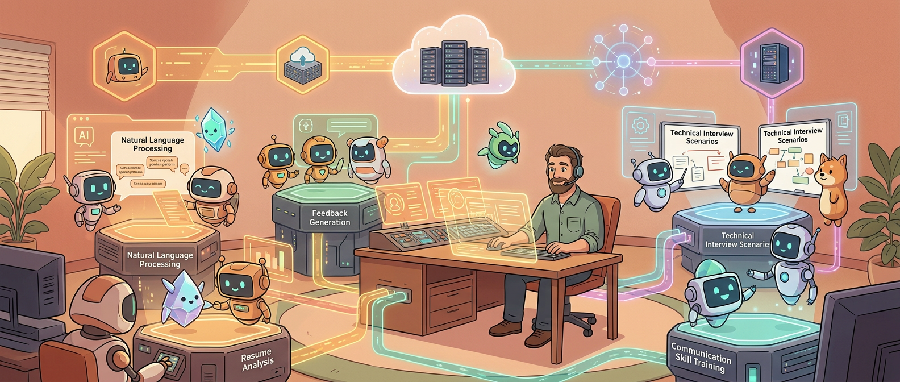
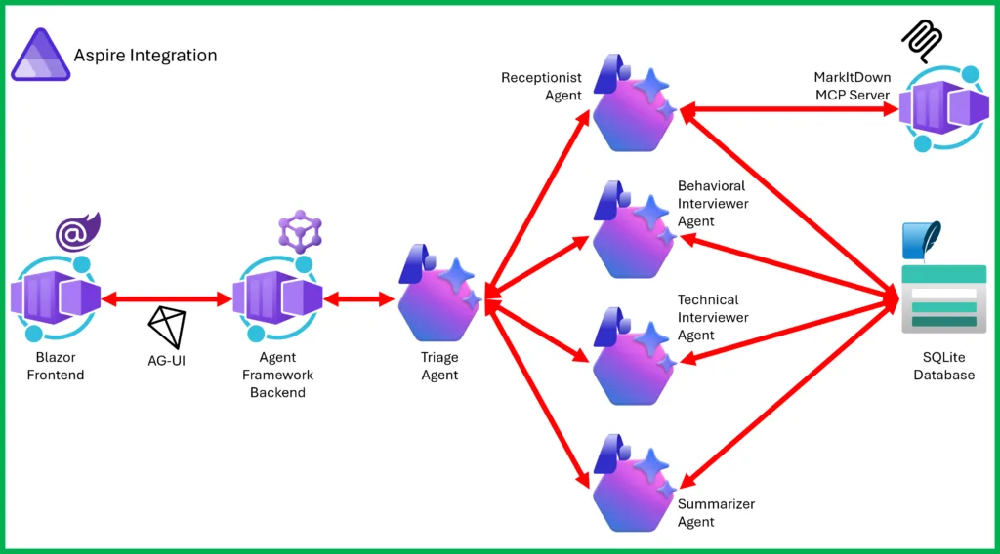
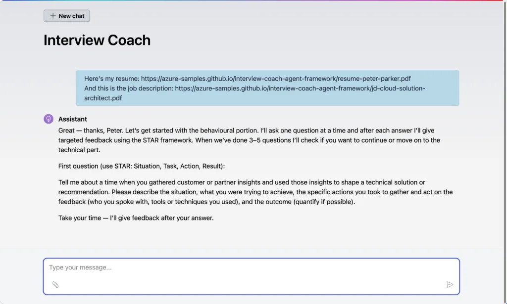

现在聊 agent，最容易出现一种错觉：只要模型会说话、会调工具、能串几个步骤，一个“AI 应用”基本就算成了。可真把东西往生产环境里放，麻烦立刻从 prompt 漂亮不漂亮，切到另一套问题：服务怎么拆、状态怎么留、工具怎么隔离、模型后端怎么治理、部署怎么收口、观测和调试怎么跟上。

Microsoft 这篇用 Interview Coach（面试教练）样例讲 `Microsoft Agent Framework`、`Microsoft Foundry`、`MCP` 和 `Aspire` 的文章，最值钱的地方就在这儿。它不是再演示一个“agent 能干嘛”的玩具，而是在回答一个更现实的问题：**当 agent 真要成为应用系统的一部分，哪些能力该归框架，哪些该归平台，哪些该归工具协议，哪些又该归应用编排层？**

这四样东西放在一起看，你会发现它讲的其实不是某个 demo，而是一套 agent 应用分层方法。

## 这篇文章真正讲清楚的，是 agent 系统的责任边界

Interview Coach 这个样例本身不复杂：用户上传简历和目标岗位描述，系统跑一轮模拟面试，先做行为面，再做技术面，最后给出总结反馈。表面上这像一个很适合做 AI demo 的场景，因为它天然是对话式、阶段式、带上下文的。

但 Microsoft 没有把重点放在“看看它多会聊”，而是刻意把系统拆给你看：

- `Agent Framework` 负责 agent 抽象、handoff 工作流、多 agent 编排
- `Foundry` 负责模型接入、内容安全、评估与企业治理
- `MCP` 负责工具服务化，把文档解析和会话数据存取放在 agent 进程外
- `Aspire` 负责多服务启动、发现、健康检查、遥测和部署路径

这层拆分很重要。因为今天很多 agent 项目最大的问题，不是功能做不出来，而是所有东西糊在一起：模型调用、工具实现、应用逻辑、部署脚本、状态存储全塞一个仓库、一堆进程，跑起来像 magic，维护起来像事故前夜。

> agent demo 最擅长隐藏复杂度，生产系统最擅长把隐藏过的复杂度连本带利讨回来。

这篇文章真正靠谱的地方，就是它没有继续藏，而是把复杂度按责任拆开了。

## Agent Framework 在这里补的，不是“更会聊天”，而是工作流语义

文章先解释为什么用 `Microsoft Agent Framework`。对 .NET 开发者来说，这一层的信号很明确：Microsoft 想把过去 `Semantic Kernel` 和 `AutoGen` 各自擅长的东西，收敛成一套更统一的 agent 开发抽象。

它吸收了 AutoGen 那套 agent-oriented 的建模方式，也保留了 Semantic Kernel 更偏企业级的部分，比如状态管理、类型安全、中间件、遥测，然后再往上加 graph-based workflow（图式工作流）来承接多 agent orchestration。

这在 Interview Coach 里最典型的体现，是 handoff 模式。系统不是一个“全能主 agent”从头聊到尾，而是拆成五个角色：Triage、Receptionist、Behavioral Interviewer、Technical Interviewer、Summarizer。谁接手、谁放权、谁回退到分诊 agent，全都被定义成明确的 workflow。

这个区别非常关键。因为很多人现在做 agent，默认还是“一个 agent + 一堆 tools”。这种方式不是不行，但一旦任务天然带阶段切换、职责变化、上下文重点变化，用 handoff 往往更清楚。你不是让一个 agent 假装会所有事，而是承认不同阶段该由不同角色接管。

这也是 Agent Framework 在这里最有价值的地方：**它让多 agent 不只是“多开几个 prompt”，而是能被当成正式运行时语义来编排。**

## Foundry 提供的不是模型而已，而是 agent 的后端治理面

很多 agent 讨论一说到“模型层”，停留在接哪个模型、比哪个模型强。但文章里关于 `Microsoft Foundry` 的定位其实更值得注意。它把 Foundry 放成 Agent Framework 推荐后端，不是因为它只提供一个 endpoint，而是因为它顺手把一堆生产环境会需要的能力包进来了：模型访问、内容安全、PII 检测、成本优化路由、评估、微调、企业治理。

这层很容易被低估，因为在本地 demo 里它看起来只是配置项。但一旦系统进到真实环境，问题立刻变成：

- 模型换了，接口要不要改
- 内容审核放哪层
- 敏感信息谁兜底
- 成本和路由怎么控
- 身份、权限、合规怎么接进企业环境

Foundry 实际上是在承接这些“模型之上的平台责任”。文章特别提到 agent 代码通过 `IChatClient` 接模型，所以 Foundry 在代码层像是可替换后端，但在平台层，它给的是最完整的企业化工具箱。

AI 时代这件事越来越明显：模型能力差异仍然重要，但很多团队真正卡住的不是“模型不够聪明”，而是“模型接进真实系统以后，外围治理没跟上”。这篇文章把 Foundry 放在这里，恰恰是在承认 agent 后端不只是 LLM endpoint，而是 governance surface（治理面）。

## MCP 在这里扮演的，是工具边界管理，而不是“顺手调个函数”

文章第三个亮点是 MCP 这层。Interview Coach 里有两个工具服务：一个是 Python 写的 `MarkItDown MCP Server`，负责把 PDF / DOCX 简历转成 markdown；另一个是 .NET 写的 `InterviewData MCP Server`，负责把会话状态存进 SQLite。

这套设计的意思很明确：**工具不活在 agent 进程里，而是作为独立 MCP server 存在。**

别小看这个选择，它背后其实是很成熟的系统观。因为很多早期 agent 项目把 tools 当成“agent 内部函数集合”，写起来快，后面问题也来得快：工具和 agent 生命周期绑死、语言绑死、团队边界绑死、复用性也一起绑死。

MCP 的好处就是把这些东西拆开。MarkItDown 完全可以继续作为 Python 服务存在，别的 agent 项目也能复用；InterviewData 这种会话存储工具，也可以由另一支团队独立迭代。工具团队不需要陪着 agent 团队一起发布。

更重要的是，文章强调每个 agent 只拿自己需要的工具：Triage 不拿工具，Receptionist 拿文档解析和会话数据，面试官 agent 只拿会话访问。这其实就是 least privilege（最小权限）在 agent 体系里的落地版本。

今天很多 agent 系统最大的潜在风险之一，就是让“会说话的东西”顺手拥有太多工具权限。MCP 不会自动解决这个问题，但它至少给了你一个天然更清楚的边界层。

## Aspire 真正解决的，是“终于别再靠一堆 README 手动起服务了”

如果说 Agent Framework 管 agent、Foundry 管模型平台、MCP 管工具边界，那 `Aspire` 在这篇文章里承担的，就是把整套系统真正拢成一个能跑、能看、能部署的多服务应用。

Interview Coach 不只是一个 web 页面后面接个模型，它至少包含：Blazor WebUI、Agent service、MCP servers、模型后端连接，还要附带 health checks、service discovery、distributed tracing。你要是没有一层编排，开发体验会迅速退化成老熟人：终端开五个窗口，启动顺序靠运气，URL 配置靠复制，某个服务没起来就开始全局找日志。

Aspire 在这里做的事很朴素，但很关键：

- 服务按名字发现彼此，不硬编码 URL
- 启动拓扑明确，依赖关系明确
- OpenTelemetry 和健康检查自动进来
- 本地一条 `aspire run --file ./apphost.cs` 就能拉起整套系统
- 上云则用 `azd up` 收口到 Azure Container Apps

这类能力看起来不 glamorous，却决定一个 agent 样例到底像博客 demo，还是像能被团队接过去继续做事的工程起点。

## 这篇文章最适合今天看的原因，是它把“生产化 agent”从概念拆成了可交付零件

我觉得这篇文章最值得带走的，不是某个 API，也不是 Interview Coach 这个场景本身，而是它给了一个很清楚的 agent application decomposition（应用拆分）示例。

很多团队现在已经接受一件事：agent 不只是聊天 UI，而是要接工具、接状态、接业务流程、接部署体系。可一旦真开始做，最容易陷入两个极端：

- 要么所有东西都塞进一个 agent service，短期很快，后期越来越糊
- 要么一上来就想做超级平台，抽象过头，项目还没跑起来先把人累死

Microsoft 这篇文章选的路径更务实：拿一个具体样例，把每一层的职责都放到刚刚好的位置。agent 负责流程与角色切换，平台负责模型与治理，协议负责工具边界，编排负责运行时拓扑。没有哪层假装自己能吞掉所有问题。

这其实也很符合 AI 系统逐渐成熟后的一个趋势：**真正能落地的 agent 应用，往往不是“一个无所不能的智能体”，而是一组分工明确、边界清晰、运行时受控的系统组件。**

## AI 改变了实现速度，但没有取消系统设计这门苦活

你会发现，这篇文章虽然一直在聊 agent，却几乎每一段都在提醒同一件事：AI 降低的是实现和连接的门槛，不是系统设计的门槛。

Agent Framework 让你更容易定义角色和 handoff，Foundry 让你更容易接入可治理的模型后端，MCP 让你更容易把工具做成可复用服务，Aspire 让你更容易起整套云原生应用。可这些东西放在一起以后，真正难的仍然是判断：

- 应该拆几个 agent，还是一个就够
- 工具该内嵌，还是走 MCP server
- 状态放哪层最合适
- 哪些能力该由应用负责，哪些该交给平台
- 本地开发体验和云上部署路径怎么统一

这些问题都不是模型自己会替你回答的。它们仍然是工程设计问题。

## 如果把这篇文章压成一句话，我会这么总结

**这不是一篇“教你做一个面试 agent”的文章，而是一篇“教你怎么别把 agent 做成下一代单体泥球”的文章。**

Microsoft 用 Interview Coach 这个例子，实际演示的是 agent 系统的四层分工：Framework 让 agent workflow 有正式语义，Foundry 让模型接入具备治理能力，MCP 让工具边界清晰且可复用，Aspire 让多服务应用真的能被启动、观测和部署。

这也是为什么我觉得它对今天的 .NET / AI 开发者很有参考价值。因为现在大家最不缺的，就是“模型会回话”的 demo；真正稀缺的，是把这些组件装配成可演进系统的工程判断。Interview Coach 不见得是你要做的产品，但它给出的拆法，很可能正是很多团队在 2026 年做 agent 应用时最该补的那块现实感。

## 参考

- [Build a real-world example with Microsoft Agent Framework, Microsoft Foundry, MCP and Aspire](https://developer.microsoft.com/blog/build-a-real-world-example-with-microsoft-agent-framework-microsoft-foundry-mcp-and-aspire) — Microsoft for Developers
- [Interview Coach sample](https://aka.ms/agentframework/interviewcoach) — Azure-Samples / GitHub
- [Microsoft Agent Framework documentation](https://aka.ms/agent-framework) — Microsoft Learn
- [Microsoft Foundry documentation](https://learn.microsoft.com/azure/foundry/what-is-foundry) — Microsoft Learn
- [Model Context Protocol specification](https://modelcontextprotocol.io/) — MCP
- [Aspire documentation](https://aspire.dev/) — Aspire
