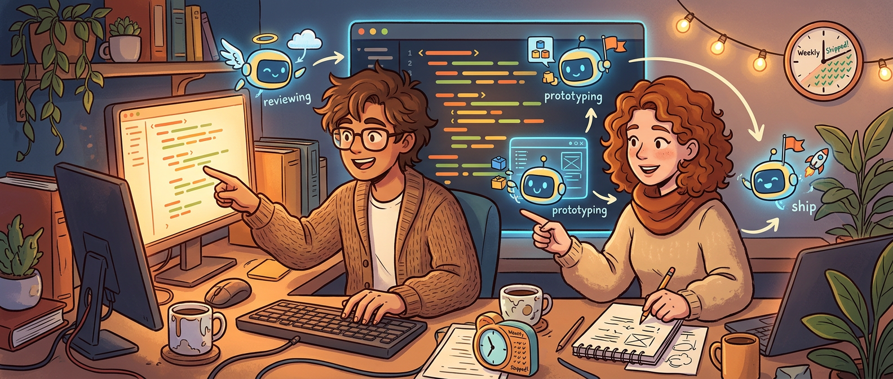
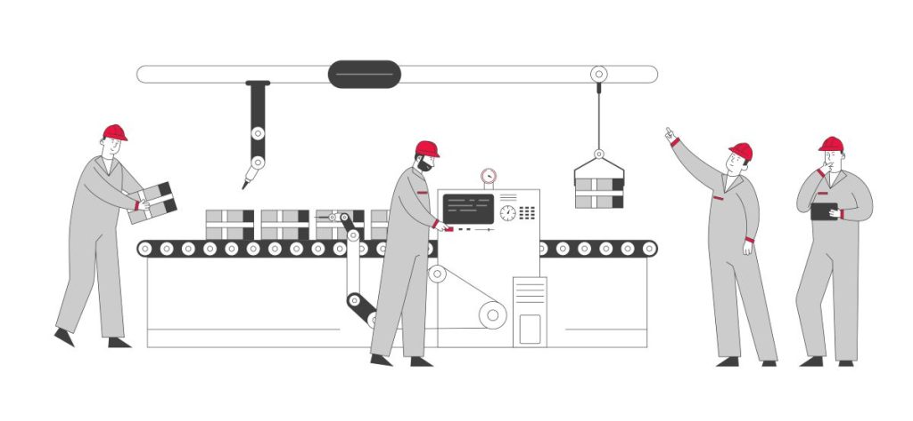

现在一提 AI 写代码，大家第一反应还经常停在补全、生成函数、修个 bug、写点测试。可真正有意思的变化，早就不是“工程师快没快 20%”这种局部问题了，而是**团队到底开始怎么组织工作**。

The New Stack 采访 VS Code 产品负责人 Pierce Boggan 这篇文章，值钱的地方就在这里。它不是在吹 Copilot 多神，也不是简单重复“PM 以后也能写代码”这种标题党判断，而是给了一个很具体的信号：在 VS Code 团队内部，AI 已经开始影响发布节奏、原型方式、PR 流程、triage 流程，甚至连 PM 和工程师之间原本很稳的边界都在变形。

最扎眼的一句当然是那个结果：**VS Code 在连续 10 年按月发布之后，开始切到按周发布，而且团队明确说 AI 是关键原因之一。** 这不是一个小优化，这是交付节奏级别的变化。

## 这篇文章真正重要的，不是“AI 参与开发”，而是“AI 已经参与团队操作系统”

Boggan 讲得很直接，他作为 PM 每天早上会用一个 prompt file，把日历、邮件、Teams 消息、GitHub 上下文一起拉进来，先做一轮汇总。团队还在 VS Code 和 Copilot 里跑专门的 PM 工作流，比如分析反馈仓库、看社交媒体反馈、保持文档和 release notes 更新。

工程团队那边也不是只拿 Copilot 做 autocomplete。文中提到他们有针对自己流程做的 custom agents 和 slash commands，用来总结过去 24 小时提交、整理和去重 issue；每个 PR 都先过一轮 `Copilot Code Review`；甚至还有一个叫 `demonstrate` 的 agent，会直接启动 VS Code、自行导航到功能位置、截图、判断改动是否真的生效。

这个细节特别关键。因为它说明 AI 在这里不再只是“写点代码”，而是逐步吃进了信息汇总、问题分发、代码审查、产品验证这些原本散落在团队日常里的机械环节。

> 当 AI 不只是帮你写某一段代码，而是开始承接团队日常里的收集、整理、验证、分发，变化就不再是局部提效，而是工作流重排。

这才是我觉得这篇采访最值得注意的地方。很多团队还在讨论要不要给工程师开 Copilot seat，VS Code 团队已经在把 AI 塞进自己的日常操作系统里了。

## PM 开始直接做原型，这件事比“人人都能写代码”复杂得多

采访里最容易被传播出去的，肯定是 Boggan 说的那句：现在 spec / PRD 的等价物，越来越像 prototype，而 prototype 本身就是 PR。

这话听起来很猛，也很容易被理解成“以后 PM 自己提代码，工程师要失业了”。但如果认真看他后面的描述，事情其实更细一点。

Boggan 的做法是：有人在 X、Reddit、GitHub issue 上提反馈，他不再先写一份文档描述“我们觉得体验应该怎样”，而是直接在 VS Code 的 plan mode 里开始搭原型。这个过程特别适合 UI 和交互层的变更，因为那类问题最需要回答的通常是“这个体验到底对不对”，而不是一开始就下重判断做架构设计。

他甚至举了个很具体的例子：关于 Copilot Chat 中 conversations fork（会话分叉）的功能，他在录节目之前一天就自己发了 PR，工程师给了反馈，两边一起调了几处 CSS，然后就合进去了。

注意这里最重要的不是“PM 写了代码”，而是另一层：**原型和产物之间的距离被极大压缩了。** 以前从反馈到 PR，通常要经过需求文档、评审、排期、实现；现在中间很大一段被 AI 直接折叠成了一个可跑、可讨论、可 review 的候选实现。

这改变的不是谁有资格打字，而是产品想法第一次被验证的介质。

## 但 AI 没有消灭工程判断，反而让它更贵了

Boggan 自己也说得很清楚：这种方式最适合体验层问题，不等于 PM 可以替代工程师做架构决策。如果工程负责人看了他的 PR 说“这个架构不对”，那代码完全可能被扔掉重写，他对此是接受的。

这恰恰是这篇文章里最健康的部分。因为现在很多 AI 讨论最大的风险之一，就是把“谁都能先生成一个实现”误读成“工程判断不再重要”。现实显然不是这样。

AI 让原型更便宜，意味着错误原型也更便宜；让任何人都能更快提出候选改动，也意味着团队更需要有人守住架构、边界、可维护性和长期成本。代码可以更容易出现，但正确结构不会自动出现。

所以如果非要从这篇采访里提炼一句更准确的话，我会说：**AI 正在降低跨角色动手的门槛，但同时抬高了团队对评审能力和架构判断的要求。**

这也是为什么“PM 开始能提 PR”这件事，不该被理解成工程边界消失，而应该理解成边界正在从“谁来写”转向“谁来判断是否值得留下”。

## 周更这件事，比表面看起来更有信号价值

采访里最硬的量化指标，就是 VS Code 团队从连续 10 年月更切到了周更。Boggan 给出的解释也很明确：原来一个完整发布周期里，triage、测试、release notes、stabilization 这些开销太大，所以整个团队天然需要一个月节奏。现在这些环节里有不少已经被自动化或 agent-assisted 接住了，所以周更开始变得可持续。

这件事为什么重要？因为它说明 AI 对研发组织最深的影响，未必先体现在“一个人多写多少代码”，而可能先体现在**系统性的流程阻力被削平**。

很多团队现在谈 AI，还停留在 coder productivity 的小账本思路：补全快一点，review 快一点，写测试快一点。但如果真正影响发布节奏的是 triage、文档、验证、发布说明、回归把关这些外围工作，那只盯着 IDE 里的代码生成，本来就看漏了大头。

文里还提到几个挺能说明问题的数字信号：以前 `git fetch` 后常见的是 20 到 30 个提交，现在经常是每天 100+；PR cycle time 变短了；agent-based triage pipeline 已经能处理初步分类、查重和 owner 分配，替掉过去需要轮值人工做的那部分。

这些变化拼在一起，才解释了为什么周更不是一句营销话术，而是真的流程重构结果。

## 速度变快之后，团队真正盯的不是产量，而是回归率

这篇采访还有个我挺喜欢的地方，就是没有把“更快”讲成无脑好事。Boggan 明说了，团队最在意的质量问题是：稳定版里的 regression 有没有比以前更少，而不是更多。

这点非常重要。因为现在很多 AI 工作流一旦提速，团队很容易被提交数、PR 数、吞吐量这些指标带跑偏。但软件交付的老问题并没有消失：你当然可以更快地产生改动，也可以更快地把错误送到用户手里。

VS Code 团队现在能把周更跑起来，前提恰恰不是只靠生成能力，而是靠 review、验证、triage、自检代理这些环节一起补上来。特别是那个 `demonstrate` agent，我觉得就是个很有代表性的信号：团队已经不满足于“AI 说自己改完了”，而是要让它实际把应用拉起来、走到功能位置、拿证据回来。

这其实特别像 AI 时代开发流程的一个成熟方向：**生成能力越来越便宜，验证能力越来越值钱。**

## “Agent-ready codebase” 这句话，才是采访里最该被抄下来的一句

Boggan 最后提到一个说法，我觉得是整篇采访的金句：`agent-ready codebase` 会成为每支工程团队都该培养的 meta-skill。

这句话表面看像口号，细想其实很实。什么叫 agent-ready？不是代码里随便接几个 AI SDK，而是你的代码库、测试、文档、ownership 边界、验证机制，能不能让 agent 安全地参与进来。

如果代码库结构混乱、测试薄弱、文档失真、边界模糊、谁负责什么都说不清，那 agent 的加入大概率只会把混乱放大。反过来，如果 harness、测试、说明、模块边界这些东西本来就做得好，agent 才更容易成为放大器，而不是事故制造机。

这其实也回答了很多团队现在一个常见误解：以为 AI adoption 主要是采购问题、权限问题、模型问题。那些当然重要，但更底层的问题其实是——**你的工程系统准备好被一个高速度、低上下文耐心的“协作者”接入了吗？**

如果没有，AI 工具的上限很快就会撞到代码库自身的天花板。

## 未来一两年，真正变化的不是职位名称，而是职责分布

采访里还有一个判断我基本同意：未来模糊的不是头衔，而是贡献方式。传统上“想产品的人”和“做产品的人”分得比较开，现在这条线会越来越虚。每个人都更像是在对结果负责，而不只是对自己那一段环节负责。

但这不意味着一切都会融成一锅粥。更可能发生的是，重复性、机械性、可模板化的部分被 agent 吃掉，剩下最值钱的部分集中在：

- 问题有没有被定义对
- 体验是不是真的更好
- 结构是不是经得起后续演进
- 这次提速有没有偷偷换来新的质量债

也就是说，角色会更流动，但判断不会更便宜。

## 如果把这篇文章压成一句话

我会这么总结：**VS Code 团队被 AI 改写的，不只是 coding surface，而是整个产品—工程协作回路。**

从 PM 在编辑器里直接做原型，到工程侧用自定义 agent 做 triage、review 和自验证，再到发布节奏从月更切到周更，这篇采访透露出来的不是一个新功能，而是一种新组织形态的雏形。

AI 当然会继续影响写代码本身，但更大的变化也许发生在代码外：想法怎么被验证、改动怎么被审查、质量怎么被兜住、团队怎么围绕结果重新分工。谁先把这套回路搭起来，谁拿到的就不只是一点点提效，而是整支团队更短的反馈闭环。

## 参考

- [Microsoft's VS Code team moved to weekly releases after 10 years of monthly — and credits AI for making it possible](https://thenewstack.io/vs-code-ai-copilot/) — The New Stack
- [VS Code becomes multi-agent command center for developers](https://thenewstack.io/vs-code-becomes-multi-agent-command-center-for-developers/) — The New Stack
- [GitHub Copilot Code Review](https://docs.github.com/en/copilot/how-tos/use-copilot-agents/request-a-code-review/use-code-review) — GitHub Docs
- [Work IQ overview](https://learn.microsoft.com/en-us/microsoft-365-copilot/extensibility/workiq-overview) — Microsoft Learn
