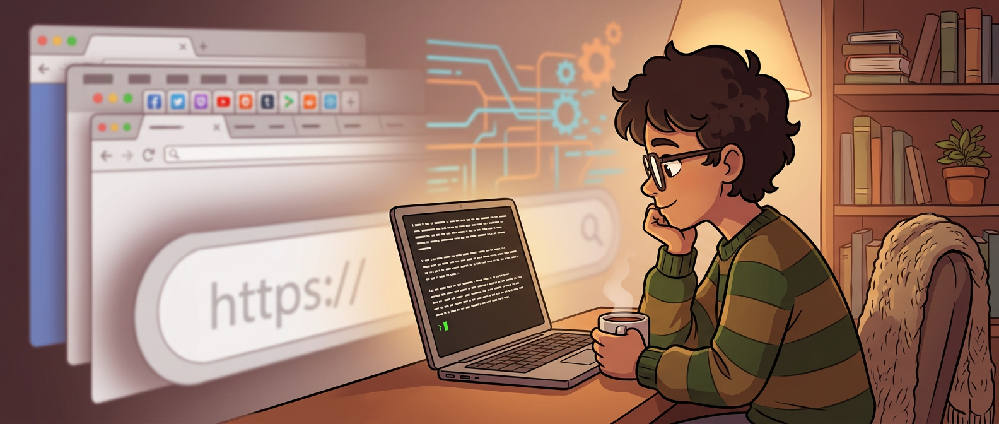
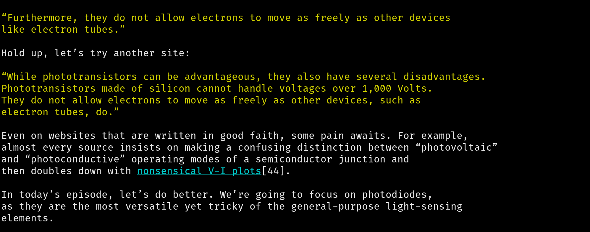

现代浏览器有多复杂，这事大家早就知道了，但大多数时候我们只是把它当背景噪音接受下来。Chromium 几千万行代码、层层叠叠的标准支持、脚本引擎、渲染管线、沙箱、扩展生态、媒体编解码、同步能力、隐私对抗、性能优化，全都已经大到像一种自然现象，而不是一个可以重新追问的设计结果。

Maurycy 这篇《The web in 1000 lines of C》好玩的地方，就是它偏不把这件事当自然现象。他问的是另一个问题：**如果我只是想“读网页”，而不是运行一个巨大的 Web 应用容器，浏览器最低到底需要多少东西？**

他的答案当然不是“1000 行 C 就能替代 Chrome”，真这么理解就浅了。更准确地说，这 1000 行代码像一把小刀，直接把现代 Web 的层次切开给你看：哪些是阅读网页的最低需求，哪些是今天 Web 生态额外叠上去的复杂性，哪些则是现实世界逼你不得不接受的妥协。

## 这不是在重写 Chrome，而是在追问“读网页”这件事的最小闭环

文章一开头就把目标说得很清楚：作者不是要跑多媒体网页，不是要执行大型 JavaScript 应用，也不是想支持今天所有复杂站点。他只是想读自己链接列表里的那些博客，而且要求很朴素：页面要能被渲染出来，链接要能点，别只是把 HTML 原样吐到终端里。

这个目标听起来很小，但它反而让问题变得干净了。因为一旦你把目标从“支持整个现代 Web”缩成“把文字网页读出来”，很多过去默认合理的复杂性都开始失去天然正当性。

你需要的最低闭环是什么？大概是这些：

- 解析 URL
- 做 DNS 查询
- 建立 socket 连接
- 发送 HTTP 请求
- 读取响应
- 解析一点点 HTML
- 做最基础的排版和换行
- 处理链接跳转

这套东西写出来，结果居然真能读博客。它当然简陋，但正因为简陋，你才更能看见现代浏览器到底帮我们吞掉了多少默认不可见的工作。

> 一旦把目标从“跑完整 Web 平台”降到“读一个页面”，浏览器复杂度就不再只是技术事实，而开始变成可讨论的设计取舍。

## 1000 行最有价值的地方，不是极客炫技，而是把 Web 协议重新拉回人的尺度

文章里最讨喜的一段，是作者从最原始的 HTTP 请求开始拆：URL 告诉你是 `http`，所以要发明文请求；服务器会回状态行、头部、空行和正文；URL 通常没有 IP，所以先要做 DNS；拿到响应后才轮到“怎么显示”这个问题。

这类内容对资深开发者来说不算新鲜，但放在今天其实特别有价值。因为我们太久没有直接面对 Web 的基础面貌了。现在大多数人接触 Web，更像是在用框架、API、构建链和浏览器工具跟“某种现成环境”打交道，而不是面对协议本身。

这也是为什么这种小项目总有一种奇怪的教育意义：它不一定能拿来日用，但它能把你从一整套自动化抽象里拽出来，重新看见底层到底发生了什么。

AI 时代尤其如此。现在生成一个 HTTP client、写个 parser、甚至做个小渲染器都变得越来越容易，反而更需要人自己知道：这些东西背后原理是什么，哪些复杂度来自本质，哪些复杂度只是生态习惯。

## HTML 真正难的地方，从来不是“会不会 parse”，而是“要不要帮全世界收烂摊子”

这篇文章里最有意思的一个现实感，在于作者没有假装 HTML 很优雅。他明确承认：纸面上看，解析 HTML 不难；现实里麻烦的，是海量 edge cases 和烂 markup。

他举的例子很典型：标签大小写乱飞、自动闭合规则一堆、错误嵌套满天飞、作者把本该闭合的 `</a>` 写成了一个奇怪的 `<a>`，而浏览器居然还得猜出“这大概是手滑”。

这段特别能说明浏览器复杂度真正来自哪里。不是“标准设计得太先进”，而是 Web 最大的兼容性原则一直是：**哪怕页面写得稀烂，也得尽量给它渲染出来。**

这跟很多新系统不一样。很多现代工具一旦输入有问题，直接报错、退出、拒绝处理；浏览器不能这么干，因为如果它太讲原则，现实世界大半网站都会看起来像爆炸现场。

所以现代浏览器的大量复杂度，本质上是“替整个失控的网页世界兜底”。Maurycy 这个小浏览器的巧妙之处，不在于解决了这个问题，而在于它通过故意不完全解决，让你更清楚地看到：完整浏览器到底为什么会长成现在这个体型。

## “够用就行”的排版策略，本身就是一种很老派也很诚实的工程判断

作者对 typesetting 的处理方式很有味道：只要看到空格并且列数超过 70，就换行，基本把文本压在 80 列以内。没有复杂 layout engine，没有 CSS box model，没有字体度量，没有响应式设计，连链接交互也只是给每个链接分个编号，用户手动输入数字跳过去。

这套方案从产品角度当然很粗糙，但从工程角度看，它特别诚实。它没有试图伪装成“完整浏览体验”，而是专注在目标函数上：把文字内容读出来，能继续跟着链接走，就算成功。

这让我觉得这篇最妙的一点是，它不是极简主义审美表演，而是一连串明确的 scope control（范围控制）。你能几乎逐项看到作者在做选择：这个我支持，因为完成目标必须有；那个我不做，因为它只会把问题重新膨胀回现代浏览器。

很多小项目失败，不是因为做不出来，而是因为没有能力停下来。这个 tiny browser 能成立，恰恰是因为作者知道什么不做。

## 直到 HTTPS 出场，你才会看见现实世界是怎么把“纯粹”拧回妥协的

文章里我最喜欢的一段转折，是作者说到一个小尴尬：现实里大多数网站都不再接受明文 HTTP，而是会直接把你重定向到 HTTPS。于是问题突然从“发个文本请求”升级到“你得处理加密、证书、PKI、一堆 cipher suite”。

如果硬要自己从零支持 TLS，这个项目瞬间就不再是 1000 行了。所以作者做了一个特别现实、也特别有代表性的选择：不自己造这块，直接用 OpenSSL。

这个细节其实很关键，因为它把“极简”从幻想拉回了现实。很多人看到这种项目，会自然代入一种 purity fantasy（纯洁幻想）：真正厉害就是一切都自己写，越少依赖越好。但现实工程往往不是这么回事。真正成熟的极简，不是拒绝外部库，而是**知道哪些部分值得自己写，哪些部分直接借成熟实现才是理智。**

于是项目里很有意思的一幕出现了：网络传输、HTML 解析、排版、导航这些核心体验部分自己动手，而 TLS 这种现实世界不可绕开的重基础设施，交给 OpenSSL。这种取舍比“全都自己来”更像真正能工作的工程判断。

## 这类项目在 AI 时代的意义，反而比以前更大

今天看这种“1000 行 C 做浏览器”的项目，千万别只把它当成 Hacker News 风格的复古趣味。AI 时代它反而更有一种逆向教育意义。

因为现在生成代码越来越容易，拿模型让它吐一个 socket client、吐一个递归 parser、吐一个简单 terminal UI，并不困难。越是在这种时候，越要分清两件事：

- 你是在复制一堆看起来能跑的实现
- 还是你真的理解这个系统为什么只需要这些，以及为什么现实里往往又不得不需要更多

这篇文章最值钱的，不是 tiny.c 这个文件本身，而是它逼你重新做 architecture accounting（复杂度记账）。浏览器为什么会变复杂？哪些是阅读网页的本质需求？哪些是向现实世界兼容妥协的代价？哪些又是现代 Web 自己发展出的运行时负担？

AI 可以更快帮你重现一个极简浏览器，但只有人才能判断：这个极简版本到底证明了什么、没有证明什么。

## 这篇文章真正留下来的，不是一个玩具，而是一种“复杂度拆解”的视角

Maurycy 自己也说得很坦白：他并不推荐你严肃使用这个浏览器。如果真想要小而完整的浏览器，现成的 `lynx` 之类工具早就成熟得多。

但这不影响这个项目有价值。它的价值根本不在替代品位，而在于它把一个已经大得近乎不可触碰的系统，重新压回到人还能完整理解的尺度上。哪怕这个尺度是通过大量简化、跳过和借库换来的，它依然有启发性。

如果非要把这篇文章压成一句话，我会这么说：**这 1000 行 C 并没有证明“浏览器其实很简单”，它证明的是“只有当你明确放弃很多现代 Web 默认能力时，浏览网页这件事才会重新变得简单”。**

这就是它最有意思的地方。它不是在否认现代浏览器复杂度的必要性，而是在提醒你，那些复杂度并不是天降圣旨，而是一连串历史选择、兼容义务和产品目标共同堆出来的结果。理解这一点，比单纯惊叹“哇，1000 行”要值钱得多。

## 参考

- [The web in 1000 lines of C](https://maurycyz.com/projects/tinyweb/) — Maurycy's blog
- [tiny.c source code](https://maurycyz.com/projects/tinyweb/tiny.c) — Maurycy's blog
- [Lynx](https://lynx.invisible-island.net/) — text-mode web browser
