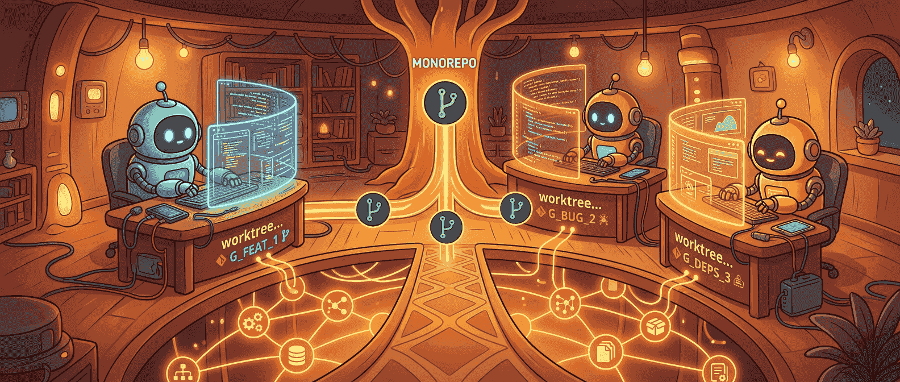
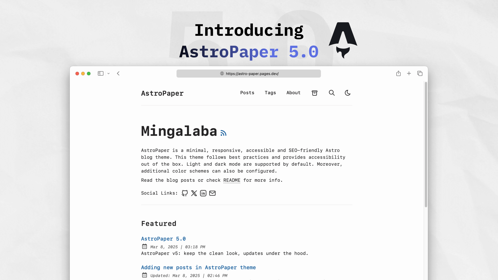

现在一聊 coding agent，很多人脑子里先想到的是模型能力：会不会改代码、会不会拆任务、会不会跑测试。可真把多个 agent 同时丢进一个 monorepo 里干活，最先炸的常常不是模型，而是工程环境。

一个 agent 要有自己的分支、自己的工作目录、自己的文件改动空间，还得能独立安装依赖、跑构建、跑测试。如果你最朴素地处理这件事，办法当然有：每个 agent clone 一份仓库，再各装一遍依赖。问题是这么干一两次还行，三五个 agent 一起跑，磁盘、安装时间、依赖缓存和目录管理很快就开始变成纯体力活。

pnpm 这篇 `pnpm + Git Worktrees for Multi-Agent Development` 文档，真正值钱的地方就在这儿。它不是只在讲一个 Git 小技巧，而是在回答多 agent 开发里一个很现实的问题：**怎么让每个 agent 都拥有隔离工作区和完整 node_modules，同时又别把仓库和依赖重复到把机器榨干。**

答案不是单独靠 `git worktree`，也不是单独靠 `pnpm`，而是两者刚好接上：worktree 解决代码副本，pnpm 的 global virtual store 解决依赖副本。

## Git worktree 解决的，是“每个 agent 都该有自己的世界”

先说 worktree。这东西其实不新，但很多人一直没把它真正用进日常工作流里。

普通 Git 仓库默认只有一个工作目录，基本绑定你当前 checkout 的那条分支。你如果想看另一条分支，要么 stash、要么 commit、要么来回切换。对单人开发这已经够烦了，对多个 agent 同时并行就更别提了。

`git worktree` 的意义，就是让同一个仓库历史可以同时投影成多个独立目录。每个目录都 checkout 在不同分支上，文件彼此隔离，但底层共享同一份 Git 对象库。

比如：

```bash
git worktree add ../feature-branch feat/my-feature
```

这一条命令就能拉出一个新的工作目录，里面是 `feat/my-feature` 分支，而你原来的目录还停在当前分支。对人类开发者来说，这已经挺方便；对 agent 来说，这几乎是刚需。因为 agent 如果要改文件、跑命令、写临时代码，你基本不可能让几个 agent 共用同一份工作树不打架。

> 多 agent 并行开发最基本的前提，不是模型会不会协作，而是它们先别踩彼此工作目录。

所以 worktree 的价值首先不是性能，而是隔离。每个 agent 拿到一个完整、独立、可运行的 checkout，它才有真正安全的操作边界。

## 但 worktree 只解决了 Git 那半边，node_modules 才是更容易把机器拖垮的那半边

很多人第一次看到 worktree，会自然觉得问题已经解决得差不多了。其实只解决了一半。

因为对 Node.js / monorepo 项目来说，真正胖的通常不是 Git 历史，而是依赖安装。你可以让多个 worktree 共用 Git 对象，但每个 worktree 如果都还得各自来一整套 `node_modules`、虚拟 store、链接结构，那你还是会在磁盘和安装时间上狠狠流血。

特别是 monorepo，几百 MB 到几 GB 的依赖树并不夸张。你开两个 worktree 还好，开五个、八个、十个给多个 agent 并行跑，很快就进入“我明明是在扩展开发效率，为什么机器先被依赖副本打趴”的阶段。

pnpm 这篇文档厉害的地方，是它没有把 worktree 当完整答案，而是继续往前补了第二块拼图：`enableGlobalVirtualStore: true`。

## pnpm 的 global virtual store，真正压掉的是每个 worktree 的依赖重复成本

pnpm 默认本来就比很多包管理方式更克制，它用 content-addressable store 存包，再通过链接机制组织依赖树。可在 worktree 场景里，如果你不额外开 global virtual store，每个 worktree 还是会各自维护一套本地 `.pnpm` 虚拟 store 结构。文件不会像最原始那种全量复制一样夸张，但重复成本依然存在。

而 `enableGlobalVirtualStore: true` 的意义在于，它把这些内容进一步往全局共享推。文档给的描述很直白：每个 worktree 的 `node_modules` 最终更像一个符号链接入口层，真正的包内容都统一落在共享的 global store 里。

效果就是：

- 第一个 worktree 安装依赖时，包被下载进全局 store
- 后续 worktree 再安装，很多时候几乎只是补链接
- 每个 worktree 仍然保有自己独立的 `node_modules` 视图
- 但磁盘上不需要为每个 agent 再养一份巨大依赖副本

这件事看起来像实现细节，实际上它才是多 agent 并行能不能规模化的关键。因为 AI agent 最怕的不是偶尔多等几秒，而是每新开一个工作区，环境准备都像重新开荒一样昂贵。

## 把这两层叠起来，才真正构成“多 agent 开发环境”

pnpm 文档里推荐的套路很清楚：用 bare repository 当中心仓库，然后从这个 bare repo 派生多个 worktrees；再让每个 worktree 通过 pnpm 指向同一个全局依赖存储。

大致结构像这样：

```bash
git clone --bare https://github.com/your-org/your-monorepo.git your-monorepo
cd your-monorepo

git worktree add ./main main
git worktree add ./feature-auth feat/auth
git worktree add ./fix-api fix/api-error
```

然后在 `pnpm-workspace.yaml` 里打开：

```yaml
packages:
  - 'packages/*'

enableGlobalVirtualStore: true
```

再分别在各个 worktree 里执行 `pnpm install`。第一次安装负责把包拉进共享 store，后面新增 worktree 的安装速度和成本就会明显轻很多。

这套结构真正漂亮的地方在于，它恰好把两个原本很容易被混着处理的问题分开了：

- Git 层：多个独立 checkout，互不干扰
- 依赖层：多个独立 `node_modules` 视图，共享底层包存储

这就是一种很健康的工程分层。不是暴力复制一切，也不是让所有 agent 共用一个容易打架的环境，而是在隔离和复用之间找到刚好的平衡。

## 对 AI coding 场景来说，这不只是“方便”，而是吞吐量基础设施

文档里说得很诚实：在没有大量使用 AI agents 之前，作者自己在 pnpm 仓库里可能只需要两三个 worktrees，一个 main，一个 v10，偶尔再来一个 feature 分支。可开始大量使用 AI agents 之后，worktrees 数量明显变多，因为 agent 需要并行处理很多任务。

这个变化特别能说明问题。过去我们谈开发环境，经常默认一个人对应一套工作区；现在开始变成一个人可能同时驱动多个 agent，每个 agent 都像一个短时开发者进程，需要自己的 branch、自己的 checkout、自己的安装环境、自己的测试运行空间。

这时候 worktree + global virtual store 就不再是“懂 Git 的人才会用的冷门技巧”，而是典型的 throughput infrastructure（吞吐量基础设施）。

没有它，你也能跑 agent；有了它，你才能把多个 agent 并行这件事做得不那么笨重。

## 这篇文档最有启发的一点，是它把 agent 环境也当成工程对象来设计

现在很多 agent 讨论还有个常见误区：太关注 agent 在任务里的智能表现，却低估了 agent 运行环境本身也需要被工程化。

事实上，多 agent 开发最容易踩坑的，从来不只是 prompt 或模型选择，而是这些更朴素的东西：

- 工作目录会不会互相污染
- 安装依赖是否重复浪费
- 分支是不是足够隔离
- 工作区创建是不是够快
- PR / 临时分支 / fork ref 能不能顺手拉起来
- 工具配置（比如 `.claude`）怎么在多个 worktree 之间共享

pnpm 仓库自己的做法就很有代表性。它不只是有 `pnpm worktree:new` 这种 helper，还会把 `.claude` 目录从 bare repo 的共同 Git 目录里链接进新 worktree，让所有 worktree 共享 Claude Code 设置和批准命令。这个细节特别说明问题：团队已经不只是“给 agent 一个目录”，而是在认真设计 agent workspace lifecycle（工作区生命周期）。

这才像成熟的 AI 工程。不是临时给模型找个地方落脚，而是把 agent 当成会频繁进出、并行运行、需要稳定环境的系统参与者。



## 真正该带走的，不是几条命令，而是一种多副本但不重复浪费的思路

如果只把这篇文档看成“git worktree 用法说明”，会有点低估它。更值得带走的其实是一种思路：**在多 agent 开发里，你要允许工作区副本增多，但不能让重量级状态跟着无脑复制。**

代码 checkout 可以多份，因为隔离最重要；依赖内容不该多份，因为复用最重要。这个原则不仅适用于 pnpm + worktree，几乎也适用于所有未来的 agent 工作台设计。

AI 把并行开发需求抬上来了，工程环境就得跟着变。谁还在靠一份 checkout + 多窗口 + 临时 stash 硬撑，很快就会在 agent 场景里感到别扭。真正更顺手的方式，是接受“一个仓库，多份工作树，多位执行者”已经会变成新常态，然后用正确的工具把重复成本压到最低。

## 如果把这篇文章压成一句话

我会这么总结：**git worktree 让多个 agent 能在同一个仓库里各干各的，pnpm 的 global virtual store 让他们不用为此各背一份沉重的 node_modules。**

前者解决隔离，后者解决浪费。两者拼起来，才是多 agent monorepo 开发真正可持续的基础设施，而不只是一个“看起来挺巧”的命令行技巧。

## 参考

- [pnpm + Git Worktrees for Multi-Agent Development](https://pnpm.io/11.x/git-worktrees) — pnpm documentation
- [global virtual store](https://pnpm.io/11.x/global-virtual-store) — pnpm documentation
- [git worktree](https://git-scm.com/docs/git-worktree) — Git documentation
