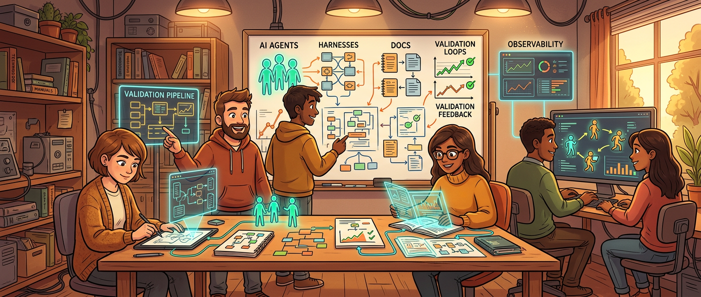
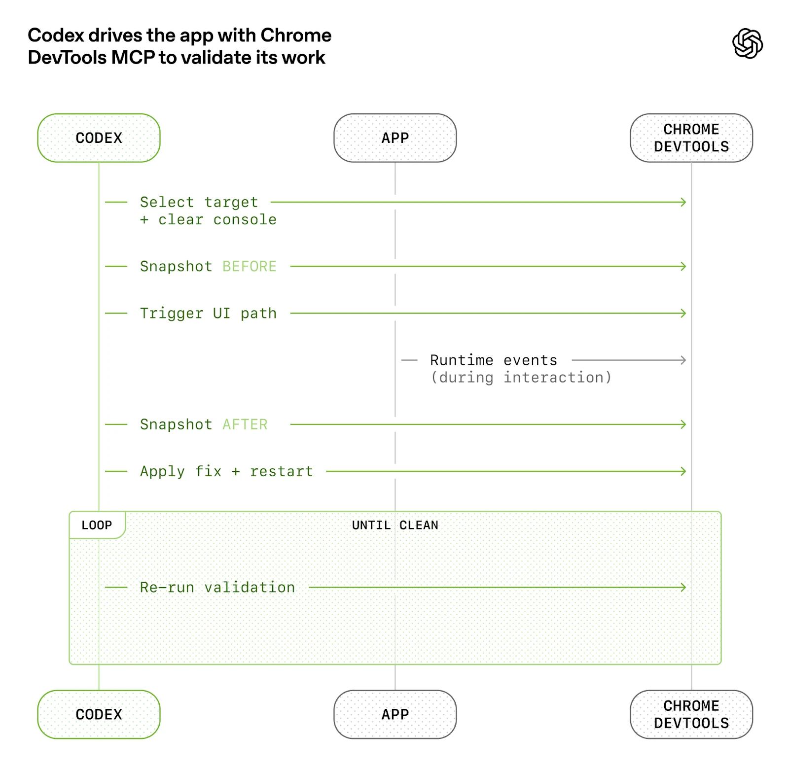
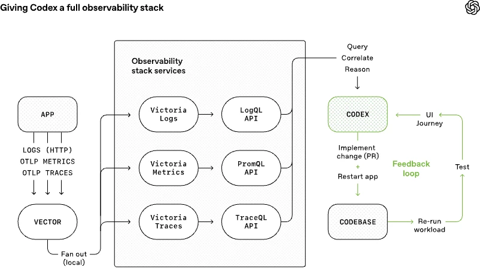

过去大家讨论 AI 写代码，最常问的是：模型到底能写到什么程度？能不能独立改 feature？能不能修复杂 bug？能不能替人写测试？这些问题当然重要，但 OpenAI 这篇《Harness engineering: leveraging Codex in an agent-first world》真正往前推了一步——它开始回答另一个更像 2026 年的问题：**如果 agent 已经能大量产出代码，工程团队接下来最该优化的到底是什么？**

他们给出的答案挺明确：不是继续盯着“怎么让模型更会写”，而是开始认真设计 agent 的工作环境本身。也就是所谓的 harness engineering。

这篇文章最值得看的，不是那句“0 lines of manually-written code”的 headline，而是它背后隐含的工程重心迁移：**当代码不再是最稀缺的产物，工程师的核心工作就会从亲手实现，转向设计让 agent 稳定实现的系统。**

## 真正的变化，不是“AI 开始写代码”，而是工程师的稀缺性从实现转向约束与反馈

OpenAI 这个实验说得很猛：五个月，内部 beta 产品，日活内部用户，外部 alpha tester，应用逻辑、测试、CI、文档、可观测性、内部工具，全都由 Codex 生成；团队坚持 **no manually-written code**；他们估算整体速度大概是手写的十分之一时间。

如果只盯这个结果，最容易得出的结论会是：“哦，所以以后工程师不写代码了。”这结论又快又浅。

文章真正有价值的部分，是它展示了工程工作没有消失，只是挪位置了。OpenAI 团队自己说得很直接：人类的工作开始转向 systems、scaffolding、leverage。也就是说，工程师不再主要靠键盘一行行堆实现，而是靠设计脚手架、补环境能力、构造反馈回路，来让 agent 能持续可靠地产出。

这其实特别像工业化后的角色变化。不是没人做事了，而是最值钱的人从“亲自拧每颗螺丝的人”，变成了“设计产线、调产线、盯质量、控节拍的人”。

> 当 agent 能大规模写代码，真正稀缺的就不是写代码本身，而是定义方向、设计环境、约束质量和维持可控吞吐的人类注意力。

## Harness 这个词的重点，不是工具链，而是“把 agent 装进一个能稳定工作的环境”

很多人一听 harness engineering，容易把它理解成“多接点工具、多搞点集成”。这只是皮。

从文章里的做法看，harness 真正指向的是一个更完整的概念：你不是单独把模型丢进仓库里让它干活，而是给它一个足够 legible（可读、可理解、可验证）的工程世界。这个世界里有目录结构、有工作规则、有质量基准、有观测能力、有本地验证链路、有 review 回路、有知识地图。agent 不是在真空里生成代码，而是在一个被设计过的环境里行动。

OpenAI 团队一开始就从空 Git 仓库起步，连最初的 scaffold、CI、格式规则、包管理器设置、应用框架，甚至 AGENTS.md 都是 Codex 自己生成的。五个月后，他们做到了大约一百万行代码、1500 个 PR、小团队高吞吐，而且核心哲学一直没变：人不直接写代码，只设计系统让 agent 写。

这其实说明一件事：所谓 harness，不是某个单点神技，而是一整套让 agent 能不断自我推进的工程环境设计。

## agent-first 工程里，环境不够清楚，比模型不够聪明更致命

文章里有一个判断我很认同：早期进展慢，并不是因为 Codex 不会，而是因为环境 underspecified（规格不清）。agent 缺的不是“再努力一点”，而是缺少工具、抽象和内部结构，不知道该怎么向高层目标推进。

这句话特别重要，因为它几乎可以解释今天大量 agent 项目的失败。很多团队以为模型一旦变强，任务就会自动完成；现实是，只要环境模糊，模型能力再高也会在模糊空间里反复浪费。人类以前能靠经验脑补的东西，agent 不一定能脑补；人类能临场问同事、切窗口、翻文档、凭直觉修正的东西，agent 不见得能可靠补齐。

所以 OpenAI 团队的工作方式慢慢变成了：把大目标往下拆，把缺失能力补出来，把抽象搭起来，把验证机制接上。一旦某件事失败，先问的不是“能不能再 prompt 一下”，而是“到底缺了什么能力，我们怎么把它做成 agent 可理解、可执行、可约束的东西？”

这其实就是 harness engineering 最硬核的地方：**把失败当成环境设计问题，而不只是模型表现问题。**

## 所谓“让应用对 agent 可读”，本质上是在扩大 agent 的感官系统

文章里我觉得最有意思的一段，是他们不断把应用本身变得对 Codex 更 legible。

比如他们让应用能按 git worktree 启动，这样每个 change 都能在独立实例里跑；把 Chrome DevTools Protocol 接进 agent runtime；给它技能去处理 DOM snapshot、截图、导航，让 Codex 能自己复现 bug、验证修复、理解 UI 行为。后来又把可观测性工具也接进去：日志、指标、trace 全都能在本地、临时、隔离的 observability stack 里暴露给 agent，让它直接跑 LogQL、PromQL、TraceQL 去查问题。

这一步的价值，不只是“agent 多了几个工具”，而是 agent 的感官被扩展了。它不再只是盯着静态代码猜自己改得对不对，而是能看见 UI 结果、运行时表现、启动时间、关键链路耗时。于是像“把启动时间压到 800ms 内”“让四条关键用户路径的 span 都小于两秒”这种要求，才开始变成 agent 真能闭环处理的任务。

我很喜欢这个方向，因为它其实重新定义了“测试”在 agent 世界里的角色。过去测试更多是给人类看，也给 CI 看；现在测试、日志、指标、截图、trace 这些东西，开始同时扮演 agent 的观察输入。谁能把系统状态表达得更清楚，谁就能把 agent 变得更能干。

## repository knowledge 变成 system of record，说明文档终于从附属品升成了运行时资产

文章另一个非常关键的点，是他们放弃了“大而全 AGENTS.md”路线。原因也说得很扎实：上下文资源稀缺、大说明书会把重点冲淡、信息极易腐烂、单个大文件也很难机械检查和验证。

于是他们反过来做：让短小的 AGENTS.md 只做目录和入口，而把真正的知识系统放进仓库里的结构化文档树，docs/ 才是 system of record。

这里我觉得最值得注意的不是“文档变多了”，而是文档角色变了。它不再只是面向人类 onboarding 的辅助材料，而是 agent 运行时真正要依赖的知识层。设计文档、架构说明、产品 spec、质量评分、可靠性、安全边界、执行计划，全都成了一种运行时资产。

这和前面你投过来的 skills / Markdown / MCP 那批文章，其实在一个方向上会合了：**agent 不只是需要 tool access，它还需要一份清楚、分层、可维护的知识地图。** 没有这层地图，再强的 agent 也只能在局部 pattern matching；有了这层地图，它才可能沿着仓库自身的知识结构去行动。

这其实也把“文档是否值得维护”这个老问题翻案了。agent-first 世界里，文档不只是给后来的同事看的，它直接决定 agent 能否稳定地接任务、做判断、保持风格和架构一致性。

## 当吞吐大幅上升，merge philosophy 也会被迫改变

这篇文章还有个很容易被忽略、但我觉得特别重要的信号：当 agent 把 PR 吞吐拉起来以后，团队的 merge philosophy 也会变。

传统团队很多时候默认“PR 少一点但大一点”是可以接受的，因为人类 review、实现和上下文切换都贵。可在 agent-first 环境里，吞吐结构完全不同：PR 可以很多，agent review 也能并行，human attention 反而成了绝对瓶颈。这个时候，真正该优化的不是“人类如何扛住更多改动”，而是“怎么让更多小的、可验证的、容易 merge 的改动稳定流过去”。

OpenAI 文里没有把这件事说成一句简单口号，但它隐含的方向非常明显：在高吞吐 agent 环境里，合并策略、评审边界、质量闸门和任务切分都会被重写。不是因为工程原则变了，而是因为系统里的稀缺资源变了。

## “agent-generated” 不等于无人负责，恰恰相反，它要求更强的责任设计

我很反感一些讨论把“agent 生成”说得像一种无主状态，好像代码是模型自己冒出来的。OpenAI 这篇文章其实恰好相反。它展示的是：当代码由 agent 生成时，责任不会消失，而会转移到更上层。

谁定义任务？谁给环境？谁建验证？谁设质量门槛？谁决定 docs 是不是真的是 source of truth？谁控制架构 taste？谁负责清理熵和垃圾？这些责任全都还在，而且一点不轻。

只不过它们从“我亲手写了这行代码，所以我负责”这种局部责任，变成了“我设计了这个 agent 产线，所以我对这条产线的行为负责”的系统责任。

这也是为什么文章后半段提到 autonomy、entropy 和 garbage collection 时很关键。agent 产出越多，仓库里的冗余、重复抽象、风格漂移、低价值遗留物也会越容易堆起来。没有持续的清理机制，系统很快就会被自己的高吞吐反噬。

所以 agent-first 工程不是“让人类退场”，而是要求人类从作者变成更像策展人、产线设计师、质量控制者和垃圾回收器。

## 我觉得这篇文章真正留下来的，不是一个战绩，而是一种工程观迁移

“0 行手写代码”“1/10 时间”“百万行代码”“1500 PR”这些数字都很抓眼球，但如果只记住这些，你带不走什么真正能复用的东西。

更值得带走的是这套工程观迁移：

- 把 agent 失败优先看成环境设计问题
- 把知识结构当成运行时基础设施
- 把 UI、日志、指标、trace 都做成 agent 可读输入
- 把 review、验证、执行循环更多交给 agent-to-agent
- 把人类注意力当成最珍贵资源来围绕它设计系统

这就是 harness engineering 真正的意思。不是“给 AI 上几根缰绳”，而是承认软件工程本身正在变成一种环境设计工作：你设计的不是单个功能，而是一个能让 agent 持续做出正确功能的场。

## 如果把这篇文章压成一句话

我会这么总结：**agent-first 世界里，最重要的工程不再是把代码写出来，而是把 agent 放进一个它能看清、能验证、能被约束、能持续迭代的环境里。**

代码生成只是表层变化，真正更深的变化是：工程团队开始把环境、知识、验证、观测、合并策略和清理机制都当成一套新的主战场。谁先把这套 harness 设计好，谁才能真正把 agent 从“偶尔有用的写码助手”变成“稳定可扩展的工程吞吐系统”。

## 参考

- [Harness engineering: leveraging Codex in an agent-first world](https://openai.com/index/harness-engineering/) — OpenAI
- [Ralph Wiggum Loop](https://ghuntley.com/loop/) — Geoffrey Huntley
- [Architecture.md](https://matklad.github.io/2021/02/06/ARCHITECTURE.md.html) — Aleksey Kladov
