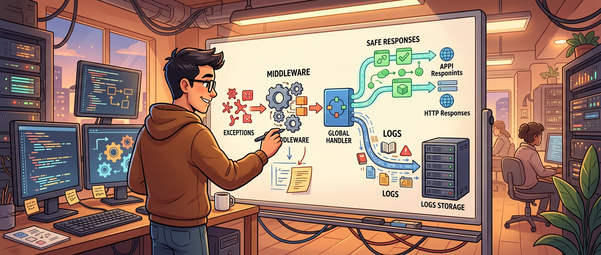

异常处理这种东西，平时最容易被拖着走。接口能跑的时候，大家往往先顾业务；等线上开始出现 500、日志里全是堆栈、前端拿到的错误格式又乱七八糟，才会发现这块其实早就该收口了。

Code With Mukesh 这篇《Global Exception Handling in ASP.NET Core》覆盖得很全，从最朴素的 try-catch，一路讲到 `UseExceptionHandler`、自定义 middleware、`IExceptionHandler`、`ProblemDetails`，再带上 .NET 10 里的 `SuppressDiagnosticsCallback`。但如果把它压成一句最值得带走的话，我会这么说：**ASP.NET Core 里真正现代的全局异常处理，不是“哪里出错就 catch 一下”，而是让异常成为一条统一、可映射、可观测的请求管道能力。**

## 先别急着写 try-catch，真正要先想的是“错误要以什么语义离开系统”

很多人第一次学异常处理，视角都很局部：某个 action 里可能抛错，那就在 action 里包个 try-catch；某个 service 调用数据库可能挂，那就在那一层 catch 住然后返回点什么。

这当然不是完全不行，但它天然有两个问题。

第一，它会迅速把重复逻辑铺满代码库。日志、状态码、错误消息、响应结构，这些东西一旦散在 controller、service、handler 里，团队很快就会进入“每个人都在处理异常，但每个人处理得都不太一样”的状态。

第二，它让错误的 HTTP 语义越来越模糊。业务校验失败、资源不存在、权限问题、依赖服务暂时不可用、真正的未预期异常，这些本来应该有不同外部表现的情况，最后常常都被压成一句“An error occurred”和一个 500。

所以全局异常处理真正该先回答的问题，不是“在哪里 catch”，而是：**这个系统里的错误，最终要怎么被稳定地表达给客户端、日志系统和排障流程。**

这也是为什么 Mukesh 在文里虽然从 try-catch 讲起，但最后的落点明显不是鼓励你多写 catch，而是鼓励你把异常统一纳入请求管道。

## ASP.NET Core 这几年的演进方向，其实很明确：从“能兜住”走向“能分层表达”

这篇文章把 ASP.NET Core 异常处理的演化路线梳理得挺清楚：

- 局部 `try-catch`
- `UseExceptionHandler` 这种内建 middleware 方案
- 自定义异常处理中间件
- .NET 8+ 推荐的 `IExceptionHandler`

这条路线背后的趋势其实很简单：框架越来越鼓励你把异常处理从业务代码中抽离出来，变成一个可组合、可测试、可映射的基础设施层。

`UseExceptionHandler` 已经比到处写 try-catch 好很多了，因为至少它把“未处理异常的最终出口”收拢到了一个地方。但它的问题也很明显：一旦需求变复杂，比如你想按不同异常类型输出不同状态码、不同 Problem Details 内容、不同日志等级，这种写法会越来越像一坨集中式分支逻辑。

自定义 middleware 再往前走了一步，你可以把一些规则抽出来，也更适合老项目和 .NET 7 之前的代码库。但真正更现代的方向，确实像文里强调的那样，是 `IExceptionHandler`。

## 为什么 IExceptionHandler 更像现在该用的做法

`IExceptionHandler` 最大的好处，不是“它是新接口”，而是它终于把异常处理这件事从单一大块逻辑，拆成了更清楚的职责单元。

你可以为不同异常写不同 handler，或者至少在一个 handler 里按清楚的规则去分派。更重要的是，它和 ASP.NET Core 现在整套可组合管道风格是对齐的。你不是在某个控制器里临时救火，也不是在一大段 middleware 里手搓所有决策，而是把异常映射能力注册进应用的基础设施层。

对生产项目来说，这一点很值钱。因为真正难维护的从来不是“今天先把异常兜住”，而是随着系统变复杂以后，你还能不能很清楚地回答这些问题：

- 哪类异常会返回 400、404、409、422、500？
- 哪些异常该被完整记录，哪些只需要业务级提示？
- 哪些错误信息能暴露给客户端，哪些只能留在日志里？
- 某个团队新增了一种业务异常时，应该往哪一层加规则？

`IExceptionHandler` 的价值就在这里：它让异常处理更接近一种显式设计，而不是临时补丁。

## 真正该和全局异常处理一起出现的，不只是 handler，还有 Problem Details

这篇文章里另一个很关键的点，是把 `ProblemDetails` 放到了异常处理旁边讲。这个搭配非常对，因为全局异常处理如果没有统一的响应结构，最后只是把错误从散乱的业务代码里搬到了散乱的 JSON 里。

`ProblemDetails` 的好处不是它“长得标准”，而是它给错误响应建立了一套稳定骨架：

- `type`
- `title`
- `status`
- `detail`
- `instance`

这件事对今天尤其重要。因为 API 的消费者不只是前端页面，还可能是移动端、第三方客户端、自动化脚本，甚至另一个 AI agent。如果错误响应每次结构都不一样，调用方几乎没法可靠处理。

AI 时代这点会更明显。因为越来越多系统不是只让人读响应，而是让模型、代理、自动化流程去判断“这次失败是什么性质，下一步该重试、修参数、还是报警”。这时候统一的错误结构就不再是“好看”，而是机器可用性的一部分。

所以如果今天要做 ASP.NET Core 全局异常处理，我会把 `IExceptionHandler + ProblemDetails` 看成一个组合动作。前者负责管异常流，后者负责管输出形态。

## 异常类型分层，比“统一返回 500”更重要

Mukesh 文里提到自定义异常和不同 handler 的意义，我觉得这部分很值得强化。很多系统异常处理做得很“整齐”，但本质上只是把所有错误整齐地塞进 500。这种整齐没有什么价值。

真正好的全局异常处理，应该做的是把错误语义分层。比如：

- 参数或业务规则不满足，返回 400 / 422
- 资源不存在，返回 404
- 状态冲突，返回 409
- 未授权或禁止访问，返回 401 / 403
- 真正不可预期的系统异常，返回 500

这里最关键的，不是把状态码表背下来，而是承认一件事：**异常不只是服务器内部的失败，它也是系统对外表达状态的一部分。**

你把所有错误都压成 500，看似省事，实际是在把语义债甩给调用方。前端不知道该提示用户重试、改输入还是换流程，调用链上的其他服务也没法做更细的补救策略。

这也是为什么我一直觉得，异常类型设计其实和 API 设计是一体两面。一个 API 只认真设计成功响应，不认真设计失败响应，基本上只能算设计了一半。

## .NET 10 的变化提醒了一件事：诊断信息不一定永远跟着异常走

文章提到 .NET 10 里的 `SuppressDiagnosticsCallback`，这是个挺有意思的信号。它不是那种看一眼就会立刻用上的 API，但它提醒了一个更底层的问题：**异常被处理掉以后，诊断行为是否还应该照旧发生？**

这件事在复杂系统里其实很现实。有些异常是你明确预期且已经映射处理的，比如业务级 not found、某些受控校验失败，这时候如果每次都按系统错误级别打出一整套诊断噪声，日志和监控很快就会被淹掉。

所以现代异常处理不只是“能不能处理”，而是“处理之后还要不要继续当成诊断事件”。这说明框架层也在往更细的可控性走：不是所有异常都该一视同仁地记录和上报。

对今天的团队来说，这个变化最重要的启发不是新 API 本身，而是要开始把“异常映射”和“诊断策略”分开想。异常能返回给客户端一个干净结果，不代表日志和指标就一定该保持同样强度。

## 生产环境里最容易被忽略的，不是写 handler，而是保持 handler 的克制

我看过不少项目，接入全局异常处理后，结果又把所有业务判断塞进 handler 里，最后 handler 变成另一个 service 层。这个方向也不太对。

全局异常处理层最该做的是三件事：

- 识别异常类型
- 映射统一响应
- 决定日志和诊断策略

它不该反过来承载大量业务逻辑。业务规则仍然应该留在领域和应用层，只是当这些规则最终以异常形式冒出来时，handler 负责把它们翻译成稳定的 HTTP 行为。

这层如果越界太多，后面会出现另一个问题：团队开始把“抛异常 + handler 兜底”当成默认业务控制流，代码表面上变整洁了，实际语义越来越绕。

所以现代全局异常处理真正成熟的姿势，不是把一切复杂性都吸进去，而是保持它像一个翻译层、边界层，而不是万能垃圾桶。

## 今天再看这件事，AI 改变的不是原则，而是更放大了“错误结构化”的价值

如果把这篇文章放回今天的语境里，我觉得还有一层值得补上。AI 并没有改变异常处理的底层原则：统一入口、统一响应、按类型映射、避免泄漏内部细节，这些都没变。

真正变了的是，系统越来越多时候不只是给人返回错误，而是给自动化流程和 agent 返回错误。于是“错误是否结构化、是否语义清楚、是否边界稳定”这件事，价值被放大了。

以前一个前端开发看见一句模糊报错，可能还能凭经验补救；现在一个 agent 如果拿到一坨不稳定、字段飘忽、语义不清的错误响应，它只会更容易误判。也就是说，AI 没有让异常处理过时，反而让它更像一项基础设施质量工作。

## 如果把这篇文章压成一句话

我会这么总结：**ASP.NET Core 全局异常处理真正该做的，不是替你多写几个 catch，而是把异常统一翻译成清楚、稳定、可观测的 API 行为。**

在 .NET 8 之后，`IExceptionHandler` 已经很自然地成了这件事的主轴；再配上 `ProblemDetails` 和更清晰的异常分层，你拿到的就不只是一个“能兜底”的方案，而是一条更适合生产环境长期维护的错误处理管道。

## 参考

- [Global Exception Handling in ASP.NET Core - The Complete Guide for .NET 10](https://codewithmukesh.com/blog/global-exception-handling-in-aspnet-core/) — Mukesh Murugan
- [Handle errors in ASP.NET Core](https://learn.microsoft.com/aspnet/core/fundamentals/error-handling) — Microsoft Learn
- [ProblemDetails in ASP.NET Core](https://learn.microsoft.com/aspnet/core/fundamentals/error-handling-api) — Microsoft Learn
