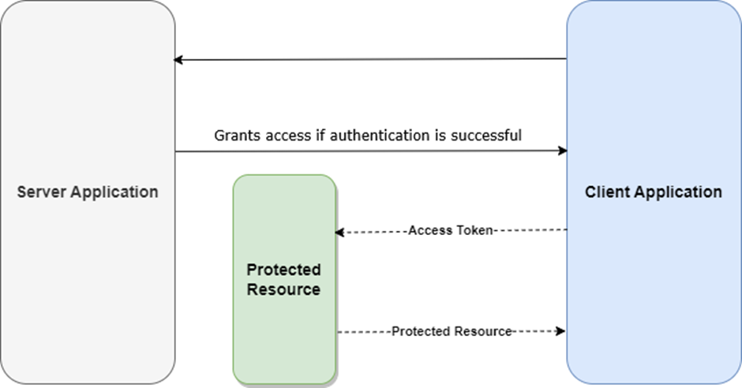

很多 JWT 教程讲 refresh token，讲着讲着就只剩一句话：access token 很短，refresh token 很长，过期了就拿 refresh token 换新的。听上去没错，但也太轻了。

真正做过认证系统的人都知道，refresh token 不是“顺手补一个更长的 token”这么简单，它其实是在决定一件更底层的事：**当短期凭证失效后，系统允许用户如何继续会话，以及一旦凭证泄露，损害会被控制在什么范围里。**

Redgate 这篇《How to use refresh tokens in ASP.NET Core》把基础流程铺得挺完整，适合入门和上手实现。但如果把它压成一篇更适合今天看的工程文章，我觉得重点应该落在 refresh token 背后的边界设计，而不只是代码步骤。

## 先分清 access token 和 refresh token，不然整个设计会从第一步就跑偏

这两个 token 经常一起出现，所以很多人会把它们混成“反正都是 JWT 身份凭证”。其实它们承担的职责完全不一样。

access token 是给 API 网关、控制器、授权中间件看的，它应该短命、轻量、易验证，适合频繁随请求发送。它的主要职责是：**在一个较短时间窗口里证明“这个调用当前是带授权的”。**

refresh token 则不是给业务 API 四处传着玩的。它更像一把续期钥匙，用来在 access token 过期之后，向认证系统重新申请新的访问能力。它的职责不是直接访问业务资源，而是访问“重新签发凭证”这件事本身。

这两个角色一旦没分清，后面常见的坑就全来了：

- 把 refresh token 也当 bearer token 到处带
- refresh token 生命周期太随意
- refresh token 不做存储和失效控制
- token 刷新后旧 token 还一直可用
- 一旦泄露，攻击者几乎拿到长期会话控制权

所以 refresh token 的第一原则其实很朴素：**它不是另一个 access token，它是更敏感的一层会话续期凭证。**

## refresh token 真正解决的，不只是“免登录”，而是把安全性和体验拆开处理

为什么大家不直接把 access token 设成 30 天、90 天，省得搞 refresh token 这套？因为这两件事本来就在互相拉扯。

用户体验上，你当然希望用户不要频繁重新登录；安全上，你又不希望一个被盗的 access token 可以长时间直接访问业务 API。refresh token 机制的核心价值，就是把这两个目标拆开：

- **短命 access token** 负责把被盗后的直接利用窗口压短
- **相对长命 refresh token** 负责把“持续登录体验”留给认证系统控制

这相当于把“能访问资源”和“能续命会话”分成两层权限。系统不需要把高频 API 调用都绑在一个长期有效的大钥匙上，而是用短期通行证 + 续期钥匙的组合来平衡体验和风险。

这也是为什么 refresh token 设计得好不好，决定的不是一个登录页体验，而是整套会话安全模型的形状。

## 教程最容易漏掉的地方，是 refresh token 的风险其实比 access token 更值得怕

很多入门文章会强调 access token 不能太长命，这是对的。但到了 refresh token，又常常默认“那它就长一点就好了”。这就有点危险了。

因为从攻击者视角看，一个可用的 refresh token 往往比一个快过期的 access token 更值钱。后者可能只剩几分钟窗口，前者如果没有轮换、吊销、绑定设备或其他保护机制，等于给了攻击者持续换新通行证的能力。

所以 refresh token 真正该被当成什么？我更愿意把它当成一种**高价值续期凭证**。既然它更值钱，就不能只考虑“怎么发”，还得考虑：

- 怎么存
- 怎么换
- 怎么失效
- 怎么发现异常使用
- 怎么在用户登出、密码修改、风险事件后统一撤销

如果这些问题不回答，refresh token 机制看似提升了体验，实际上只是把高风险凭证静悄悄地延长了寿命。

## 在 ASP.NET Core 里实现 refresh token，真正重要的不是控制器，而是状态管理

Redgate 这篇文章用了一个比较常见的讲法：建 Web API、加 JWT Bearer、配 EF Core / Identity、定义模型、写 `AuthenticationService`、提供登录和刷新接口。这条路线没有问题，适合把功能跑起来。

但如果从工程视角再往前一步看，你会发现 refresh token 这件事最关键的，其实不是 `AuthenticationController` 里那个 `/refresh` endpoint，而是你有没有把 token 的状态管理清楚。

因为 access token 往往是自包含、无状态的，签发后主要靠签名和过期时间验证；refresh token 不一样，它几乎天然要求有一层服务器端状态：

- 当前 token 是否仍有效
- 属于哪个用户 / 会话 / 设备
- 什么时候过期
- 是否已经被用过
- 是否已被吊销
- 是否被新的 token 链替换

也就是说，refresh token 不是简单签一个 JWT 就结束的事。它通常需要落库存、带元数据、支持查询和吊销。你如果还沿用“JWT 都是无状态的，所以 refresh token 也别存”的直觉，后面大概率会被会话管理反噬。

这也是我觉得很多教程容易带偏人的地方：代码入口看起来在 controller，真正复杂度其实在 token lifecycle management（令牌生命周期管理）。

## 轮换（rotation）才是 refresh token 设计里最值得上强度的地方

文章里虽然把“刷新后重新生成 access token 和 refresh token”讲出来了，但这件事其实值得被单独放大：**refresh token 轮换，不是实现细节，而是安全核心。**

如果刷新接口每次都返回新 access token，但 refresh token 自己长时间不变，那一旦 refresh token 被窃取，攻击者就能在很长时间里持续刷新。你可能甚至感知不到，因为一切看上去都像正常续期。

轮换的意义在于：每次使用 refresh token 后，旧 refresh token 立刻失效，并签发一个新的。这样一来：

- token 泄露后的可重放窗口会缩短
- 服务器有机会识别“同一个旧 token 被重复使用”的异常
- 会话能形成一条可追踪的续期链，而不是一把永不更换的万能钥匙

如果再往前做得更细，还可以在检测到旧 token 被重复使用时，把整条会话链直接作废。这在今天已经不算特别激进，而更像成熟认证系统的基本防线。

所以如果你今天在 ASP.NET Core 里做 refresh token，不要只实现“刷新成功”，还要问一句：**刷新之后，旧 token 怎么处理？** 如果答案只是“留着也行”，那这套方案离生产可用还差一截。

## 别把 refresh token 当成纯认证问题，它其实也是设备和会话管理问题

当系统只有“用户”维度，没有“会话”维度时，refresh token 设计会越来越拧巴。

比如一个用户同时在手机、笔记本、平板上登录，你到底是给这三台设备共享一个 refresh token，还是每台设备一条独立会话？如果用户主动退出某一台设备，你能不能只让这一条 refresh token 失效，而不是把所有端都踢下线？

这些都说明 refresh token 不只是 auth plumbing（认证 plumbing），它本质上还是 session model（会话模型）的一部分。真正成熟的设计里，refresh token 往往应该绑定到更具体的会话上下文，比如设备、客户端实例、浏览器 session，甚至风险等级。

这件事对今天尤其重要。因为用户越来越习惯多端无感续期，团队又越来越在意“只撤销有风险的那一个会话，而不是全局炸掉”。如果 refresh token 设计天生没有会话粒度，后面要补就会很痛。

## 说到存储，真正稳妥的方向是：能少暴露就少暴露，能校验就多校验

这类文章通常会让你把 refresh token 存到数据库里，这没问题，但只做到“有一列 RefreshToken”还不够。

更像生产做法的方向一般会包括：

- 不直接明文存 token，至少考虑哈希存储
- 记录过期时间、创建时间、吊销时间、替换来源
- 关联用户 ID、会话 ID、设备信息或客户端标识
- 刷新时核对 token 状态，而不是只核对字符串相等
- 对异常刷新行为打审计日志

这些动作听起来都不惊艳，但它们决定了一旦系统出事，你到底有没有能力回答：哪个 token 被谁用过、什么时候失效、是否被重放、该撤哪一批会话。

AI 并没有改写这些原则。相反，AI 时代因为很多人更容易快速生成一套“能跑的 JWT 登录代码”，才更需要有人盯住这些不会自动被模板照顾到的安全边界。模型能帮你搭接口，帮不了你自动做出正确的会话风险判断。

## 真正要避免的，不是“不会做 refresh token”，而是“做了个看起来像 refresh token 的东西”

我见过不少方案，表面上已经有 access token 和 refresh token 两层了，但本质上只是把风险换了个地方放：

- refresh token 永久有效或超长有效
- 不轮换
- 不落库存状态
- 登出不撤销
- 密码修改后旧 refresh token 还继续能用
- 所有设备共用同一条续期凭证

这种实现最麻烦的地方就在于，它看起来比单一长命 JWT 更“现代”，但实际安全收益可能并没有你想得那么大。最糟时，它只是把系统从简单不安全升级成复杂不安全。

所以今天看 refresh token 方案，我最关注的反而不是“有没有 `/refresh` 接口”，而是这几个问题：

- token 有没有轮换
- refresh token 是否有服务端状态
- 会话能不能被单独吊销
- 凭证泄露后的损害能不能被收敛
- 返回给客户端的生命周期策略是否清楚

回答清楚这些，才算是真的把 refresh token 设计进系统里，而不是只是把它写进教程里。

## 如果把这篇文章压成一句话

我会这么总结：**ASP.NET Core 里的 refresh token 设计，本质上不是“让 JWT 续一下命”，而是在设计一套可续期、可撤销、可控风险的会话机制。**

access token 负责短期访问，refresh token 负责有限续期；真正决定这套方案是否靠谱的，不只是签发代码，而是轮换、存储、吊销和会话粒度这些边界有没有被认真设计。

## 参考

- [How to use refresh tokens in ASP.NET Core - a complete guide](https://www.red-gate.com/simple-talk/development/dotnet-development/how-to-use-refresh-tokens-in-asp-net-core-a-complete-guide/) — Joydip Kanjilal / Simple Talk
- [JWT introduction](https://jwt.io/introduction) — JWT.io
- [ASP.NET Core authentication and authorization](https://learn.microsoft.com/aspnet/core/security/authentication/) — Microsoft Learn
