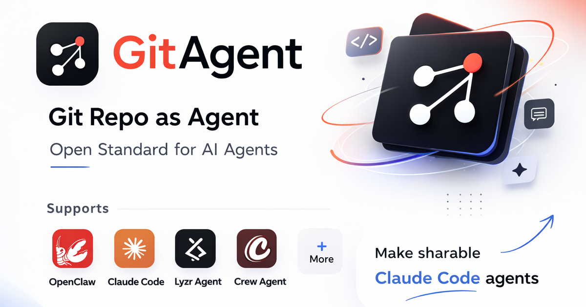

现在做 agent，很多产品默认的起手式都差不多：进一个控制台，填几段 prompt，挂几个 tools，配点 memory，再点按钮部署。刚开始挺顺，越往后越容易出现一种熟悉的不适感：为什么这个东西明明已经是团队核心资产了，结果它最关键的定义还散落在某个供应商的网页配置里？

GitAgent 想解决的，就是这个不适感。

它给出的答案很直接：**如果 agent 已经是工程系统的一部分，那 agent 的定义就应该像代码一样活在 git 里。** 不是活在一个难以审查、难以迁移、难以分支协作的产品后台里，而是活在仓库、文件、提交记录、分支和 PR 里。

这也是为什么我觉得 GitAgent 值得整理进 AideHub。它不是单纯“又一个 agent framework”，而更像是在追问 agent 开发里一个被很多人默认跳过的问题：**agent 到底应该被当成运行时产物，还是仓库里的可治理工件？**

## GitAgent 真正卖的不是 runtime，而是 agent definition 要归档进 git

GitAgent 官网首页最核心的一句定位其实已经说透了：`The Open Standard for Git-Native AI Agents`。

这个“git-native”不是随便加的形容词，它直接决定了整个项目的视角。GitAgent 不是先从某个特定模型、某个特定 orchestration runtime、某个特定 provider 出发，而是先从 agent definition（agent 定义）出发。

它认为一个 agent 不应该只是某条 system prompt，或者某个 UI 里的一堆配置项，而应该是一组有结构的文件：

- `agent.yaml`
- `SOUL.md`
- `SKILL.md`
- `AGENTS.md`
- tools / knowledge / memory / hooks / compliance 之类目录

这套设计背后的思想其实很朴素：如果身份、规则、技能、记忆、工具清单、知识来源本来就是 agent 的组成部分，那它们就应该被清楚拆分、文件化、版本化，而不是混进某个 opaque runtime 配置里。

> GitAgent 的关键点不在于“让 agent 跑起来”，而在于“让 agent 的定义先变成一个可以被管理的仓库对象”。

这句话听起来像管理味很重，但恰恰因为 agent 正越来越进入真实团队流程，这种“先定义、再运行”的思路才会变得更重要。

## 它最有意思的地方，是把 agent 资产从厂商后台里拽回开发者熟悉的协作面

为什么说 GitAgent 不是普通意义上的 agent framework？因为很多 framework 真正关心的是 runtime abstraction：怎么定义 agent、怎么调用 tool、怎么编排 multi-agent、怎么接 provider。

GitAgent 关心的东西稍微偏上一层。它在乎的是：

- agent 能不能被 git versioning 管起来
- 能不能走 branch / PR / review
- 能不能用已有 CI/CD 去校验
- 能不能从一个框架导出到另一个框架
- 能不能别被单一 vendor 锁死

这就让它看起来更像一种 agent packaging / specification 层，而不是一整套封闭运行时。

官网自己也说得很明白：GitAgent 是 framework-agnostic。定义一次，然后可以导出到 Claude Code、OpenAI Agents SDK、CrewAI、OpenClaw、Nanobot、Lyzr，甚至导成一个 raw system prompt。

这点很值钱。因为今天很多团队做 agent 最大的潜在风险不是“模型不够强”，而是太早把 definition 跟某个 runtime、某个 SaaS 平台深度耦合了。短期上手很快，后面迁移和治理会越来越痛。

GitAgent 试图把这层解开：先把 agent 作为一套 git 里的标准化定义沉淀下来，运行时只是下游适配器之一。

## 这套文件结构为什么有吸引力？因为它天然贴近今天 agent 的真实组成

我觉得 GitAgent 最聪明的一点，不是 invent 了多复杂的新 DSL，而是它很克制地利用了大家已经熟悉的文件语义。

像 `SOUL.md` 这种文件，本质上是在表达 agent identity；`SKILL.md` 是能力模块；`agent.yaml` 是配置；`memory/`、`knowledge/`、`hooks/`、`tools/`、`compliance/` 这些目录名，几乎一眼就能猜到职责。

这其实跟很多人现在已经在实践里的做法是收敛的。你看 Claude Code skills、OpenClaw 这类系统、各种 repo-local prompt conventions、团队内部 agent playbook，本质上都已经在往“agent = 一组文件”这条路上走了，只是每家结构还不统一。

GitAgent 的野心就是把这件事再往前推一步：**不是只有我们团队这样堆文件，而是把文件结构本身变成一个可交换标准。**

这也是为什么它对开发者会很顺手。因为你不需要重新学一整套陌生配置心智，很多东西已经天然能放进 git 工作流里：

- 想改 persona，改 `SOUL.md`
- 想加技能，新增 `skills/.../SKILL.md`
- 想审查 agent 行为变化，看 diff
- 想试一个实验版本，开 branch
- 想恢复旧行为，git revert

这个体验对工程团队来说很自然。Agent 终于不再像一个漂浮的产品对象，而更像仓库里的正式资产。

## GitAgent 在解决的，某种意义上是 agent 时代的“基础设施可移植性”问题

官网反复强调 open standard 和 MIT license，这不是装饰。因为它真正对准的痛点，本来就和 portability（可移植性）有关。

今天 agent 生态有个很明显的问题：大家都在定义 agent，但定义方式高度平台化。一个平台里叫 instructions，另一个叫 config，第三个叫 workflow，第四个叫 crew；你在一个工具里辛辛苦苦积累的 agent 资产，往往很难完整迁移到另一个工具里。

GitAgent 的提议是：把定义层抽出来，运行时各做各的，但 agent definition 至少应该有一套开放、文件化、可导出的标准承载。

这有点像基础设施世界里 Terraform 或 Kubernetes YAML 曾经扮演的角色。它们不是把所有平台差异消灭了，而是提供了一层更稳定的中间表示，让团队别每次都从零绑死在某个控制台里。

GitAgent 现在显然还远没到那种生态地位，但它指向的问题是成立的：**agent 的价值不该只沉淀在供应商的运行时里，也该沉淀在你自己能长期持有的定义层里。**

## 它也不是没有难点：标准越想开放，就越要面对“最小公约数”和“复杂度外溢”

当然，GitAgent 这类项目天然也会遇到一个老问题：想做开放标准，就得在表达能力和通用性之间反复拉扯。

如果标准太轻，最后只能描述一些很基础的 agent 元信息，真正复杂的 workflow、provider-specific 特性、工具能力细节还是得各自平台补，导出时很容易失真。

如果标准太重，又会把大量运行时差异硬塞进 spec，结果不是变成一个臃肿配置系统，就是把最复杂的适配成本推给使用者。

所以 GitAgent 真正难的地方，不是把 `SOUL.md`、`SKILL.md` 这些概念摆出来，而是后面如何持续证明：这套定义层足够稳定、足够通用，同时又不至于沦为最小公约数玩具。

不过我反而觉得，这正是它值得关注的地方。因为 agent 生态现在最缺的不是“又多一个 runtime”，而是更少一些重复发明、更清楚一些资产边界。如果哪怕 GitAgent 最后只推动了“agent 应该文件化、版本化、可迁移”这件事成为共识，它都已经有价值。

## 对今天的团队来说，GitAgent 最现实的价值可能不是马上全面迁移，而是提供一个更清楚的整理框架

说实话，不是每个团队明天就要把现有 agent 系统都迁到 GitAgent。很多团队现在的问题甚至还没到“跨框架迁移”，而是更前面的混乱：

- prompt 放哪都不知道
- 技能说明和工具配置缠在一起
- 记忆、知识、规则全塞一个文件
- 不知道哪些应该进 repo，哪些应该进 runtime
- 每次调整 agent 都像手工改黑盒

在这种情况下，GitAgent 的现实价值可能首先是结构启发。它提供了一种很清楚的整理方式：agent 有身份层、技能层、配置层、工具层、知识层、记忆层、治理层，这些东西本来就不该混成一团。

哪怕你暂时不用它的 CLI，不用它的 adapter，只是借它的结构去重新梳理团队当前 agent 资产，很多时候也已经能让系统更清楚。

这也是我觉得它和 AideHub / OpenClaw 这类实践特别容易对话的原因。因为大家其实都在朝一个方向逼近：让 agent 不再只是 prompt engineering 的结果，而成为仓库里可维护、可审查、可积累的工程对象。

## 如果把 GitAgent 压成一句话

我会这么总结：**GitAgent 想做的，不是另一个把 agent 关进自己生态里的平台，而是一层把 agent 定义重新交还给 git 的开放标准。**

它试图把 identity、skills、tools、knowledge、memory、compliance 这些原本容易散落在运行时和后台配置里的东西，重新整理成一组可版本化、可分支、可 review、可导出的仓库文件。真正值钱的不是某个单点功能，而是它在推动一种更像工程资产的 agent 形态。

如果你今天已经开始认真把 agent 当团队系统的一部分看，GitAgent 至少提出了一个很值得追的问题：**我们的 agent，到底属于某个 vendor 的控制台，还是应该首先属于我们自己的仓库？**

## 参考

- [GitAgent](https://www.gitagent.sh/) — GitAgent 官方网站
- [open-gitagent/gitagent](https://github.com/open-gitagent/gitagent) — GitHub
