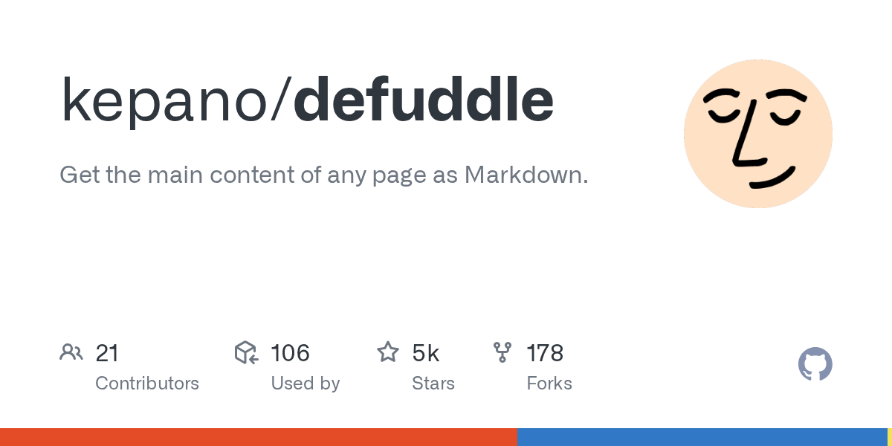

互联网上很多页面其实不是给“读”设计的，而是给“站点整体运营”设计的。正文之外，评论区、侧边栏、推荐流、分享按钮、广告位、锚点链接、浮动工具条，全都在争版面。人类读一遍还勉强能忍，真到了收藏、归档、转 Markdown、喂知识库或者做后续检索的时候，这些东西就全成了噪音。

Defuddle 这个工具要解决的，就是这类噪音。

它不是浏览器阅读模式那种“看起来更清爽”层面的处理，而更像一个面向程序和知识系统的网页正文提纯器：输入 URL 或 HTML，输出更干净的正文 HTML / Markdown，再顺手带上标题、作者、发布时间、站点名、favicon、schema.org 数据这些元信息。

如果只看一句话介绍，你可能会把它理解成“另一个 Mozilla Readability 替代品”。但真正让我觉得它有意思的地方，不只是能提正文，而是它明显在朝更工程化、更可持续复用的方向做。

## Defuddle 真正处理的，不只是页面脏，而是“内容以后还要不要用”

很多内容提取工具的默认目标都差不多：把一页 HTML 里最像正文的那块找出来。做到这一步已经不容易了，但现实问题通常还没结束。

因为对今天很多使用场景来说，你并不是只想“看一眼这篇文章”。你可能还想：

- 存到 Obsidian / 知识库
- 转成 Markdown 继续编辑
- 保留作者、发布时间、站点来源
- 让脚注、代码块、公式不要在转换时坏掉
- 后续交给搜索索引或 AI 做检索

一旦场景变成这样，简单地“把正文 div 扒下来”就不够了。你需要的是一种更稳定的内容标准化过程。

Defuddle 的 README 里其实已经把这件事说得很明白了。它不仅提取主内容，还会做一层 HTML standardization：规范化标题层级、处理脚注、清洗代码块、保留语言标记、把 MathJax / KaTeX 之类数学内容统一成 MathML，还能提取更多 metadata。

这就让它看起来不像一个“一次性爬虫小工具”，而更像一条内容预处理管道。

## 它和 Readability 的差别，不在于“更猛”，而在于“更克制，也更面向后续处理”

Defuddle 作者自己在 README 里直接拿 Mozilla Readability 做了对比，我觉得这点挺坦诚。它并不是说自己把 Readability 全面碾压了，而是强调了几个实际差异：

- 它更宽容，少删一些不确定元素
- 它对脚注、数学、代码块这类结构化内容给出更一致的输出
- 它会利用页面的移动端样式去猜哪些东西是不必要元素
- 它会尽量提取更多 metadata，包括 schema.org 数据

这几个点拼起来，其实很能说明它的定位。很多“正文提取”工具擅长做减法，但减法做狠了，往往会把对后续使用很关键的信息一起删掉。Defuddle 明显是在试图平衡两件事：既要把噪音去掉，又别把以后还要用的结构一起打碎。

这对知识管理和 AI 检索尤其重要。因为今天很多时候我们不是把网页提纯完就结束，而是要把它继续喂给别的系统。你清理得太暴力，后面引用、搜索、转换、追踪来源都会变得更差。

## 真正让我觉得它顺手的，是它没有把自己绑死在某一个使用场景里

README 里这点也很清楚：Defuddle 最初是为了 Obsidian Web Clipper 做的，但它没有把自己做成只能活在某个浏览器扩展里的私有逻辑，而是提供了三种形态：

- 浏览器环境可直接跑
- Node.js 环境可接 `linkedom`、`jsdom`、`happy-dom` 等 DOM 实现
- CLI 可直接对本地 HTML 或 URL 做解析

这种设计很适合工程实际。因为同样一套“正文提纯”需求，可能会出现在完全不同的地方：

- 浏览器扩展里给用户剪藏网页
- 后台服务里把文章同步进知识库
- 命令行脚本里批量清洗存档页面
- 爬虫流程里先做预处理再转 markdown

如果一个工具只能嵌在某个产品内部，那它的适用面会很窄。Defuddle 这种写法更像是在认真把“网页内容提纯”当成一个独立能力层来做，而不是某个应用的小零件。

## 它最适合的场景，不是“抓所有网页”，而是把真正值得保留的内容变干净

这类工具最容易被误解的一点，是好像它能替你解决整个 web scraping 世界。其实不太是。

Defuddle 更擅长的是“文章型”“正文型”“内容型”页面，也就是那些本来就存在一个相对明确主内容区域的页面。它的目标不是模拟浏览器执行所有复杂前端逻辑，也不是帮你处理整站数据抓取策略，而是把已经拿到的页面内容整理成更适合阅读和后处理的形式。

所以它特别适合这些场景：

- 收藏文章并转成 Markdown
- 给知识库做网页剪藏预处理
- 给 AI 检索或 RAG 管道准备更干净的文档输入
- 做离线归档时保留主要正文和元数据
- 从博客或文档页面提取结构化正文

反过来说，如果你要抓的是强交互型 Web App、复杂登录态页面、动态数据流界面，Defuddle 不会 magically 把这些都变成文章。它解决的是页面清洗和正文抽取，不是整个浏览器自动化问题。

把边界看清以后，它的价值反而更明确：**它帮你把“已经拿到的网页内容”变成后续更好用的内容。**

## 对今天的 AI / 知识库工作流来说，这种工具的价值其实在上升

这几年一个很明显的变化是，网页内容越来越常常不是被人直接读完就结束，而是会进入另一条链：剪藏、索引、摘要、问答、知识库同步、全文搜索、语义检索。

在这条链里，原始网页 HTML 往往并不是一个很好的输入格式。它混着布局、装饰、推广位、脚本残留和站点级杂质，太适合浏览器渲染，不太适合后续系统消费。

Defuddle 这类工具真正能提供的便利，就在于它帮你在进入后续流程之前，先做一轮“内容降噪 + 结构标准化”。这一步看似不起眼，实际很值钱。因为后面无论是转 Markdown、入库、embedding 还是让 AI 检索，输入质量都会直接影响结果质量。

而且它还特意照顾了脚注、代码块、数学公式这些传统正文提取里最容易处理糙的部分。对于开发者文档、技术博客、学术型页面来说，这比单纯“正文提出来了”要重要得多。

## debug 能力也很实用，因为内容提取最怕“删过头了还不知道为什么”

Defuddle README 里我挺喜欢的一部分是 debug 设计。它不只是告诉你能开 debug，而是把调试信息也结构化了：

- 选中了哪个 content selector
- 哪些元素被删了
- 是在哪个 pipeline step 被删的
- 为什么删（例如低分、隐藏、命中特定 selector）

这个能力很适合真实使用。因为正文提取类工具最常见的问题就是：某个站点提取得不对，但你很难迅速知道到底是主内容判断错了，还是某一步清洗过猛。没有这层可见性，修 bug 会非常痛苦。

Defuddle 至少在接口设计上已经意识到这件事了，所以它看起来不像“跑通 happy path 就完了”的 demo，而是朝着一个真的会被反复嵌入工作流里的工具去做。

## 如果你今天正好在做网页转 Markdown、知识归档或内容预处理，Defuddle 的意义很实际

我觉得 Defuddle 最打动人的地方，不是它发明了一个全新的问题，而是它认真对待了一个很多人都以为“随便提一下正文就行”的问题。

现实里，真正好用的网页提纯不是把页面砍干净这么简单，而是要把正文、结构和元信息一起整理好，让它能继续进入别的系统。Defuddle 在这件事上明显是有取舍的：它想删掉噪音，但不想把以后还要用的内容也一起丢掉。

所以如果你只是想临时看一篇文章，浏览器阅读模式可能已经够了；但如果你想把网页变成可归档、可转换、可检索、可复用的内容对象，Defuddle 这类工具就会开始变得很顺手。

## 参考

- [defuddle](https://github.com/kepano/defuddle) — GitHub
- [Obsidian Web Clipper](https://github.com/obsidianmd/obsidian-clipper) — GitHub
- [Mozilla Readability](https://github.com/mozilla/readability) — GitHub
