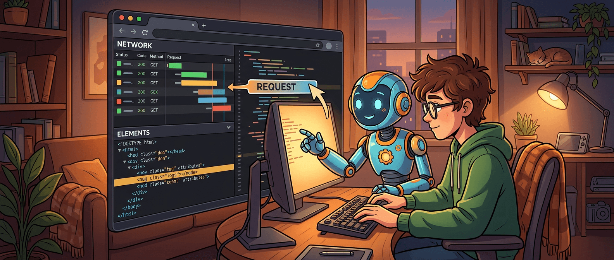
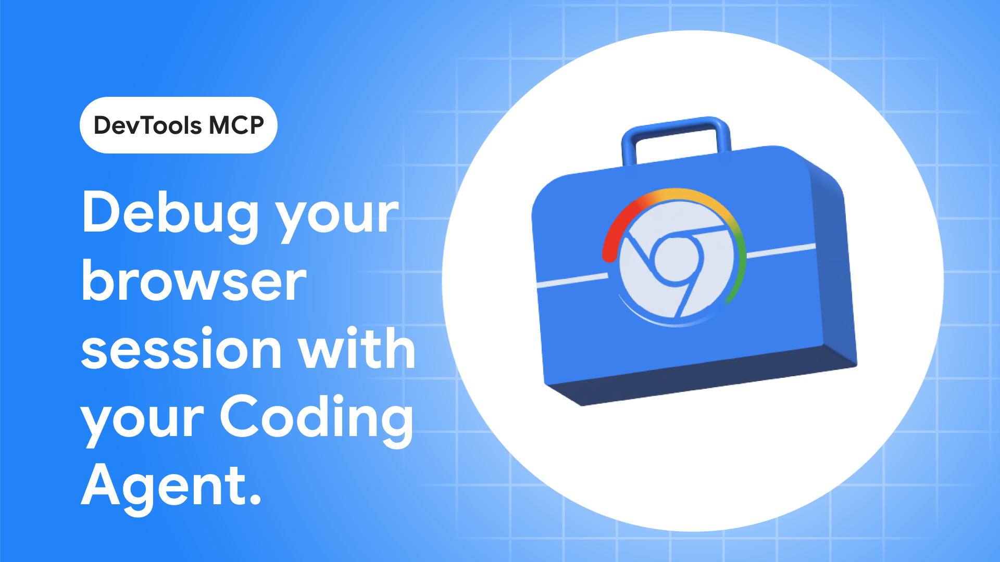
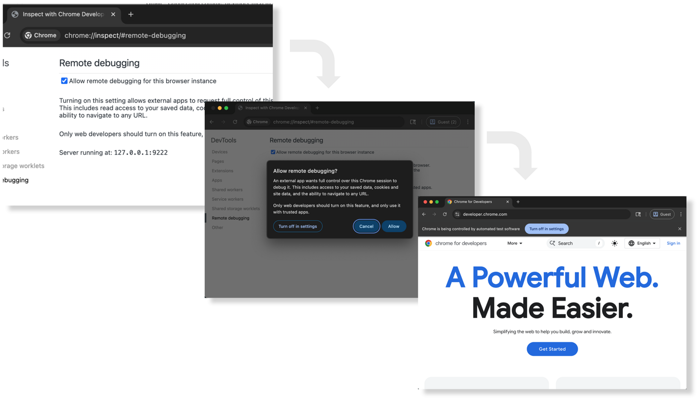

---
pubDatetime: 2026-03-16T00:14:16+00:00
title: "Chrome DevTools MCP 调试浏览器会话有什么变化"
description: "Chrome DevTools MCP 这次增强最有价值的地方，不是又多了一个浏览器自动化入口，而是让编码智能体可以直接接入你已经在用的真实浏览器会话和 DevTools 调试上下文。登录态不用重来，当前选中的网络请求和 DOM 元素也能直接交给 agent 接着查。这让手动调试和 AI 辅助调试之间第一次变得像是在同一条工作流里切换，而不是重新开一套隔离环境。"
tags: ["Chrome DevTools", "MCP", "AI Coding", "Debugging"]
slug: "chrome-devtools-mcp-browser-session"
ogImage: "../../assets/616/01-cover.png"
source: "https://developer.chrome.com/blog/chrome-devtools-mcp-debug-your-browser-session?hl=zh-cn"
---

过去一段时间里，大家聊浏览器里的 agent 调试，最大的问题其实不是“它能不能操作浏览器”，而是它操作的那个浏览器，往往不是你正在看的那个。

你自己已经登录好了站点、已经打开了 DevTools、已经在 Network 面板里盯住某个失败请求、甚至已经在 Elements 面板里选中了可疑节点；结果一旦把任务丢给 agent，它又重新起一个隔离浏览器、重新走登录、重新定位页面、重新猜问题在哪。能跑当然也能跑，但整个过程总有一种很明显的断裂感。

Chrome DevTools MCP 这次新加的能力，最重要的变化就是把这道断裂补上了。它让编码智能体可以直接接入**当前活跃的浏览器会话**，甚至接住你在 DevTools 里已经选中的调试上下文。说白了，它终于让“我手动已经看到的问题”可以更自然地交给 agent 接着查，而不是让 agent 从零再演一遍。

## 调试上下文终于可以交接了

Chrome 这篇文章里最值得记住的一句，不是某个参数名，而是它描述的两个能力：

- 复用现有浏览器会话
- 访问活跃的 DevTools 调试会话

这两件事说来平常，但浏览器调试最花时间的部分，很多时候不是"点哪里"，而是**把上下文准备到问题暴露出来的那个状态**。

比如一个 bug 只在登录后出现；比如某个失败请求只会在复杂交互路径之后触发；比如你已经在 Network 面板里筛了半天，终于找到那个 500；比如你已经在 Elements 里锁定了那个奇怪的 DOM 结构。以前这些都是你手上已经有的上下文，但 agent 很难直接继承。

现在 DevTools MCP 的 auto-connect 能力，实际解决的就是这个交接问题。它不是再给 agent 一个“也能打开 Chrome”的能力，而是让它直接进入你已经走到一半的真实浏览器现场。

> 浏览器调试里最贵的常常不是操作本身，而是把问题重新摆到眼前的那段上下文准备。Chrome DevTools MCP 这次增强，等于是在给 agent 省这段成本。

## agent 为什么在看另一个浏览器

过去很多浏览器自动化或 agent 调试方案都能“连上浏览器”，但默认连接的是专用 profile、独立实例，或者某个临时远程调试环境。这样做当然有安全和隔离上的好处，但它也带来一个副作用：开发者和 agent 实际上在两个浏览器世界里工作。

你在自己的会话里调，agent 在它自己的会话里跑。你看到的 cookie、登录状态、当前 tab、当前选中元素、当前失败请求，agent 很多时候都继承不到。于是调试流程就会变成两段：

1. 你先手动发现问题
2. 然后 agent 再从头尽量复现一次

这就是为什么很多“AI 辅助调试”虽然看起来很强，实际用起来却总有隔层。你知道问题就在眼前，但它得先花一大圈去走到你已经在的位置。

Chrome DevTools MCP 现在的自动连接能力，等于是承认了一个更真实的工作方式：开发者和 agent 不一定非得在隔离环境里一前一后轮流工作，他们也可以接着同一段浏览器上下文往下做。

## DevTools 选中态也能变成 agent 输入

文章里提到一个很妙的点：不只是登录后的会话能复用，**你在 DevTools 里当前选中的网络请求或元素，也可以成为 agent 的调查起点。**

这一步把 DevTools 从“人类看的界面”推向了“人和 agent 共享的调试面板”。

以前如果你在 Network 面板里已经找到失败请求，接下来要么自己继续查，要么口头把信息转述给 agent。现在它的意思是，你已经在 UI 里完成的那一步筛选，可以直接传给 agent。你不是再写一段长 prompt 去描述“我刚刚看到一个 /api/foo 返回 403”，而是把那个真实请求上下文直接交过去。

Elements 面板也是同理。很多页面问题并不是“整个页面坏了”，而是某个具体元素状态不对。你都已经点到那个元素了，最希望的当然不是 agent 再从根节点一路猜，而是它直接接住你手上的选中对象。

这就把 AI 调试从“自然语言解释问题”往“共享调试现场”推进了一步。

## autoConnect 让连接变成正式能力

文章里还有个很关键的实现层变化：Chrome M144 增加了新的远程调试流程，让 DevTools MCP server 可以通过 `--autoConnect` 去请求连接活跃 Chrome 会话。

这件事表面看像一个参数，实际上是在把“连接当前浏览器”这件事做成有界、可授权、可见的正式能力，而不是灰色技巧。

默认情况下远程调试是关闭的，开发者需要先去 `chrome://inspect/#remote-debugging` 明确打开；MCP server 请求会话时，Chrome 还会弹权限对话框；远程调试期间顶部还会出现“Chrome 正受到自动测试软件控制”的横幅。

这些设计其实很合理。因为一旦 agent 能接入你当前活跃浏览器，这个能力就比“开一个临时无状态浏览器”敏感得多。它看到的不只是页面，而是你真实的活动会话。

所以这次增强的价值不只是便利，还有一点很重要：**Chrome 团队在把这件事纳入明确的用户授权和安全边界中。** 这说明他们也知道，真正有用的 agent 能力往往更接近真实上下文，而真实上下文就一定伴随更高权限。

## 手动和自动调试不再割裂

这次更新最値得关注的，不是某个参数，而是它背后的工作流变化。

以前的模式更像这样：

- 你手动调你的
- agent 自动化跑它的
- 两边之间靠 prompt 和截图传递信息

现在更像这样：

- 你先手动把问题定位到一个更具体的上下文
- 然后把当前浏览器 / 当前面板 / 当前选中对象直接交给 agent
- agent 再沿着这个上下文继续分析、复现、修复

这会让 AI 调试更像真实结对，而不是让另一个人在隔壁房间从头重演你的步骤。

这点特别适合复杂 bug。因为复杂 bug 往往不缺“理论上怎么查”的手段，缺的是把问题压缩到足够小的上下文。人类擅长先凭经验快速锁范围，agent 擅长在这个范围里高速遍历和验证。Chrome DevTools MCP 这次增强，本质上是在给这种协作方式搭桥。

## 在补浏览器现场可观察性

如果把这篇文章放回最近这一波 agent 开发工具趋势里看，它的意义会更清楚。

我们前面已经看过很多相关方向：MCP 在补工具连接，Harness engineering 在补环境和观测，GitAgent 在补定义层。Chrome DevTools MCP 这次做的，某种意义上是在补**浏览器现场的可观察性和可接管性**。

很多前端或全栈问题，本来就不是代码静态可见的：

- 网络请求在运行时怎么失败
- 某个元素在特定状态下怎么渲染
- 登录后某段流程怎么走
- 某个页面在实际浏览器上下文里怎么表现

这些都要求 agent 不只是“会读代码”，还要更直接接触真实浏览器世界。autoConnect 和活跃会话接入，本质上是在让 agent 少一点“隔着玻璃看页面”，多一点“走进现场”。

## DevTools 面板语义开放才是下一步

文章结尾其实也点出来了：这只是第一步，Chrome 团队计划通过 DevTools MCP 逐步向编码智能体开放更多面板数据。

这句话挺关键，因为它意味着未来重点可能不只是“连接当前会话”，而是 DevTools 自身的语义会越来越结构化地暴露给 agent。今天是当前请求、当前元素，后面可能是更多 network timing、performance trace、console context、DOM 状态、面板级筛选结果。

如果这条路持续走下去，DevTools 对 agent 的意义可能会慢慢从“浏览器入口”变成“前端调试知识总线”。那时候 agent 就不只是能操纵页面，而是能直接消费开发者已经在 DevTools 里整理好的观察结果。

## 对开发者的实际价値

如果你平时并不让 agent 直接碰浏览器，这个更新看起来可能只是“哦，连接方式多了一个”。但如果你已经在把 agent 用到调试流程里，它带来的便利其实非常具体：

- 登录态不用让 agent 再重演一遍
- 当前页面现场不用重新构造
- Network / Elements 里已定位的信息可以直接交接
- 手动调试和 AI 接管之间的切换成本明显下降

这类便利不是“更酷”，而是更像把原本断成两段的工作流缝回了一段。很多工具真正值钱的地方，不在于让你做全新事情，而在于让原本已经在做的事情少掉那段最烦的重复。

## 参考

- [让编码智能体使用 Chrome DevTools MCP 调试您的浏览器会话](https://developer.chrome.com/blog/chrome-devtools-mcp-debug-your-browser-session?hl=zh-cn) — Chrome for Developers
- [chrome-devtools-mcp](https://github.com/ChromeDevTools/chrome-devtools-mcp) — GitHub
- [Model Context Protocol](https://modelcontextprotocol.io/) — MCP
