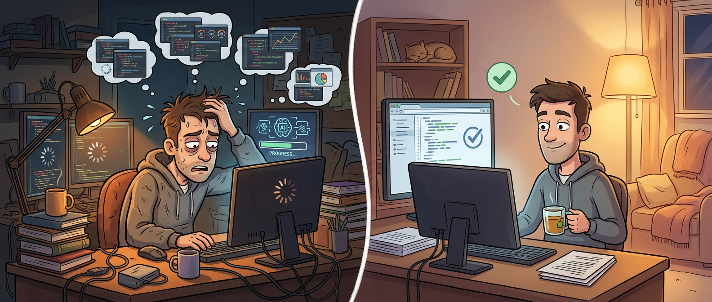

这两年关于 LLM 的讨论里，大家最爱聊的是效率、杠杆、提速、替代，仿佛只要把模型接进工作流，剩下的就只是“快多少”的问题。但真正在一线连续跟 LLM 干过几小时活的人，大概都懂另一种更难描述的感受：不是单纯没产出，而是会被一种很黏、很散、很难解释的疲惫感拖住。

Tom Johnell 这篇《LLMs can be absolutely exhausting》写得挺诚实。它不是在讲某个模型又变笨了，也不是在输出“AI 不行”的情绪，而是在拆一种很多人其实都遇到过、但不太会系统表达的问题：**有些时候，和 LLM 一起工作之所以让人筋疲力尽，不只是模型失误，而是你、人机反馈回路和上下文机制一起掉进了低质量循环。**

这篇文章的好处就在于，它没有把责任全推给模型，也没有把问题简化成“多写好 prompt 就行”，而是把疲惫感背后的几个具体机制讲出来了。

## 很多“LLM 今天不行”的时刻，先坏掉的可能其实是人

Tom 文里最扎人的一句，不是他抱怨 Claude 或 Codex，而是他第二天睡醒后，脑子清空，再回来做同一个问题，反而很顺。这件事说明什么？说明有些时候昨天那场痛苦拉扯，问题未必主要出在模型，而是人已经进入疲劳态了。

这点其实很重要。因为 LLM 特别容易制造一种错觉：模型永远在线、永远能接话、永远能继续试，所以你也会不知不觉以为自己应该持续在线、持续 steering、持续修 prompt。可现实是，人脑不是上下文窗口，疲劳一上来，最先劣化的就是表达质量。

而在 LLM 工作流里，表达质量几乎直接决定回报质量。你越累，prompt 越糙；prompt 越糙，输出越偏；输出越偏，你越想补一句、打断一下、追加一点上下文；结果模型上下文更乱，你也更烦。

这就是为什么这类疲惫感和普通写代码疲惫不完全一样。传统编码里你累了，最糟是代码写慢一点；在 LLM 工作流里，你累了，**你给系统的输入本身就在持续变差**，而系统又会立刻把这种变差放大回来。

## 最折磨人的不是试错，而是“慢试错”

我觉得这篇文章里最形象的比喻，是他说那种反馈回路像一个十几分钟才转一次的老虎机。这个比喻特别准。

因为很多 LLM 工作本来就是实验型的：你给提示，看结果，修正，再试。这个模式本身没问题，甚至可以很高效。问题出在，一旦每次实验都很慢，整个工作体验就会迅速从“探索”变成“消耗”。

Tom 举的例子是解析大文件、修解析逻辑 bug。每次 tweak 都得重新解析，跑一次特别慢，等你终于拿到结果，上下文又已经快满了。于是系统不仅慢，而且你很难维持清晰的短期记忆：刚刚到底试了什么、为什么这么改、这次结果和上次差在哪。

这就是慢反馈最伤的地方。它不只是浪费时间，而是在持续吞掉人的工作记忆和耐心。等下一轮输出回来时，你已经不在最佳判断状态，模型也已经不在最佳上下文状态，两边一起钝化。

所以这篇文章最值得带走的一点，不是“要更有耐心”，而是：**一旦反馈回路慢到让你失去节奏，它本身就该成为要优先解决的问题。**

## 上下文膨胀不只是 token 问题，它会把人也一起拖进雾里

很多人现在提到 context rot，第一反应都是模型层面：上下文太长了，模型开始忘、开始漂、开始敷衍。Tom 这篇文章很妙的地方在于，它让你看到 context rot 不只是模型出问题，人也会一起被拖进雾里。

因为长上下文本来就在制造一种“已经聊了很多、应该越来越接近答案”的心理暗示。可实际情况往往相反：上下文一长，真正关键的实验信息、边界条件、失败原因反而更难被稳定抓住。模型开始硬撑，你也开始硬撑。

最糟的时候就会出现一种特别熟悉的状态：

- 你觉得自己已经讲得很多了
- 模型也表现得像“懂了”
- 但你们其实都在越来越模糊的语义雾里往前挪

这时候人最容易做的，就是继续追加说明、继续打断、继续 steer。可这又进一步把上下文堆厚，最后像在泥地里加油门。

所以上下文管理在今天已经不只是模型使用技巧，而是认知节奏管理。你要防的不只是 token 爆炸，还要防那种“已经聊了很多，所以应该快成了”的错觉。

## 好的 prompt 不是礼貌，不是玄学，而是你自己是否真的想清楚了问题

Tom 有个观察我很认同：很多时候我们 prompt 写得差，不只是因为累，而是因为其实自己并没有把问题想清楚，只是期待 AI 帮我们把空白自动补上。

这正是 LLM 最诱人的陷阱之一。因为它太会顺着不完整描述往下接了，所以你很容易误以为“我只需要大概说说，剩下它会补齐”。有时候它确实能补，但一旦问题稍微复杂，这种偷懒就会反噬。

说白了，LLM 让“认知外包”变得比以前更顺手了。以前你没想清楚，多半会先卡在自己这里；现在你没想清楚，也能很快得到一堆貌似有推进感的输出。于是你会误以为工作在前进，实际上只是在和一个很会接话的系统一起绕圈。

这也是为什么 Tom 提到一种很珍贵的感觉：当你把 prompt 写到足够清楚时，你在点击发送的那一刻几乎已经知道结果会很不错。这个描述其实特别重要，因为它说明真正好的 prompt 不是文字技巧，而是你自己对目标、边界、成功条件已经够清楚。

## 解决疲惫感的关键，有时候不是“换模型”，而是“先把实验缩小”

这篇文章我最喜欢的一段，是他开始把“让反馈回路变快”本身当成一个单独问题交给 LLM 去解决。比如先让它构造一个更小、更快、能稳定复现失败案例的路径，目标不是直接修大问题，而是把验证成本压到 5 分钟以内。

这其实非常像测试思维，只不过对象变了。以前写 TDD 或调复杂 bug，我们知道要尽量缩小复现范围、制造更快的实验闭环；现在和 LLM 一起工作时，这个思路反而更重要。因为 LLM 特别吃“清楚的成功标准”和“高频的小回路”。

一旦你能把问题收缩成：

- 复现这个失败案例
- 保证单轮反馈不超过 5 分钟
- 允许你删掉不必要路径，只保留最小重现条件

整个工作流就会重新变轻。模型更聪明，不一定是因为它变强了，而是因为你终于给了它一个更适合工作的场。

这点对今天所有 AI coding 工作都适用。很多时候最该优化的不是 prompt 文案，而是实验结构。你把 loop 缩短，模型和人都会一起变得没那么笨。

## 所谓“LLM 很累”，很多时候其实是在提醒你该停了，或者该换工作方式了

我觉得这篇文章最成熟的地方，在于它没有把“累”浪漫化，也没有把“扛下去”当美德。它反而把疲惫感当成一个非常实际的诊断信号。

如果你已经开始：

- 懒得把需求讲清楚
- 一直打断模型
- 频繁补充遗漏上下文
- 对每轮输出都越来越不耐烦
- 明知道 loop 很慢却还硬拖着跑

那通常说明问题已经不在“再试一次”这个层面了。你该做的要么是停下来休息，要么是退一步，把工作方式改掉。继续硬顶，只会让低质量输入和低质量输出互相喂养。

这件事其实挺反直觉，因为 LLM 给人的感觉总像是“只要再多试一轮，可能就好了”。但有些时候，最有效率的动作反而是退出当前回合。

## 今天再看这篇文章，它讲的不是情绪问题，而是工作流设计问题

如果把这篇文章放在更大的 AI 工程语境里看，它其实和我们前面聊的很多东西是连起来的。Harness engineering 在讲环境设计，pnpm worktree 在讲并行工作区，skills / MCP 在讲分层，Chrome DevTools MCP 在讲现场上下文可交接；Tom 这篇则是在提醒另一件更基础的事：**人机协作的认知负担，也是一种基础设施问题。**

工具再强，如果它让你长时间处在慢反馈、大上下文、模糊目标和持续补漏的状态里，最后你体感到的就不是提效，而是疲劳。反过来，当 loop 短、目标清、成功条件稳，LLM 的体验会突然好很多，甚至好到像换了一个模型。

所以这篇文章真正适合被记住的，不是“LLM 让人崩溃”这种情绪标题，而是它背后的工作观察：**很多糟糕体验并不来自某一次单独失败，而是来自一个持续让人和模型都变钝的回路。**

如果你能识别这个回路，并及时缩小实验、加快反馈、停掉低质量对话，很多疲惫感其实是能明显下降的。

## 参考

- [LLMs can be absolutely exhausting](https://tomjohnell.com/llms-can-be-absolutely-exhausting/) — Tom Johnell
